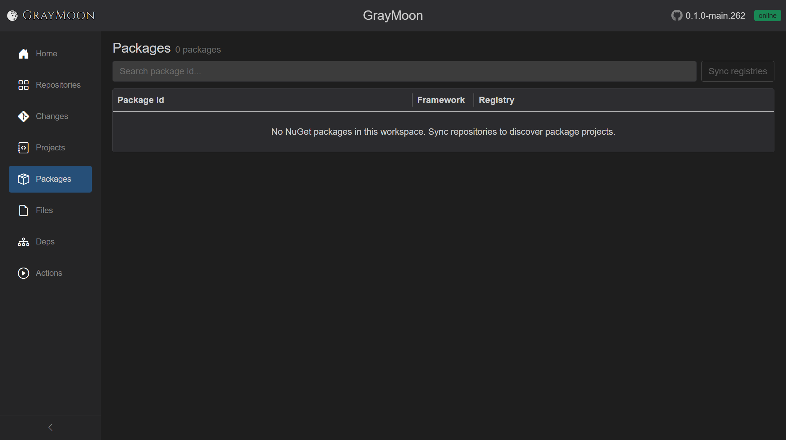

# Workspace Packages

Route: `/workspaces/{id}/packages`

NuGet **package projects** in the workspace (projects that produce a package id), plus which connector/registry they match.

## Header

- Title: **Packages**
- Subtitle: `N package(s)` or `N package(s) found`
- [Filter search](../shared.md#filter-search-shared) - "Search package id...". Disabled while loading or when the list is empty.
- **Sync registries** - refreshes package metadata against NuGet connectors. Disabled when there are no packages. Overlay: "Syncing registries..."

Empty: "No NuGet packages in this workspace. Sync repositories to discover package projects."

## Search fields

Plain terms match **package id**, **framework**, and **matched connector name**.

Field prefixes:

- `registry:` - connector name
- `framework:` - TFM

## Grid columns

| Column | What it shows |
| --- | --- |
| Package Id | Package id, or `-` |
| Framework | TFM badge, or `-` |
| Registry | Matched connector name, or `-` |
