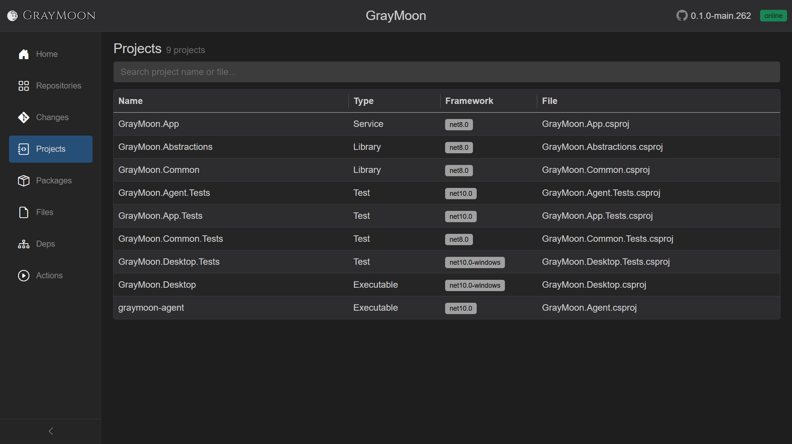
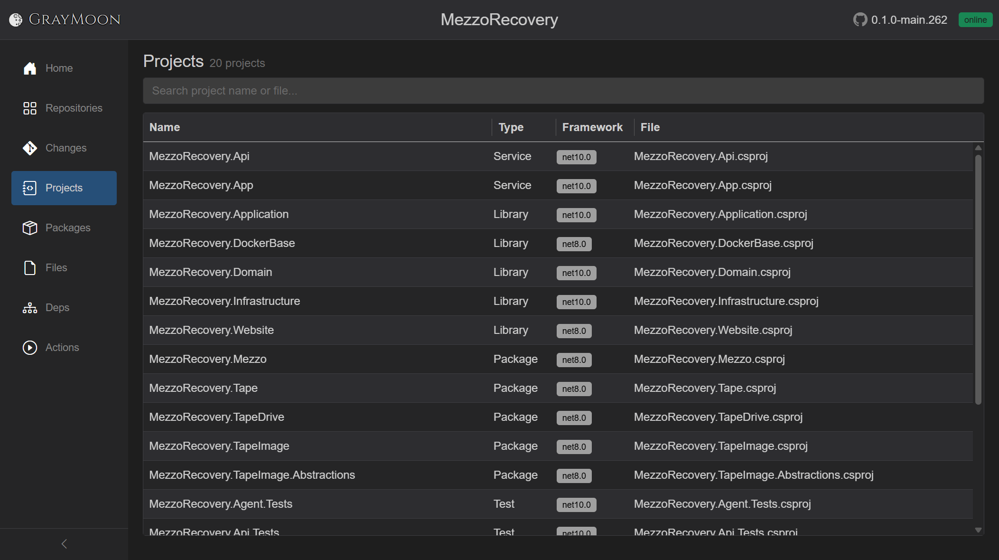

# Workspace Projects

Route: `/workspaces/{id}/projects`

GrayMoon's workspace is mostly the app itself. **MezzoRecovery** shows the mix: services, libraries, packable libraries, tests, and standalone executables (tools) in one catalog of 20 `.csproj` files.

Sort puts **Service** first (`MezzoRecovery.Api`, `MezzoRecovery.App`), then **Library**, **Package** (the five NuGet ids on [Packages](packages.md)), **Test**, then **Executable** (`mra` / Agent, `mrmc` / MezzoCopy, `mrtc` / TapeCopy). Tools and the API consume the Package rows; those package ids are what the [dependency graph](dependencies.md) edges represent.

Read-only catalog of `.csproj` projects discovered when workspace repositories were synced.

## Header

- Title: **Projects**
- Subtitle: `N project(s)` or `N project(s) found`
- [Filter search](../shared.md#filter-search-shared) - "Search project name or file..."

Empty: "No projects in this workspace. Sync repositories to discover .csproj projects."

No match: "No projects match your search."

First open uses the [loading overlay](../shared.md#loading-overlay) ("Loading projects...").

## Search fields

Plain terms match **project name**, **file path**, **project type**, and **target framework**.

Field prefixes:

- `type:` - Service, Library, Package, Test, Executable, ...
- `framework:` - e.g. `net10.0`

## Grid columns

Virtual-scrolled. Resizable.

| Column | What it shows |
| --- | --- |
| Name | Project name |
| Type | ProjectType enum text (Service, Library, Package, Test, Executable, ...) |
| Framework | Target TFM as a gray badge, or `-` |
| File | File name of the `.csproj` (full path in the cell tooltip) |

Rows are not clickable. Sort on the server prefers Service, then Library, Package, Test, then others.
