# Workspace Repositories

Route: `/workspaces/{id}`

This is the main workspace grid. Opening a workspace from [Workspaces](../02-workspaces.md) lands here and switches the sidebar to workspace items ([shared.md](../shared.md#sidebar-navigation)).

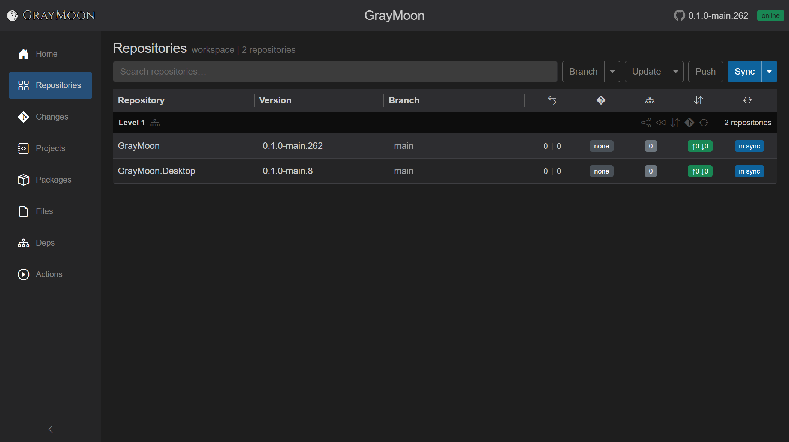

The screenshots above are a two-repo workspace (GrayMoon). A larger workspace looks the same, with more **Level** groups. **MezzoRecovery** (`/workspaces/2`) has 11 repositories: Level 1 libraries and shared tooling, Level 2 packages that consume those libraries, and Level 3 services / standalone tools that consume the packages.

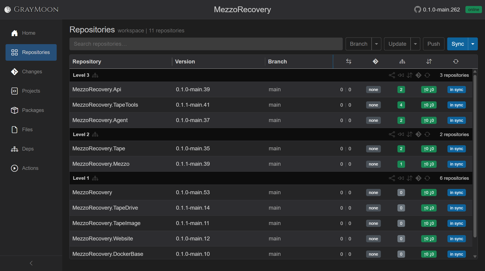

Level 3 here is `MezzoRecovery.Api` (service), `MezzoRecovery.TapeTools` (tool), and `MezzoRecovery.Agent` (agent/service). Level 2 is `MezzoRecovery.Tape` and `MezzoRecovery.Mezzo`. Level 1 holds the remaining six (including `TapeDrive`, `TapeImage`, `Website`, `DockerBase`, `Solution`, and the root `MezzoRecovery` repo). Green dependency-count badges on higher levels show how many workspace packages that repo consumes.

## Header

- Title: **Repositories**
- Breadcrumb subtitle: clickable **workspace** (goes to `/workspaces`) then `| N repositories` (or `N repositories found`). Clicking the count opens the same select-repositories modal as the Workspaces row **Repositories** button.
- While the agent has queued work: "Agent is completing N task(s)" (spinner if the overlay is not already showing).
- [Filter search](../shared.md#filter-search-shared) - "Search repositories…"

### Search fields

Plain terms match **repository name**, **branch**, **git version**, **level** (`level 1`, `no dependencies`), and **sync status** words (`in sync`, `sync`, `not cloned`, `version`, `error`).

`topic:` is accepted by the parser but does not match workspace rows (catalog-only field).

Spaces are **AND**. Use `or` (orange in the search bar) to keep several name fragments. On MezzoRecovery, `api or tools` returns both `MezzoRecovery.Api` and `MezzoRecovery.TapeTools` (`2 repositories found`) and hides empty levels. Parentheses work too: `(api or tools) main`.

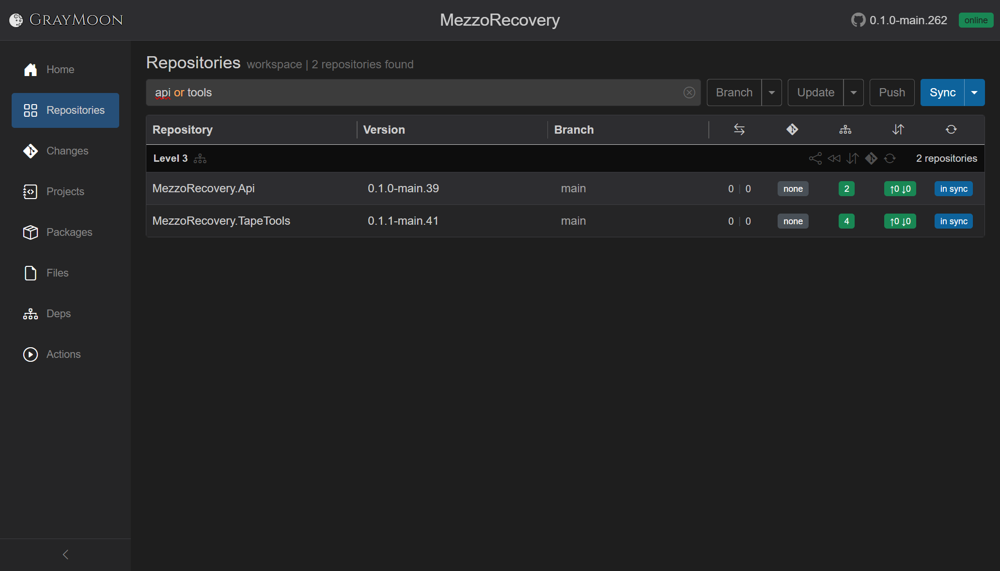

## Header action buttons

Buttons disable while a job is running, while agent tasks are pending, or when the workspace has zero repos.

### Branch (split)

Primary **Branch** opens the Branch modal on the **New Branch** tab. The caret opens the menu:

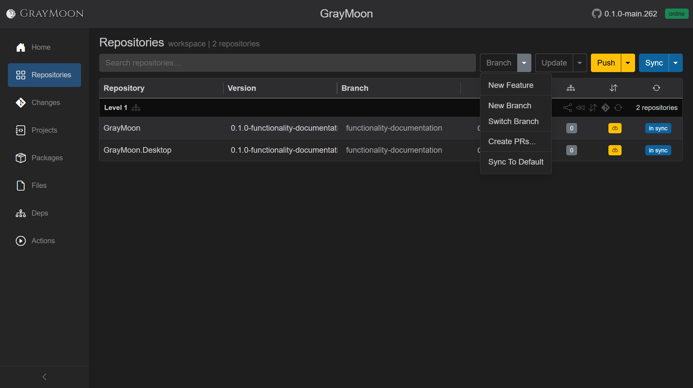

- **New Feature** - wizard: new branch, optional dependency update, synchronized push. [new-feature.md](new-feature.md).
- **New Branch** - same dialog as the primary button ([new-branch.md](new-branch.md)).
- **Switch Branch** - same dialog, **Switch Branch** tab. [switch-branch.md](switch-branch.md).
- **Create PRs...** - open the new-PR modal for every eligible repo.
- **Sync To Default** - abandon the current feature branch across the workspace: checkout default, delete that branch, pull latest. [sync-to-default.md](sync-to-default.md).

### Update vs Push Updated

If any repo has unmatched package/file dependencies **and** there are no incoming commits:

- Primary becomes yellow **Push Updated** (update then push).
- Split menu: **Level N Only** (lowest level that still needs work), **Update Only**, **Update Files**, **Push Only**, and **Undo Push Commits** when a push is recommended.

Otherwise:

- **Update** - outline, or **red** if unmatched deps exist together with incoming commits (update is still offered, pull is separate).
- Split: **Update**, **Update Files**, **Update & Push...**

**Push Updated** is those two halves in one job: **Update Only** (rewrite `.csproj` / version-file tokens and commit) then **Push Only** (push by dependency level). The primary button runs both. The caret is how you run them separately. Combined **Push Updated** (one click) is demonstrated later; the walkthrough below is the split path on MezzoRecovery after [new-branch.md](new-branch.md) created `new-branch-demo`.

Update modals ask for a commit message and whether to include dependency bumps, then run under the [loading overlay](../shared.md#loading-overlay).

#### After New Branch: unmatched deps and no upstream

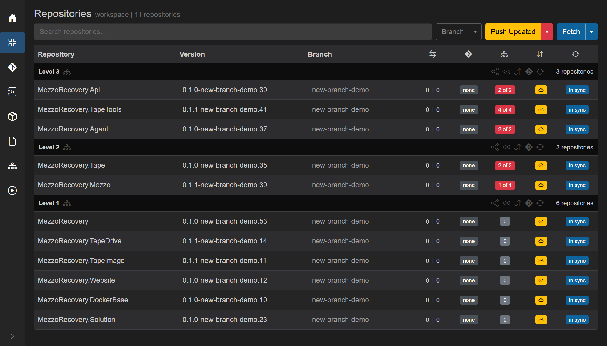

Every row is on `new-branch-demo`. GitVersion strings include the branch name (`0.1.0-new-branch-demo.39`). Two different problems show up at once:

- **No upstream.** Yellow cloud-up on every commits badge: the branch exists only locally. `git push` has not created `origin/new-branch-demo` yet. **in sync** stays blue (working tree matches HEAD). Divergence is still `0 | 0` because nothing has been committed on top of `main`.
- **Unmatched package deps on higher levels.** Level 1 stays gray `0` (nothing in-workspace to consume). Level 2 / 3 show red `N of M` (`2 of 2`, `4 of 4`, `1 of 1`) because those `.csproj` files still pin the **main** package versions, while GitVersion on the packages now says `-new-branch-demo`. Header **Push Updated** (yellow) is the shortcut for that pair of problems.

Hover a mismatch badge for the list. TapeTools `4 of 4`:

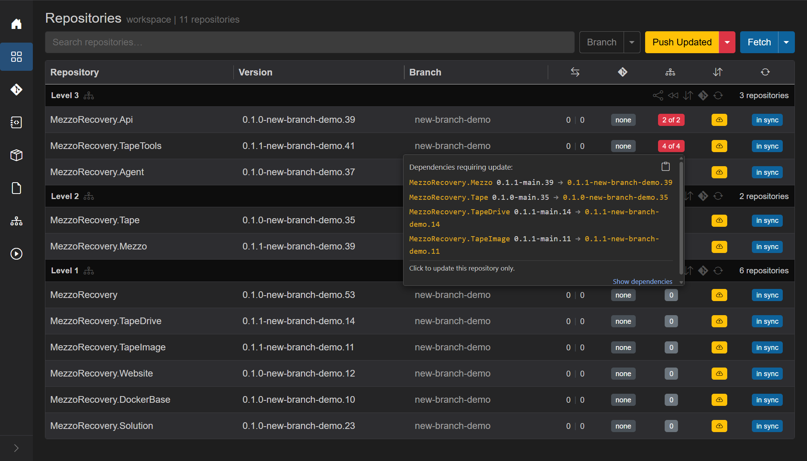

Title **Dependencies requiring update:** then each workspace package as `current -> new` (`MezzoRecovery.Mezzo 0.1.1-main.39 -> 0.1.1-new-branch-demo.39`, and the same for Tape, TapeDrive, TapeImage). Footer: **Click to update this repository only.** That click would update one row; workspace **Update Only** does every unmatched repo.

The **Push Updated** caret:

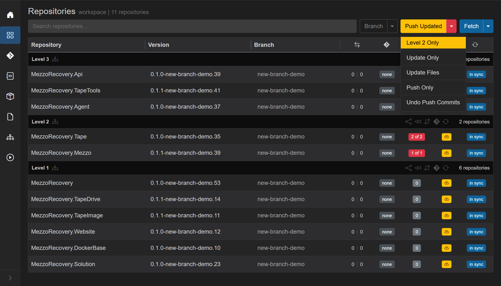

- **Level 2 Only** - lowest level that still needs work (here Level 2; Level 1 has nothing to rewrite).
- **Update Only** - bump `.csproj` / files and commit. Does not push.
- **Update Files** - version-file tokens only.
- **Push Only** - push what is already committed (and set upstream). Does not rewrite deps.
- **Undo Push Commits** - roll back local update commits. Full walkthrough: [undo-push-commits.md](undo-push-commits.md).

#### Update Only

**Update Only** opens **Update dependencies**: rewrite `.csproj` (and configured version files) to the current package versions, then commit in each affected repo.

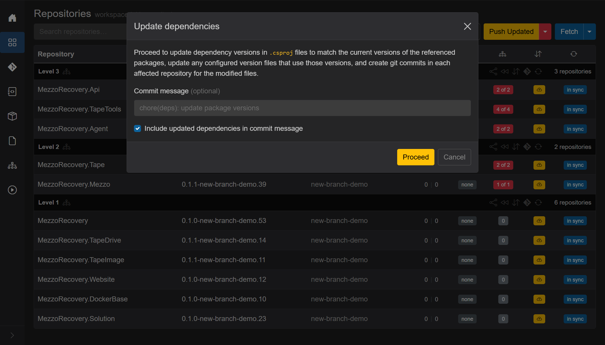

Optional commit message (placeholder `chore(deps): update package versions`). **Include updated dependencies in commit message** is on by default. **Proceed** runs the job.

Overlay: spinner, **Updating version N of M...**, **Abort**, live git log (`git add` on `.csproj`, commit). This run was **Updating version 2 of 3...**:

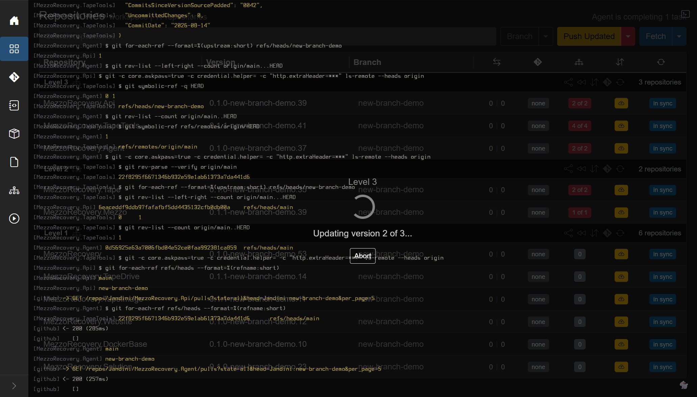

When it finishes, unmatched badges are gone and the header is no longer **Push Updated** (nothing left to update). Yellow **Push** is the remaining half - same action as **Push Only** on the previous menu.

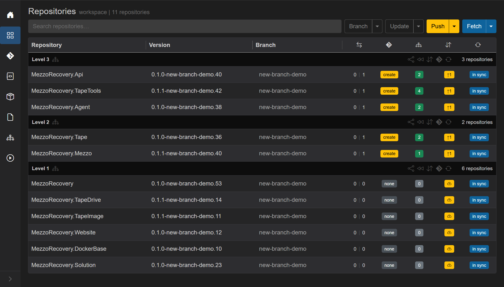

What changed:

- Dep badges on Level 2 / 3 are **green counts** (`2`, `4`, `1`) - `.csproj` now pins `-new-branch-demo` versions. Level 1 stays `0`.
- **Divergence** on updated repos is `0 | 1`: one commit ahead of default `main` (the deps commit). Level 1 stays `0 | 0` (nothing to rewrite there).
- **Outgoing:** Level 2 / 3 yellow `↑1`. Level 1 still yellow cloud-up (branch still has no upstream, and no extra commit).
- **PR** badge is yellow **create** on repos that are ahead of default.
- Header: outline **Update**, yellow **Push**, blue **Fetch**.

#### Push Only and synchronized push

Yellow **Push** (or **Push Only** while **Push Updated** is still showing) pushes every repo that has outgoing commits or no upstream. When the graph has package deps, GrayMoon first shows the **Push** dialog:

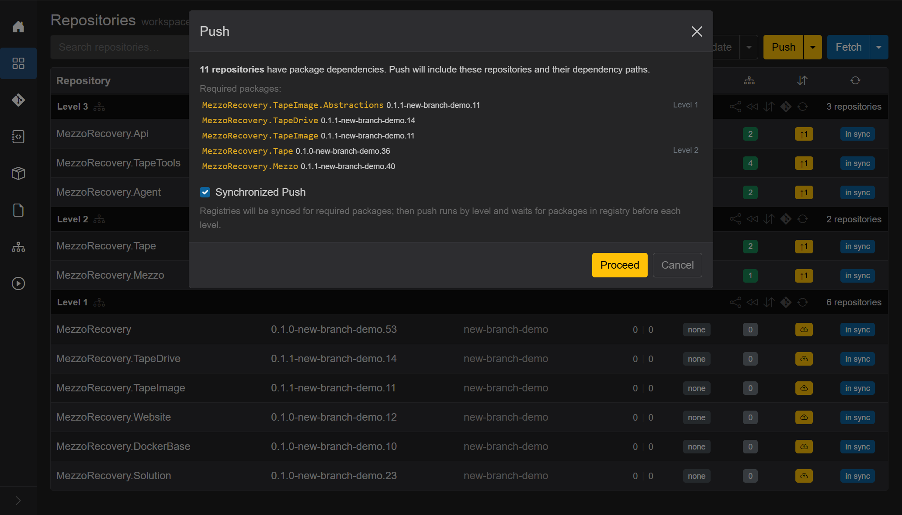

- **11 repositories have package dependencies.** Push includes those repos and their dependency paths.
- **Required packages** grouped by level (the NuGet ids consumers will need after the lower level is pushed): Level 1 `TapeImage.Abstractions`, `TapeDrive`, `TapeImage`; Level 2 `Tape`, `Mezzo`. Versions are already `-new-branch-demo`.
- **Synchronized Push** (checked by default): *Registries will be synced for required packages; then push runs by level and waits for packages in registry before each level.* Unchecked: push by level without waiting.

Leave it checked. This is why the workspace has **NuGet connectors**: GrayMoon maps each required package to a connector and polls that feed. It does **not** drive CI, wait on GitHub Actions conclusions, or publish packages itself. After a level is pushed, CI (or whatever normally packs) has to put the nupkg on the feed. GM only waits until the version is **there**, then starts the next level so consumers restore the branch-specific package instead of a stale `main` one.

Timeout is **3 minutes per package** at that level (`PushWaitDependencyTimeoutMinutesPerDependency`, default 3; total wait = package count x 3 minutes). Here the overlay showed **Waiting for 3 packages...** with a countdown from `08:59` (3 packages x 3 minutes). If CI does not publish those nupkgs within that window, **GrayMoon WILL STOP**. It will not keep waiting, skip the level, or retry forever.

**Proceed** starts the job. Overlay: spinner, wait/push progress, **Abort**, live git + registry log. Right after Level 1 was pushed, GM waited on those packages before Level 2:

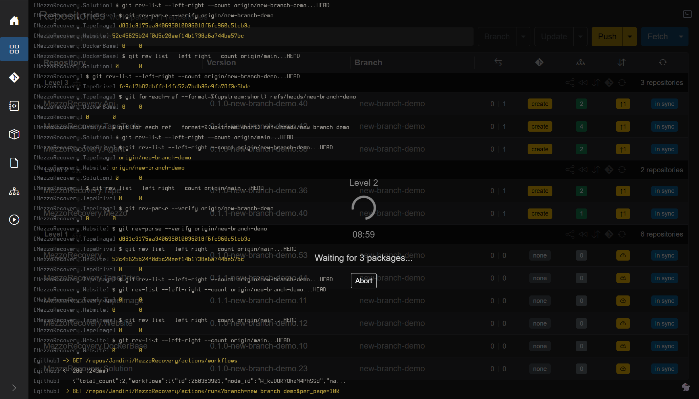

Later, before Level 3, the same overlay showed **Level 3**, **Found 3 of 4 packages**, and a shorter countdown. GHA polling can appear in the terminal; that is status only. The gate that unblocks the next level is still "is this nupkg on the NuGet connector feed?", not a green check on the workflow.

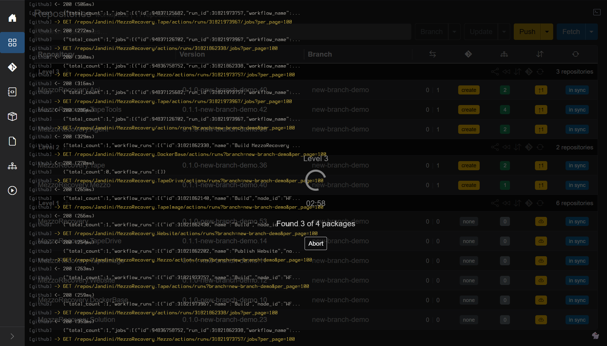

Together, **Update Only** then **Push Only** is what the primary **Push Updated** button does in one click. [New Feature](new-feature.md) is that pair plus creating the branch first.

When this push finished, every commits badge was green `↑0 ↓0` (upstream exists, nothing left to push). Header **Push** went back to outline. Divergence on the updated repos stayed `0 | 1` (the deps commit is on the remote branch, still one commit ahead of `main`). **create** stays until a PR is opened. Green dep counts stay: packages match.

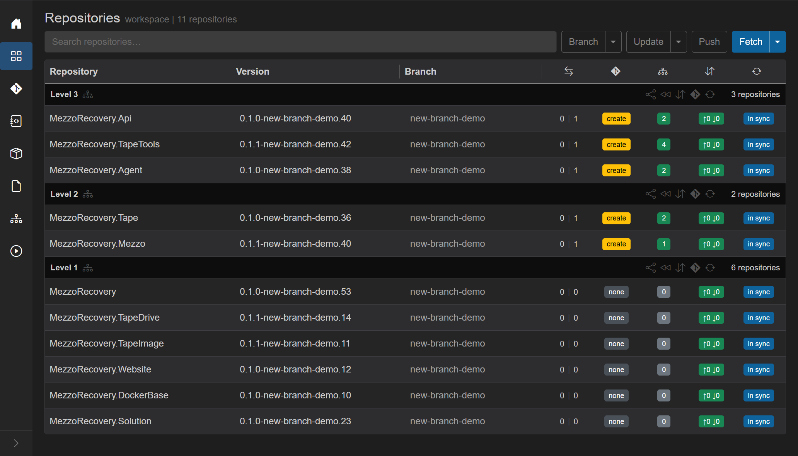

### Pull / Push

- Incoming commits on any repo: red **Pull**.
- Outgoing commits / push recommended (including a branch with no upstream): yellow **Push** with split **Undo Push Commits**.
- Otherwise outline **Push**.

The header **Push** is the same action as the yellow **Push** on the [notification card](../shared.md#workspace-action-notification-cards). The card is hidden on this page (the header already has the button) and visible on Changes and other non-Repositories pages so you can push several repos in one go without opening this grid.

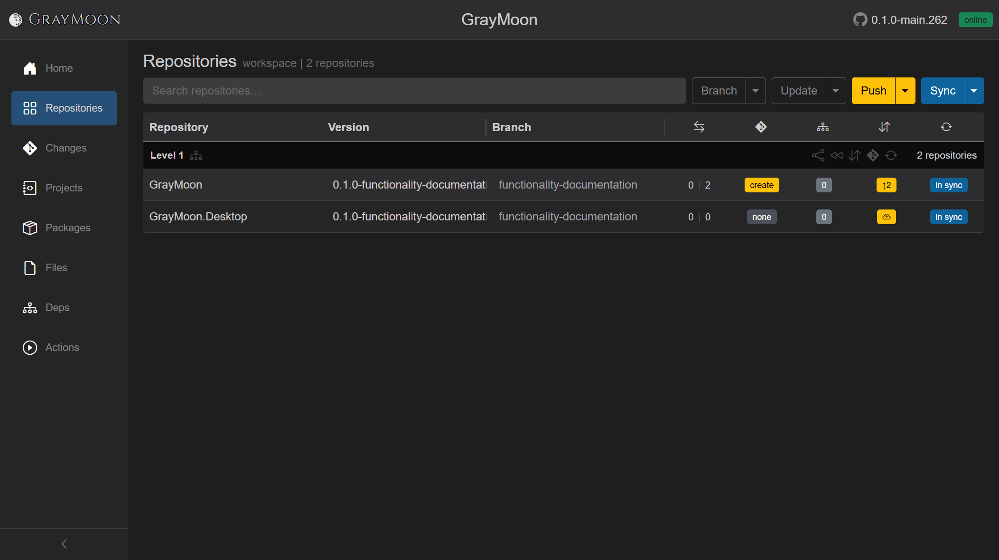

In this state (new branch `functionality-documentation`, nothing pulled from default):

- Header **Push** is yellow. The notification card is not shown here.
- **Divergence** (`behind | ahead` of default): GrayMoon is `0 | 2` - zero incoming from default, two commits ahead. Desktop is `0 | 0` on the same new branch with no extra commits.
- **Commits badge**: GrayMoon yellow `↑2` (outgoing only; no `↓` incoming). Desktop yellow cloud-up (no upstream yet). With incoming the badge would turn red `↑N ↓M` and the header would become **Pull** instead.
- **PR badge**: GrayMoon `create` (ahead of default, no open PR). Desktop `none`.
- **in sync** stays blue: local git status matches what the agent last reported; it is not "already pushed".

One **Push** sends every repo that has outgoing commits or no upstream. Overlay: spinner, **Pushing...**, **Abort**. After a successful push the header **Push** goes back to outline, commits badges go green `↑0 ↓0`, and the cloud-up icon is gone (upstream exists):

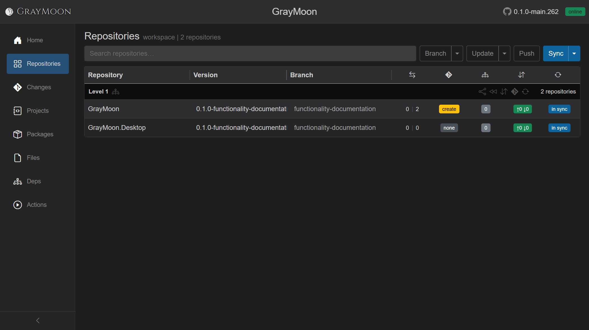

**Undo Push Commits** opens a modal listing each repo with outgoing commits and a **Keep changes** checkbox (mixed vs hard reset). It resets local branches to `origin` only - nothing is pushed. Use when you committed on the default branch by mistake or cannot push to a protected branch. MezzoRecovery example: [undo-push-commits.md](undo-push-commits.md).

### Sync (split)

On MezzoRecovery (`/workspaces/2`, 11 repositories) the primary starts as blue **Sync**. The caret opens **Fetch**, **Sync**, and **Restore**. The button turns **red** when the workspace is out of sync.

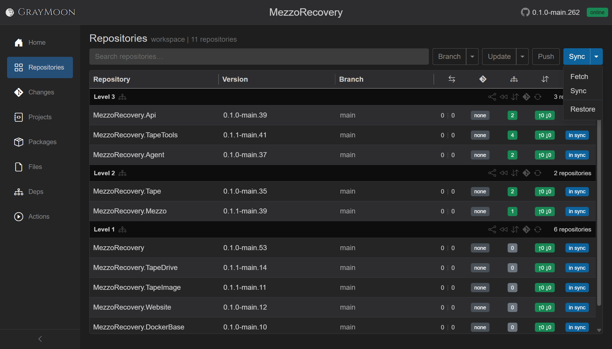

The last choice is remembered in the browser (`graymoon:sync-mode`). After you run **Fetch**, the primary label becomes **Fetch** so the cheap refresh stays one click away. Pick **Sync** from the menu to switch it back.

#### Sync

Full refresh of every workspace repo (in parallel, up to 16 at a time). For each repo the Agent:

1. Clones it if the folder is missing.
2. Runs `git fetch origin --prune --tags`.
3. Runs GitVersion (version string + branch).
4. Writes the live git hooks (`post-commit`, `post-checkout`, `post-merge`, `pre-push`).
5. Recounts outgoing / incoming vs upstream **and** ahead / behind vs the default branch (the `0 | 0` divergence pair).
6. Refreshes local/remote branch lists and tags.
7. Scans `.csproj` files (projects, package references, dependency levels).
8. Rechecks file-version tokens.

Overlay: spinner, **Synchronizing...** then **Synchronized N of M**, **Abort**, and the live git terminal (fetch, `for-each-ref`, `rev-list`, GitVersion). This run finished at **Synchronized 11 of 11**:

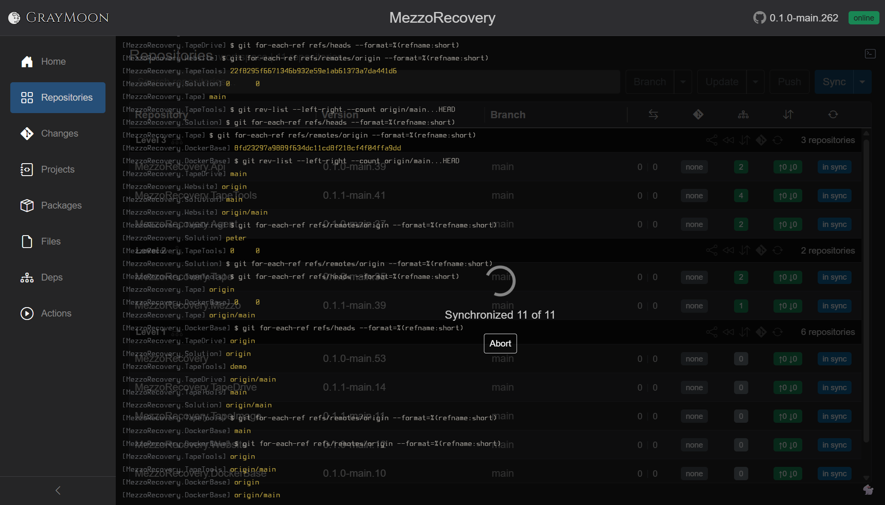

Sync does **not** merge or pull. Incoming counts update so you can decide to Pull; working trees stay as they are.

#### Fetch

Lighter than Sync. The Agent only fetches remotes (with tags) and recounts commits. It skips GitVersion, `.csproj` scanning, and hook rewriting. Overlay: **Fetching commits...** then **Fetched N of M**. **Fetch does not clone.** If the workspace folder does not exist yet, pick **Sync** from the caret - same for **Restore**, which needs `.csproj` files already on disk. First-day clone: [getting-started/03-workspace-clone.md](../getting-started/03-workspace-clone.md).

For repos pinned to a tag, Fetch also refreshes the tag list and may show a yellow **upgrade** badge when a newer release tag exists on origin. See [tag-upgrade.md](tag-upgrade.md).

That is the daily team-collaboration action: see whether teammates moved **your branch** (incoming `↓N` / commits badge) or the **default branch** (divergence `behind | ahead`, for example `2 | 0` when `main` gained commits you do not have). It does not merge those commits.

On this MezzoRecovery run Fetch brought **no incoming** - every row stayed `↑0 ↓0` and `0 | 0`. Incoming will be simulated separately later.

After Fetch the primary button itself becomes **Fetch**:

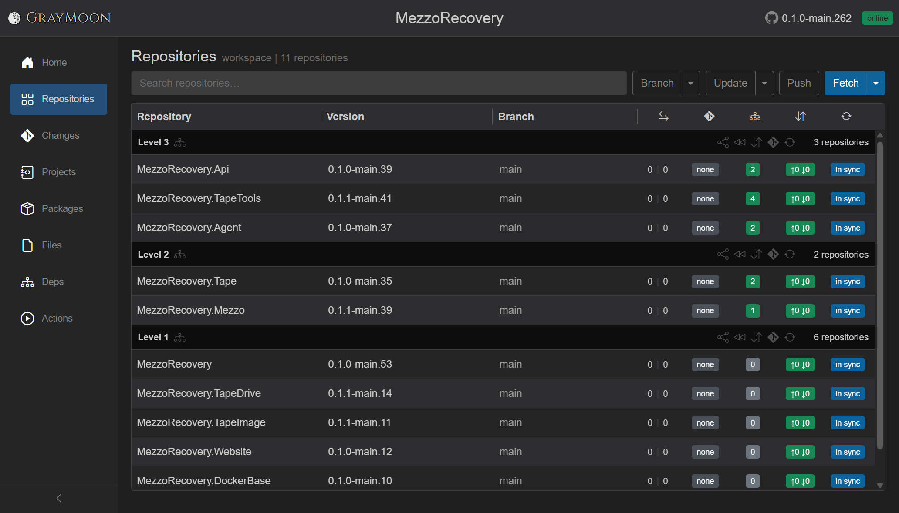

#### Restore

Runs `dotnet restore --force --no-cache` on every tracked project in the workspace (repos checked out on a tag are skipped). Overlay: **Restoring packages...**, **Abort**, and the restore log. A toast reports how many projects were restored.

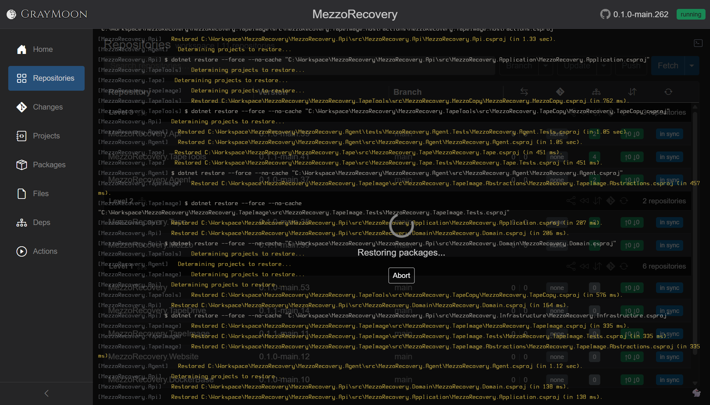

## New Branch

Workspace-wide create / switch lives in one dialog. Full write-up (MezzoRecovery `new-branch-demo`): [new-branch.md](new-branch.md). **New Feature** (branch + update + synchronized push in one job) is [new-feature.md](new-feature.md).

## Grid grouping: dependency levels

Rows are grouped by topological **Level N** (Level 1 = no upstream workspace packages). Repos with no graph placement sit under **No dependencies**.

Each level header:

- Title **Level N** (or **No dependencies**).
- Diagram icon - opens the Dependencies page filtered to that level.
- Share icon - copy open PR URLs for the level.
- Rewind - sync this level to default branch. Workspace-wide discard is the header **Branch** caret **Sync To Default** ([sync-to-default.md](sync-to-default.md)); the level rewind skips unmerged ahead commits.
- Up/down arrows - sync commits for the level.
- Git icon - open PRs for the level.
- Repeat arrows - synchronize every repo in the level.
- Count: "N repositories" - hover/focus can open GitHub links for those repos.

Level actions are disabled when a job is running or repos in the group are on tags.

## Row columns

| Column | What the user sees | Interaction |
| --- | --- | --- |
| Repository | Name as a link to the GitHub repo | Tooltip is the project type: Service, Package, Executable, Library, Test |
| Version | GitVersion string, or `-` | Click copies the version (brief clicked styling). Tooltip: "Click to copy version" |
| Branch | Current branch, or a tag icon + tag name | Click opens the per-repo branch dialog (**Locals** / **Remotes** / **Tags** / **New Branch**). See [repository-branch-management.md](repository-branch-management.md). Workspace-wide Switch Branch is the header **Branch** caret ([switch-branch.md](switch-branch.md)). On a tag: "Repository is pinned to a tag." |
| Metrics | Five badges in one cell (see below) | On a tag (**frozen** row): divergence (behind \| ahead), PR, and outgoing/incoming commits badges are **not displayed**; branch shows tag icon + tag name. See [Frozen on the Repositories grid](repository-branch-management.md#frozen-on-the-repositories-grid). |

If a per-repo operation fails, a dismissible red **Error:** banner appears under the row.

### Divergence (`behind | ahead`)

Commits behind | ahead of the default branch. Blank when on a tag. `-` when unknown.

- Behind number is red-ish / actionable: click starts **update branch from default** (merge/rebase prompt) unless you are already on the default branch (then pull handles incoming).
- Ahead number links to GitHub compare `default...branch`.
- Behind number links to GitHub compare `branch...default` when it is not an actionable update.

### Pull request badge

| Appearance | Meaning | Click |
| --- | --- | --- |
| `none` (dark gray) | No PR (or not verified yet) | None |
| `create` (yellow, black text) | Branch is ahead of default, no open PR | Opens create-PR modal for this repo |
| `#123` (green / tinted) | Open PR. Tint reflects mergeability: mergeable, conflicts, checks running, blocked, unknown | Opens the PR on GitHub |
| extra number badge | Files changed on that PR | Opens `{prUrl}/changes` |
| `merged` (purple) | Merged | Opens PR |
| `closed` (red) | Closed without merge | Opens PR |
| `upgrade` (yellow) | Repo is on a tag and a newer tag exists on origin | Opens branch dialog on **Tags** tab. Full walkthrough: [tag-upgrade.md](tag-upgrade.md) |
| blank | On a tag without a newer tag | PRs need a branch |

Hovering an open-PR badge refreshes mergeability from GitHub.

### Dependencies badge

| Appearance | Meaning | Click / hover |
| --- | --- | --- |
| `0` | No package/file deps | Opens **custom dependencies** modal |
| green count (e.g. `4`) | All matched | Hover: list of packages/versions, file tokens, custom deps, copy, **Show dependencies**. Click: custom deps modal |
| yellow/red `N of M` | Unmatched package deps and/or out-of-date file tokens | Hover: `current -> new` lines, copy, hint "Click to update this repository only" (or files / both). Click: update **this repo only** (unless on a tag) |

On a tag the mismatch badge is read-only ("checkout a branch first").

When an upstream repo checks out a newer **tag**, consumers on branches often flip from green to red - the tooltip shows `current -> expected` where **expected** is the upstream tag version. Walkthrough: [tag-upgrade.md - out-of-date dependencies](tag-upgrade.md#why-higher-levels-suddenly-show-out-of-date-dependencies).

**Show dependencies** jumps to the Dependencies graph for that repo.

### Commits badge (`↑out ↓in`)

| Appearance | Meaning | Click |
| --- | --- | --- |
| green `↑0 ↓0` | Clean vs upstream | Push (no-op-ish / still wired to push) |
| yellow `↑N ↓0` | Outgoing commits | Push this repo (may open push-with-dependencies modal) |
| red `↑N ↓M` (M>0) | Incoming (and maybe outgoing) | Pull this repo |
| yellow cloud-up icon | Branch has no upstream | Push to set upstream |
| blank / `-` | On a tag, or unknown | None |

### Sync status badge

| Label | Color | Click |
| --- | --- | --- |
| `in sync` | blue | None |
| `sync` | red | Sync this repository |
| `not cloned` | gray | Sync (clone) this repository |
| `version` | red | Sync (version mismatch vs expected) |
| `error` | red | Sync retry |

Disabled while a job runs or the row is on a tag.

## Modals the user can reach from this page

- Select repositories (from the subtitle count)
- New Feature
- New Branch (workspace-wide) / Switch Branch (workspace-wide [switch-branch.md](switch-branch.md), or per-row branch dialog - [repository-branch-management.md](repository-branch-management.md))
- New Pull Request (one repo, one level, or all)
- Update branch from default
- Update dependencies (workspace, level-only, or single repo)
- Custom dependencies (which workspace repos this repo should wait on)
- Push with dependencies
- Confirm / default-branch warning / [Sync To Default](sync-to-default.md) options (delete remote / local branches)
- Version-files commit (when file tokens were rewritten)
- Undo push
- Operation error

All long runs use the shared [loading overlay](../shared.md#loading-overlay). Notification cards on other pages offer the same Update / Push / Pull shortcuts ([shared.md](../shared.md#workspace-action-notification-cards)).
