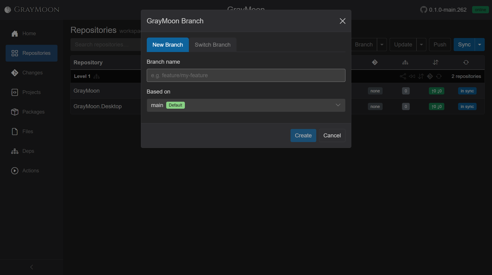
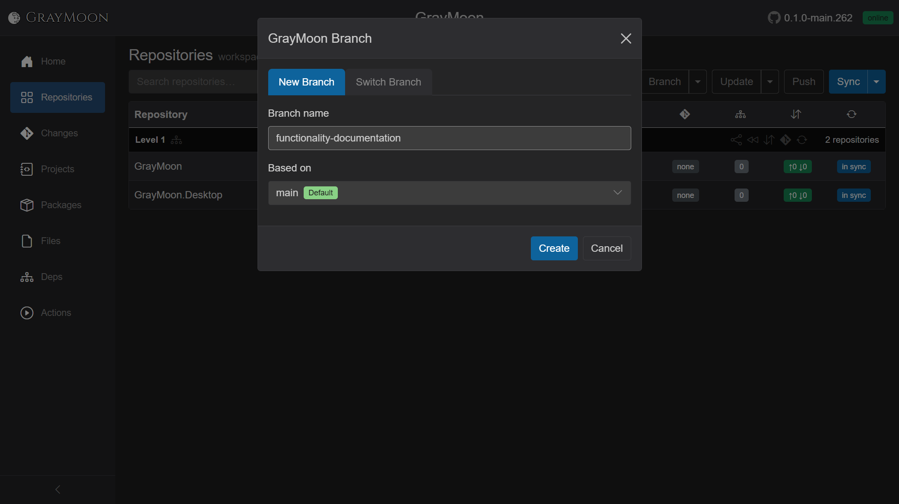
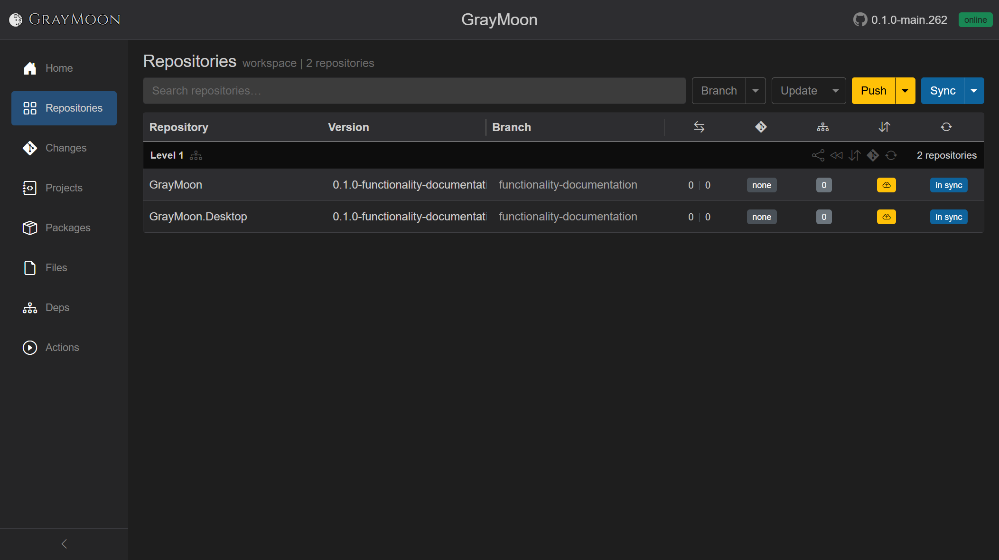

# Workspace Repositories

Route: `/workspaces/{id}`

This is the main workspace grid. Opening a workspace from [Workspaces](../02-workspaces.md) lands here and switches the sidebar to workspace items ([shared.md](../shared.md#sidebar-navigation)).

The screenshots above are a two-repo workspace (GrayMoon). A larger workspace looks the same, with more **Level** groups. **MezzoRecovery** (`/workspaces/2`) has 11 repositories: Level 1 libraries and shared tooling, Level 2 packages that consume those libraries, and Level 3 services / standalone tools that consume the packages.

Level 3 here is `MezzoRecovery.Api` (service), `MezzoRecovery.TapeTools` (tool), and `MezzoRecovery.Agent` (agent/service). Level 2 is `MezzoRecovery.Tape` and `MezzoRecovery.Mezzo`. Level 1 holds the remaining six (including `TapeDrive`, `TapeImage`, `Website`, `DockerBase`, `Solution`, and the root `MezzoRecovery` repo). Green dependency-count badges on higher levels show how many workspace packages that repo consumes.

## Header

- Title: **Repositories**
- Breadcrumb subtitle: clickable **workspace** (goes to `/workspaces`) then `| N repositories` (or `N repositories found`). Clicking the count opens the same select-repositories modal as the Workspaces row **Repositories** button.
- While the agent has queued work: "Agent is completing N task(s)" (spinner if the overlay is not already showing).
- [Filter search](../shared.md#filter-search-shared) - "Search repositories…"

### Search fields

Plain terms match **repository name**, **branch**, **git version**, **level** (`level 1`, `no dependencies`), and **sync status** words (`in sync`, `sync`, `not cloned`, `version`, `error`).

`topic:` is accepted by the parser but does not match workspace rows (catalog-only field).

Spaces are **AND**. Use `or` (orange in the search bar) to keep several name fragments. On MezzoRecovery, `api or tools` returns both `MezzoRecovery.Api` and `MezzoRecovery.TapeTools` (`2 repositories found`) and hides empty levels. Parentheses work too: `(api or tools) main`.

## Header action buttons

Buttons disable while a job is running, while agent tasks are pending, or when the workspace has zero repos.

### Branch (split)

Primary **Branch** opens the Branch modal on the **New Branch** tab. The caret opens the menu:

- **New Feature** - wizard: create branches (and optional dependency update / commit / push) across selected repos.
- **New Branch** - same modal as the primary button (see [New Branch](#new-branch) below).
- **Switch Branch** - same modal, **Switch Branch** tab: check out a common branch across the workspace.
- **Create PRs...** - open the new-PR modal for every eligible repo.
- **Sync To Default** - check out / reset toward each repo's default branch. Confirmations cover deleting local/remote feature branches and force-delete.

### Update vs Push Updated

If any repo has unmatched package/file dependencies **and** there are no incoming commits:

- Primary becomes yellow **Push Updated** (update then push).
- Split menu: **Level N Only** (lowest level that still needs work), **Update Only**, **Update Files**, **Push Only**, and **Undo Push Commits** when a push is recommended.

Otherwise:

- **Update** - outline, or **red** if unmatched deps exist together with incoming commits (update is still offered, pull is separate).
- Split: **Update**, **Update Files**, **Update & Push...**

Update modals ask for a commit message and whether to include dependency bumps, then run under the [loading overlay](../shared.md#loading-overlay).

### Pull / Push

- Incoming commits on any repo: red **Pull**.
- Outgoing commits / push recommended (including a branch with no upstream): yellow **Push** with split **Undo Push Commits**.
- Otherwise outline **Push**.

The header **Push** is the same action as the yellow **Push** on the [notification card](../shared.md#workspace-action-notification-cards). The card is hidden on this page (the header already has the button) and visible on Changes and other non-Repositories pages so you can push several repos in one go without opening this grid.

In this state (new branch `functionality-documentation`, nothing pulled from default):

- Header **Push** is yellow. The notification card is not shown here.
- **Divergence** (`behind | ahead` of default): GrayMoon is `0 | 2` - zero incoming from default, two commits ahead. Desktop is `0 | 0` on the same new branch with no extra commits.
- **Commits badge**: GrayMoon yellow `↑2` (outgoing only; no `↓` incoming). Desktop yellow cloud-up (no upstream yet). With incoming the badge would turn red `↑N ↓M` and the header would become **Pull** instead.
- **PR badge**: GrayMoon `create` (ahead of default, no open PR). Desktop `none`.
- **in sync** stays blue: local git status matches what the agent last reported; it is not "already pushed".

One **Push** sends every repo that has outgoing commits or no upstream. Overlay: spinner, **Pushing...**, **Abort**. After a successful push the header **Push** goes back to outline, commits badges go green `↑0 ↓0`, and the cloud-up icon is gone (upstream exists):

Undo Push opens a modal listing repos/commits to roll back.

### Sync (split)

- Primary is **Sync** (blue), or **Fetch** if quick-fetch is the remembered primary. Turns **red** when the workspace is out of sync.
- Menu: **Fetch** (remote tips only), **Sync** (clone/fetch/checkout/status), **Restore** (dotnet restore).

## New Branch

Creates the same local branch in every repository in the workspace (or skips repos that are on a tag, if that checkbox is shown).

1. On Repositories, open **Branch** (primary) or **Branch** caret then **New Branch**.
2. The modal title is `{WorkspaceName} Branch` (for example **GrayMoon Branch**). Tabs: **New Branch** (active) and **Switch Branch**.

3. **Branch name** - required. Placeholder `e.g. feature/my-feature`. **Create** stays disabled until the name is non-empty. Enter submits the same as **Create**.
4. **Based on** - defaults to each repo's default branch, shown as that name with a green **Default** badge (or `multiple` if defaults differ). The dropdown also lists branches that exist in every repo.
5. **Skip repos on tags** - only appears when at least one repo is checked out on a tag. Checked: tagged repos are left alone. Unchecked: those repos are included.
6. **Create** / **Cancel**. If the name already exists in one or more repos, a warning asks to **Proceed** (check out the existing branch there) or **Cancel**.

The job runs under the [loading overlay](../shared.md#loading-overlay). When it finishes, the grid **Branch** column (and GitVersion **Version** strings) show the new name on every included repo:

Clicking a row **Branch** cell opens the same modal on **Switch Branch** (or tag checkout when the repo is on a tag).

## Grid grouping: dependency levels

Rows are grouped by topological **Level N** (Level 1 = no upstream workspace packages). Repos with no graph placement sit under **No dependencies**.

Each level header:

- Title **Level N** (or **No dependencies**).
- Diagram icon - opens the Dependencies page filtered to that level.
- Share icon - copy open PR URLs for the level.
- Rewind - sync this level to default branch.
- Up/down arrows - sync commits for the level.
- Git icon - open PRs for the level.
- Repeat arrows - synchronize every repo in the level.
- Count: "N repositories" - hover/focus can open GitHub links for those repos.

Level actions are disabled when a job is running or repos in the group are on tags.

## Row columns

| Column | What the user sees | Interaction |
| --- | --- | --- |
| Repository | Name as a link to the GitHub repo | Tooltip is the project type: Service, Package, Executable, Library, Test |
| Version | GitVersion string, or `-` | Click copies the version (brief clicked styling). Tooltip: "Click to copy version" |
| Branch | Current branch, or a tag icon + tag name | Click opens Switch Branch (or tag checkout). On a tag: "Repository is pinned to a tag." |
| Metrics | Five badges in one cell (see below) | |

If a per-repo operation fails, a dismissible red **Error:** banner appears under the row.

### Divergence (`behind | ahead`)

Commits behind | ahead of the default branch. Blank when on a tag. `-` when unknown.

- Behind number is red-ish / actionable: click starts **update branch from default** (merge/rebase prompt) unless you are already on the default branch (then pull handles incoming).
- Ahead number links to GitHub compare `default...branch`.
- Behind number links to GitHub compare `branch...default` when it is not an actionable update.

### Pull request badge

| Appearance | Meaning | Click |
| --- | --- | --- |
| `none` (dark gray) | No PR (or not verified yet) | None |
| `create` (yellow, black text) | Branch is ahead of default, no open PR | Opens create-PR modal for this repo |
| `#123` (green / tinted) | Open PR. Tint reflects mergeability: mergeable, conflicts, checks running, blocked, unknown | Opens the PR on GitHub |
| extra number badge | Files changed on that PR | Opens `{prUrl}/changes` |
| `merged` (purple) | Merged | Opens PR |
| `closed` (red) | Closed without merge | Opens PR |
| `upgrade` (yellow) | Repo is on a tag and a newer tag exists | Opens switch-branch on the tags tab |
| blank | On a tag without a newer tag | PRs need a branch |

Hovering an open-PR badge refreshes mergeability from GitHub.

### Dependencies badge

| Appearance | Meaning | Click / hover |
| --- | --- | --- |
| `0` | No package/file deps | Opens **custom dependencies** modal |
| green count (e.g. `4`) | All matched | Hover: list of packages/versions, file tokens, custom deps, copy, **Show dependencies**. Click: custom deps modal |
| yellow/red `N of M` | Unmatched package deps and/or out-of-date file tokens | Hover: `current -> new` lines, copy, hint "Click to update this repository only" (or files / both). Click: update **this repo only** (unless on a tag) |

On a tag the mismatch badge is read-only ("checkout a branch first").

**Show dependencies** jumps to the Dependencies graph for that repo.

### Commits badge (`↑out ↓in`)

| Appearance | Meaning | Click |
| --- | --- | --- |
| green `↑0 ↓0` | Clean vs upstream | Push (no-op-ish / still wired to push) |
| yellow `↑N ↓0` | Outgoing commits | Push this repo (may open push-with-dependencies modal) |
| red `↑N ↓M` (M>0) | Incoming (and maybe outgoing) | Pull this repo |
| yellow cloud-up icon | Branch has no upstream | Push to set upstream |
| blank / `-` | On a tag, or unknown | None |

### Sync status badge

| Label | Color | Click |
| --- | --- | --- |
| `in sync` | blue | None |
| `sync` | red | Sync this repository |
| `not cloned` | gray | Sync (clone) this repository |
| `version` | red | Sync (version mismatch vs expected) |
| `error` | red | Sync retry |

Disabled while a job runs or the row is on a tag.

## Modals the user can reach from this page

- Select repositories (from the subtitle count)
- New Feature
- New / Switch Branch (workspace-wide or per row)
- New Pull Request (one repo, one level, or all)
- Update branch from default
- Update dependencies (workspace, level-only, or single repo)
- Custom dependencies (which workspace repos this repo should wait on)
- Push with dependencies
- Confirm / default-branch warning / sync-to-default options (delete remote branches, allow force-delete local)
- Version-files commit (when file tokens were rewritten)
- Undo push
- Operation error

All long runs use the shared [loading overlay](../shared.md#loading-overlay). Notification cards on other pages offer the same Update / Push / Pull shortcuts ([shared.md](../shared.md#workspace-action-notification-cards)).
