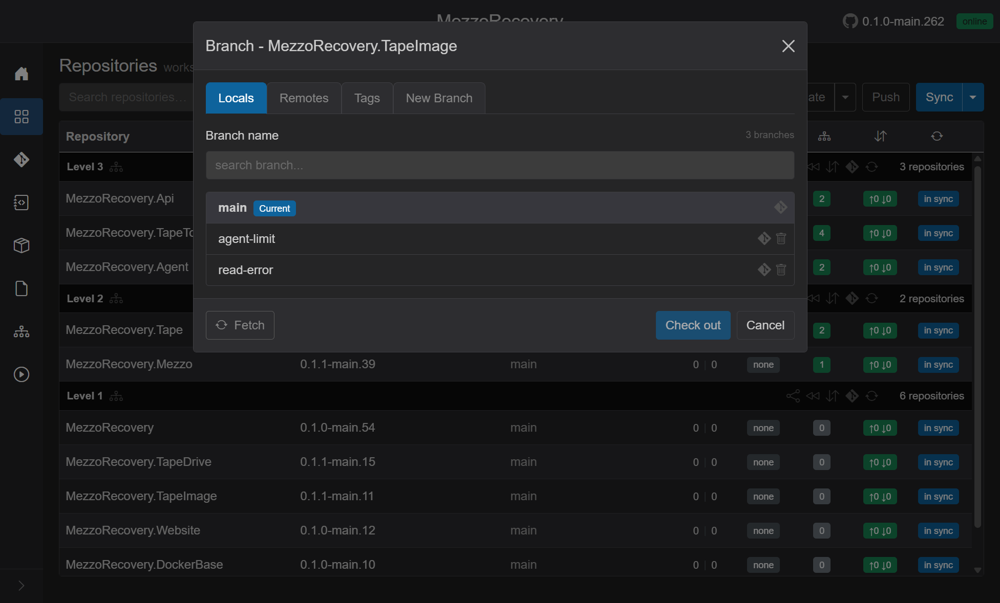
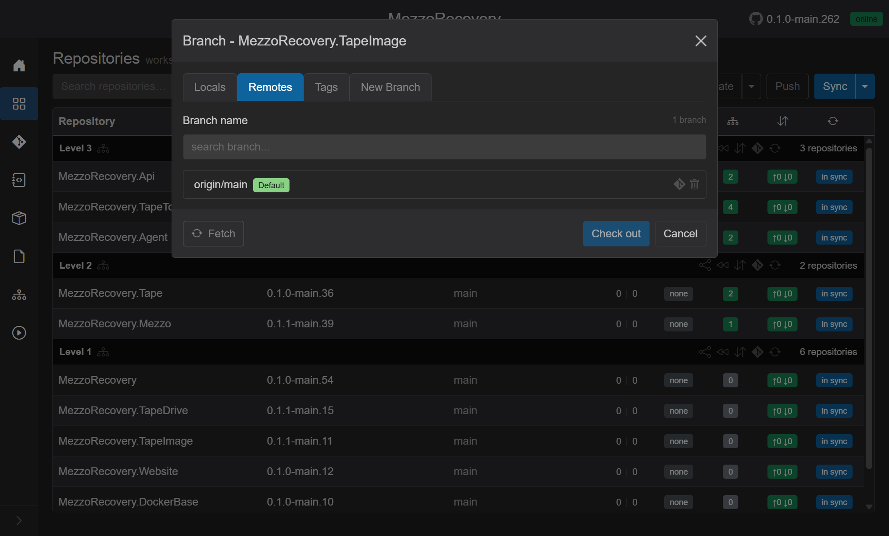
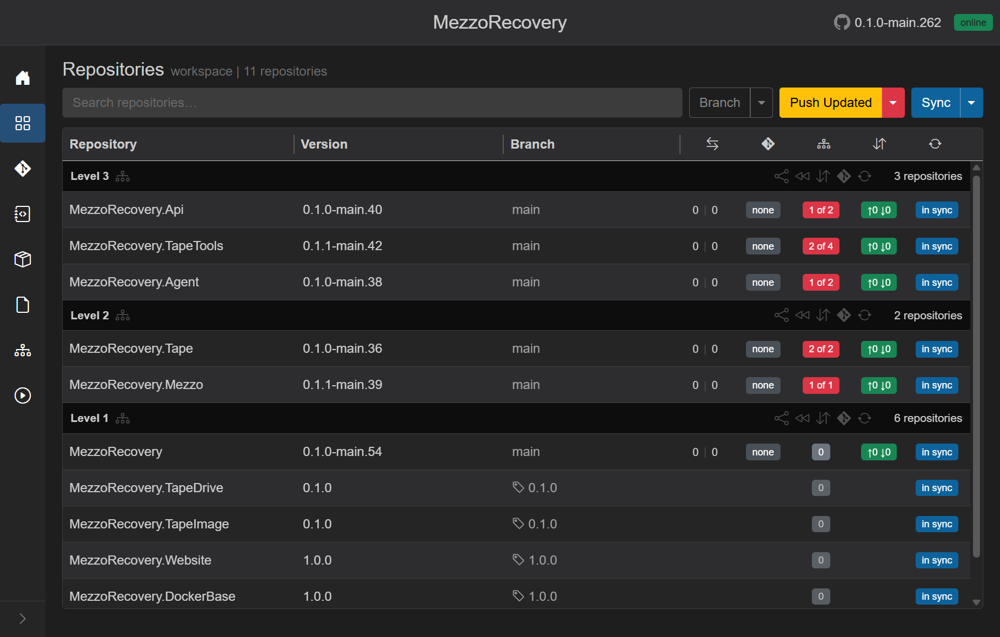
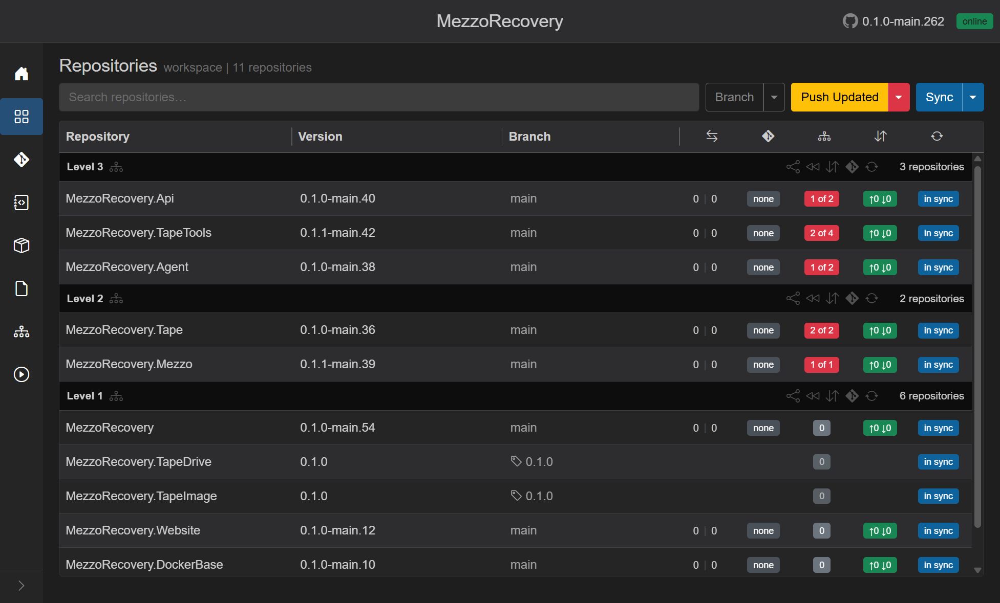
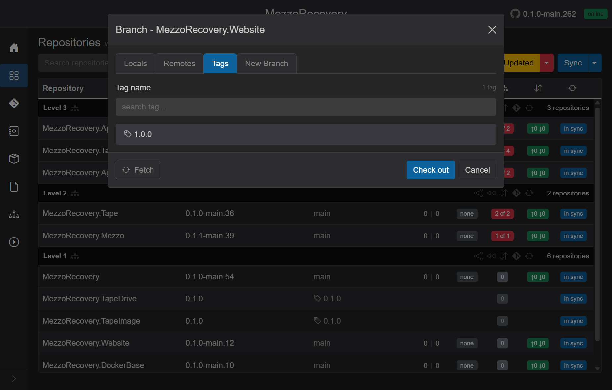
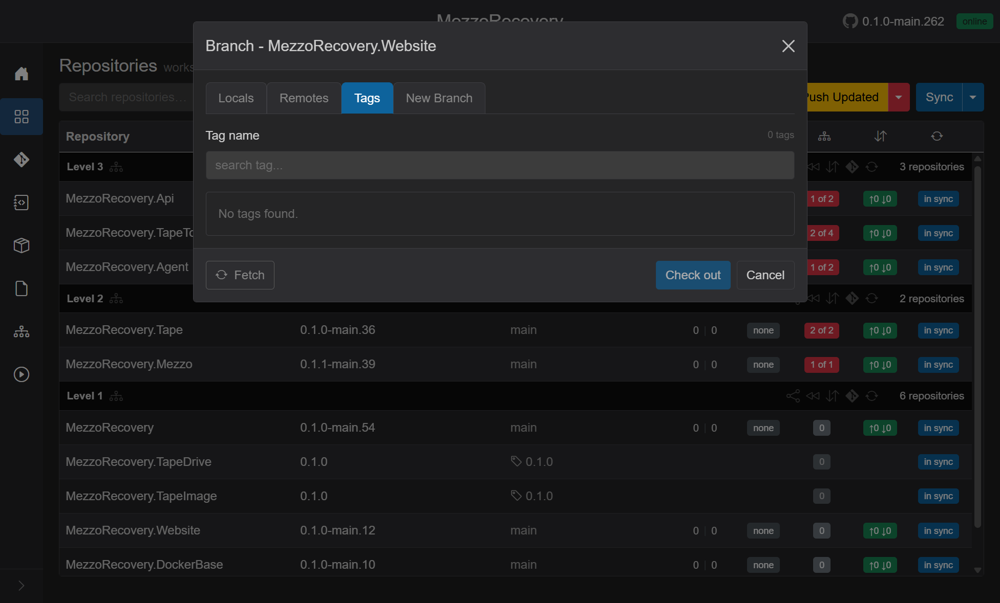
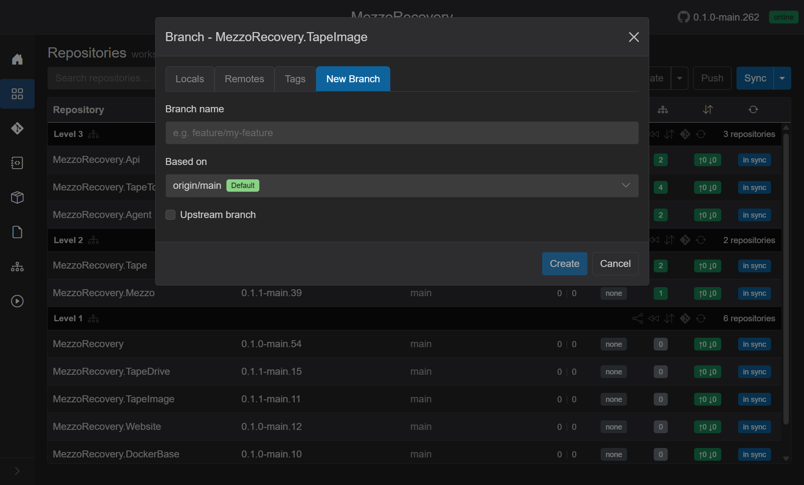
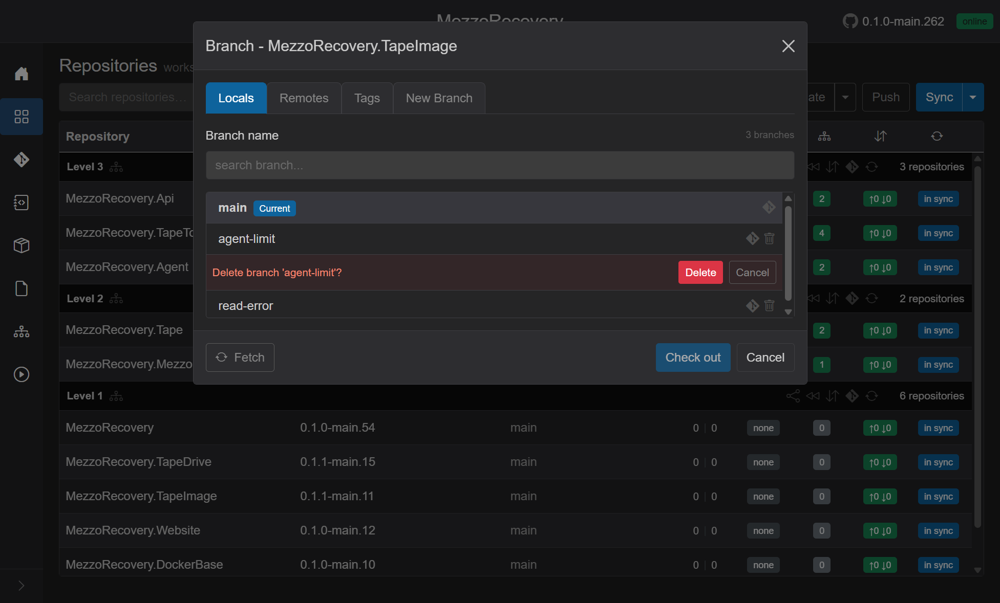
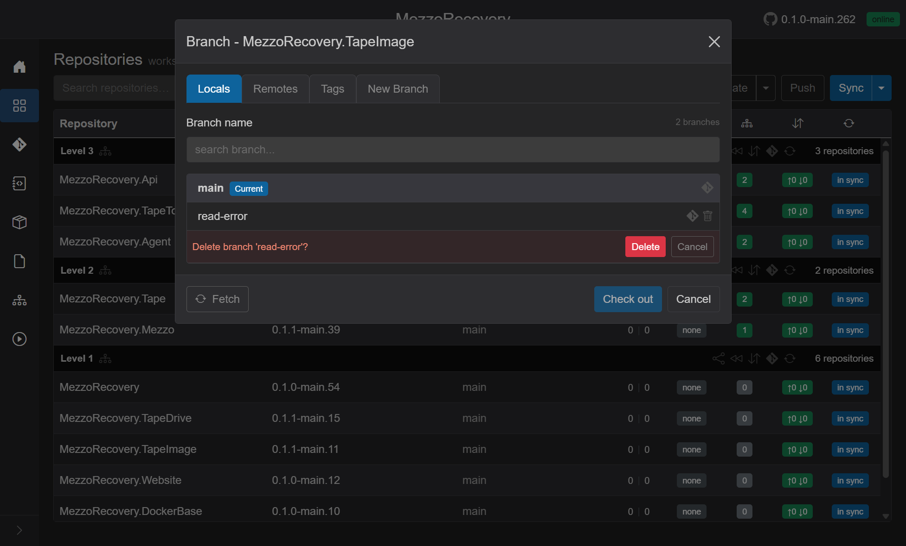
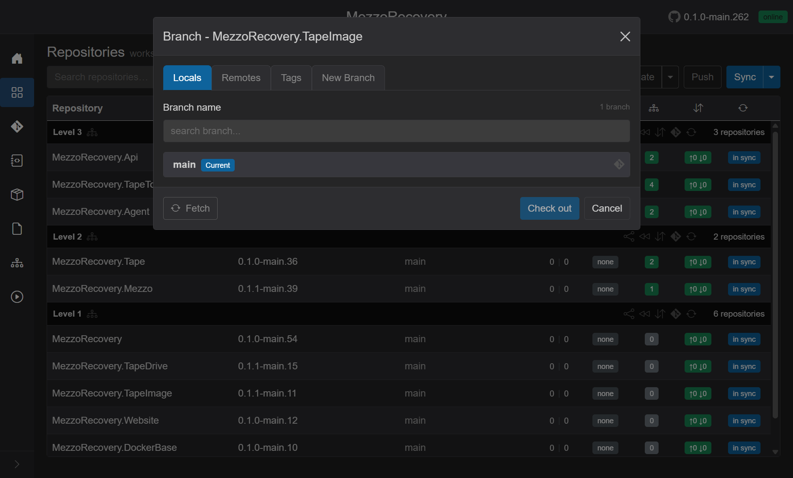

# Repository branch management (single repo)

Route: Repositories (`/workspaces/{id}`), click a row **Branch** cell.

This dialog manages **one repository** at a time. It is separate from workspace-wide branch actions in the header **Branch** menu:

| Scope | How to open | Doc |
| --- | --- | --- |
| **One repo** | Click the **Branch** cell on a row | This page |
| **All repos** | Header **Branch** caret -> **Switch Branch** / **New Branch** | [switch-branch.md](switch-branch.md), [new-branch.md](new-branch.md) |
| **Feature workflow** | Header **Branch** caret -> **New Feature** | [new-feature.md](new-feature.md) |

Walkthrough repos on MezzoRecovery (`/workspaces/2`): **MezzoRecovery.TapeImage** and **MezzoRecovery.TapeDrive** (tag **0.1.0**); **MezzoRecovery.Website** and **MezzoRecovery.DockerBase** (GitHub release tag **1.0.0**).

## Open the dialog

On the Repositories grid, find **MezzoRecovery.TapeImage** (Level 1). Click its **Branch** cell (`main`). Tooltip: *Click to switch branch*.

The modal title reads **Branch - MezzoRecovery.TapeImage**. Four tabs run across the top: **Locals**, **Remotes**, **Tags**, **New Branch**. Footer buttons depend on the active tab (**Fetch**, **Check out** / **Create**, **Cancel**).

## Locals tab

Local branches in this clone. The current branch is pinned to the top with a blue **Current** badge.

What you see:

| Element | Purpose |
| --- | --- |
| **Branch name** search | Filter the list (`search branch...`). Enter submits **Check out** when a row is selected. If the filter matches nothing, Enter opens **New Branch** with the filter text as the name. |
| Count label | e.g. **3 branches** or **1 branch matched** while filtering |
| Branch rows | Radio selection. **Current** branch has no delete icon (you cannot delete the checked-out branch). |
| Git icon | Opens GitHub compare `default...branch` for this repo in a new tab |
| Trash icon | Delete this **local** branch (inline confirmation) |
| **Fetch** | `git fetch` for this repo only; refreshes local, remote, and tag lists |
| **Check out** | Check out the selected local branch. Disabled when **Current** is selected. |
| **Sync to {default}** | Appears when the current local branch has no matching remote ref - shortcut to per-repo [Sync to Default](sync-to-default.md) flow |

Local list in this run: `main` (**Current**), `agent-limit`, `read-error`.

## Remotes tab

Remote-tracking branches (`origin/...`). You can check out a remote (creates a local tracking branch) or delete a remote branch on origin.

| Element | Purpose |
| --- | --- |
| Branch rows | Remote names shown as `origin/{branch}`. Green **Default** marks the repo default branch (`origin/main` here). |
| Git icon | Same GitHub compare link, using the short branch name |
| Trash icon | Delete the branch **on origin** (inline confirmation) |
| **Check out** | Create/switch to a local branch tracking the selected remote |

TapeImage had only **origin/main** on remote in this snapshot - the stale locals were never pushed.

## Tags tab

Git tags for this repo. Checking out a tag puts the clone in detached-HEAD / tag-pinned mode.

| Element | Purpose |
| --- | --- |
| **Tag name** search | Filter tags (`search tag...`) |
| Tag rows | Tag icon, name, blue **Current** when the repo is pinned to that tag |
| **Check out** | Check out the selected tag |

TapeImage shows tag **0.1.0** when tags exist on origin (see [Fetch](#fetch-per-repo-dialog) below if the list is empty on first open).

## Check out tag `0.1.0` (TapeDrive and TapeImage)

Pin two Level 1 repos to the same release tag:

1. Click **Branch** on **MezzoRecovery.TapeImage** (or **MezzoRecovery.TapeDrive**).
2. Open the **Tags** tab.
3. If the list is empty, click **Fetch** first (see below), then select **0.1.0**.
4. Click **Check out**. The dialog closes; a brief checkout job runs on the Agent.

Repeat for the second repo. Both clones now report tag **0.1.0** in the grid.

## Frozen on the Repositories grid

When a repo is checked out on a tag, GrayMoon treats it as **frozen** - pinned to an immutable ref, not a moving branch. The row still shows repository name, GitVersion, and sync status, but most branch-oriented metrics are suppressed because there is no active branch to compare, push, or open a PR from.

### What stays visible

| Column | On a tag |
| --- | --- |
| **Repository** | Normal repo link |
| **Version** | GitVersion at the tagged commit (e.g. `1.0.0`). Click to copy - same as on a branch. |
| **Branch** | Tag icon + tag name (e.g. `1.0.0`). Tooltip: *Repository is pinned to a tag. Click to switch.* Opens the branch dialog on **Tags** with **Current** on the active tag. |
| **Sync badge** | Still shows `in sync` / `sync` when applicable (repo exists on disk and matches origin for that ref) |

### What is not displayed

These columns are intentionally blank on a frozen row - GrayMoon does not compute or show branch-only state while the clone is detached on a tag:

| Column / badge | On a branch (`main`) | On a tag (`1.0.0`) |
| --- | --- | --- |
| **Divergence** (behind \| ahead vs default) | e.g. `0 \| 0` with GitHub compare links | **Not displayed** - empty cell |
| **PR badge** | `none`, `create`, `#N`, `merged`, etc. | **Not displayed** - empty (exception: yellow **upgrade** when a newer tag exists on origin) |
| **Commits badge** (outgoing ↑ / incoming ↓) | e.g. `↑0 ↓0`, push/pull on click | **Not displayed** - empty cell |
| **Deps badge** | Click/hover, update hints | Read-only gray `0` or count; tooltip: *checkout a branch first* |

Together, a frozen row looks visually quieter than its neighbors: tag icon in **Branch**, version semver in **Version**, empty metrics in the middle, sync on the right.

Earlier snapshot with only TapeDrive and TapeImage on **0.1.0**:

### Workspace actions skip tagged repos

| Action | Tagged repo behavior |
| --- | --- |
| **New Feature** / **New Branch** / **Switch Branch** | Skipped (`Skip repos on tags` when the footer checkbox applies, or filtered out of batch lists) |
| **Update** / **Push Updated** / **Push** | Excluded from rewrite and push sets |
| **Sync to Default** (level or workspace) | Skipped |
| **Level header** icons (rewind, sync commits, open PR, sync level) | Disabled when **every** repo in that level is on a tag |

Other repos still on `main` (e.g. **MezzoRecovery** at Level 1, Level 2/3 packages) continue to show full divergence, PR, and commit badges. Freezing is per-repo, not workspace-wide.

To unfreeze: open the branch dialog, **Locals** or **Remotes** tab, select `main`, **Check out**.

When a newer release tag is published on origin, workspace **Fetch** shows a yellow **upgrade** badge in the PR column. After checking out the newer tag, downstream repos may show red dependency badges - see [tag-upgrade.md](tag-upgrade.md#why-higher-levels-suddenly-show-out-of-date-dependencies).

## Fetch (per-repo dialog)

**Fetch** in the branch dialog footer is **not** the same as the header **Sync** caret **Fetch** (workspace-wide). Per-repo **Fetch**:

- Runs `git fetch` (with tags) for **this repository only**
- Refreshes the **Locals**, **Remotes**, and **Tags** lists in the dialog from live git state
- Persists updated branch/tag lists to GrayMoon's store and refreshes the grid row when the dialog closes or after delete/checkout

Use **Fetch** when:

- **Tags** tab shows *No tags found.* but you know tags exist on GitHub (have not fetched yet)
- A new remote branch or tag was pushed and the dialog list is stale
- You just created a tag on origin and want GrayMoon to see it (next step in this walkthrough)

While **Fetch** runs, the button shows a spinner and tabs are disabled. It does not checkout, merge, or rewrite `.csproj` files.

## GitHub releases - Website and DockerBase (`1.0.0`)

After the empty-tags walkthrough, **1.0.0** release tags were published on GitHub for:

| Repository | Release tag | Notes |
| --- | --- | --- |
| **MezzoRecovery.Website** | `1.0.0` | First release tag on this repo |
| **MezzoRecovery.DockerBase** | `1.0.0` | First release tag on this repo |

GrayMoon does not create tags - they must exist on origin. Use per-repo **Fetch** in the branch dialog to pull new tags into the clone and dialog list.

### Website - Fetch then check out `1.0.0`

1. Click **Branch** on **MezzoRecovery.Website** (was on `main`).
2. **Tags** tab -> **Fetch** (refreshes from origin; tag list goes from empty to **1 tag**).
3. Select **1.0.0** -> **Check out**.

After checkout the grid row shows **Branch** with tag icon + `1.0.0`, **Version** `1.0.0`, and blank divergence / PR / commits columns (frozen).

### DockerBase - same flow

1. Click **Branch** on **MezzoRecovery.DockerBase**.
2. **Tags** tab -> **Fetch** -> select **1.0.0** -> **Check out**.

Level 1 then has four frozen repos on tags: TapeDrive and TapeImage on **0.1.0**, Website and DockerBase on **1.0.0**. **MezzoRecovery** (root) and **MezzoRecovery.Solution** stay on `main` with full branch metrics.

### Website - empty tags (before release)

Before any GitHub release existed, **Fetch** on Website showed:

- Count label: **0 tags**
- Message: *No tags found.*
- **Check out** disabled until a tag appears after **Fetch**

## New Branch tab

Create a branch in **this repo only** (not workspace-wide **New Branch** from the header).

| Field | Purpose |
| --- | --- |
| **Branch name** | New branch name (placeholder `e.g. feature/my-feature`) |
| **Based on** | Dropdown: **Default** (`origin/main`) or any local/remote branch |
| **Upstream branch** | When checked, sets upstream after create |
| **Create** | Creates the branch and closes the dialog (overlay runs checkout/create on the Agent) |

If the name already exists locally or on remote, the footer switches to **Check out** with a warning instead of **Create**.

Workspace-wide branch creation (same name in every repo) stays on the header **Branch** button - [new-branch.md](new-branch.md).

## Delete local branches

Delete stale locals without leaving the dialog. You cannot delete **Current** (`main` here).

### Delete `agent-limit`

1. Stay on **Locals**.
2. Click the trash icon on the **agent-limit** row.
3. Inline confirmation appears: *Delete branch 'agent-limit'?* with red **Delete** and **Cancel**.

4. Click **Delete**. The list refreshes; `agent-limit` is gone.

### Delete `read-error`

Same flow for **read-error**:

### After deletion

Only **main** (**Current**) remains:

The grid **Branch** cell is unchanged (`main`) because you deleted branches you were not on.

### Delete behavior and safety

| Case | Behavior |
| --- | --- |
| **Local delete** | `git branch -d`. If git reports *not fully merged*, a second step offers force delete (`-D`) with a warning about lost commits (safe after squash merge). |
| **Remote delete** | Deletes the branch on origin via the Agent. Confirmation names the remote ref (e.g. `origin/feature-x`). |
| **Current branch** | No trash icon - switch away first if you need to delete it |
| **Errors** | Red alert at top of the dialog; other repos in the workspace are unaffected |

Remote delete is useful after a merged PR when `origin/feature-x` still exists. Local delete cleans up clones without touching other repos.

## Keyboard and footer shortcuts

- **Escape** - close dialog (clears search filter first if the filter box has text)
- **Enter** in search - **Check out** selected branch, or **Create** from filter on Locals when no match
- **Fetch** - always available on Locals / Remotes / Tags (not on New Branch tab)

## How this fits the doc set

| Topic | Document |
| --- | --- |
| Workspace grid, Branch column | [repositories.md](repositories.md) |
| Switch all repos to a common branch | [switch-branch.md](switch-branch.md) |
| Create branch in all repos | [new-branch.md](new-branch.md) |
| Feature branch + deps + push | [new-feature.md](new-feature.md) |
| Abandon feature branch / rewind to default | [sync-to-default.md](sync-to-default.md) |
| **Single-repo tabs, checkout, delete, tags, frozen** | **This page** |
