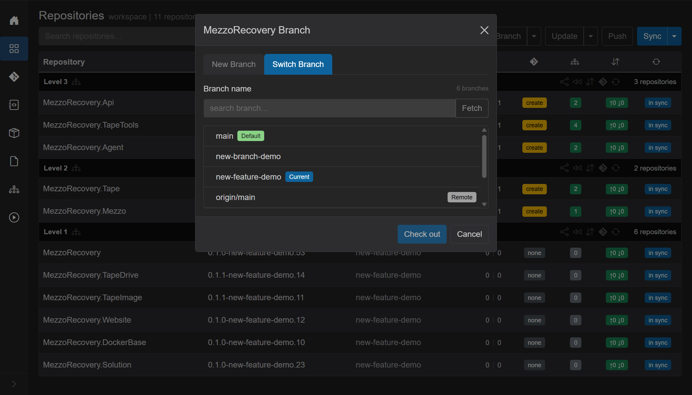
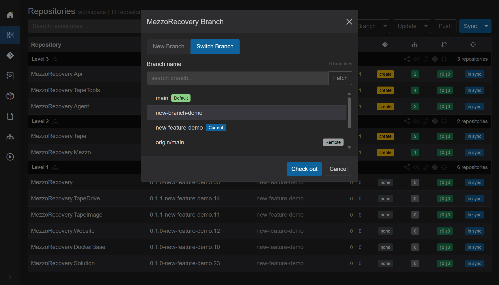
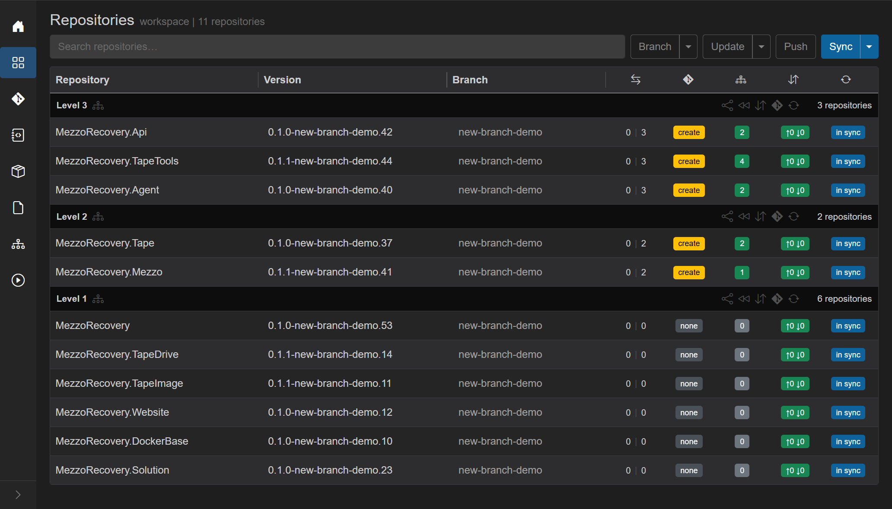
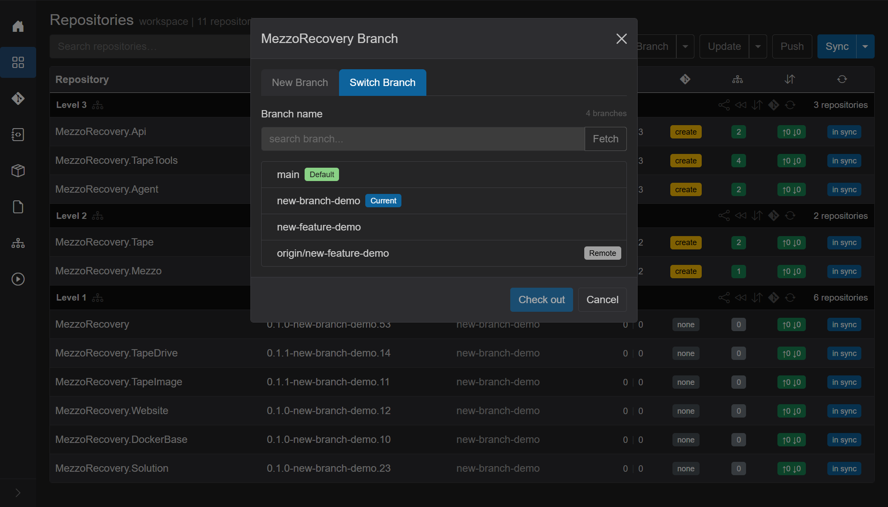
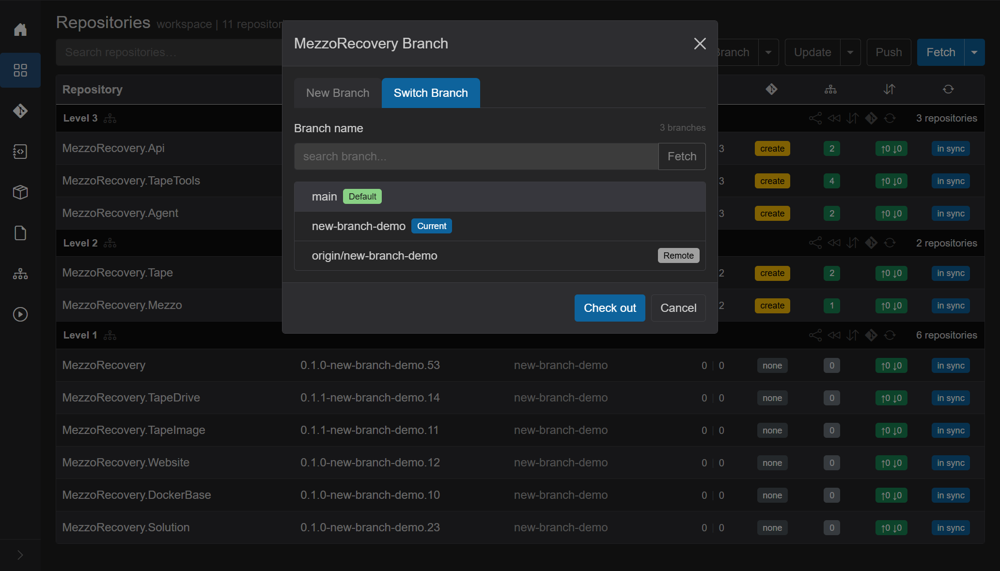

witch Branch

Route: Repositories, header **Branch** caret, **Switch Branch**.

One list. One **Check out**. Every repository in the workspace moves to the same branch. That is the point: you do not walk the grid checking out 11 repos by hand.

It shares a dialog with [New Branch](new-branch.md) (two tabs). It does **not** create a branch, rewrite `.csproj` files, or push. For branch + update + synchronized push, use [New Feature](new-feature.md).

On MezzoRecovery (`/workspaces/2`, 11 repos) the **Branch** caret opens:

- **New Feature** - [new-feature.md](new-feature.md).
- **New Branch** - [new-branch.md](new-branch.md).
- **Switch Branch** - this tab.
- **Create PRs...** / **Sync To Default** - not this dialog. Sync To Default is [sync-to-default.md](sync-to-default.md).

The primary **Branch** button opens the same dialog on **New Branch**. Click **Switch Branch** in the caret, or switch tabs after it is open.

## Jumping from one branch to another

After [New Feature](new-feature.md) created `new-feature-demo`, every MezzoRecovery repo sat on that one branch. Versions include the branch name. Level 2 / 3 are ahead of `main` with yellow **create** (PR). Commits badges are green `↑0 ↓0` (already pushed). Header **Push** is outline.

**Branch** caret, **Switch Branch**. The list is only names that exist in **all** 11 repos. Here that is six rows: `main` (Default), `new-branch-demo`, `new-feature-demo` (Current), plus the matching `origin/...` remotes. Search (`search branch...`) filters the list. **Fetch** refreshes remotes from origin, then the intersection is recomputed.

Blue **Current** is the branch every repo is already on. Green **Default** is the shared default (`main`). Gray **Remote** marks `origin/...` names. Click a row that is not Current - here **new-branch-demo**, the other feature branch from the [New Branch](new-branch.md) walkthrough. **Check out** enables.

**Check out** closes the dialog and runs a workspace job: overlay **Checking out...** then **Checked out N of M**, **Abort**. Checkout of 11 repos is usually a few seconds. GitVersion and branch cells catch up as each repo's checkout hook syncs.

After checkout every **Branch** cell is `new-branch-demo`. Version strings are `*-new-branch-demo.*` again. Working trees match that branch (whatever commits it already had - including earlier demo work). Switch Branch did not update packages or push; it only moved HEAD.

Open **Switch Branch** again. **Current** has moved to `new-branch-demo`. `new-feature-demo` is still in the list, so jumping back is the same gesture: select it, **Check out**.

Same path works for `main` (Default). Select it, **Check out**, every repo is on `main`:

After landing on default, a full **Sync** is a good idea before [New Feature](new-feature.md) so remote tips and `.csproj` scans match `origin/main`.

## Conditions

These are the gates. Unmatched dependencies, outgoing commits, and PR badges do **not** block Switch Branch.

### To open the workspace dialog

- The workspace has at least one repository. With zero repos the Branch actions stay disabled.
- **Branch** and its caret stay disabled while a Repositories job is running or the Agent is showing pending tasks.

The Agent must be online for **Check out** (and **Fetch**) to succeed. The dialog can still open from persisted branch lists if the Agent is down; checkout will fail per repo.

### For a name to appear in the list

A branch is listed only if it exists in **every** workspace repository. A name missing from even one repo does not appear. Locals and remotes are intersected separately, so `new-feature-demo` and `origin/new-feature-demo` are two rows.

- Shared default (when every repo uses the same default name, e.g. `main`) is always shown with green **Default**. If defaults differ, that label is `multiple`.
- Empty list: **No common branches across all repositories.**
- Search miss: **No branches match the filter.**
- **Fetch** (in the search group) runs `git fetch` across the workspace, then rebuilds the common set. Use it when a remote exists on origin but is not in the list yet.

That intersection is why Switch Branch feels safe: you cannot pick a branch that only some repos have.

### To enable Check out

- A row is selected (radio). Opening from the header menu does not pre-select; click the branch you want.
- That selection is **not** already **Current**. Current means every repo is on that **local** name (case-insensitive). Tooltip when disabled for that reason: **Already on this branch across all repositories.**
- Remote rows never get **Current**. Checking out `origin/foo` still runs checkout (creates a local `foo` tracking that remote when the local ref is missing).

Enter submits **Check out** when it is enabled.

### Tags

**Skip repos on tags** appears in the footer only when at least one repo is on a tag. Checked (the default): tagged repos are left alone. Unchecked: those repos are included in the checkout.

### When git can still refuse

GrayMoon does not require a clean working tree before **Check out**. If a repo has local changes that `git checkout` would overwrite, that repo fails and the error is toasted / shown on the row. The other repos still switch. Commit or stash those changes (or use [Changes](changes.md)) and retry.

### Per-repo branch dialog

Clicking a row **Branch** cell is a **different** dialog: **Branch - {repo}**, with tabs **Locals** / **Remotes** / **Tags** / **New Branch**. That one repo can check out any of *its* branches, including names that are not common to the workspace. Workspace-wide Switch Branch (this page) is only the header **Branch** caret.

On a tag, the row click opens that per-repo dialog on **Tags**. The `upgrade` PR badge (newer tag exists) does the same.

## What Check out does not do

- It does not create a new branch name (use [New Branch](new-branch.md) or [New Feature](new-feature.md)).
- It does not bump package / file versions or commit.
- It does not push, and it does not open PRs.
- It does not reset or delete the branch you left. That branch stays in the common list so you can jump back.
