c To Default

Route: Repositories, header **Branch** caret, **Sync To Default**.

Every repository that is not already on its default branch (`main` here) is moved back to that default, the branch you were on is removed, and default is pulled so local matches origin. That is stronger than [Switch Branch](switch-branch.md). Switch Branch only checks out another existing name and leaves the old branch in place. Sync To Default is how you **abandon** the current feature branch across the workspace.

This page covers both the workspace-wide action from the **Branch** menu and the rewind icon on each **Level N** header ([Per dependency level](#per-dependency-level)).

## Two reasons to use it

**1. Roll back (this walkthrough).** The feature-branch work across the repositories is wrong and will never land on default via PR. You want every repo back on `main`, those feature commits gone, and the feature branch deleted locally and on origin. Treat this as discard, not merge.

**2. PRs already merged (not demoed here).** The feature is in default on GitHub. You still want the workspace off the feature branch and on the latest default: checkout `main`, drop the now-merged feature branch, pull so GitVersion and working trees match `origin/main`. Same menu item, same dialog shell. The difference is the dialog stays calm: merged / closed PRs do not show **N commits will be lost**, **Proceed** stays blue, and there is no countdown.

Both cases share the same housekeeping benefit. Sync To Default removes the feature branch from every workspace clone once that work is either merged or discarded, so local repositories stay on default with a short branch list. Without it, each finished feature would remain as an unused local ref (and often a remote) after you had already moved on. Over time that clutter makes [Switch Branch](switch-branch.md) harder to read and makes it easy to check out yesterday's branch by mistake.

The workspace-wide walkthrough below is reason 1 for all 11 repos at once. [Per dependency level](#per-dependency-level) is the same rollback, one level at a time, starting at Level 1.

## Open it

On MezzoRecovery (`/workspaces/2`, 11 repos) the **Branch** caret opens:

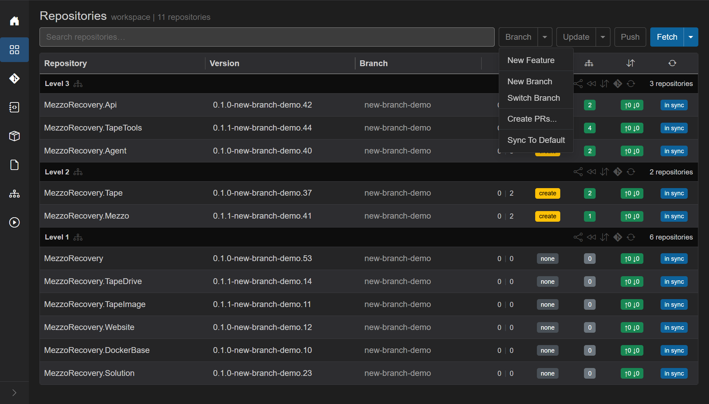

- **New Feature** / **New Branch** / **Switch Branch** - not this action.
- **Create PRs...** - not this action.
- **Sync To Default** - this flow.

The Agent must be online. **Branch** stays disabled while a Repositories job is running or the Agent has pending tasks, and when the workspace has zero repos. Repos already on default are skipped. If every repo is already on default, a toast says **All repositories are already on the default branch.** and nothing else runs. Repos on tags are skipped.

## What not to do (hard abort vs merge workflow)
Use **Branch menu -> Sync To Default** only as a hard abort/discard: it checks out default across *every* eligible repo and deletes the current feature branch refs locally (and optionally on origin).

If any listed repo is **ahead of default** and does **not** have a merged or closed PR, GrayMoon shows a red warning like **N commits will be lost** (and the dialog supports rollback countdown / Proceed flow for discard).

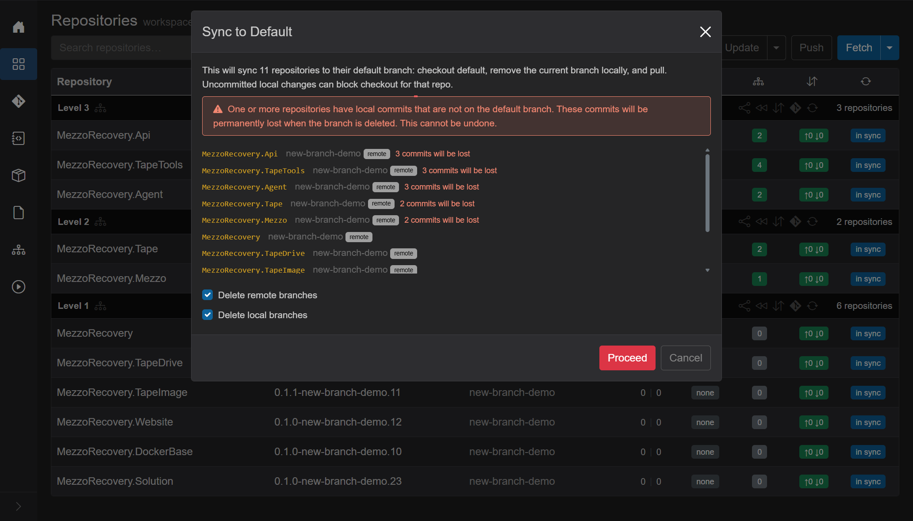

In this walkthrough, we are not abandoning merged work. So for anything where you still intend to merge PRs, **do not proceed with the workspace-wide Sync To Default dialog**. Click **Cancel** and use per-level rewind instead.

## Roll back the feature work

After [Switch Branch](switch-branch.md) the workspace sat on `new-branch-demo` everywhere. Level 2 / 3 were ahead of `main` (`0 | 3` or `0 | 2`) with yellow **create** (no PR). Commits badges were green `↑0 ↓0` (that feature branch had been pushed). The work on that branch is what we are throwing away.

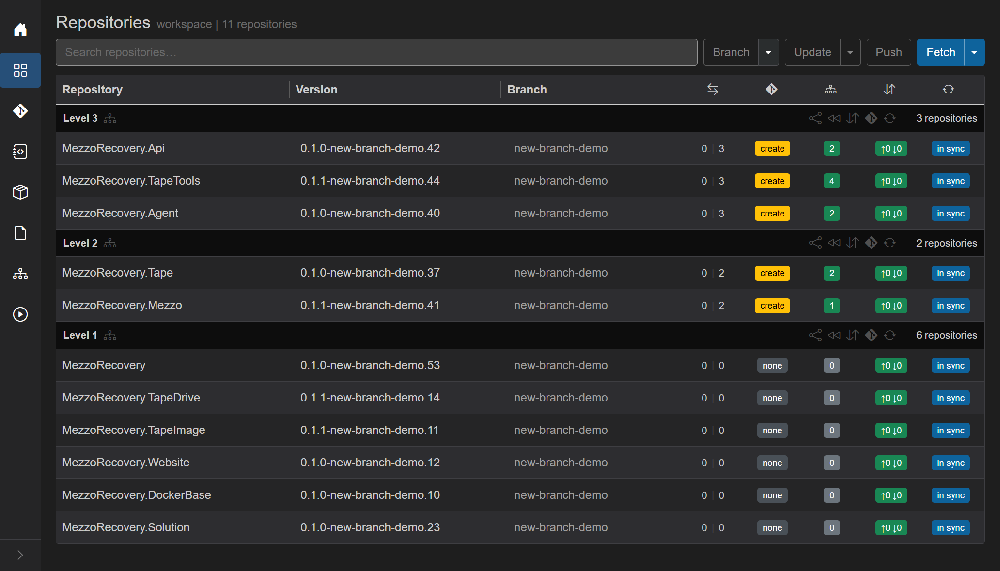

**Branch** caret, **Sync To Default**. GrayMoon does **not** show the confirm dialog on that click. It first refreshes live git / GitHub state so the list you are about to approve is current.

### Fetch before the dialog

A workspace job starts immediately: overlay **Fetching latest branch state for N repositories...**, then **Fetched N of M...**, **Abort**. In parallel (up to 8 at a time) it:

1. Refreshes pull-request records from GitHub (open / merged / closed, PR numbers).
2. Fetches branches from origin for each eligible repo (`git fetch`), then reloads upstream and ahead/behind vs default from that result.

Only after that fetch finishes does the **Sync to Default** dialog open, built from the database just written - not from whatever the grid last painted. If you **Abort** (or the fetch fails), you get **Fetch cancelled.** / **Failed to prepare sync to default.** and no checkout happens.

On this run the fetch of 11 repos was short; the overlay may flash. The dialog below is the proof it completed.

### The dialog

Title: **Sync to Default**. Escape, the X, or **Cancel** closes it without changing git.

**Lead copy** (11 repos here): *This will sync 11 repositories to their default branch: checkout default, remove the current branch locally, and pull. Uncommitted local changes can block checkout for that repo.* For a single repo the wording is the singular equivalent.

**Red alert** (reason 1): *One or more repositories have local commits that are not on the default branch. These commits will be permanently lost when the branch is deleted. This cannot be undone.* It appears when any listed repo is ahead of default **and** does not have a merged or closed PR. That is the rollback warning. Reason 2 (merged PRs) does not show this alert.

**Repo list** - one line per eligible repo (not already on default, not on a tag):

- Repository name (`MezzoRecovery.Api`, ...).
- Current branch (`new-branch-demo`).
- Gray **remote** when that branch has an upstream (`origin/new-branch-demo`). That is what **Delete remote branches** will remove.
- **PR open** / purple **merged** / **PR closed** when a PR exists for that branch. This demo never opened PRs, so those badges are absent (the grid still showed yellow **create**).
- Red **N commits will be lost** when that repo is ahead of default and the PR is not merged or closed. Here Level 3 lost 3 commits, Level 2 lost 2. Level 1 had `0 | 0` vs `main`, so those six lines have **remote** but no lost-commit text. They still leave `new-branch-demo`; they just have no unique commits to destroy.

**Delete remote branches** - shown only if at least one listed repo has an upstream. Default **on**. Checked: GrayMoon deletes `origin/{current branch}` **before** the fetch/pull so prune drops the tracking ref. Unchecked: the remote feature branch stays on GitHub. For a rollback, leave it on.

**Delete local branches** - default **on**. Checked: after checkout of default, the old local branch is force-deleted (`git branch -D`), which is what actually discards unmerged commits. Unchecked: GrayMoon still tries to delete the local branch with a safe delete (`git branch -d`), which **refuses** if the branch is not merged - the feature branch survives locally and the rollback is incomplete. For a rollback, leave it on.

Footer: red **Proceed** when commits will be lost, otherwise blue **Proceed**. **Cancel**.

### Countdown (rollback only)

When the red alert is showing, the first **Proceed** does not start git yet. The button switches to **Syncing in 5...** and counts down. **Cancel** turns yellow so it is obvious you can still abort. After 5 seconds GrayMoon proceeds on its own. Enter on the dialog is the same as **Proceed** (ignored during the countdown). Escape is **Cancel**.

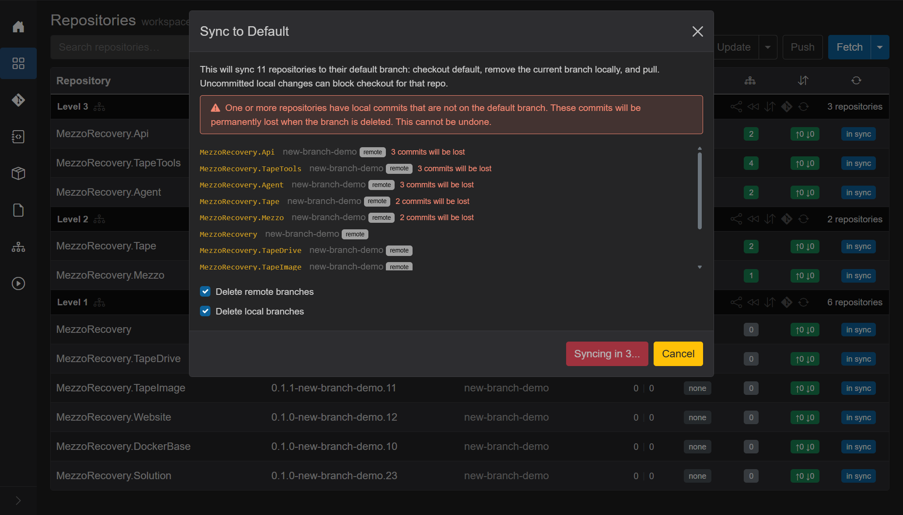

Reason 2 has no countdown: **Proceed** runs immediately.

## What runs after Proceed

A second job: overlay **Synchronizing to default branch...**, then **Synchronized N of M to default branch**, **Abort**. Repos run in parallel (up to 16). For each repo GrayMoon:

1. Closes an **open** PR on GitHub when it knows the number (best-effort; a close failure is logged and sync continues). This demo had no open PRs.
2. Deletes the remote feature branch if you left **Delete remote branches** on and that repo had an upstream.
3. Fetches from origin again (with prune), including tags.
4. Checks out the default branch (`main`).
5. Deletes the local feature branch (force if **Delete local branches** was on, or if the PR is already merged / closed).
6. Pulls default so local `main` matches origin.
7. Recaptures GitVersion, branch lists, projects, and commit counts for the grid.

After every repo finishes, workspace dependency / file-version stats are recomputed once. A toast reports **Synced N of M repositories to default branch.** (or the failure count). Per-repo errors land as a row **Error:** banner and an error toast.

Uncommitted local changes that `git checkout` would overwrite fail **that repo only**; the others still switch. Use [Changes](changes.md) (or stash / commit) and retry the failed rows.

It does **not** rewrite commits on `main`. It does **not** delete **other** feature branches you are not currently on. After this rollback, `new-branch-demo` is gone locally and on origin, but `new-feature-demo` from the earlier [New Feature](new-feature.md) demo can still exist until you delete it separately.

## After

Every **Branch** cell is `main`. Version strings are `*-main.*` again. Divergence is `0 | 0`. PR badges **none**. Dep counts green. Commits `↑0 ↓0`, **in sync**. Header **Push** is outline. The workspace looks like default, with the discarded feature work no longer on the current branch.

## Per dependency level

Each **Level N** header has a rewind control (title **Sync to default branch...**). It runs the same Sync To Default job, but only for repositories in that level. Fetch still happens first; the dialog still lists only those repos; **Delete remote branches** / **Delete local branches** still default on.

Use this when you want default to come back **in graph order**, not all 11 clones at once.

### Roll back Level 1 first

After switching to `new-feature-demo`, every repo was on that branch. Level 1 was `0 | 0` vs `main` (no unique commits). Level 2 / 3 were `0 | 1` with yellow **create** - the New Feature dependency-update commit, and no PRs.

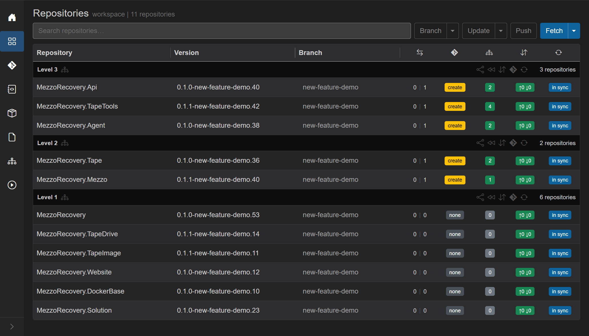

On the **Level 1** header, rewind. Overlay **Fetching latest branch state for 6 repositories...**, then the same **Sync to Default** dialog, scoped to those six names only. No red **commits will be lost** alert: nothing unique vs `main` would be destroyed, only the feature-branch ref. **Proceed** stays blue and runs immediately (no countdown).

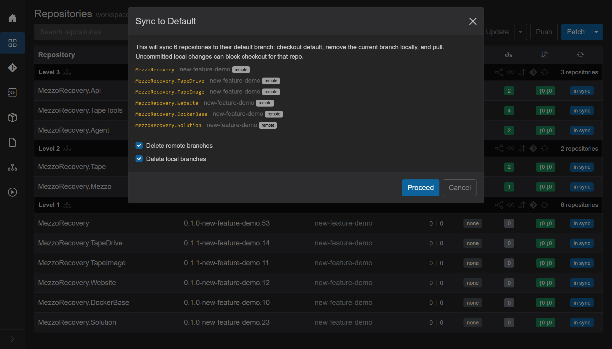

The job is **Synchronizing to default branch...** with **Abort** and the live git log (remote delete of `new-feature-demo` on those six remotes, fetch --prune, checkout `main`, delete the local branch, pull).

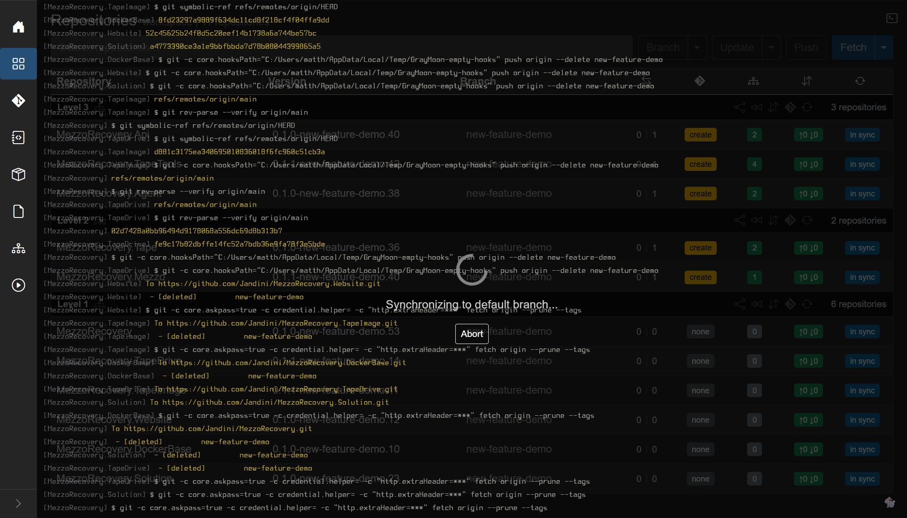

Afterward Level 1 is on `main` (`*-main.*`, `0 | 0`, **none**). Level 2 / 3 stay on `new-feature-demo`. That mixed grid is expected after a per-level rewind, not a failed job.

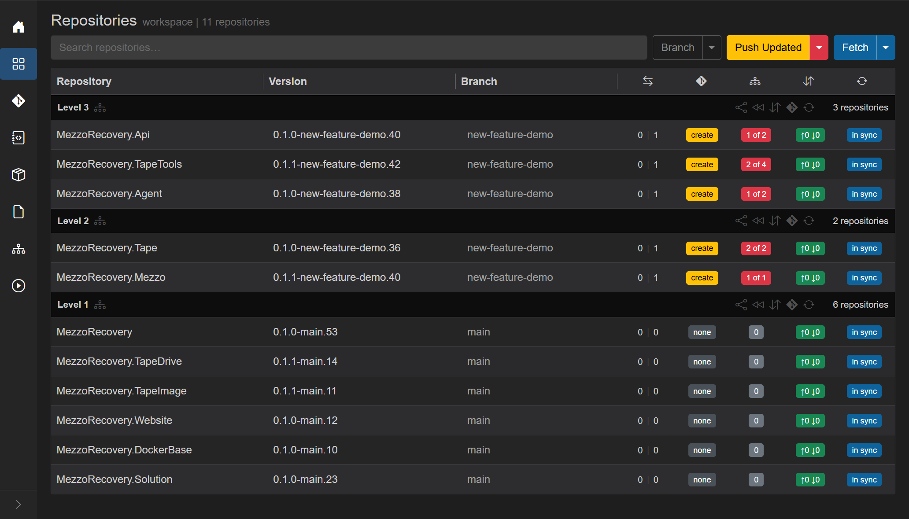

### Level 1 PRs are still open (what to do next)
If PRs are still open on **Level 1**, you must not start the rollback from the workspace-wide **Branch menu -> Sync To Default** flow.

The safe workflow is:
- **Merge (or close) Level 1 PRs first**.
- Then rewind **Level 1** using the Level header's rewind icon (single-level cleanup).

On this run, the Level 1 header still shows two open PRs:

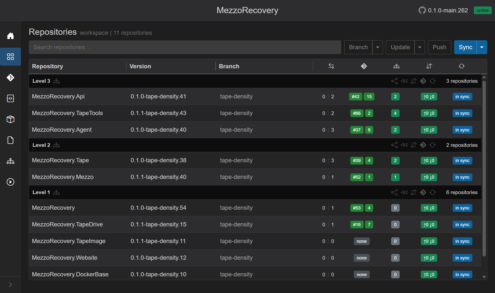

On the **Level 1** header, click the rewind icon (**Sync to default branch...**). The dialog it opens is scoped to Level 1 and skips repos with open PRs.

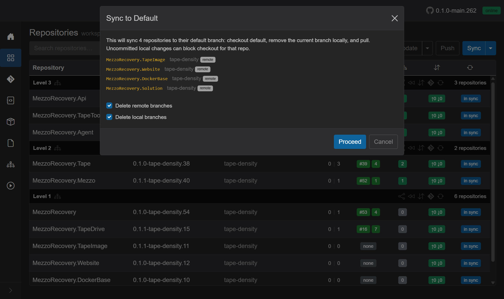

In this dialog, the two open-PR repos are intentionally absent:
- `MezzoRecovery` (PR `#53`)
- `MezzoRecovery.TapeDrive` (PR `#16`)

The repos that are listed (safe to rewind while PRs are still unmerged) are:
- `MezzoRecovery.TapeImage`
- `MezzoRecovery.Website`
- `MezzoRecovery.DockerBase`
- `MezzoRecovery.Solution`

In this scenario, the first three effectively have no divergence vs `main` (so GrayMoon can safely do the branch cleanup for them), and `Solution` is also eligible because there is no unmerged PR work tied to it.

Click **Proceed** in this dialog to sync the eligible Level 1 repos to `main`.

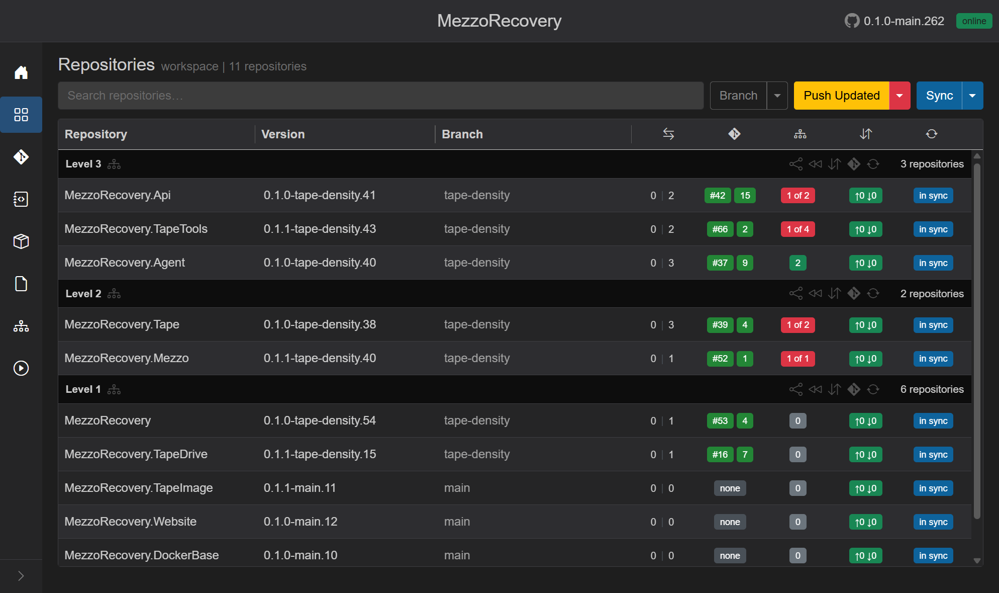

Afterward, GrayMoon leaves the two open PR repos on the feature branch and rewinds only the repos listed in the dialog:
- Stayed on `tape-density` (still blocked by PRs): `MezzoRecovery` (PR `#53`), `MezzoRecovery.TapeDrive` (PR `#16`)
- Moved to `main`: `MezzoRecovery.TapeImage`, `MezzoRecovery.Website`, `MezzoRecovery.DockerBase`, `MezzoRecovery.Solution`

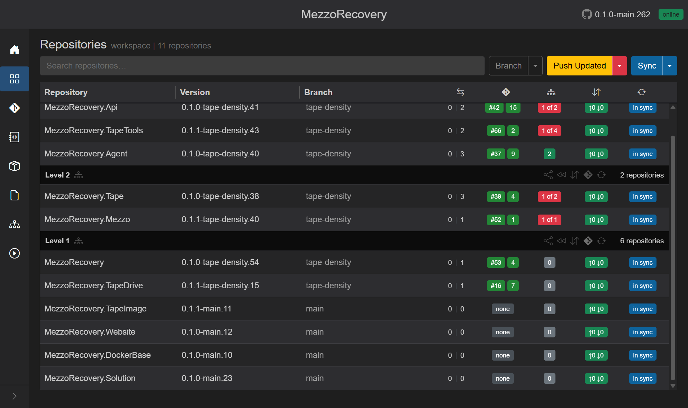

Next: merge the two remaining PRs at Level 1. Then rerun **Level 1 rewind** so those two repos are finally included in the dialog and can be checked out onto `main`.

### What the red badges are tracking

[New Feature](new-feature.md) rewrote Level 2 / 3 `.csproj` files so `<PackageReference>` versions matched GitVersion on the feature branch (`0.1.1-new-feature-demo.14`, and so on). Level 1 rewind put those package repos back on `main`, so GitVersion there is `*-main.*` again. The consuming `.csproj` files on `new-feature-demo` still pin the feature versions. GrayMoon compares every workspace package reference to the live GitVersion of that package and paints the mismatch.

That is the red `N of M` badge: **N** workspace package refs (and/or file tokens) that do not match, out of **M** tracked in-workspace deps. Green counts mean every pin still matches. Gray `0` on Level 1 means those repos do not consume other workspace packages.

Hover TapeTools `2 of 4`:

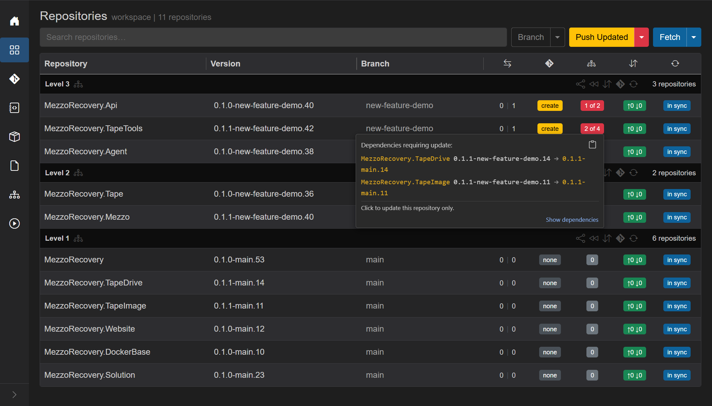

Title **Dependencies requiring update:** then each drifted pin as `current -> new`. Here TapeDrive and TapeImage went `0.1.1-new-feature-demo.14 -> 0.1.1-main.14` (and the same for TapeImage). The other two of TapeTools' four workspace deps are still on `new-feature-demo` (Level 2), so those pins still match - hence **2 of 4**, not **4 of 4**. Footer **Click to update this repository only** / **Show dependencies** is the path that would rewrite this `.csproj` onto `main` versions. Header **Push Updated** (yellow) is the workspace-wide version of that path.

This walkthrough is **aborting** the feature, not retargeting it. Do **not** click the red badge, **Update Only**, or **Push Updated**. Those would commit new pins on `new-feature-demo` so consumers follow `main` - the opposite of discarding the branch. Leave the badges as the audit trail. Finish the rollback with workspace **Branch** menu **Sync To Default** (Level 2 / 3 rewind will skip while those unique commits have no merged PR), which checks out `main` and deletes the feature branch so the `.csproj` files on disk are the `main` ones again and the red counts clear.

### Why Level 2 and Level 3 rewind skipped

Rewind on **Level 2** (or 3) does **not** open the dialog while those repos are ahead of default and have no merged or closed PR. Each row is toasted: *{repo}: skipped sync to default (commits ahead of default, PR not merged).* If every repo in the level is skipped, nothing is checked out.

That guard is the point of the per-level control. Unique work on a consuming repo is not discarded just because Level 1 already went back to `main`. A full no-PR discard of those ahead commits is the workspace **Branch** menu **Sync To Default** (the walkthrough above), which shows the red alert and countdown instead of skipping.

### How per-level rewind fits merging PRs

The usual happy path is: merge the PRs **by dependency level**, then rewind that level so clones drop the merged feature branch and pick up latest default.

1. Open PRs (**Create PRs...**). Merge **Level 1** first so the base packages exist on default (and on the feed).
2. Rewind **Level 1**. Those six clones leave `new-feature-demo`, delete the merged branch locally and on origin, and pull `main`. Level 2 / 3 stay on the feature branch until *their* PRs merge - they can keep building against the feature while Level 1 is already clean.
3. Merge **Level 2** PRs (they already consumed Level 1 packages; those packages now live on default). Rewind **Level 2**. The skip no longer applies: the PR is merged, so ahead-of-default is treated as landed work, not lost work. **Proceed** is blue, no countdown.
4. Merge **Level 3**, rewind **Level 3**.

Benefits of doing it per level instead of waiting to rewind the whole workspace:

- Default comes back in publish order. A consumer is not forced onto `main` while its own PR is still open, and it is not left pinning a feature package version after the package repo has already returned to default unless that is what you intended.
- Each finished level sheds the feature branch immediately, so those clones stay tidy instead of carrying a merged name until the last PR in the graph lands.
- Higher levels can keep using the feature branch while lower levels are already on default. Switch Branch stays readable: fewer leftover names in the repos you have already closed out.
- The skip on unmerged ahead commits is the same safety net during the PR process: rewind is a cleanup step after merge (or a branch-name cleanup when a level has no unique commits), not an accidental discard of open work.

This demo used an open-PR state on Level 1, so the Level 1 rewind dialog intentionally excluded the two open-PR repos until you merge them. Level 2 / 3 still sit on `new-feature-demo` with unmatched deps until you merge their PRs and rewind those levels (or, as an explicit rollback/discard action, use workspace-wide Sync To Default).

## Other entry points

- **Per-repo branch dialog** (click a row **Branch** cell) - can sync **one** repo to default from that dialog. Same git steps for that repo only.

## What Sync To Default does not do

- It does not create or update a PR.
- It does not bump `.csproj` / file versions or make a new commit on default.
- It does not switch you to another feature branch (use [Switch Branch](switch-branch.md) if you still want that work).
- It does not keep the feature branch around. If you only wanted to visit `main` and come back, use Switch Branch instead.
