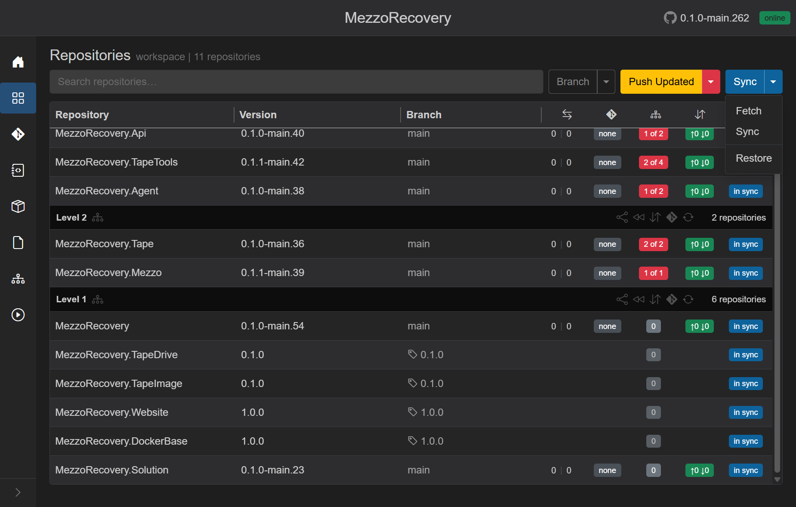
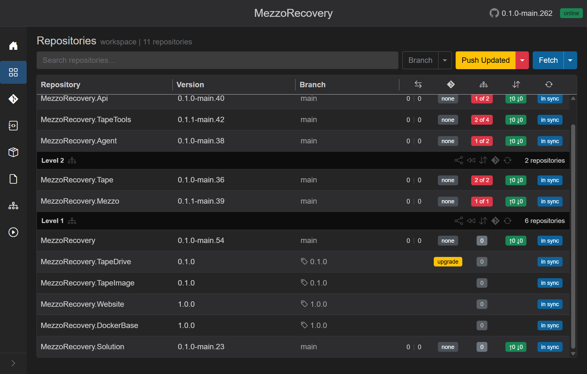
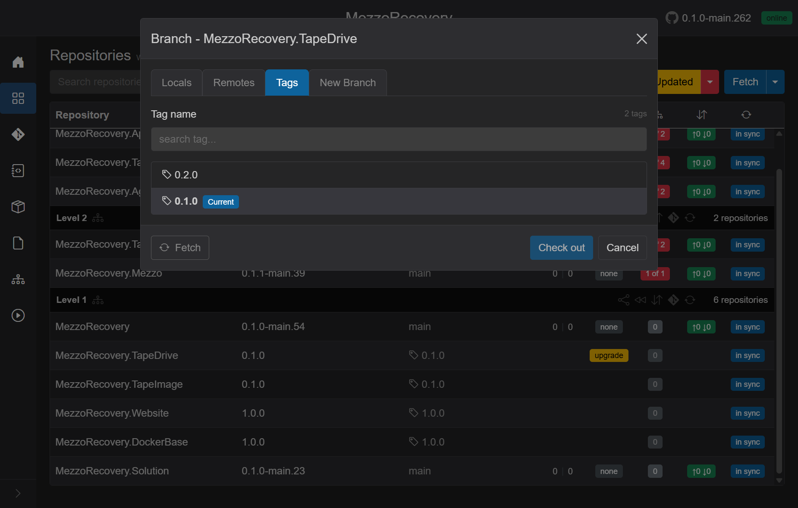
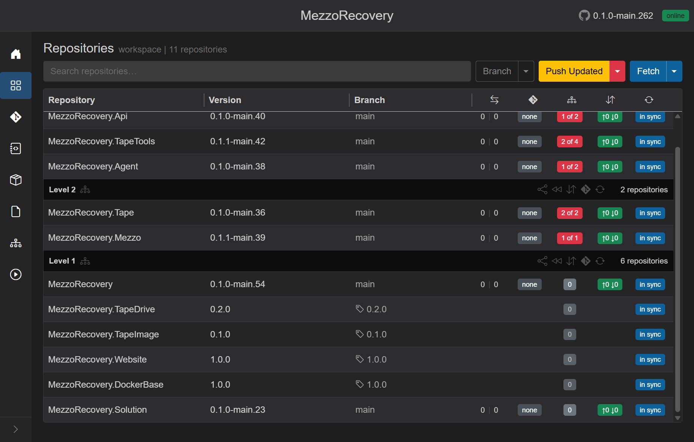
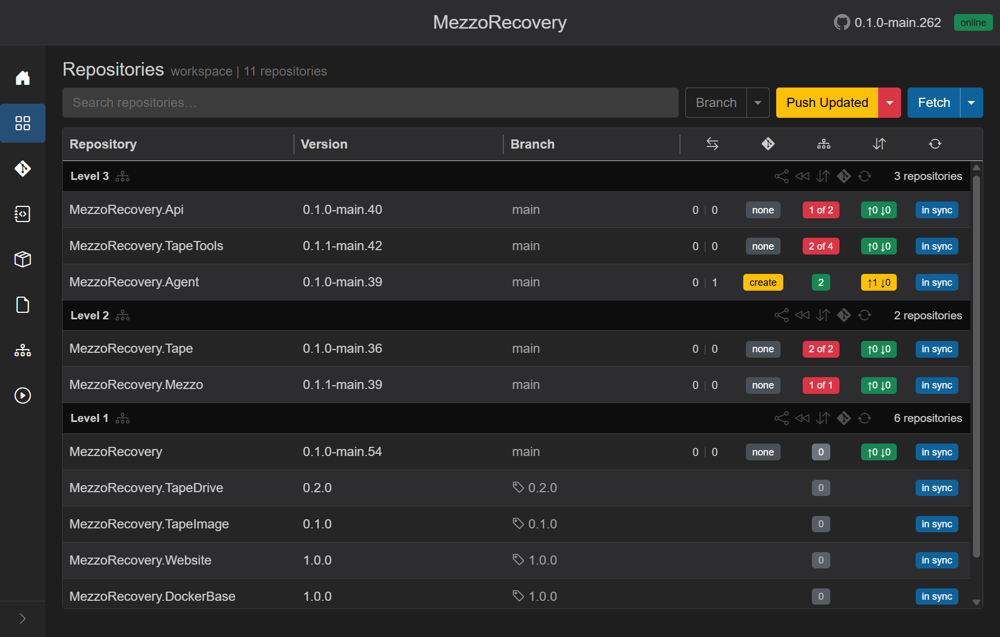
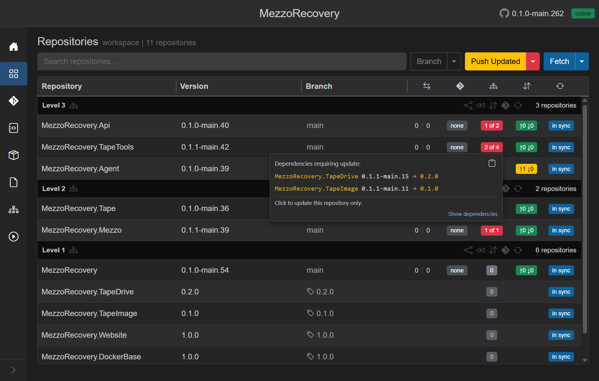
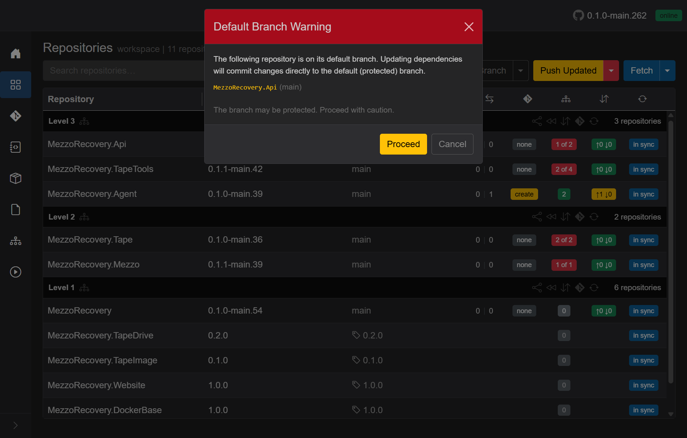

# Tag upgrade detection (Fetch to checkout)

Route: Repositories (`/workspaces/{id}`)

When a repository is **pinned to a tag** (see [Frozen on the Repositories grid](repository-branch-management.md#frozen-on-the-repositories-grid)), GrayMoon keeps watching origin for **newer tags**. After someone publishes a higher release on GitHub, a workspace **Fetch** pulls those tags down and the grid shows a yellow **upgrade** badge in the PR column. Click it to open the branch dialog on **Tags**, pick the newest tag, and **Check out**.

This walkthrough uses **MezzoRecovery.TapeDrive** on MezzoRecovery (`/workspaces/2`): pinned to tag **0.1.0**, then a **0.2.0** release tag is published on GitHub.

## Fetch vs Sync - what you need for tag upgrades

Both workspace actions run `git fetch` with tags on every cloned repo. For tag-upgrade detection, **Fetch is enough**.

| Action | Where | What it does | Tag upgrade? |
| --- | --- | --- | --- |
| **Fetch** | Header **Sync** caret -> **Fetch** | `git fetch --tags`, refresh commit counts (on branches), refresh tag lists for tagged repos, recompute **HasNewerTag** | **Yes** - this is the light daily action |
| **Sync** | Header **Sync** caret -> **Sync** | Everything Fetch does, **plus** GitVersion, hook rewrite, `.csproj` scan, file-version check, branch lists | Yes, but heavier - use when you also need versions/deps refreshed |
| **Fetch** (per repo) | Branch dialog footer on **Tags** tab | `git fetch --tags` for **one** repo only | Yes for that repo only |

**Fetch** skips GitVersion, package scanning, and hook writes. **Sync** includes Fetch and then runs the full refresh pipeline. If you only care about new release tags, use **Fetch**.

After a Fetch completes, the primary **Sync** button label switches to **Fetch** until you run a full Sync again.

## End-to-end flow

```text
Pinned on tag 0.1.0
    -> GitHub: new tag 0.2.0 published
    -> Workspace Fetch (all repos)
    -> Agent: git fetch --tags + tag list for tagged repos
    -> App: persist tags, set HasNewerTag = true (current tag is not newest)
    -> Grid: yellow "upgrade" in PR column
    -> Click upgrade -> Branch dialog, Tags tab (newest tag first)
    -> Check out 0.2.0
    -> Grid: Branch shows tag 0.2.0, upgrade badge gone (on newest tag)
    -> Higher-level repos: red deps badges (PackageReference still on old version)
    -> Hover deps badge: current -> expected (tag version)
    -> Click badge: Default Branch Warning (if on main) -> update single repo
```

### 1. Before Fetch - pinned tag, no upgrade

**MezzoRecovery.TapeDrive** is on tag **0.1.0**. The PR column is blank (frozen row - no PR badge while on a tag and no newer tag known yet).


### 2. Open the Sync menu and choose Fetch

Click the **Sync** split button caret, then **Fetch**. This runs across **all** workspace repositories in parallel (up to 16 at a time).



Overlay while the job runs: spinner, **Fetching commits...**, progress **Fetched N of M**, live git terminal output, **Abort**. Fetch does **not** clone missing repos - use **Sync** for that.

See also [repositories.md - Fetch](repositories.md#fetch) for the full Fetch vs Sync comparison.

### 3. After Fetch - yellow **upgrade** badge

Fetch pulled tag **0.2.0** from origin. GrayMoon compared the tag list to the checked-out tag:

- Tags are stored **newest first** (git `tag --sort=-creatordate` on the Agent).
- **HasNewerTag** is true when the current tag is not at index 0 (a newer tag exists).
- The PR column shows yellow **upgrade** instead of blank. Tooltip: *Newer tag available - click to upgrade*.

Only repos **on a tag** with a newer tag on origin get this badge. **MezzoRecovery.TapeImage** (still on **0.1.0** with no newer tag yet) stays blank.



This is the NuGet-relevant signal: release tags carry the package version consumers pin to. A newer tag means a newer published package version is available on origin.

### 4. Click **upgrade** - Tags tab

Click the yellow **upgrade** badge (not the Branch cell). GrayMoon opens the per-repo branch dialog (**Branch - MezzoRecovery.TapeDrive**) directly on the **Tags** tab.

Tags are listed **newest first**:

| Order | Tag | Meaning |
| --- | --- | --- |
| 1 | **0.2.0** | Newest tag on origin (the upgrade target) |
| 2 | **0.1.0** | **Current** - what the clone is pinned to today |

Use **Fetch** in the dialog footer if the list looks stale for this repo only. Workspace **Fetch** already refreshed tags for this run.



### 5. Check out the newer tag

1. Select **0.2.0**.
2. Click **Check out**. The dialog closes; the Agent checks out the tag (detached HEAD).
3. GitVersion runs at the new commit; the grid row updates.



- **Branch**: tag icon + **0.2.0**
- **Version**: **0.2.0** (GitVersion at that commit)
- **PR column**: blank again (on the newest tag - nothing to upgrade to)
- Divergence, PR (except upgrade), and commits badges stay blank while frozen on a tag

To move to another tag later, repeat **Fetch** after new releases, or open **Branch** -> **Tags** manually.

## Why higher levels suddenly show out-of-date dependencies

Checking out a newer tag on a Level 1 library changes the **expected package version** for every workspace repo that references it in a `<PackageReference>`. Those consumers are usually on **branches** (Level 2 packages, Level 3 services) - their `.csproj` files still pin the old version until you run **Update**.

After **MezzoRecovery.TapeDrive** moved from tag **0.1.0** to **0.2.0**:

| What changed | Level 1 (TapeDrive) | Level 2 / 3 (consumers on `main`) |
| --- | --- | --- |
| Checked-out ref | Tag **0.2.0** (frozen) | Branch **main** (normal row) |
| GitVersion / expected NuGet version | **0.2.0** | Still references **0.1.1-main.15** (or similar) in `.csproj` |
| Deps badge | Gray **0** (frozen - read-only on tags) | Red **N of M** (unmatched package refs) |

Nothing is wrong with the workspace topology - GrayMoon is correctly reporting that downstream `.csproj` files no longer match the version the upstream repo is publishing at its current tag.



Typical badges in this run:

| Repository | Level | Badge | Meaning |
| --- | --- | --- | --- |
| **MezzoRecovery.Tape** | 2 | **2 of 2** | Both workspace deps need a version bump |
| **MezzoRecovery.Mezzo** | 2 | **1 of 1** | Its one dep is behind |
| **MezzoRecovery.TapeTools** | 3 | **2 of 4** | Two of four deps mismatched |
| **MezzoRecovery.Api** | 3 | **1 of 2** | One of two deps mismatched |

Level 1 tagged repos stay frozen and do not participate in workspace **Update** - only branch-checked-out consumers show the red badges.

### Hover the deps badge - required versions at the tag

Hover the red **N of M** badge on a consumer row. A single tooltip lists each mismatched package as **current -> expected**, where **expected** is the GitVersion GrayMoon reads from the upstream repo at its current ref (tag or branch):



Tooltip contents for **MezzoRecovery.TapeTools**:

- Header: *Dependencies requiring update:*
- Lines: `MezzoRecovery.TapeDrive 0.1.1-main.15 -> 0.2.0` and `MezzoRecovery.TapeImage 0.1.1-main.11 -> 0.1.0`
- Footer: *Click to update this repository only.* and **Show dependencies** link

The arrow points at the **tag semver** (or branch GitVersion) GrayMoon expects after the upstream checkout - not at a branch name. Only **one** tooltip opens at a time (hover one badge at a time).

### Click the badge - update a single repository

Click the red deps badge (not just hover) to start an **update for that repo only** - same dependency rewrite as header **Update**, scoped to one row. GrayMoon loads an update plan, then shows the confirm modal for that repository.

Repos on tags cannot be updated from the badge (toast: *checkout a branch first*).

### Default Branch Warning

If the consumer is on its **default branch** (`main`), GrayMoon stops before writing anything and shows **Default Branch Warning**. The assumption is that `main` is **protected** on GitHub - dependency rewrites commit directly to that branch.



Modal text:

- *The following repository is on its default branch. Updating dependencies will commit changes directly to the default (protected) branch.*
- Lists the repo: `MezzoRecovery.Api (main)`
- *The branch may be protected. Proceed with caution.*
- **Proceed** continues to the single-repo update confirm modal; **Cancel** aborts.

The same warning appears for header **Update** / **Push Updated** when any repo in the update set is on its default branch, and on **Changes** before **Commit All** / **Commit Staged** targets a default branch ([changes.md - Commit across repositories](changes.md#commit-across-repositories)).

Best practice: create or switch to a feature branch before clicking **Proceed**, unless you intentionally commit dependency alignment straight to `main`.

## Quick reference

| Question | Answer |
| --- | --- |
| How do I pick up new tags? | Workspace **Sync** caret -> **Fetch** (all repos), or per-repo **Fetch** on the **Tags** tab |
| Is full Sync required? | No - Fetch is enough for tags and the upgrade badge |
| Where is the upgrade shown? | Yellow **upgrade** in the **PR** column (only when on a tag and a newer tag exists) |
| What opens when I click it? | Branch dialog on **Tags**, newest tag at the top |
| How are tags sorted? | Newest first (creator date descending). For normal semver release tags, the top row is the highest version |
| When does upgrade disappear? | After you check out the newest tag, or when no newer tag exists on origin |
| Why do Level 2/3 turn red after a tag checkout? | Upstream GitVersion changed; consumer `.csproj` still pins the old package version |
| How do I see what to bump? | Hover the red **N of M** deps badge - `current -> expected` per package |
| How do I fix one consumer? | Click the red deps badge -> confirm update (after Default Branch Warning if on `main`) |

## Related docs

| Topic | Document |
| --- | --- |
| Tag checkout, frozen rows, per-repo Fetch | [repository-branch-management.md](repository-branch-management.md) |
| Workspace Fetch / Sync / Restore buttons | [repositories.md](repositories.md) |
| PR column badges (including **upgrade**) | [repositories.md - Pull request badge](repositories.md#pull-request-badge) |
| Dependencies badge column | [repositories.md - Dependencies badge](repositories.md#dependencies-badge) |
| Commit default-branch warning | [changes.md - Commit across repositories](changes.md#commit-across-repositories) |
| Undo accidental commits on main before push | [undo-push-commits.md](undo-push-commits.md) |
