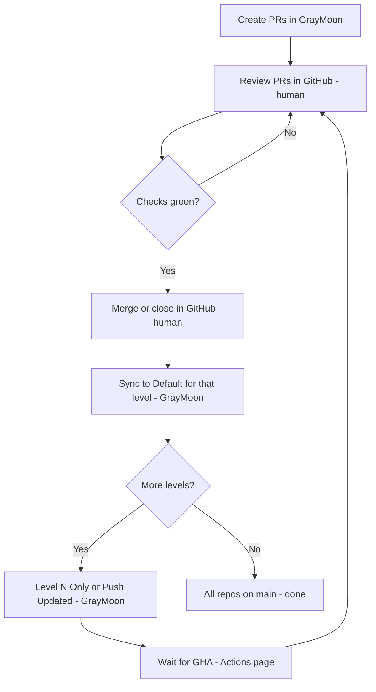

# Feature walkthrough: `tape-density` (multi-repo development)

This walkthrough demonstrates the full lifecycle of a cross-repo feature in GrayMoon, using the **MezzoRecovery** workspace (11 repositories, 3 dependency levels).

## What this walkthrough shows

GrayMoon coordinates multi-repository development from branch creation through PR merge and cleanup:

1. **Create** a feature branch across every impacted repo in one job.
2. **Implement** the feature locally (you write the code; GrayMoon tracks changes).
3. **Commit and push** with dependency-aware ordering and NuGet wait.
4. **Create coordinated PRs** with shared title and body, batched by dependency level.
5. **Merge level by level** - you review and merge in GitHub; GrayMoon aligns deps, tracks status, and rewinds each level back to `main`.

Case scenario: **Tape density LTO generation tracking** (plan file: `tape_density_lto_generation_tracking_cbf37004.plan.md`).

## Workspace

| Field | Value |
| --- | --- |
| Workspace | **MezzoRecovery** |
| Id | **2** |
| Route | `/workspaces/2` |
| URL | `http://localhost:8384/workspaces/2` |

## Privacy / redaction

- No deep code snippets from private repos.
- Repository names, packages, dependency relationships, and GrayMoon UI behavior are documented freely.
- Code detail is summarized at user-relevant outcome level only.

## Walkthrough phases (all complete)

| Phase | Doc | What happened |
| --- | --- | --- |
| 1 - Preparation | [phase-1-preparation.md](phase-1-preparation.md) | Workspace setup, connectors, clone/sync |
| 2 - New Feature | [phase-2-new-feature.md](phase-2-new-feature.md) | **New Feature** -> `tape-density` branch, deps update, synchronized push |
| 2 - Baseline coding | [phase-2-baseline-implementation.md](phase-2-baseline-implementation.md) | Multi-repo AI workspace; Changes page; 5 repos edited |
| 3 - Commit + push + GHA | [phase-3-commit-push-gha.md](phase-3-commit-push-gha.md) | Commit All, **Push Updated**, Actions live feed |
| 4 - Create PRs | [phase-4-create-prs.md](phase-4-create-prs.md) | Coordinated PRs by dependency level |
| 4 - Merge + sync | [phase-4-merging-prs.md](phase-4-merging-prs.md) | Level-by-level merge in GitHub, scoped updates, per-level **Sync to Default** |

Final screenshot: all 11 repos on `main`, green deps, PR **none** - [all repos on main after Level 3 rewind](../screenshots/workspace2-tape-density-all-repos-on-main-after.png).

## Step plan (summary)

### Step 1 - Create feature branch `tape-density`

GrayMoon created the branch, updated dependencies per level, and pushed with NuGet wait. See [Phase 2 - New Feature](phase-2-new-feature.md).

### Step 2 - Baseline implementation (you)

You implemented the plan locally. GrayMoon **Changes** tracked edits across repos. See [Phase 2 - Baseline implementation](phase-2-baseline-implementation.md).

### Step 3 - Commit, push, GitHub Actions

**Commit All**, **Push Updated**, synchronized push overlay, Actions before/after. See [Phase 3](phase-3-commit-push-gha.md).

### Step 4 - Create coordinated PRs

Bulk PR creation by dependency level plus per-repo `create` badges for stragglers. See [Phase 4 - Create PRs](phase-4-create-prs.md).

### Step 5 - Merge PRs and Sync to Default

Level-by-level merge rhythm documented in [Phase 4 - Merge PRs](phase-4-merging-prs.md):

| Level | Your action (GitHub) | GrayMoon action |
| --- | --- | --- |
| **1** | Merge Level 1 PRs | Level 1 rewind -> all Level 1 on `main` |
| **2** | **Level 2 Only** update, merge Tape `#39`, close Mezzo `#52` | Level 2 rewind |
| **3** | **Push Updated** (same as Level 3 Only), merge `#42` / `#66` / `#37` | Level 3 rewind -> **all 11 on `main`** |

## The PR merge rhythm (simple)

**You** review code and click Merge in GitHub. **GrayMoon** never merges for you.

**GrayMoon** creates branches, tracks PR/check status on one grid, rewrites package pins in dependency order, pushes with NuGet wait, and rewinds each level back to `main` with one header click.

## Benefits vs traditional multi-repo workflow

| Pain (traditional) | GrayMoon answer (this walkthrough) |
| --- | --- |
| Same branch name in 11 repos by hand | **New Feature** - one job, one branch name everywhere |
| `.csproj` package versions drift after upstream merges | **Level N Only** / **Push Updated** - rewrite + commit + push in order |
| Push repo 3 before repo 2's package hits NuGet | Synchronized push with NuGet wait between levels |
| Miss a repo when opening PRs | Coordinated PR creation; grid shows `create` where still needed |
| 11 tabs to check PR merge state | Purple **merged**, red **closed**, green open badges on one page |
| Manual `git checkout main && git pull && branch -d` per repo | Per-level **Sync to default branch** - fetch, confirm, proceed |
| Stale `tape-density` branch left on origin | Delete remote branch checkbox in rewind dialog |
| CI status scattered across GitHub | **Actions** page with live step feed; check badges on Repositories |
| Multi-repo diff review | **Changes** page - combined tree + Monaco diff viewer |

## Who does what

| Task | Owner |
| --- | --- |
| Write feature code | **You** (local IDE / AI assistant) |
| Code review, approve, merge PRs | **You** (GitHub) |
| Branch creation across repos | **GrayMoon** |
| Dependency version rewrites | **GrayMoon** |
| Ordered push + NuGet wait | **GrayMoon** |
| PR creation with shared title/body | **GrayMoon** |
| PR/check/branch status on grid | **GrayMoon** |
| Per-level checkout `main` + branch cleanup | **GrayMoon** |
| Git hook sync when you edit outside GM | **GrayMoon Agent** |

Human judgment stays in GitHub. GrayMoon removes the repetitive coordination tax across repositories.

## Related reference docs

- [Sync To Default](../../sync-to-default.md) - workspace-wide vs per-level rewind
- [Switch Branch](../../switch-branch.md) - checkout without deleting branches
