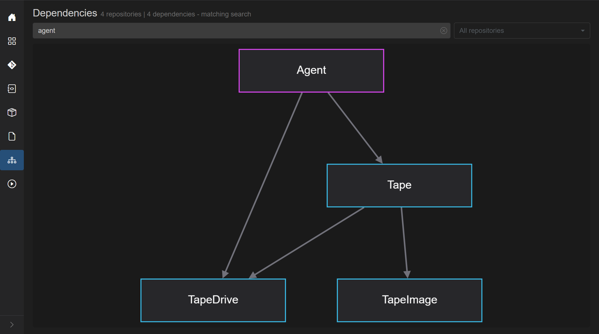
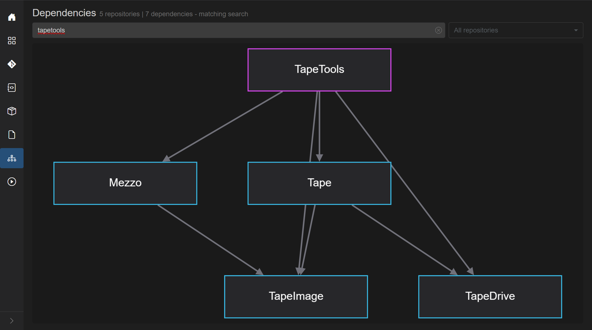

# Feature walkthrough: Phase 1 preparation

This is Phase 1 of the `tape-density` multi-repo walkthrough.

In this phase we prepare the “demo baseline context” only:

- where the demo workspace lives (`MezzoRecovery`, workspace id `2`)
- what GrayMoon shows for repositories (branch/status grid + dependency-level grouping)
- what GrayMoon shows for dependencies (graph + dependency-aware filtering)
- the exact dependency subgraphs you want to reference later in the demo: `agent`, `api`, `tapetools`

No feature creation, no commits, and no PR work happens in Phase 1.

## Demo workspace: `MezzoRecovery` (workspace 2)

- Workspace name: **MezzoRecovery**
- Workspace id: **2**
- Route: `/workspaces/2`
- URL: `http://localhost:8384/workspaces/2`

GrayMoon models a workspace as a set of repositories plus a dependency graph between them.

## What we mean by “dependencies” in GrayMoon

On the **Dependencies** page, the graph is built from multiple sources (merged into one model before layout):

- `.csproj` `PackageReference` relationships (project consumes package/library)
- workspace file configuration tokens (token names referencing other repos)
- user-declared custom dependency edges

In the MezzoRecovery workspace, the result is a multi-level graph:

- **Level 1**: “root” packages (consumed by multiple higher-level repos, but that have no workspace package dependencies)
- higher levels: consumers that depend on lower-level workspace packages/tools/services

GrayMoon later uses these levels to keep coordinated actions consistent (for example dependency update ordering, and synchronized push ordering).

## Repository and dependency overview screenshots

### Workspace repositories grid (context)

This is the main workspace grid you will refer to when we create the `tape-density` feature branch:

### Full dependency graph (context)

This is the full dependency graph for the workspace:

## Dependency filtering: `agent`, `api`, `tapetools`

The Dependencies page includes a shared filter search bar:

- plain terms match repository names
- a match keeps the node and its dependency tree (so you see what it consumes, and what depends on it)
- you can use one term at a time for single-consumer trees (`api` vs `tools` vs `agent`)

In Phase 1 we capture the dependency subgraphs you requested.

### Filter: `agent`

What this subgraph is meant to communicate in the walkthrough:

- `Agent` is a consumer of lower-level tape components (so future “coordinated change” actions need to respect this direction)

### Filter: `api`

What this subgraph is meant to communicate in the walkthrough:

- `Api` is a higher-level service that depends on shared libraries and components (so dependency-level ordering matters)

### Filter: `tapetools`

What this subgraph is meant to communicate in the walkthrough:

- `TapeTools` is a standalone tool that consumes the same shared libraries, which makes it a good multi-repo demo candidate

## Phase 1 pause point

Phase 1 context is complete. Continue with [Phase 2 - New Feature](phase-2-new-feature.md) to create the `tape-density` branch in GrayMoon.

