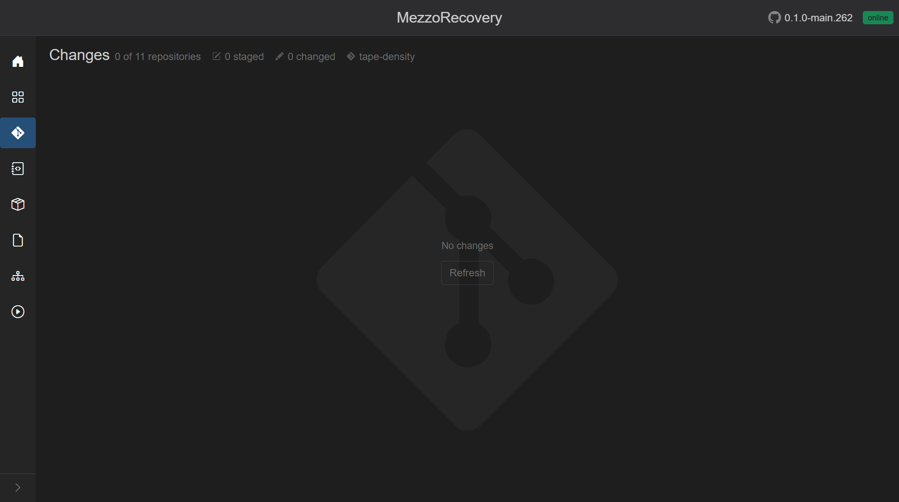
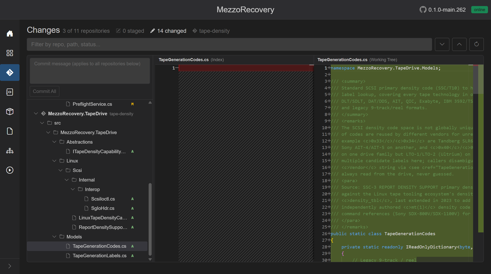
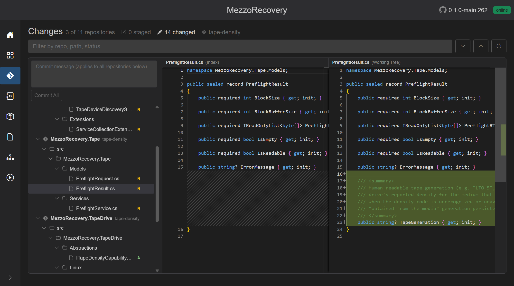
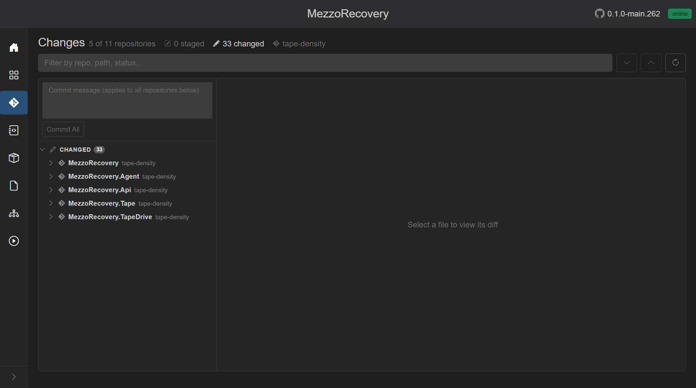
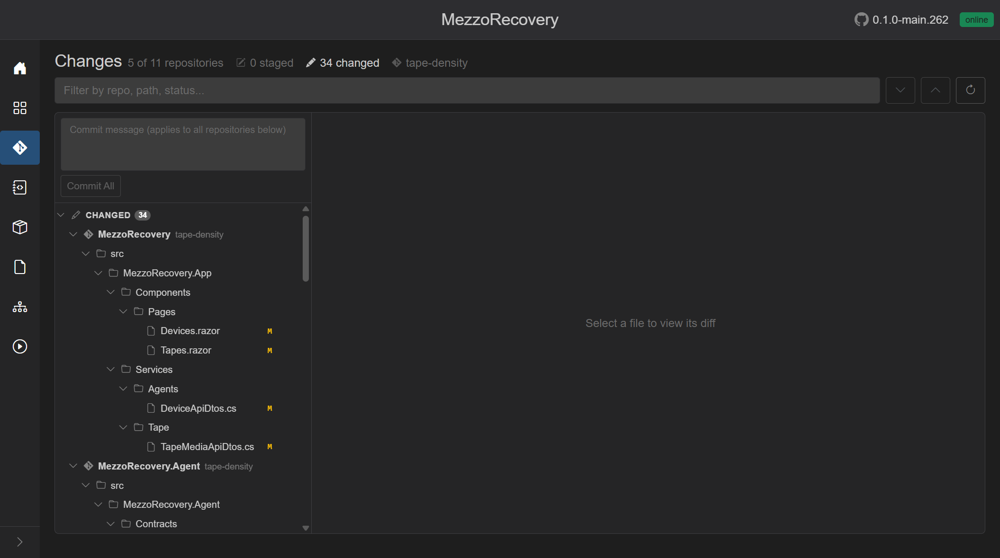
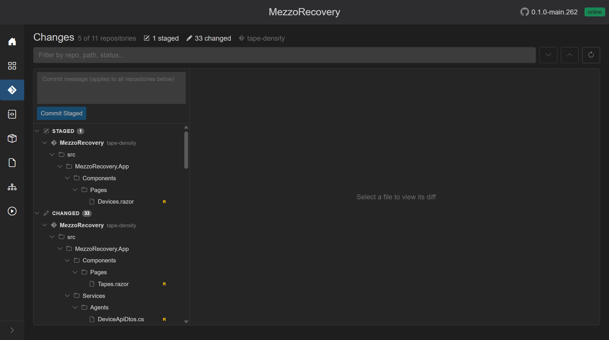
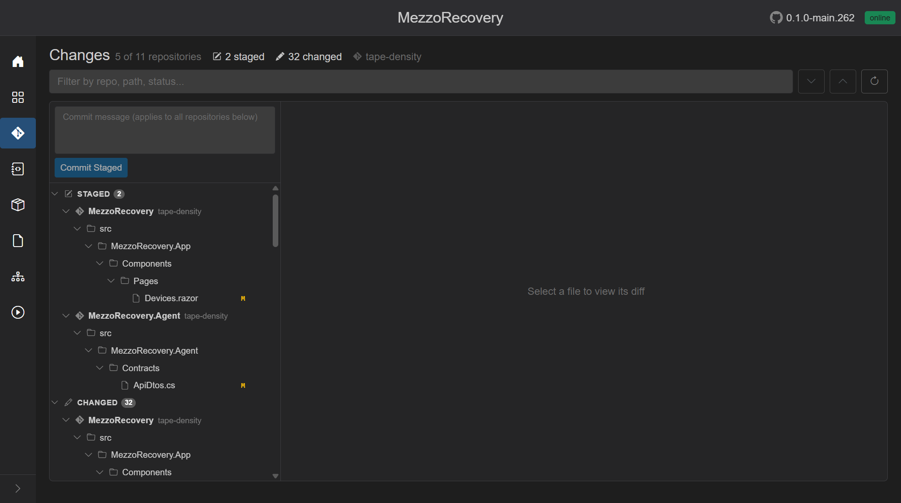
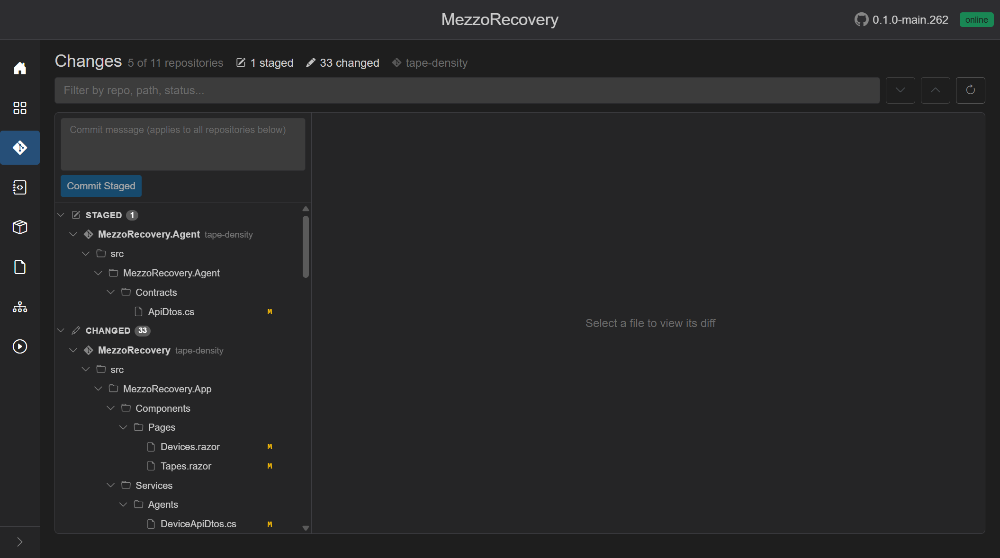
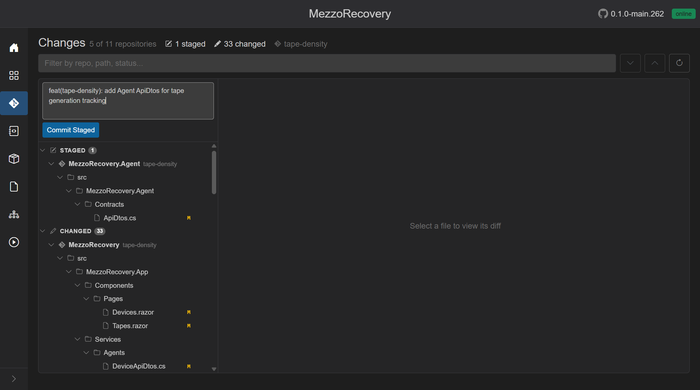

# Feature walkthrough: Phase 2 - Baseline implementation (AI coding)

This is the bridge between [Phase 2 - New Feature](phase-2-new-feature.md) (GrayMoon prepared the branch) and Phase 3 (demo changes and PRs).

GrayMoon work for branch setup is **done**. You implement the tape-density feature next, using your AI IDE against the full multi-repo workspace. How each class or API is written is **not** part of this walkthrough - only the GrayMoon context and why the layout helps AI-assisted development.

## What GrayMoon has already done

After **New Feature** completed in Phase 2, MezzoRecovery looks like this on **Repositories** (`/workspaces/2`):

- All **11 repositories** are on branch **`tape-density`** (same name everywhere).
- Dependency versions were updated and committed per level, then **synchronized push** ran so NuGet consumers can resolve branch packages.
- Working trees are clean relative to the last dependency commit - ready for feature edits.

You are not starting from "11 repos still on `main` with mismatched package refs." GrayMoon already aligned the cross-repo baseline.

## Why multi-repo feature branches matter for AI work

A feature like tape-density touches several packages and services (`TapeDrive`, `Tape`, Agent, Api, App UI, tools, and others). In a traditional setup you would:

- remember which repos need the same branch name
- open each repo in a separate window or hope one solution covers everything
- manually track which repos you already edited

GrayMoon **New Feature** gave you one coordinated **`tape-density`** branch and dependency baseline across the whole workspace. Your AI agent can now assume:

- the branch name is consistent everywhere it needs to commit
- downstream `.csproj` references already point at branch package versions where New Feature updated them
- the Repositories grid and Git hooks will reflect progress as you edit on disk

## Your local code workspace (sibling repositories)

GrayMoon clones workspace repositories as **sibling folders** under the workspace root (Settings **Root Path** + workspace name). For MezzoRecovery that is typically:

`C:\Workspace\MezzoRecovery\`

Each catalog repo is its own folder next to the others, for example:

- `MezzoRecovery.TapeDrive`
- `MezzoRecovery.Tape`
- `MezzoRecovery.Agent`
- `MezzoRecovery.Api`
- `MezzoRecovery.TapeTools`
- ... and the rest of the 11 repos

That layout is deliberate: one directory on disk holds the **entire dependency graph** the feature spans, not a single monorepo and not eleven unrelated paths scattered across the machine.

### Opening the codebase in an AI IDE (Cursor, VS Code, Visual Studio)

**Cursor / VS Code multi-root workspace**

Add the workspace root folder (or selected repo folders) to one editor window:

- **File -> Add Folder to Workspace...** and pick `C:\Workspace\MezzoRecovery`, or add individual repo folders.
- Save as a `.code-workspace` file if you want a reusable layout (for example `MezzoRecovery.code-workspace` listing each repo path).

The AI then indexes every folder in that workspace. Questions like "where is tape preflight handled?" or "which Api DTO maps Agent tape generation?" can span repositories without you pasting paths by hand.

**Visual Studio**

Open the solution that matches your workflow (`MezzoRecovery.Solution` lives in its own repo in this workspace). For cross-repo edits, many teams use multi-root in VS Code/Cursor for AI sessions and Visual Studio for focused debugging - GrayMoon does not care which editor writes the files; git hooks and watchers keep the App in sync.

### What the AI can see vs what this walkthrough covers

| AI IDE has | This walkthrough documents |
| --- | --- |
| Full source across sibling repos | GrayMoon UI and workflow only |
| Your plan file and prompts | Not private implementation details |
| Ability to edit, build, test locally | Not step-by-step code for tape-density |

Implementation choices stay in your plan and AI session. GrayMoon shows **whether** repos changed and **whether** the workspace is ready to commit or push - not **how** you wrote the code.

## Git Changes before you write code

Open **Changes** (`/workspaces/2/changes`). With clean working trees you should see:

- Header: **`0 of 11 repositories`**, **`0 staged`**, **`0 changed`**
- Branch context: **`tape-density`**
- Center: **No changes** (Refresh is available but watcher-driven updates usually appear automatically once you save files on disk)

This is the "before" snapshot. After you implement, we will capture Changes again (on your signal) to show GrayMoon tracking edits across multiple repositories in one tree - see [Workspace Changes](../changes.md) for how staging, diff, and commit work.

GrayMoon does **not** poll from the browser. The Agent watches working trees; edits in Cursor/VS Code/`git` on the CLI show up here without keeping the Changes tab focused.

## First Changes detected (AI implementation in progress)

As soon as your AI-assisted edits start landing on disk, GrayMoon’s watcher-based sync updates this page.

In this snapshot you can see:

- Header: **`3 of 11 repositories`**
- **`0 staged`**
- **`14 changed`**
- Branch context: **`tape-density`**
- Multiple repos in the tree (`MezzoRecovery.TapeDrive`, `MezzoRecovery.Tape`, and others)

This is the key "GM value" moment for Phase 2: the app is already tracking your edits across repos, so when you ask for a demo later, GrayMoon can show diffs/staging/commit readiness without you opening and comparing separate git status windows manually.

## Diff view for added files (status `A`)

Click a file whose status letter is **`A`** (added). The right pane shows an empty **Index** side and the full new file on the **Working Tree** side.

GrayMoon uses Monaco for side-by-side review. New files appear as all-green additions without opening each repository separately.

## Diff view for modified files (status `M`)

Click a file whose status letter is **`M`** (modified). The right pane shows **Index** vs **Working Tree** with inline additions highlighted.

This is the second "GM value" signal for Phase 2: GrayMoon detects changes across repositories and renders the correct diff for whichever file you select, while your AI coding session continues to update the tree in the background.

## Changes summary as implementation grows

As your AI session continues, the header counts climb without you opening separate git windows. A later snapshot on the same **`tape-density`** branch shows the feature spanning more of the workspace:

In this snapshot:

- Header: **`5 of 11 repositories`**
- **`0 staged`**
- **`34 changed`** (counts grow while coding continues)
- Branch context: **`tape-density`**
- Repositories with edits: **`MezzoRecovery`**, **`MezzoRecovery.Agent`**, **`MezzoRecovery.Api`**, **`MezzoRecovery.Tape`**, **`MezzoRecovery.TapeDrive`**

Collapse each repository row (chevron on the left) to see **which repos** are dirty at a glance. Expand when you need folder paths and individual files:

### Why one Changes view beats N separate git status windows

| What you need during a cross-repo feature | What GrayMoon Changes gives you |
| --- | --- |
| Know how many repos are touched | Header: **`N of 11 repositories`** |
| See scope without scrolling every folder | Collapse repos to a short list (five rows above) |
| Review a specific file | Click the file - Monaco diff on the right (see earlier screenshots) |
| Stage only what you are ready to commit | Per-file, per-folder, per-repo, or whole **Changed** section |
| Same branch everywhere | Branch badge on every repo row (`tape-density`) |
| Keep coding - page updates itself | Agent file watchers push new snapshots; no manual Refresh needed |

For tape-density, library (`TapeDrive`, `Tape`), agent contracts, API surface, and App UI can all appear in one tree while your AI IDE keeps editing sibling folders under `C:\Workspace\MezzoRecovery\`.

## Staging and unstaging (review before commit)

GrayMoon splits the tree into **Staged** and **Changed** sections once anything is staged. You can move files one at a time with the **+** / **-** buttons on each row (file, folder, repository, or whole section).

**Stage one file** - `Devices.razor` in `MezzoRecovery`:

- Header flips to **`1 staged`** / **`33 changed`**
- **STAGED (1)** section appears above **CHANGED**
- **Commit All** becomes **Commit Staged** (blue) - only repos with staged files would commit

**Stage a second file in another repo** - `ApiDtos.cs` in `MezzoRecovery.Agent`:

- Header: **`2 staged`** / **`32 changed`**
- Staged files can span multiple repositories in one view

**Unstage one file** - move `Devices.razor` back to **Changed**:

- Header returns to **`1 staged`** / **`33 changed`**
- `Devices.razor` is back under **CHANGED**; `ApiDtos.cs` stays in **STAGED**

You could repeat this pattern to commit in smaller batches (for example, Agent contracts first, then Api, then UI). GrayMoon supports that workflow via **Commit Staged**.

## Commit message demo (no commit yet)

Type a message in the shared box at the top. The same text applies to **every repository** that has staged (or all changed, for **Commit All**) files when you click commit:

Example message shown: `feat(tape-density): add Agent ApiDtos for tape generation tracking`

**Important for this walkthrough:** the screenshots above demonstrate staging and message entry only. **No commit was created** - your working trees still hold all edits unstaged (or as they were before the demo).

### What we will do at commit time (Phase 2 finish / Phase 3)

For the coordinated tape-density feature, the plan is **one shared commit message across all repositories** when implementation is complete:

1. **Stage all** (or use **Commit All**, which stages everything then commits per repo with the same message)
2. Enter a single message such as `feat(tape-density): track LTO generation density across tape stack`
3. **Commit All** or **Commit Staged** - GrayMoon creates **one commit per affected repository** with that same message
4. Continue to Phase 3 (grid signals, push, coordinated PRs)

You *could* commit multiple times with different messages (Agent first, Api second, and so on). GrayMoon allows it. This walkthrough deliberately saved **one** message for the full feature so every repo stays aligned for the demo push.

**Completed in Phase 3:** [Commit, push, and GitHub Actions](phase-3-commit-push-gha.md) - Commit All, Push Updated, synchronized push, Actions before/after.

See [Workspace Changes - Commit across repositories](../changes.md#commit-across-repositories) for button tooltips and default-branch warnings.

## Benefits of this setup for AI-assisted multi-repo development

| Without coordinated workspace + GM | With MezzoRecovery + GrayMoon baseline |
| --- | --- |
| AI sees one repo; you paste context from others | AI workspace spans all sibling repos |
| Branch drift (`tape-density` in Api but `main` in Tape) | Same branch name on every repo after New Feature |
| Consumers still pin old package versions | Dependency update + synchronized push already ran |
| Review means N separate git status windows | One **Changes** tree for all repos (no 25-repo cap like VS Git Changes) |
| Unclear which repos are dirty before PRs | Grid badges + Changes header (`N of 11 repositories`) |
| Push order surprises downstream CI | Level-ordered push already established branch packages on NuGet |

For tape-density specifically, the plan crosses library, agent, API, and UI boundaries. A single AI session rooted at the workspace folder matches that scope better than editing one repository in isolation.

## What you do next (implementation - your control)

1. Open your AI IDE against `C:\Workspace\MezzoRecovery` (multi-root or whole folder).
2. Use your existing plan (**Tape density LTO generation tracking**) with your AI agent.
3. Implement across the repos the plan touches (`TapeDrive`, `Tape`, Agent, Api, App, and related packages).
4. Build and test locally as you normally would.

**GrayMoon does not need to stay open** while you code. Keep the Agent service and Docker App running so hooks and watchers can update state when you commit or push.

Do **not** expect this walkthrough to describe code changes. Staging and commit-message demos are in the sections above. **Commit, push, and Actions** are documented in [Phase 3](phase-3-commit-push-gha.md). Next: coordinated PRs on your signal.

## Start coding - you are clear to begin

If Phase 2 **New Feature** finished successfully on your machine (all repos on **`tape-density`**, synchronized push complete) and **Changes** matches the empty screenshot above, **you can start implementing now**.

When you have a meaningful set of edits to show, tell me and we will:

- screenshot **Changes** with files across multiple repos
- continue toward Phase 3 (demo grid signals and coordinated PRs)

Until then, GrayMoon's role is passive tracking: watch **Changes** climb from **`0 of 11 repositories`** to **`5 of 11`** (and higher) as your AI-assisted edits land on disk.
