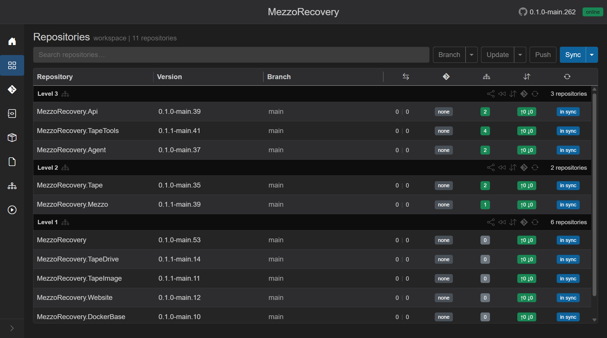
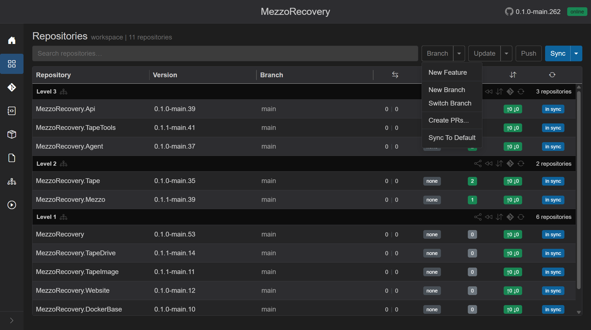
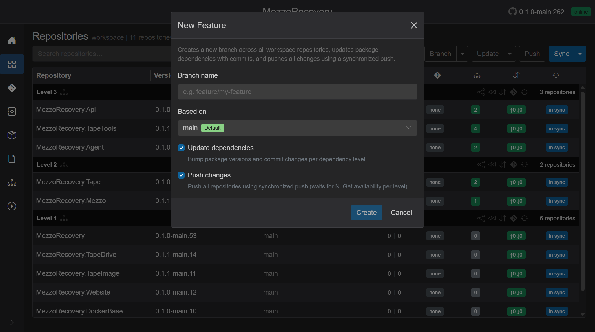
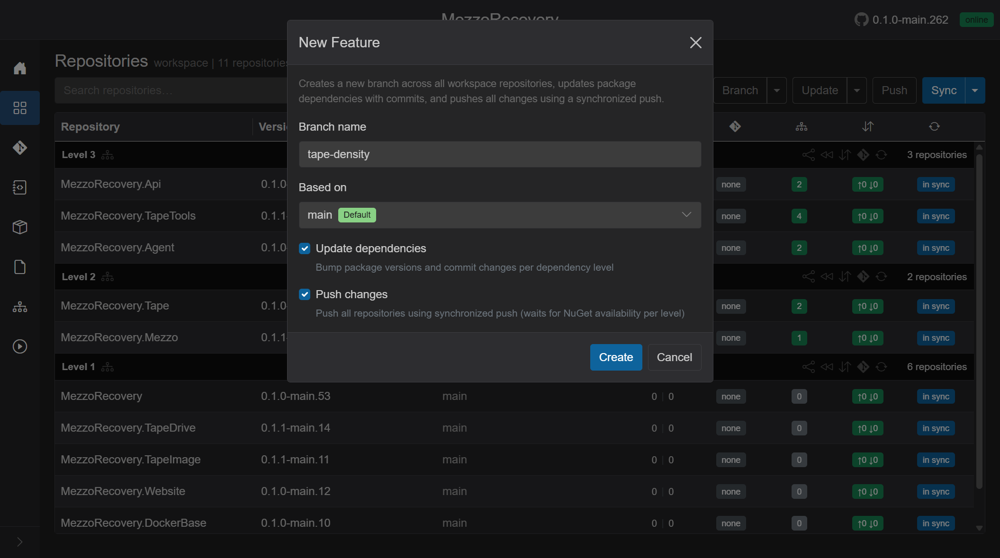
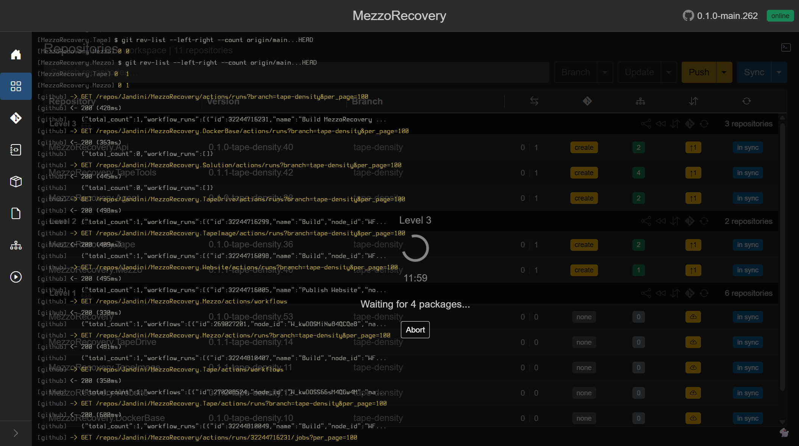
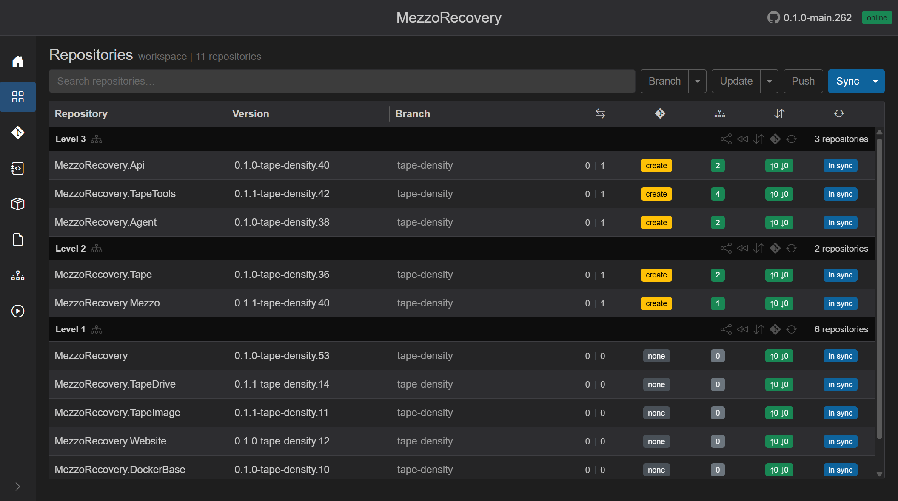

# Feature walkthrough: Phase 2 - New Feature (`tape-density`)

This is Phase 2 of the `tape-density` multi-repo walkthrough.

Phase 2 uses GrayMoon **New Feature** to create the coordinated feature branch across the MezzoRecovery workspace, roll dependency versions forward, and synchronized-push every repository so downstream consumers can build against the new branch packages.

No feature code is written in this phase. After GrayMoon finishes, you implement the baseline plan locally (your separate AI agent / IDE work).

## Prerequisites

Before starting Phase 2:

- Phase 1 context is understood ([phase-1-preparation.md](phase-1-preparation.md)).
- The [Agent](../../../getting-started/00-agent.md) badge is green **online**.
- [Connectors](../../../04-connectors.md) are **Active** with **OK** status (GitHub + NuGet).
- Workspace **MezzoRecovery** (`/workspaces/2`) is on the default branch (`main`) with a clean grid (no leftover `tape-density` branch from a prior run).

If you need to reset, use **Switch Branch** back to `main` on every repo, or run **Sync To Default** from the Branch menu.

## What we are creating

| Field | Value |
| --- | --- |
| Branch name | `tape-density` |
| Based on | `main` (default branch) |
| Update dependencies | on (default) |
| Push changes | on (default) |

GrayMoon applies this to **all 11 workspace repositories** in one job. For the tape-density plan, the impacted repos span every dependency level (libraries such as `MezzoRecovery.TapeDrive`, services such as `MezzoRecovery.Api` and `MezzoRecovery.Agent`, and tools such as `MezzoRecovery.TapeTools`). New Feature does not pick a subset - it keeps the whole workspace on the same branch name.

Reference: [New Feature](../new-feature.md) (full UI and phase details).

## Step 1 - Confirm the starting grid

Open `/workspaces/2`. Every repository should show branch **main**, divergence `0 | 0`, and blue **in sync**.

This is the baseline the walkthrough assumes: one coordinated default branch, no open feature work.

## Step 2 - Open New Feature

On **Repositories**, open the **Branch** caret and choose **New Feature**.

Other Branch menu items (New Branch, Switch Branch, Create PRs, Sync To Default) are separate flows. New Feature is the all-in-one path for branch + dependency update + synchronized push.

## Step 3 - Fill the New Feature dialog

The dialog explains the default path: create a branch everywhere, commit dependency updates per level, then synchronized push.

Fill in:

- **Branch name:** `tape-density`
- **Based on:** `main` with the green **Default** badge (each repo starts from its default branch tip)
- **Update dependencies:** checked - bumps `PackageReference` versions (and configured version-file tokens) to the new branch semver and commits per dependency level
- **Push changes:** checked - pushes level-by-level and waits for NuGet packages on the connector feed before pushing the next level

Click **Create**. The dialog closes and one background job starts (Abort is available on the loading overlay for the whole run).

## Step 4 - What GrayMoon runs (one job, three phases)

**Create** runs a single workspace job. You stay on Repositories; the [loading overlay](../../../shared.md#loading-overlay) covers the page until the job finishes or faults.

### Phase A - Creating branches

GrayMoon runs `git checkout -b tape-density` (from `main`) on every workspace repository. Progress shows **Creating branches...** then **Created N of M**. The terminal streams per-repo git output.

### Phase B - Updating dependencies

When **Update dependencies** is on, GrayMoon rewrites `.csproj` package versions (and file-config tokens) to match the new branch semver, then commits per dependency level (**Updating dependencies...**, **Committed N of M**). Level 1 packages commit first; Level 2 and 3 consumers pick up the new versions in order.

During this phase the overlay terminal shows git and dotnet activity across repos (GitVersion output, commits, restores).

### Phase C - Synchronized push

When **Push changes** is on, GrayMoon pushes level-by-level. After each level it polls the NuGet connector until required packages appear on the feed (timeout **3 minutes per package** at that level). While waiting, the overlay shows **Waiting for N packages...** with a countdown.

GitHub Actions lines in the terminal are status only. The gate is NuGet feed availability, not a green workflow badge.

If packages never appear within the timeout, GrayMoon **stops** the job. Fix CI/publish, then re-run push or New Feature as needed.

## Step 5 - Finished grid (ready for your implementation)

When the job completes successfully, every repository row shows:

- Branch **tape-density**
- GitVersion strings containing `tape-density` (for example `0.1.0-tape-density.40`)
- Green dependency badges where packages already match the branch versions
- Divergence `0 | 1` on updated repos (the dependency commit is ahead of `main`)
- Yellow **create** on repos that are ahead of default with no open PR (PR work is Phase 3)
- Blue **in sync** (synchronized push already ran)

Header **Push** is outline (nothing left to push from the New Feature run). You are now on a consistent feature branch across the workspace with dependency versions aligned for cross-repo builds.

## Why New Feature instead of doing it by hand

Compared to a traditional multi-repo workflow:

| Traditional | With GrayMoon New Feature |
| --- | --- |
| Create/checkout the same branch name in 11 repos manually | One dialog, one job |
| Edit `.csproj` versions repo-by-repo, easy to miss a consumer | Level-ordered dependency update with commits |
| Push Level 1 packages, wait for CI/NuGet, then push Level 2, repeat | Synchronized push with feed polling built in |
| Hard to see which repos still pin `main` versions | Grid shows branch, semver, and dependency badges together |

## Phase 2 pause point (your baseline implementation)

GrayMoon has prepared the branch and dependency baseline. Continue with [Phase 2 - Baseline implementation (AI coding)](phase-2-baseline-implementation.md) - **you can start coding there**.

When your baseline changes are ready, ask for **Changes** screenshots and Phase 3 (demo + PRs).
