# Feature walkthrough: Phase 3 - Commit, push, and GitHub Actions

This phase follows [Phase 2 - Baseline implementation](phase-2-baseline-implementation.md). Implementation is on disk; GrayMoon now shows the full **commit -> push -> CI** loop across the workspace.

## One commit message, five repositories

GrayMoon's **Commit All** on **Changes** stages every unstaged file, then creates **one git commit per affected repository** using the **same message**. You do not open five terminals or repeat the message by hand.

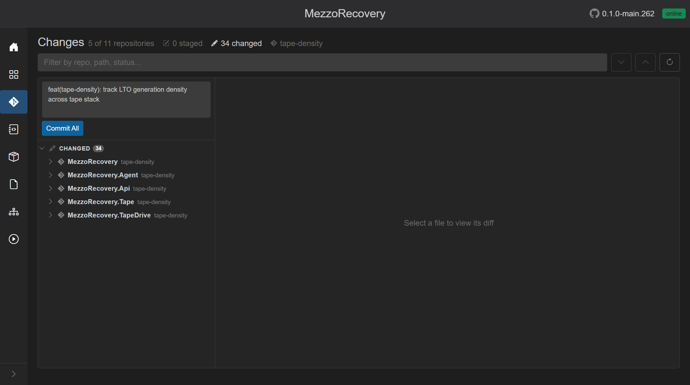

Message used for this walkthrough:

`feat(tape-density): track LTO generation density across tape stack`

**Commit All** ran against all five dirty repos:

- `MezzoRecovery`
- `MezzoRecovery.Agent`
- `MezzoRecovery.Api`
- `MezzoRecovery.Tape`
- `MezzoRecovery.TapeDrive`

### Why one message matters for a cross-repo feature

| Traditional multi-repo | GrayMoon Commit All |
| --- | --- |
| Copy/paste message into each repo | One textarea, one click |
| Easy to typo or diverge messages | Identical commit text everywhere |
| Hard to know which repos still need a commit | Header shows **`N of 11 repositories`** until clean |
| Working tree vs unpushed commits mixed up | **Changes** clears; outgoing commits move to the notification card |

After commit, **Changes** is empty - working trees are clean:

- **`0 of 11 repositories`**, **`0 staged`**, **`0 changed`**
- Unpushed commits do **not** stay in the Changes tree; they appear on the [notification card](../../shared.md#workspace-action-notification-cards) and Repositories grid badges instead.

## Notification card - push from any page

The floating card lists every repo in the workspace that still needs action. From **Changes** (or Agent, Actions, and other non-Repositories pages) you can push without opening the grid:

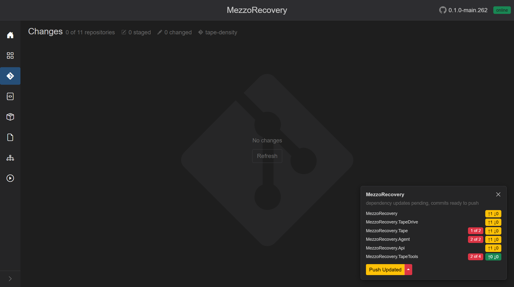

This snapshot shows:

- Description: **`dependency updates pending, commits ready to push`**
- Per-repo rows with commits badges (`↑1 ↓0`) and dependency badges (`1 of 2`, `2 of 2`, `2 of 4`)
- Primary **Push Updated** (yellow) - update deps, then synchronized push in one job
- Caret menu: **Level N Only**, **Update Only**, **Update Files**, **Push Only**, **Undo Push Commits**

The card is hidden on **Repositories** because the same header buttons are already there.

## GitHub Actions before push (baseline)

Open **Actions** (`/workspaces/2/actions`) before pushing to capture the "all green" baseline on **`tape-density`**:

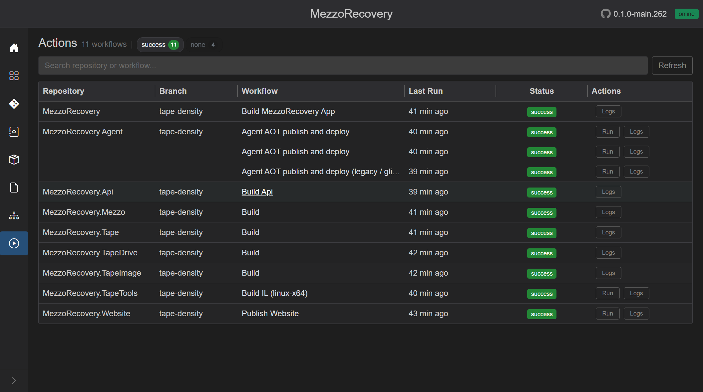

- **`11 workflows`**, **`success 11`**
- Last runs from the earlier New Feature push (~40 min ago)
- No **running** chip yet - CI has not reacted to the new feature commits

Use this as the before picture: after push, the same page will show orange **running** rows and live terminals.

## Repositories grid - Push Updated and split menu

On **Repositories**, unmatched package refs (consumers still pin old `-main` versions while Level 1 packages already report `-tape-density`) turn the header primary into yellow **Push Updated**:

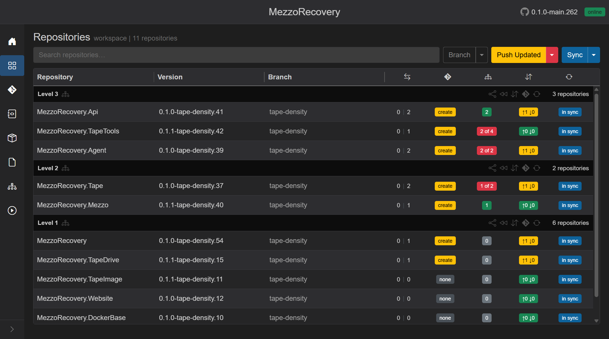

Grid signals after the feature commit:

- Yellow **`↑1 ↓0`** on repos with outgoing commits (feature commit not on origin yet)
- Red **`N of M`** dependency badges on Level 2 / 3 consumers
- Yellow **`create`** PR badges (ahead of default, no open PR)

### Push Updated caret - full menu

The split menu is how you run update and push separately:

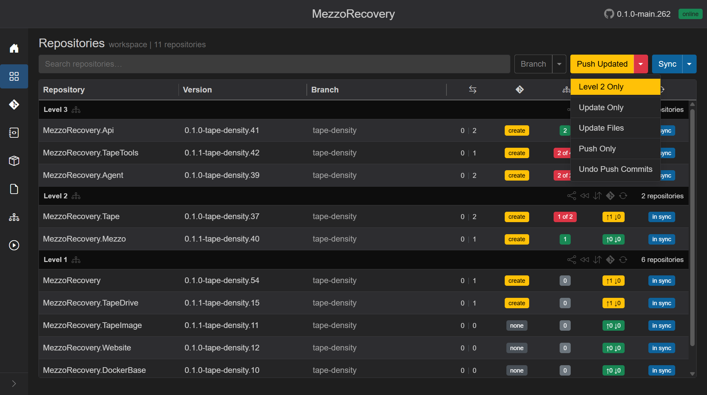

| Menu item | What it does |
| --- | --- |
| **Level N Only** | Update + push only the lowest level that still needs work |
| **Update Only** | Rewrite `.csproj` / file-config tokens and commit per repo |
| **Update Files** | Version-file token pass only |
| **Push Only** | Push outgoing commits with level-ordered synchronized push |
| **Undo Push Commits** | Roll back local update/feature commits (when shown) |

**Push Updated** (primary click) = **Update Only** then **Push Only** in one background job - the same combined path [New Feature](phase-2-new-feature.md) uses after branch creation.

## Update dependencies modal

**Push Updated** starts with the update confirmation:

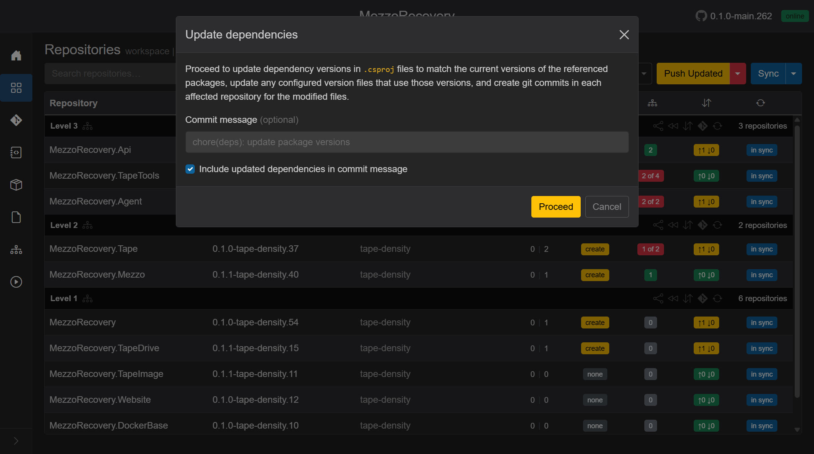

- Rewrites `.csproj` package versions to match branch package versions already on disk
- Optional commit message (default `chore(deps): update package versions`)
- **Include updated dependencies in commit message** lists which packages changed
- **Proceed** commits in each affected repo, then continues to push

This walkthrough used **Proceed** with the default message. GrayMoon created a second commit per consumer repo (deps alignment) before pushing.

## Synchronized push overlay

After updates, GrayMoon pushes **by dependency level** and polls NuGet connectors until required packages appear before starting the next level. The [loading overlay](../../shared.md#loading-overlay) shows git commands, registry checks, and wait countdowns:

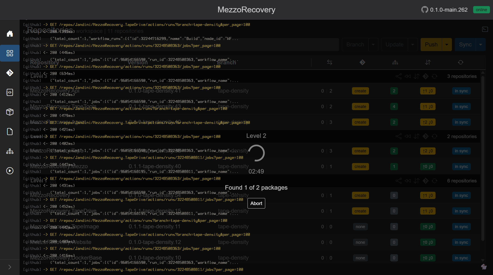

In this frame:

- Level 1 packages already pushed; overlay shows **Found 1 of 2 packages** with countdown
- GitHub Actions API lines in the terminal are **status only** - the gate is "is this nupkg on the NuGet feed?", not a green workflow badge
- **Abort** cancels the job

### Synchronized Push dialog (Push Only path)

When you choose **Push Only** (or yellow **Push** with no pending updates), GrayMoon may show the **Synchronized Push** dialog first:

(from [Repositories - Push Only](../repositories.md#push-only-and-synchronized-push))

- Lists **required packages** grouped by level
- **Synchronized Push** (default): sync registries, push level-by-level, wait for packages on the feed between levels
- **Proceed** starts the job; timeout is **3 minutes per package** per level

**Push Updated** skips this separate dialog when update+push is already implied, but the overlay behavior is the same during the push phase.

## Repositories after push

When the job finishes:

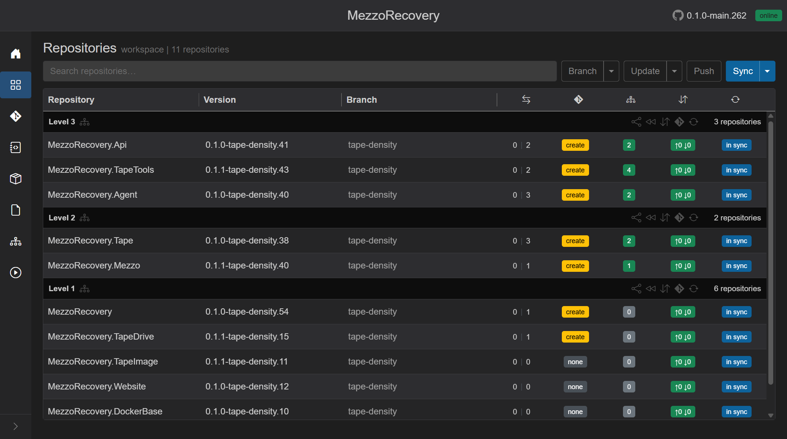

- Header **Push** back to outline (nothing left to push)
- Commits badges green **`↑0 ↓0`**
- Dependency badges green (counts match branch packages)
- Yellow **`create`** PR badges remain until PRs are opened
- Divergence **`0 | N`** still shows commits ahead of **`main`** (feature branch on origin, PR not merged)

## GitHub Actions after push - workflows in progress

Navigate to **Actions** via the sidebar (same workspace, no context loss). After the push, GitHub triggered builds on **`tape-density`**:

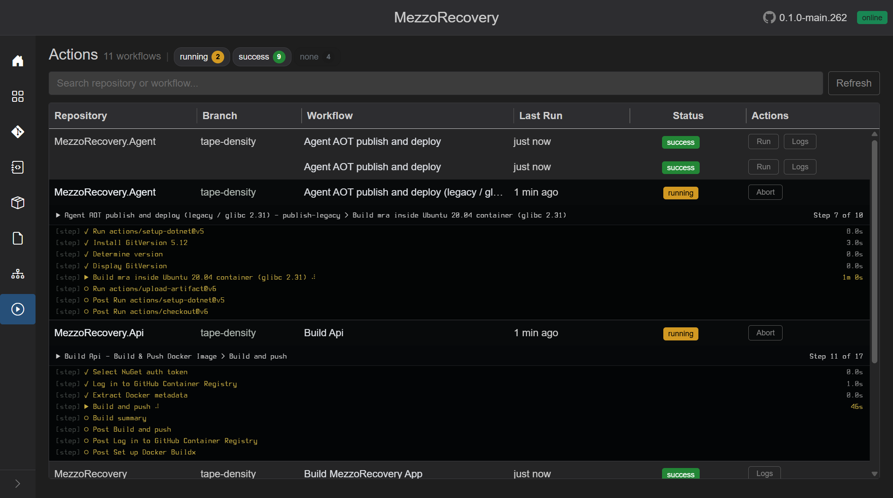

- Header chips: **`running 2`**, **`success 9`** (counts shift as jobs finish)
- Orange **running** badges on Agent, Api, TapeTools workflows
- **Abort** replaces **Run** while a run is in flight
- Expanded **live terminal** rows under running workflows (steps on the left, log output on the right)

This is the payoff of checking Actions **before** push: you can watch CI wake up across repos from one page instead of opening each GitHub repo.

Poll **Refresh** or wait - statuses flip to green **success** as GitHub completes. **Logs** opens the full run log modal on demand ([Actions reference](../actions.md)).

## None filter - workflows not yet run on the feature branch

Push-triggered **Build** workflows usually show **success** after the first feature push. **Deploy** workflows (and other **`workflow_dispatch`-only** YAML) often stay gray **none** with Last Run **never** until you start them.

Filter **none** (turn **success** off, **none** on) to list what has not run on **`tape-density`** yet:

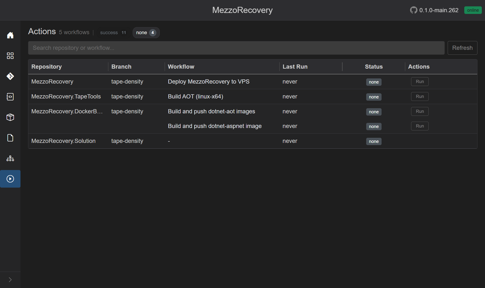

Typical rows include **Deploy MezzoRecovery to VPS**, TapeTools **Build AOT**, and DockerBase image push workflows - all with **Run** on the right. Header chip **none 4** is the workspace total; the filtered grid shows **5 workflows** on this branch.

This answers: "Build CI passed from the push - what deployment steps are still waiting?"

## Deploy a feature branch from GrayMoon

From the **none** filter (or search `deploy`), click **Run** on **Deploy MezzoRecovery to VPS**. GrayMoon dispatches GitHub **`workflow_dispatch`** on the current branch (**`tape-density`**) - no branch switch in GitHub, no local git commands.

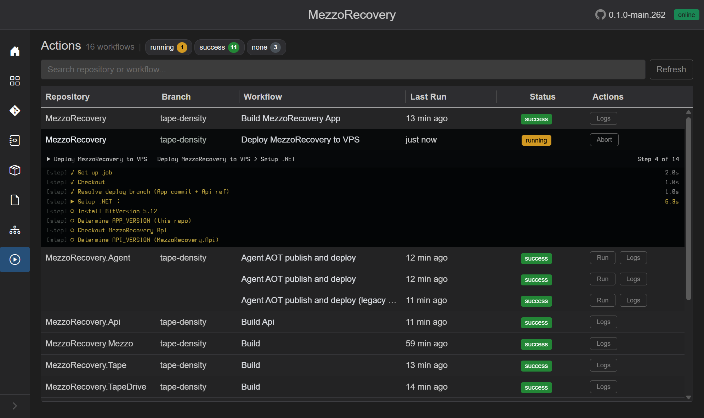

- Orange **running** badge, **running 1** chip in the header
- **Abort** cancels the run on GitHub
- Expanded **live terminal**: jobs/steps on the left (e.g. **Setup .NET**), log output on the right
- Branch column stays **`tape-density`** throughout

When GitHub finishes, status returns to **success**; open **Logs** for the full run text. See [Actions - Deploy from a feature branch](../actions.md#from-a-feature-branch-tape-density-walkthrough).

## Navigate between Repositories and Actions

GrayMoon keeps workspace context in the sidebar on every page:

1. **Repositories** - grid, header **Push** / **Push Updated** / **Update**, PR badges
2. **Actions** - CI status and live terminals for the same repos on the same branch
3. **Changes** - empty when clean; notification card visible when commits are ready to push

From here you can:

- Click **Actions** in the sidebar to watch remaining workflows finish
- Return to **Repositories** to confirm **`↑0 ↓0`** and open **Create PRs...** (next walkthrough step)
- Open **Changes** - still **No changes** while CI runs; unpushed work is already on origin

No full page reload is required; enhanced navigation keeps the circuit (and any background job keyed to `/workspaces/2`) alive.

## Phase 3 summary - GrayMoon value in this step

| Step | GrayMoon capability demonstrated |
| --- | --- |
| Commit All | One message -> N repo commits |
| Empty Changes + card | Working tree vs outgoing commits separated |
| Push Updated | Deps rewrite + synchronized push in one job |
| Split menu | Run update or push alone when needed |
| NuGet wait overlay | Level-ordered push without breaking consumers |
| Actions page | Multi-repo CI dashboard with live terminals |
| **none** filter | Workflows never run on current branch (deploy candidates) |
| **Run** Deploy VPS | Feature-branch deployment via `workflow_dispatch` from GM |
| Sidebar navigation | Repositories <-> Actions without losing workspace |

## Next (on your signal)

Now that PRs are created, the next focus is the PR check pipeline:

- Monitor PR checks until CI is green
- Merge (or open them in GitHub for review) when everything passes

See [Phase 4 - Create coordinated PRs](phase-4-create-prs.md).
