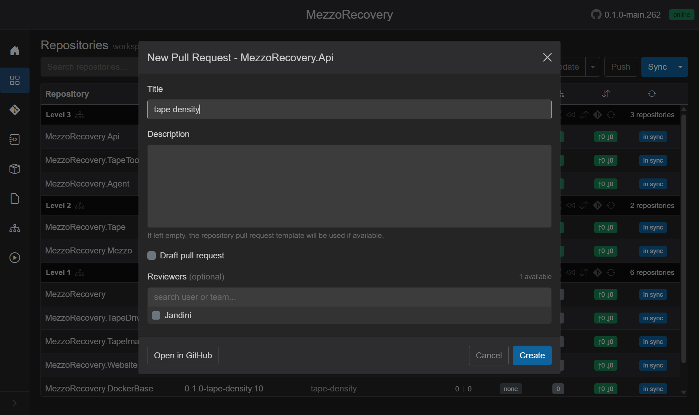
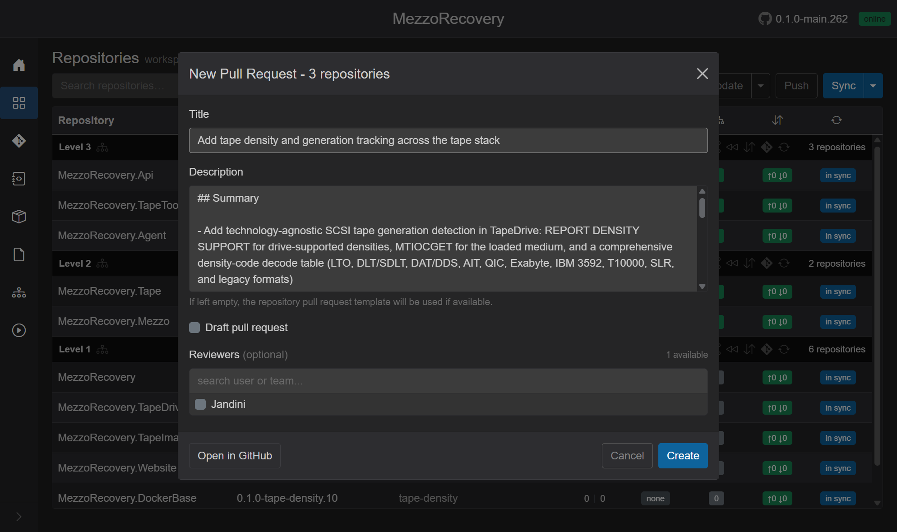
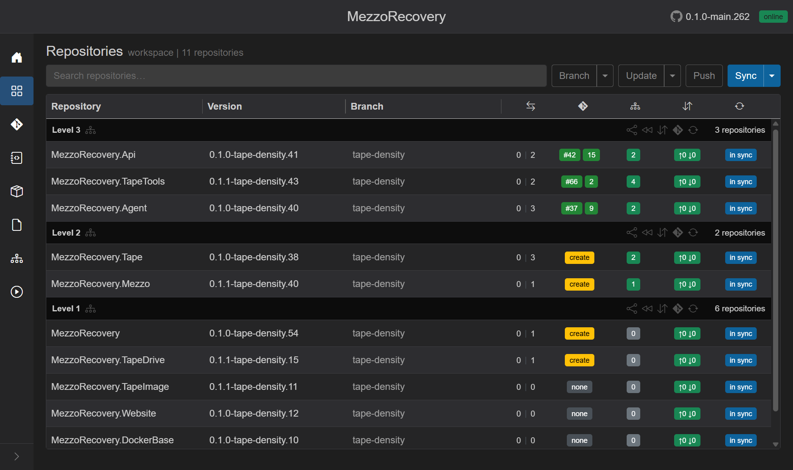
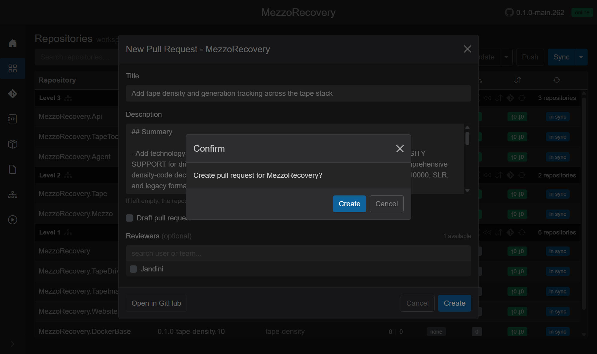
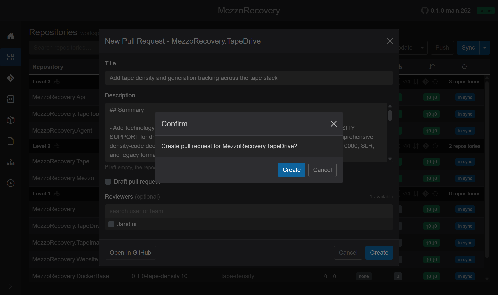
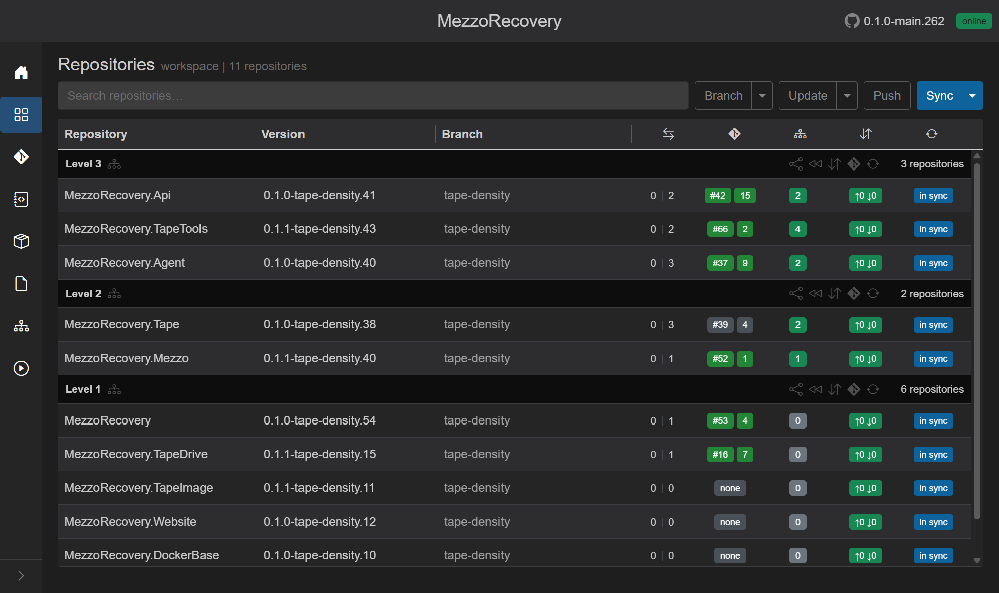

# Feature walkthrough: Phase 4 - Create coordinated PRs

This phase follows [Phase 3 - Commit, push, and GitHub Actions](phase-3-commit-push-gha.md). Your feature branch `tape-density` now has commits on the impacted repositories, and the Repositories grid shows yellow `create` PR badges where a PR is still needed.

Goal: create one coordinated PR set (same title/body) across the repos affected by the `tape-density` feature.

## What GrayMoon's PR creation targets

The Repositories page determines the eligible PR targets from:

- Dependency ordering (repos grouped by dependency level)
- Whether the repo's branch is already on its default branch
- Whether an open PR already exists for `tape-density`

So the PR creation happens in batches by dependency level. You may run the bulk PR action multiple times, and any remaining repos can be created via the per-repository `create` badge.

## (Optional) Per-repository PR dialog

You can create a PR for a single repo by clicking its yellow `create` badge. This opens the same modal, but with a single target.

## Bulk PR creation (dependency level batch)

From the Repositories grid, click **Open Pull Request** for the dependency level batch you want to process. This opens the multi-target PR modal.

Then:

1. Confirm the shared PR title
2. Paste/keep the shared description (the same markdown body everywhere)
3. Click **Create**

GrayMoon shows a confirmation modal, including how many PRs will be created.

## Why some repos did not get PRs in the first bulk run

After the first bulk create, GrayMoon updated the PR badges only for the repos included in that dependency-level batch.

The remaining repos were left with yellow `create` badges because they were not part of the eligible target set for that bulk action (they were in a different dependency level and/or were not eligible for the batch run at that time).

## Finish the remaining repos

For the remaining Level 1 repos, use their per-repo `create` badges.

## Final result: all PR badges and links

At the end, the Repositories grid shows green PR badges with the created PR numbers for every impacted repo.

## Next step: merge and Sync to Default (Level 1)

After PRs are created, merge them **by dependency level** on GitHub (Level 1 first). Then use the **Level 1** header rewind (**Sync to default branch...**) to check out `main`, delete the merged feature branch, and pull latest default in those clones.

Continue in [Phase 4 - Merge PRs and Sync to Default (Level 1)](phase-4-merging-prs.md).

