# Feature walkthrough: Phase 4 - Merge PRs and Sync to Default

This phase follows [Phase 4 - Create coordinated PRs](phase-4-create-prs.md). PRs for the `tape-density` feature are open (or already merged on GitHub). This step shows the **happy path**: merge PRs level by level, run scoped **Level N Only** updates between merge waves, then use each **Level N** header rewind to drop the feature branch and pull latest `main` in dependency order.

We document the full merge path: Level 1 rewind, **Level 2 Only**, Level 2 merge/close in GitHub, Level 2 rewind, **Push Updated** for Level 3, Level 3 merge in GitHub, and Level 3 rewind. The walkthrough ends with all 11 repos on `main`.

See also the general reference: [Sync To Default](../../sync-to-default.md).

## Starting state (full Repositories page)

After PR creation ([phase-4-create-prs.md](phase-4-create-prs.md)), every impacted repo had a PR link on `tape-density`. By this point:

- **Level 1 PRs are merged on GitHub** for the repos that had feature work (`MezzoRecovery`, `MezzoRecovery.TapeDrive`). GrayMoon paints those rows with a purple **merged** badge.
- **Level 2 / 3** still show green open PR badges (`#42`, `#66`, and so on) and remain on `tape-density`.
- **Header Push Updated** (yellow) is expected: Level 1 packages are back on `*-main.*` GitVersion while Level 2 / 3 `.csproj` files still pin `-tape-density` package versions.

In this run, four Level 1 repos (`TapeImage`, `Website`, `DockerBase`, `Solution`) had already been rewound to `main` in an earlier partial sync. Only **two** Level 1 clones still needed cleanup when we opened the dialog.

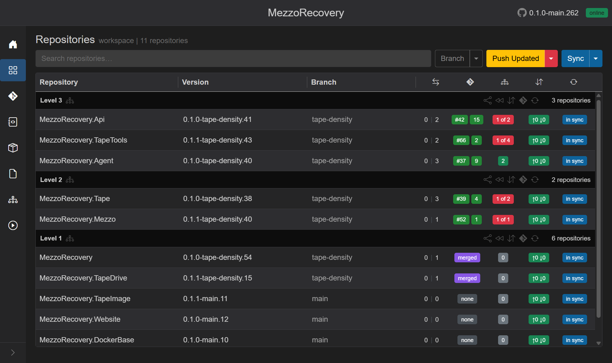

What to notice in the screenshot:

| Area | State |
| --- | --- |
| Level 3 | `tape-density`, open PRs, red dependency badges (e.g. `1 of 2`, `2 of 4`) |
| Level 2 | `tape-density`, open PRs, red dependency badges (e.g. `2 of 2`) |
| Level 1 | `MezzoRecovery` / `TapeDrive` on `tape-density` with purple **merged**; other Level 1 rows already on `main` |
| Header | **Push Updated** (yellow) - consumers still pin feature package versions |

## Do not use workspace-wide Sync To Default here

**Branch** caret **Sync To Default** across all 11 repos is for **discard/rollback** when you are abandoning unmerged work. With open PRs still on Level 2 / 3, that path would show red **commits will be lost** warnings and a countdown.

For this walkthrough you only want **per-level cleanup after merge**. Use the **Level 1** header rewind icon (**Sync to default branch...**), not the workspace-wide menu item.

## Level 1 rewind - fetch, then dialog

On the **Level 1** header, click the rewind control (**Sync to default branch...**).

GrayMoon does **not** open the confirm dialog immediately. It first runs a workspace job: **Fetching latest branch state for N repositories...** (refreshes GitHub PR records and `git fetch` per repo). When the fetch finishes, the **Sync to Default** dialog opens scoped to Level 1 only.

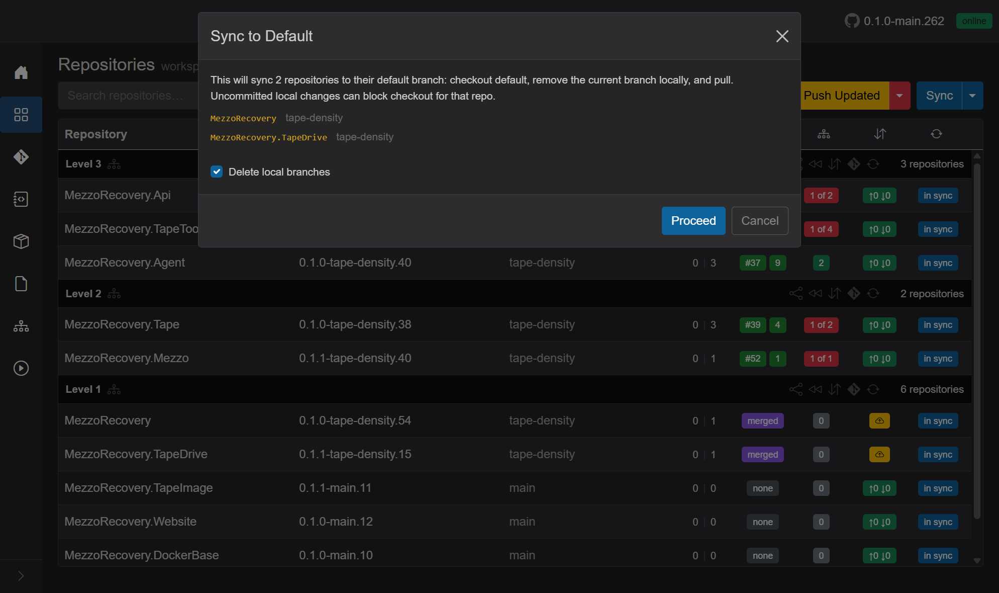

Dialog details for this **merged-PR** case (reason 2 in [sync-to-default.md](../../sync-to-default.md)):

- **Title:** Sync to Default
- **Lead copy:** *This will sync 2 repositories to their default branch: checkout default, remove the current branch locally, and pull.* (Only repos still on a non-default branch are listed; clones already on `main` are skipped.)
- **No red alert** - merged PRs are treated as landed work, not commits about to be destroyed.
- **Repo list** - `MezzoRecovery` and `MezzoRecovery.TapeDrive`, both leaving `tape-density`. No **N commits will be lost** line.
- **Delete local branches** - default **on**. After checkout of `main`, GrayMoon deletes the local `tape-density` ref.
- **Proceed** stays **blue** and runs **immediately** (no five-second countdown).

Click **Proceed**.

## What runs after Proceed

A second job: overlay **Synchronizing to default branch...**, then per-repo git steps (remote branch delete when upstream existed, fetch --prune, checkout `main`, delete local feature branch, pull). The overlay may be brief for two repos.

For each synced repo GrayMoon recaptures GitVersion, branch lists, and commit counts, then recomputes workspace dependency stats once at the end.

## After Level 1 Sync to Default

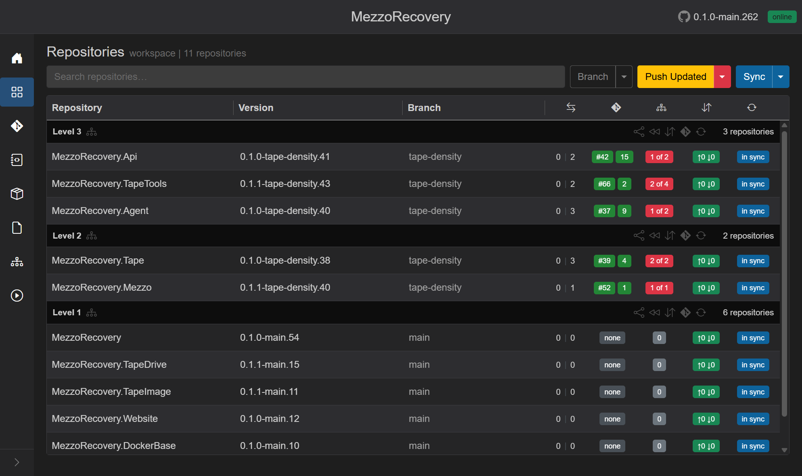

Level 1 after this step:

| Column | Level 1 state |
| --- | --- |
| **Branch** | `main` on every Level 1 row |
| **Version** | `*-main.*` GitVersion strings |
| **PR** | **none** (merged PR is closed; feature branch ref is gone locally) |
| **Deps** | gray `0` (Level 1 repos do not consume workspace packages) |
| **Commits** | **in sync** with origin |

Level 2 / 3 **unchanged** - still on `tape-density` with open PRs. That mixed grid is correct, not a failed job.

### Red dependency badges on Level 2 / 3 (expected)

Level 1 packages now report `*-main.*` again. Level 2 / 3 `.csproj` files on `tape-density` still pin `-tape-density` package versions. GrayMoon compares every workspace package reference to live GitVersion and paints red **`N of M`** badges on consumers (e.g. Tape `2 of 2`, TapeTools `2 of 4`).

Hover a badge and GrayMoon lists each drifted pin as `current -> new`. TapeTools might show only **2 of 4** mismatches because its Level 2 deps still match `-tape-density` on disk - only the Level 1 package pins are stale relative to `main`.

Those badges are the signal that consumers no longer match the package versions GitVersion reports on disk. They are expected immediately after Level 1 rewind. What you do next depends on whether you are **merging level by level** or trying to clear every badge in one shot.

## Push Updated vs Level 2 Only (while merging PRs)

Yellow **Push Updated** is available because unmatched deps exist. The primary button and the split-menu item **Level 2 Only** both run **Update Only** then **Push Only**, but they differ in **scope**:

| Action | Scope | What happens on `tape-density` after Level 1 rewind |
| --- | --- | --- |
| **Push Updated** (primary click) | Every level that still needs work | Rewrites `.csproj` / file tokens on Level 2 **and** Level 3, commits everywhere, then synchronized push walks Level 2 push, NuGet wait, Level 3 push |
| **Level 2 Only** (split menu) | Lowest level needing work only (`maxLevel: 2`) | Rewrites and commits only Level 2 repos (`Tape`, `Mezzo`), synchronized push stops after Level 2 packages publish |

The menu label tracks the lowest red-badge level. After Level 1 is on `main`, that item reads **Level 2 Only**. After Level 2 merges and rewinds, it becomes **Level 3 Only** for the final consumer pass.

See the full menu in [Phase 3 - Push Updated caret](phase-3-commit-push-gha.md#push-updated-caret---full-menu).

### Why full Push Updated is the wrong default during merge

If you click the primary **Push Updated** button while Level 2 and Level 3 PRs are still open:

1. **Level 3 picks up extra commits before its PR merges.** GrayMoon adds a `chore(deps): update package versions` commit on Api, TapeTools, and Agent while their PRs are still in review. Reviewers see a moving target; CI runs again on commits that were not part of the original feature scope.

2. **Level 3 pins Level 2 packages that are not on `main` yet.** A workspace-wide update rewrites Level 3 to whatever GitVersion Level 2 reports **on the feature branch today** (`*-tape-density.*`). After you merge Level 2 to `main` and it publishes new `-main.*` packages, Level 3 pins are stale again - you need **another** update pass.

3. **You pay for NuGet wait and push work you do not need yet.** Synchronized push continues into Level 3 (registry polling, overlay time) even though your immediate goal is only to land Level 2 PRs against packages that already live on default.

4. **It breaks the same rhythm as per-level rewind.** Sync to Default already proceeds level by level so each finished layer drops the feature branch before the next merges. Full **Push Updated** jumps ahead and couples Level 3 to dependency state that will change again when Level 2 merges.

### Why Level 2 Only fits the merge workflow

When your focus is **merge Level 2 PRs next**, open the **Push Updated** caret and choose **Level 2 Only**:

1. **Scope matches merge order.** Only `MezzoRecovery.Tape` and `MezzoRecovery.Mezzo` get `.csproj` rewrites so their Level 1 `<PackageReference>` versions point at `-main.*` packages (the versions Level 1 clones report after rewind). Level 3 repos are not touched.

2. **Level 2 PRs absorb exactly one deps commit.** The open PRs for Tape and Mezzo gain a single alignment commit that explains why they now consume default-branch packages. You merge that PR set, then **Level 2** header rewind - same pattern as Level 1.

3. **Level 3 PRs stay stable.** Api, TapeTools, and Agent keep the commits reviewers already signed off on. Red badges may remain (often partial, e.g. **2 of 4** on TapeTools) until Level 2 is merged and published - that is fine.

4. **The next pass is obvious.** After Level 2 rewind, Level 2 packages report `*-main.*`, Level 3 still pins `-tape-density` Level 2 versions, and the menu offers **Level 3 Only**. One scoped update/push per merge wave instead of rework.

### When primary Push Updated does make sense

Use the primary **Push Updated** button when you want to **clear every unmatched dep and push every outgoing commit in one job** - for example right after feature coding ([Phase 3](phase-3-commit-push-gha.md)) when no PRs exist yet, or when every level is ready to move together.

During **coordinated PR merge**, prefer **Level N Only** so each dependency layer gets one update/push cycle aligned with that layer's merge and rewind.

## Run Level 2 Only

After Level 1 rewind, yellow **Push Updated** is back because Level 2 / 3 still pin `-tape-density` package versions while Level 1 clones report `*-main.*`. The next scoped action is **Level 2 Only** from the split menu - not the primary button.

### Before

Level 1 is on `main`. Level 2 shows red **`2 of 2`** (Tape) and **`1 of 1`** (Mezzo). Level 3 still has open PRs and partial red badges (e.g. TapeTools **`2 of 4`** - only Level 1 pins are stale).

Open the **Push Updated** caret. The first item reads **Level 2 Only** because Level 2 is the lowest dependency level with unmatched refs:

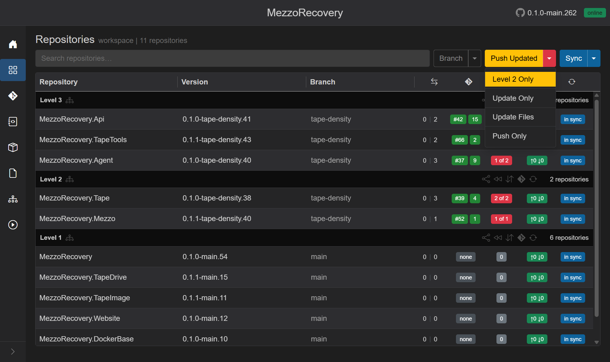

Click **Level 2 Only**.

### Update dependencies modal

GrayMoon opens the same **Update dependencies** modal as a full **Push Updated** run, but the job that follows is scoped to Level 2 (`maxLevel: 2`).

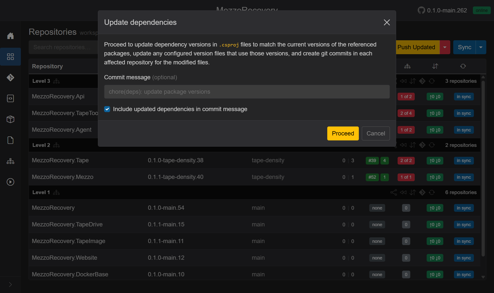

Leave the default message (`chore(deps): update package versions`) and **Include updated dependencies in commit message** on. Click **Proceed**.

### What the job does

One background job runs **Updating Level 2...** then synchronized push **only through Level 2**:

1. **Update phase** - rewrites `.csproj` in `MezzoRecovery.Tape` and `MezzoRecovery.Mezzo` so Level 1 `<PackageReference>` versions point at `-main.*` (matching the Level 1 clones after rewind). Level 3 repos are not edited.
2. **Commit phase** - one deps commit per Level 2 repo with the shared message.
3. **Push phase** - synchronized push publishes Level 2 packages and stops. No Level 3 push, no NuGet wait for Level 3 consumers.

The overlay may finish quickly when only two repos update and push:

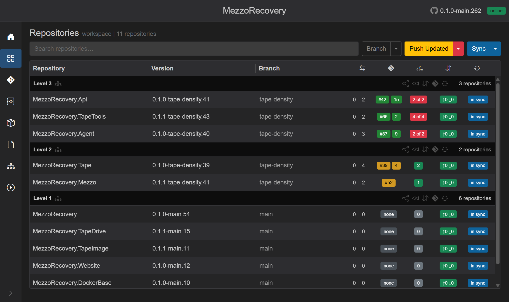

### After Level 2 Only

| Area | What changed | What did not change |
| --- | --- | --- |
| **Level 2** | Dep badges green (`2`, `1`). Tape / Mezzo gained a deps commit and push (`0 \| N` ahead of `main`). Open PR badges `#39` / `#52` still point at the same PRs - now including the alignment commit. | Branch still `tape-density`. |
| **Level 3** | Red badges may **increase** (e.g. TapeTools **`2 of 4`** -> **`4 of 4`**, Api **`1 of 2`** -> **`2 of 2`**) because Level 2 package GitVersion moved on the feature branch while Level 3 `.csproj` files were left untouched. No new commits on Level 3. | PR set unchanged - reviewers still see the original feature commits only. |
| **Level 1** | Still `main`, gray `0`, **none** PR. | Unchanged. |
| **Header** | Still yellow **Push Updated** - Level 3 is now the lowest level needing work. Menu will offer **Level 3 Only** after Level 2 merges and rewinds. | Primary **Push Updated** would still jump into Level 3 - avoid until that wave. |

That split grid is the proof **Level 2 Only** worked: Level 2 is aligned and pushed; Level 3 was deliberately not updated.

### PR checks turn green after GHA completes

Pushing the deps commit re-runs GitHub Actions on the open Level 2 PRs. While workflows are in flight, the check badge beside `#39` / `#52` is **orange** (running). After CI finishes successfully, **Sync** (or a page refresh) picks up the new status and the badge turns **green**.

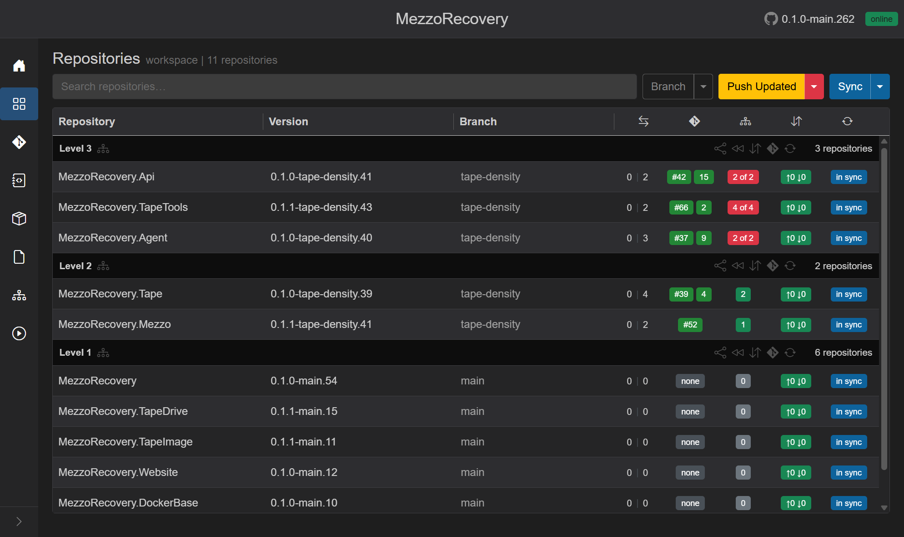

In this frame:

- **Level 2** - `#39` and `#52` with green check badges (`2` and `1` workflows passed). Ready to merge on GitHub.
- **Level 3** - open PRs unchanged; check badges still red (those PRs were not part of this push).
- **Level 1** - still `main`, no PR.

## Merge in GitHub (GrayMoon does not merge for you)

In this version of GrayMoon, **merging is done by you in GitHub**. GrayMoon tracks PR state, check status, and mergeability on the Repositories grid, but it does not expose a **Merge** button. When checks are green, open each PR on GitHub and merge (or close) there yourself.

### Quick navigation to PRs

Two shortcuts from the Repositories page:

1. **Per-repo PR badge** - click the green `#39` / `#52` link on a row. GrayMoon opens that pull request on GitHub in a new tab.
2. **Level header dropdown** - hover the **`N repositories`** label on a **Level N** header (e.g. **2 repositories** on Level 2). A menu titled **Open in GitHub...** lists **Branches**, **Pull Requests**, **Actions**, and other GitHub tabs. Choose **Pull Requests** to open the PR list for every repo in that level (open PRs resolve to the exact PR URL when GrayMoon knows the number).

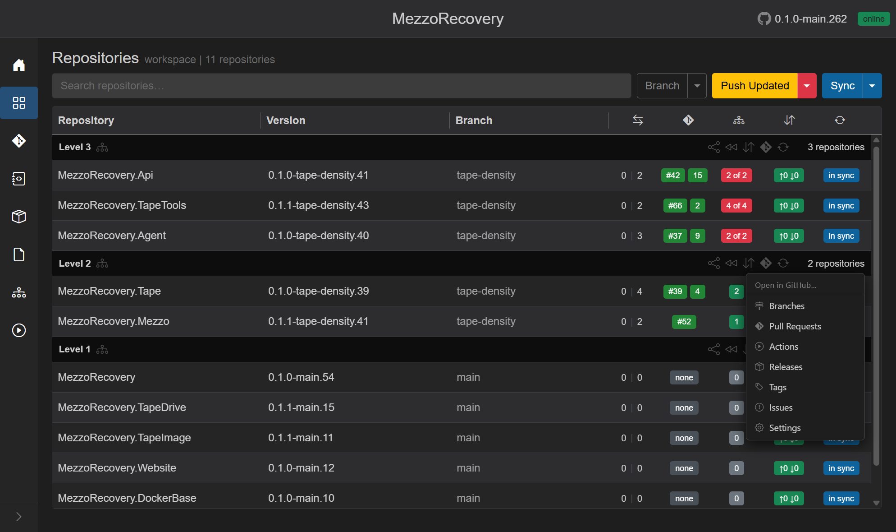

Use whichever path fits: one PR via the row badge, or the whole level via the header menu before you merge.

### Example: close `MezzoRecovery.Mezzo` when it has no file changes

After **Level 2 Only**, not every Level 2 PR carries feature edits. **`MezzoRecovery.Tape`** (`#39`) picked up the deps alignment commit and still has package work in scope. **`MezzoRecovery.Mezzo`** (`#52`) may have **no changed files** in the PR - only the deps bump GrayMoon committed, or an empty diff if Mezzo had nothing to rewrite.

On the grid, Tape shows a file-count beside the PR badge (e.g. **`4`** next to `#39`). Mezzo shows **`#52`** with a green check but **no file-count** - a signal the PR has little or nothing left to land as product code. In that case you can **close** PR `#52` on GitHub instead of merging it, then continue with Tape and the rest of the level merge plan. You perform that decision in GitHub; GrayMoon will reflect merged/closed state on the next sync.

## After you merge and close Level 2 PRs in GitHub

You performed the merge decisions in GitHub (GrayMoon only reflects the outcome):

1. **Merge** `MezzoRecovery.Tape` (`#39`) - feature work plus the deps alignment commit from **Level 2 Only**.
2. **Close** `MezzoRecovery.Mezzo` (`#52`) - no file changes left to land; closing avoids an empty merge.

Refresh the grid - hover PR badges, press **F5** (persisted state only), run header **Sync**, or click **Level 2** header **Sync to default branch...** (`<<`, which refreshes PR status for the level before the dialog). See [Refreshing PR status](../../repositories.md#refreshing-pr-status). GrayMoon paints **purple merged** on Tape and **red closed** on Mezzo. Both rows still show branch **`tape-density`** locally until you run **Level 2** header rewind.

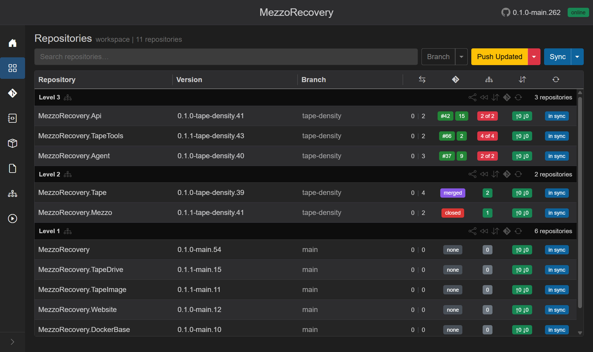

| Row | GitHub outcome | Grid badge | Branch (local) |
| --- | --- | --- | --- |
| **MezzoRecovery.Tape** | Merged `#39` | purple **merged** | `tape-density` |
| **MezzoRecovery.Mezzo** | Closed `#52` | red **closed** | `tape-density` |
| **Level 3** | Open PRs unchanged | green `#42` / `#66` / `#37` | `tape-density` |
| **Level 1** | Already rewound | **none** | `main` |

That mixed state is correct. Merged and closed PRs are finished on GitHub; local clones still need per-level cleanup.

## Level 2 rewind - fetch, then dialog

On the **Level 2** header, click **Sync to default branch...** (rewind icon). Same pattern as Level 1: PR refresh for the level first, then fetch job, then dialog scoped to Level 2 only. No need to hover badges before clicking.

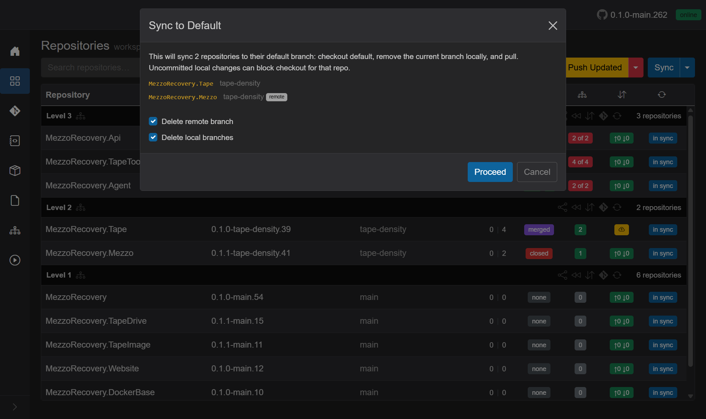

Dialog details for this **merged/closed-PR** case:

- **Lead copy:** *This will sync 2 repositories to their default branch: checkout default, remove the current branch locally, and pull.*
- **Repo list** - `MezzoRecovery.Tape` leaving `tape-density`; `MezzoRecovery.Mezzo` leaving `tape-density` with a gray **remote** hint (closed PR; origin may still have the feature branch until delete runs).
- **No red alert** - merged and closed PRs are treated as resolved work, not commits about to be destroyed.
- **Delete remote branch** and **Delete local branches** - both default **on**. After checkout of `main`, GrayMoon removes the local `tape-density` ref and deletes the remote feature branch when it existed.
- **Proceed** stays **blue** with no countdown.

Click **Proceed**. Overlay **Synchronizing to default branch...**, then per-repo checkout / pull / branch cleanup for Tape and Mezzo only.

## After Level 2 Sync to Default

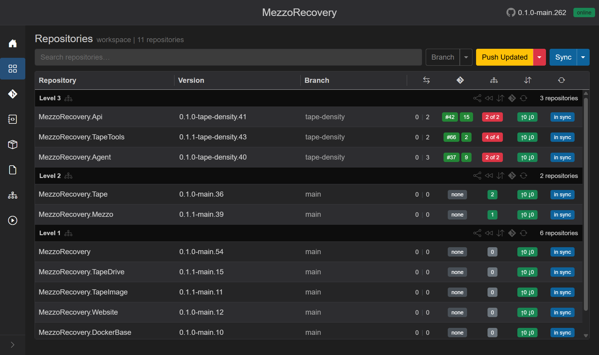

Level 2 after this step:

| Column | Level 2 state |
| --- | --- |
| **Branch** | `main` on Tape and Mezzo |
| **Version** | `*-main.*` GitVersion strings |
| **PR** | **none** (merged PR closed; closed PR stays closed; feature branch ref gone locally) |
| **Deps** | green badges (`2`, `1`) - Level 1 package pins match |
| **Commits** | **in sync** with origin |

Level 3 **unchanged** - still on `tape-density` with open PRs. Red dependency badges remain (e.g. TapeTools **4 of 4**, Api **2 of 2**) because Level 2 packages now report `*-main.*` while Level 3 `.csproj` files still pin `-tape-density` Level 2 versions. Header **Push Updated** stays yellow; the split menu will offer **Level 3 Only** next.

## Push Updated vs Level 3 Only (final dependency level)

After Level 2 rewind, Level 3 is the **only** level with red dependency badges. The split-menu label becomes **Level 3 Only**. At this point it matches primary **Push Updated** exactly:

| Action | Scope | When only Level 3 has red badges |
| --- | --- | --- |
| **Push Updated** (primary click) | Every level that still needs work | Rewrites Level 3 `.csproj` refs to Level 2 `-main.*` packages, commits, synchronized push through Level 3 |
| **Level 3 Only** (split menu, first item) | Lowest level needing work (`maxLevel: 3`) | Same job - there is no lower level left to skip and no higher level to accidentally include |

During earlier merge waves you needed **Level 2 Only** so Level 3 PRs stayed stable while Level 2 landed. Now every repo below Level 3 is already on `main` with green badges, so scoping buys nothing. Click the yellow **Push Updated** button or choose **Level 3 Only** from the caret - either path runs update + push for Api, TapeTools, and Agent only.

See the full menu shape in [Phase 3 - Push Updated caret](phase-3-commit-push-gha.md#push-updated-caret---full-menu) (the first scoped item label tracks the lowest red-badge level).

## Run Level 3 update (Push Updated)

We clicked primary **Push Updated** here. **Level 3 Only** would have opened the same **Update dependencies** modal and run the same job.

### Before

Level 1 and Level 2 are on `main` with green dep badges. Level 3 still shows red **`2 of 2`**, **`4 of 4`**, **`2 of 2`** on `tape-density` with open PRs `#42`, `#66`, `#37`. Header is yellow **Push Updated**.

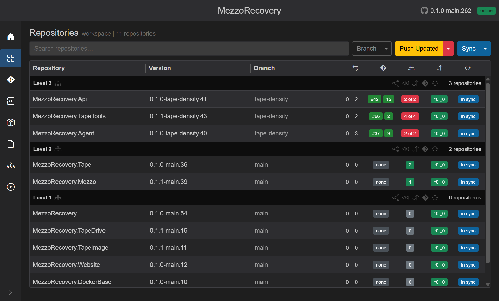

### Update dependencies modal

GrayMoon opens the **Update dependencies** modal (same shell as Level 2 Only and Phase 3 **Push Updated**).

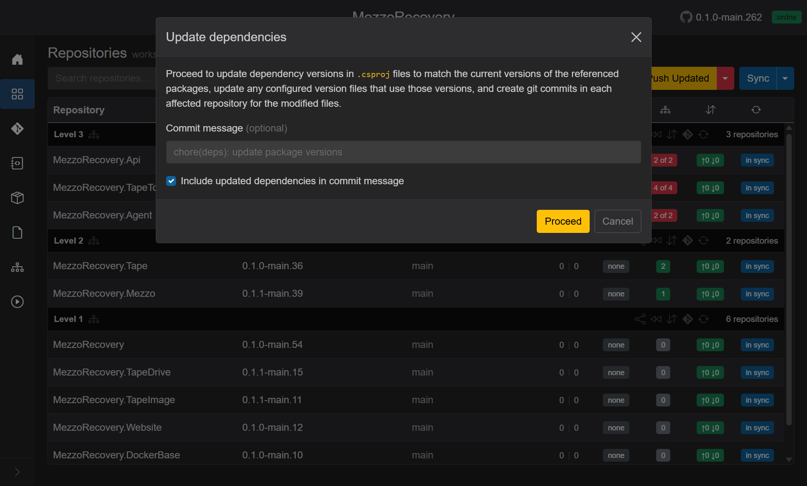

Leave the default message (`chore(deps): update package versions`) and **Include updated dependencies in commit message** on. Click **Proceed**.

### What the job does

One background job runs **Updating Level 3...** then synchronized push through Level 3:

1. **Update phase** - rewrites `.csproj` in `MezzoRecovery.Api`, `MezzoRecovery.TapeTools`, and `MezzoRecovery.Agent` so Level 1 and Level 2 `<PackageReference>` versions point at `-main.*` (matching clones after Level 2 rewind). Level 1 / 2 repos are not edited.
2. **Commit phase** - one deps commit per Level 3 repo with the shared message.
3. **Push phase** - synchronized push publishes Level 3 package refs on `tape-density` and stops (Level 3 is the top level; no NuGet wait for downstream consumers).

### GitHub Actions after push

Pushing the deps commit re-runs workflows on the open Level 3 PRs. Switch to the **Actions** sidebar to watch CI live (same page used in [Phase 3](phase-3-commit-push-gha.md)): filter **running**, expand a workflow row for step-level logs. PR check badges on Repositories stay **orange** until runs finish; **Sync** or a refresh picks up green.

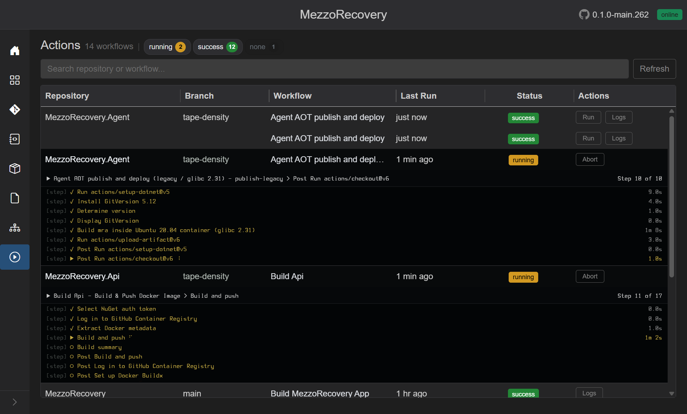

In this frame, **Build Api** and **Agent AOT publish and deploy (legacy)** are **running** on `tape-density`; other rows may already show **success** from earlier pushes on the same branch.

Return to **Repositories** when the overlay completes (or leave Actions open and navigate back later).

### After Push Updated

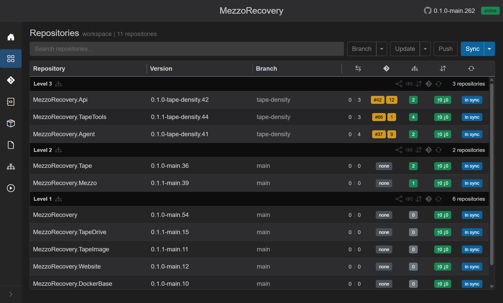

| Area | What changed | What did not change |
| --- | --- | --- |
| **Level 3** | Dep badges green (`2`, `4`, `2`). Each repo gained a deps commit and push (`0 \| N` ahead of `main`). Open PR badges `#42` / `#66` / `#37` still point at the same PRs - now including the alignment commit. | Branch still `tape-density`. |
| **Level 2 / 1** | Still `main`, green deps, PR **none**. | Unchanged. |
| **Header** | Yellow **Push Updated** drops; header shows separate **Update** and **Push** (no unmatched deps left to rewrite). | - |

Wait for GHA on the Level 3 PRs to turn green (same pattern as [Level 2 PR checks](#pr-checks-turn-green-after-gha-completes)), then merge in GitHub.

## Merge Level 3 PRs in GitHub (your action)

GrayMoon does not merge for you. When checks are green:

1. Open each Level 3 PR via the row badge (`#42`, `#66`, `#37`) or hover **3 repositories** on the Level 3 header -> **Open in GitHub...** -> **Pull Requests**.
2. Merge each PR on GitHub (all three carry feature work plus the deps alignment commit from **Push Updated**).

Refresh the grid - hover PR badges, **F5**, header **Sync**, or **Level 3** header **Sync to default branch...** (`<<`). See [Refreshing PR status](../../repositories.md#refreshing-pr-status). GrayMoon paints **purple merged** on Api, TapeTools, and Agent. All three rows still show branch **`tape-density`** locally until you run **Level 3** header rewind.

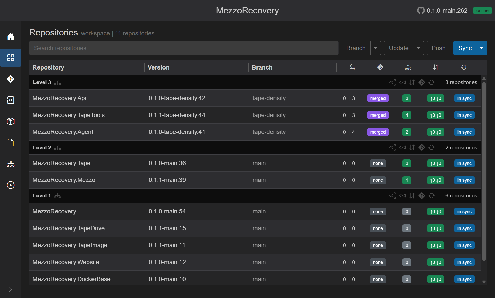

| Row | GitHub outcome | Grid badge | Branch (local) |
| --- | --- | --- | --- |
| **MezzoRecovery.Api** | Merged `#42` | purple **merged** | `tape-density` |
| **MezzoRecovery.TapeTools** | Merged `#66` | purple **merged** | `tape-density` |
| **MezzoRecovery.Agent** | Merged `#37` | purple **merged** | `tape-density` |
| **Level 2 / 1** | Already rewound | **none** | `main` |

## Level 3 rewind - fetch, then dialog

On the **Level 3** header, click **Sync to default branch...**. Fetch job first, then dialog scoped to Level 3 only.

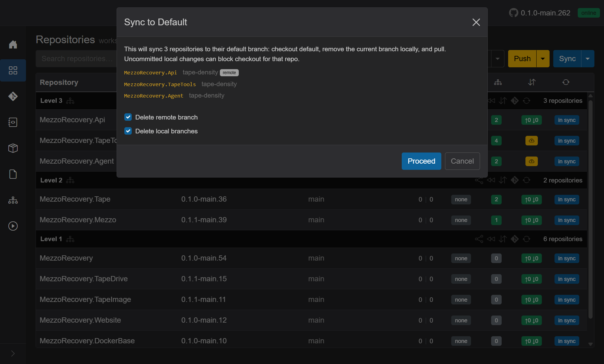

Dialog details (same merged-PR pattern as Level 1 and Level 2):

- **Lead copy:** *This will sync 3 repositories to their default branch...*
- **Repo list** - Api, TapeTools, Agent leaving `tape-density`.
- **No red alert** - merged PRs are resolved work.
- **Delete remote branch** and **Delete local branches** - both default **on**.
- **Proceed** stays **blue** with no countdown.

Click **Proceed**. Overlay **Synchronizing to default branch...**, then checkout / pull / branch cleanup for all three Level 3 repos.

## After Level 3 Sync to Default - walkthrough complete

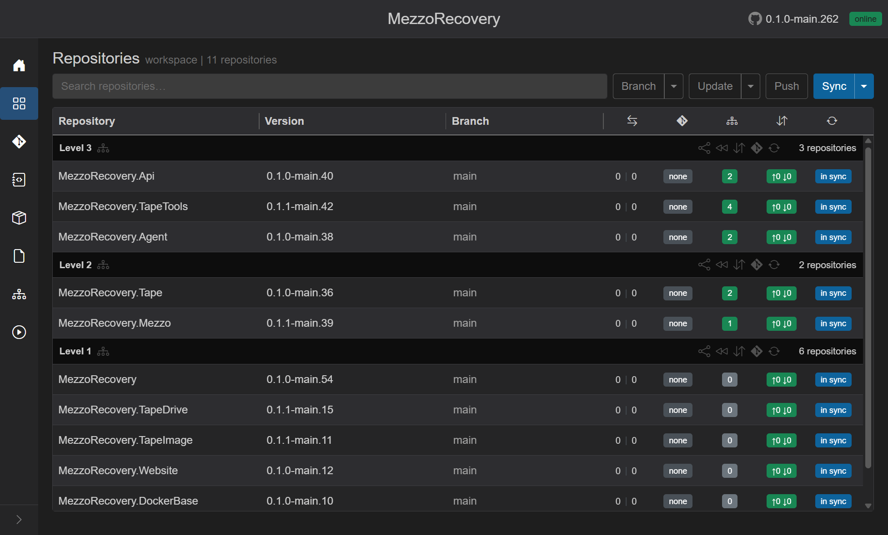

Every row in the workspace:

| Column | Final state |
| --- | --- |
| **Branch** | `main` on all 11 repos |
| **Version** | `*-main.*` GitVersion strings |
| **PR** | **none** - merged PRs closed; feature branch refs gone |
| **Deps** | green badges - every package pin matches live GitVersion |
| **Commits** | **in sync** with origin |
| **Header** | **Update** / **Push** / **Sync** - no yellow **Push Updated** (nothing left to align) |

The `tape-density` feature is fully landed. Local clones match GitHub default; the feature branch no longer exists locally or on origin (when delete-remote was checked).

## Summary - the PR merge rhythm (simple)

Cross-repo features in GrayMoon follow one repeating pattern. **You** own review and merge decisions in GitHub. **GrayMoon** owns coordination, dependency math, and fast cleanup across every clone.

### What you do (human, in GitHub)

- **Review** each PR - read the diff, comment, request changes, approve.
- **Merge or close** when satisfied (e.g. close Mezzo `#52` when it had no file changes).
- **Decide timing** - merge Level 1 before Level 2, Level 2 before Level 3. GrayMoon shows check badges and merge state but never merges for you.

### What GrayMoon does (coordination)

| Step | GrayMoon action | Why it matters |
| --- | --- | --- |
| **Create PRs** | Same title/body across repos, batched by dependency level | No missed repo; reviewers see a consistent story |
| **Track status** | Purple **merged**, red **closed**, green open PR badges; orange/green check badges | One grid replaces checking 11 GitHub tabs |
| **Scoped update** | **Level N Only** rewrites `.csproj` pins for one dependency wave at a time | Consumers pick up packages their upstream level just landed on `main` - without extra commits on PRs still in review |
| **Push + NuGet wait** | Synchronized push publishes packages level-by-level | Downstream `.csproj` updates see the correct package version on the registry |
| **Per-level rewind** | **Sync to default branch...** on each Level N header | Every clone checks out `main`, deletes the feature branch, pulls latest - in dependency order |
| **Live CI** | **Actions** page polls GHA; Repositories shows check badges | Spot failing workflows without leaving the workspace |

### The level-by-level loop (this walkthrough)

For each dependency level from bottom (Level 1) to top (Level 3):

1. **Merge** (or close) that level's PRs in GitHub.
2. **Rewind** that level in GrayMoon (**Sync to default branch...** on the level header).
3. **Update the next level** - **Level N Only** from the **Push Updated** menu (or primary **Push Updated** when only the top level remains).
4. Wait for **GHA green**, then repeat for the next level.

Level 1 had six repos; Level 2 had Tape merged and Mezzo closed; Level 3 had three merges. After the last rewind, all 11 repos sit on `main` with green deps - done.

### Why not one big Push Updated during merge?

If you clicked full **Push Updated** while Level 2 and Level 3 PRs were still open, GrayMoon would commit deps bumps onto every consumer at once. Reviewers would see moving targets, CI would re-run on PRs they already approved, and you would need another update pass after each merge wave anyway. **Level N Only** keeps each PR set stable until its level merges, then adds exactly one alignment commit before you merge that level.

At the **final** level, **Push Updated** and **Level 3 Only** are the same job - there is nothing below Level 3 left to protect.

### GrayMoon vs traditional multi-repo merge

| Traditional | With GrayMoon |
| --- | --- |
| Manually track which of 11 repos have open PRs, merged PRs, or stale branches | One Repositories grid with PR badges, branch column, and dep badges |
| Hand-edit `.csproj` package versions after each merge wave | **Level N Only** or **Push Updated** rewrites pins and commits in one job |
| Push repos one-by-one; guess when NuGet packages are available | Synchronized push with NuGet wait between levels |
| `git checkout main && git pull && git branch -d tape-density` in 11 folders | Per-level **Sync to default branch** - fetch, dialog, proceed |
| Easy to forget a repo or leave a stale feature branch | Level headers scope rewind; delete-remote cleans origin too |

**Bottom line:** code review stays human. Branch creation, dependency alignment, push ordering, PR tracking, and cleanup across the whole workspace is what GrayMoon accelerates.
