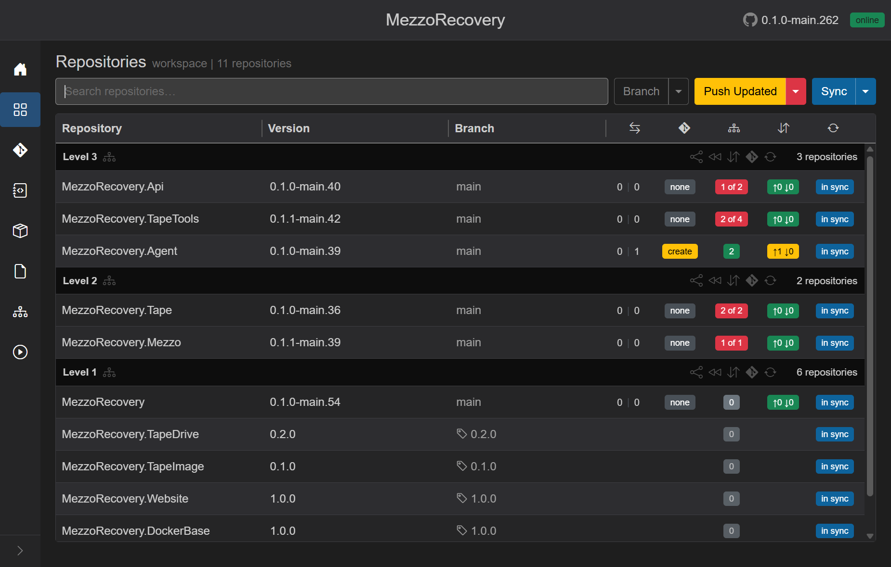
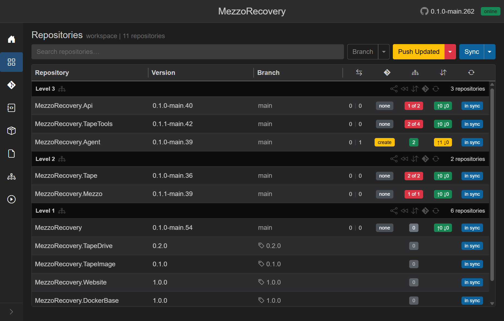
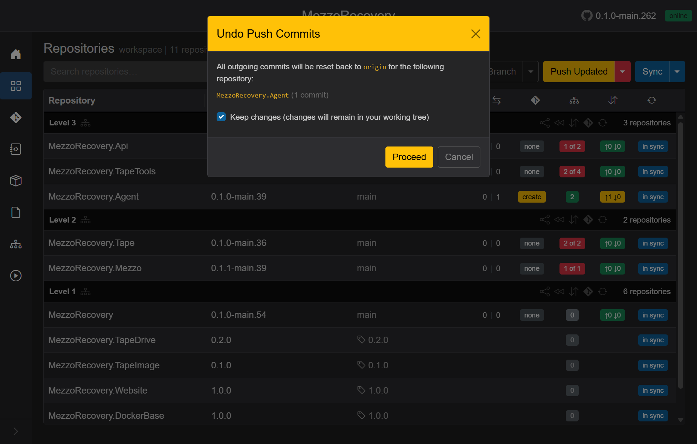
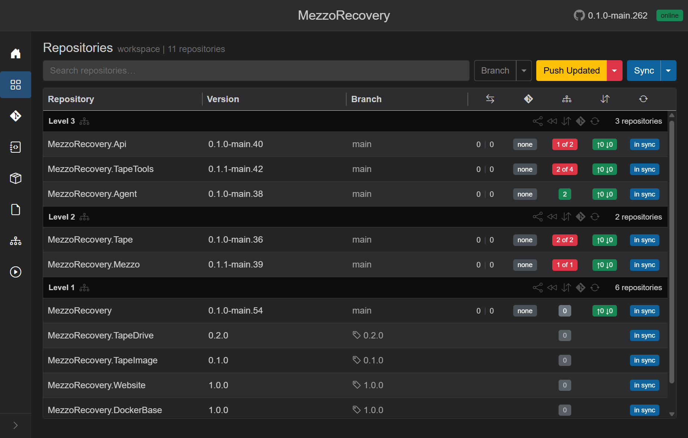
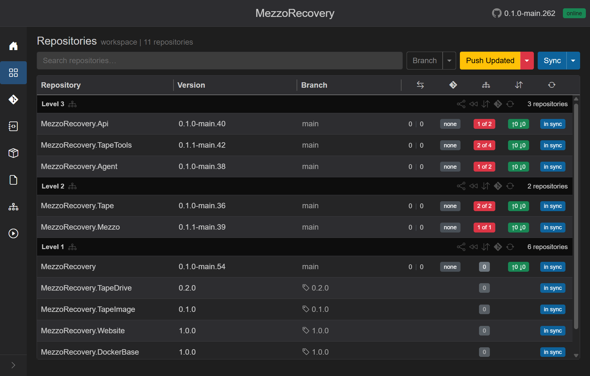

# Undo Push Commits

Route: Repositories (`/workspaces/{id}`)

**Undo Push Commits** rolls back local commits that have **not been pushed to origin yet**. The branch pointer resets to `origin/<branch>`; remote history is unchanged. Use this when you committed on the wrong branch (for example **main**), do not want those commits on origin, or **cannot push** because the default branch is protected.

This walkthrough uses **MezzoRecovery** (`/workspaces/2`). **MezzoRecovery.Agent** is on **main** with one outgoing commit: a dependency update that rewrote `MezzoRecovery.Agent.csproj` to pin `MezzoRecovery.TapeDrive` at tag **0.2.0**.

## When the menu item appears

**Undo Push Commits** is in the split menu of the yellow header button when any workspace repo has outgoing commits (or no upstream yet):

| Header button | Split menu also includes |
| --- | --- |
| **Push Updated** | Level N Only, Update Only, Update Files, Push Only, **Undo Push Commits** |
| **Push** (yellow, no deps to update) | **Undo Push Commits** |

The same item appears on the **Branch** caret push section and on [workspace notification cards](../shared.md#workspace-action-notification-cards) (**Push** / **Push Updated** caret).

Pinned tags and repos with zero outgoing commits are skipped automatically.

## Starting state - outgoing commit on Agent

**MezzoRecovery.Agent** shows:

- Branch **main**
- Divergence **0 | 1** (one commit ahead of default, nothing behind)
- Commits badge yellow **↑1 ↓0**
- PR badge yellow **create**
- Dependencies green **2** (the local commit aligned `.csproj` with current package versions)

Other Level 2 / 3 rows may already show red **`N of M`** deps badges (for example after a [tag upgrade](tag-upgrade.md)). Agent was fixed locally but not pushed.

Header is yellow **Push Updated** (unmatched deps elsewhere plus outgoing commits on Agent).

## Open Push Updated and choose Undo Push Commits

Click the **Push Updated** caret. **Undo Push Commits** is the last item.

| Menu item | What it does |
| --- | --- |
| Level N Only / Update Only / Update Files / Push Only | Normal update and push workflow |
| **Undo Push Commits** | Reset every repo with outgoing commits back to **origin** (local only) |

Primary **Push Updated** still runs update-then-push. Use the caret when you need to undo instead.

## Confirmation dialog

The modal lists each affected repository and its outgoing commit count.

- **Reset target:** `origin` for the current branch (here `origin/main`).
- **Keep changes** (checked by default): mixed reset - commits removed, file edits stay in the working tree as unstaged changes. Use this to move the work onto a feature branch via [Changes](changes.md) without losing edits.
- **Keep changes** unchecked: hard reset - commits and edits are discarded. A red warning is shown.
- **Proceed** runs resets in parallel under the [loading overlay](../shared.md#loading-overlay). Each repo sends a sync notification when done so commits badges update without a manual **Sync**.

Nothing in this flow contacts GitHub to push or delete remote commits.

## After undo - outgoing commits gone

On **MezzoRecovery.Agent** after **Proceed**:

- Commits badge green **↑0 ↓0** (matches `origin/main`)
- Divergence **0 | 0**
- PR badge **none**
- Version string drops back (GitVersion no longer includes the removed commit)

Git on disk: `main...origin/main` with no unpushed commits. If **Keep changes** was left checked, `MezzoRecovery.Agent.csproj` may still show local edits until you commit on another branch or discard them.

## Why dependencies turn red again

The undone commit changed **PackageReference** versions in `.csproj`. Removing it puts HEAD back to the pins on **origin/main** (for example `MezzoRecovery.TapeDrive` at `0.1.1-main.15`) while **MezzoRecovery.TapeDrive** is published at tag **0.2.0** on Level 1.

GrayMoon compares committed `.csproj` pins to current workspace package versions. After a hard reset (or after discarding kept working-tree edits), Agent shows a red **`1 of 2`** badge again.

Fix paths (same as any unmatched-deps state):

- Header **Push Updated** or **Update Only** on a **feature branch** (not protected **main**)
- Click the red badge on one repo to update that repo only
- See [tag-upgrade.md - out-of-date dependencies](tag-upgrade.md#why-higher-levels-suddenly-show-out-of-date-dependencies) for tooltip details (`current -> expected`)

## Protected default branch

If **main** (or your default) is protected on GitHub:

- **Push** / **Push Updated** will fail or be blocked even when the grid shows yellow **↑N**.
- **Undo Push Commits** is still available - it only runs `git reset` locally and never pushes.
- Create a feature branch, cherry-pick or recommit your work, then push from there.

## Related docs

- [Repositories - Pull / Push](repositories.md#pull--push)
- [Repositories - Push Updated menu](repositories.md#update-vs-push-updated)
- [Changes](changes.md) - stage and commit kept working-tree edits on a new branch
- [Sync To Default](sync-to-default.md) - different operation (checkout default and delete feature branch)
