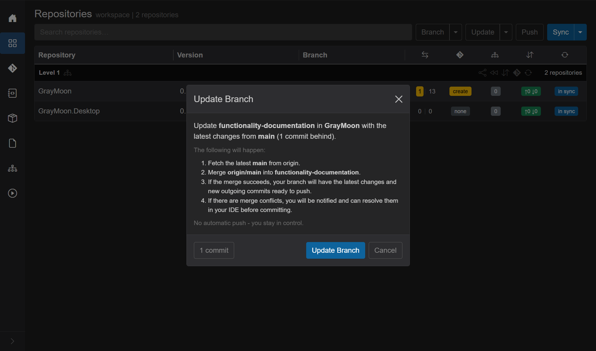
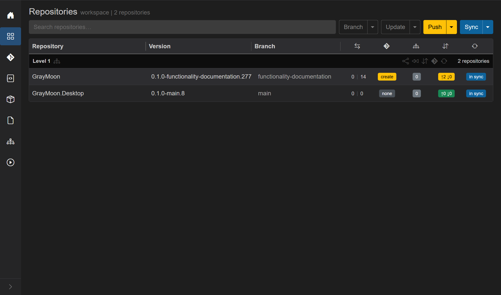
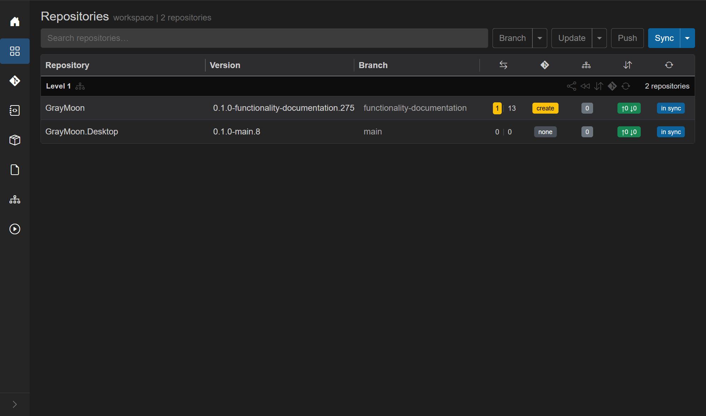

# Update branch from default

Route: Repositories (`/workspaces/{id}`), divergence badge - yellow **behind** count on a feature branch.

When any feature branch falls behind the workspace default (`main` here), GrayMoon shows a yellow number in the **behind | ahead** pair. One click opens **Update Branch**, which fetches `origin/<default>` and merges it into your **current** branch. The flow is the same for every feature branch name and every workspace that clones the repo - not only the walkthrough below. No push - you stay in control of when the merge result leaves your machine.

Primary walkthrough: **GrayMoon** (`/workspaces/1`). Branch `functionality-documentation` was **1** commit behind `main` and **13** ahead. Complementary clone of the same repos: **workspace** (`/workspaces/9`) - see [Same feature branch in another workspace](#same-feature-branch-in-another-workspace).

## Where it is

On each repository row, the divergence cell shows **`behind | ahead`** relative to the default branch (not vs upstream - that is the green `↑N ↓N` commits badge).

| Side | Meaning | Interaction on a feature branch |
| --- | --- | --- |
| **Behind** (left) | Commits on `origin/<default>` that your branch does not have yet | When **> 0**, yellow actionable button - click opens **Update Branch** |
| **Ahead** (right) | Commits on your branch that default does not have | Link to GitHub compare `default...branch` |

On the **default branch itself**, behind is not actionable for this flow (incoming from `origin/main` is a **pull**, not merge-into-self). Tag-pinned repos hide the divergence cell entirely.

## Starting state - yellow behind badge

GrayMoon is on `functionality-documentation`. Divergence shows yellow **`1`** | **`13`**: one commit landed on `main` that this feature branch does not include yet. Commits badge is still `↑0 ↓0` (local feature branch matches `origin/functionality-documentation`). Yellow **create** means no PR yet.

Tooltip on the yellow **1**: *This branch is 1 commit behind main*.

Click the yellow **behind** number (not the ahead link, not **Fetch**).

## Update Branch dialog

| Element | Purpose |
| --- | --- |
| Title | **Update Branch** |
| Lead copy | *Update **functionality-documentation** in **GrayMoon** with the latest changes from **main** (1 commit behind).* |
| Step list | What GrayMoon will do (fetch, merge, success vs conflict) |
| Footer note | *No automatic push - you stay in control.* |
| **1 commit** (outline) | Opens GitHub compare `branch...default` so you can inspect what you are about to merge in |
| **Update Branch** (primary) | Starts the job |
| **Cancel** | Closes without changing git state |

Enter confirms; Escape cancels.

## What GrayMoon does (git logic)

Agent command: `UpdateBranchFromDefault` (`UpdateBranchFromDefaultCommand`).

1. **Guard** - if `.git/MERGE_HEAD` already exists (a previous conflict left unresolved), GrayMoon refuses and tells you to finish that merge in your IDE first.
2. **Fetch** - `git fetch` from origin (default branch tip refreshed on `origin/<default>`).
3. **Merge** - `git merge --no-edit origin/<default>` into the **current** feature branch.
4. **Recount** - refresh outgoing / incoming vs upstream and behind / ahead vs default so the grid updates without waiting for a hook.

This is a normal **merge**, not rebase. History on the feature branch keeps your commits; default's tip is merged in. Fast-forward happens when git can do it; otherwise git creates a merge commit.

GrayMoon does **not**:

- Push the result
- Open or update a PR
- Rewrite `.csproj` / run Restore
- Abort an in-progress merge for you

## When the merge succeeds (no conflicts)

Click **Update Branch**. Overlay: **Updating branch in GrayMoon...** with streamed git output. Toast: *Branch updated successfully.*

After this run:

| Column | Before | After |
| --- | --- | --- |
| **Behind \| ahead** | yellow `1` \| `13` | `0` \| `14` (no longer behind; ahead grew by the merge) |
| **Commits** (`↑N ↓N`) | `↑0 ↓0` | yellow `↑2 ↓0` - merge result is local only until you push |
| **Branch** | `functionality-documentation` | unchanged |
| **PR** | yellow **create** | unchanged (still no PR) |

You now have the latest from `main` on your feature branch. Push when ready (header **Push**, or the commits badge) so origin and any open PR pick up the merge.

## Same feature branch in another workspace

Update Branch is per clone, not per GitHub branch name. A second workspace that points at the same repositories can sit on the **same** feature branch and still show yellow behind until **that** working copy merges `origin/<default>`.

Complementary example: **workspace** (`/workspaces/9`) - also GrayMoon + GrayMoon.Desktop. GrayMoon is on `functionality-documentation` with yellow **`1`** | **`13`** (Desktop stays on `main` at `0 | 0`). Same actionable behind badge as `/workspaces/1`; this clone simply has not run Update Branch yet.

Click the yellow **1**. The dialog is the same flow - it names this workspace's current branch and repo:

Lead copy: *Update **functionality-documentation** in **GrayMoon** with the latest changes from **main** (1 commit behind).* Steps, **No automatic push**, and **Update Branch** / **Cancel** match the primary walkthrough above. Confirming runs the same Agent `UpdateBranchFromDefault` merge into the current feature branch on this clone only.

## When there are merge conflicts

If git cannot merge cleanly, the Agent leaves the repo in a **merge-in-progress** state (`MERGE_HEAD` present) and returns the conflict file list.

GrayMoon shows an **error toast**, for example:

*Merge conflict in N file(s): path1, path2. Resolve the conflicts in your IDE, then commit.*

What that means for you:

1. **GrayMoon does not resolve conflicts** - open the repo in Visual Studio, Rider, VS Code, or any git UI.
2. Edit conflicted files, stage resolutions (`git add`), then **commit** the merge (your IDE's "continue merge" / commit is fine).
3. Until you commit (or `git merge --abort`), GrayMoon will refuse another **Update Branch** on that repo with: *A merge is already in progress. Resolve the conflicts in your IDE first, then commit.*
4. After you commit, use header **Fetch** or **Sync** (or wait for the Agent hook) so the grid refreshes behind / ahead and outgoing counts.
5. Then push when you want origin updated.

Conflict detection uses git's merge exit status and porcelain status (`UU`, `AA`, `DD`, and related unmerged pairs).

## When to use this vs other actions

| Goal | Use |
| --- | --- |
| Bring feature branch up to date with latest default | **Yellow behind** -> **Update Branch** (this page) |
| Discard feature work and return every clone to default | [Sync To Default](sync-to-default.md) |
| Pull teammate commits on the **same** branch | Red commits badge / header **Pull** - [incoming-commits.md](incoming-commits.md) |
| Only refresh remote tips without merging | Header **Fetch** |

## Prerequisites

- Agent connected
- Repo on a **branch** (not a tag)
- Current branch is **not** the default branch
- Behind count **> 0** (otherwise the badge is not the actionable yellow button)

## Related docs

- [Repositories - Divergence](repositories.md#divergence-behind--ahead) - badge overview
- [Sync To Default](sync-to-default.md) - abandon feature branch and checkout default
- [Switch Branch](switch-branch.md) - checkout another existing branch without merging
