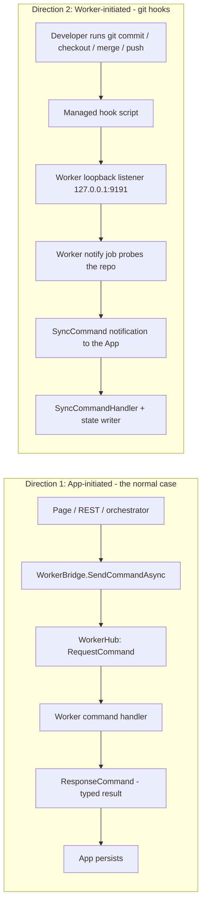
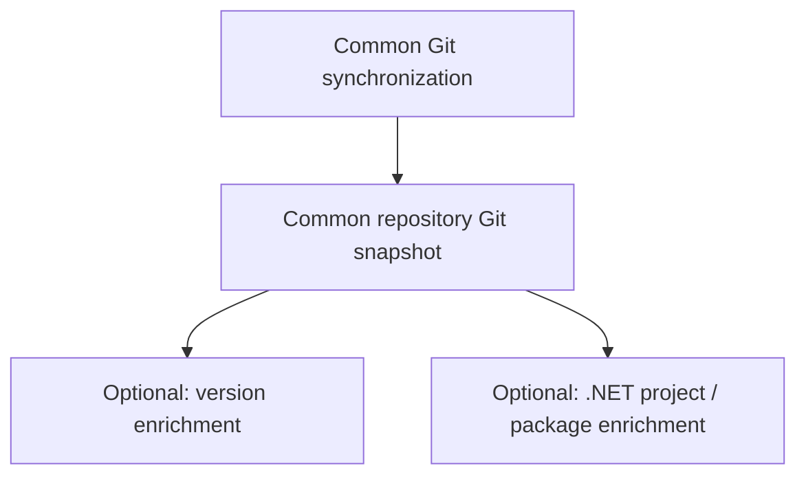

# Workspace Profiles - Design

Living design document. It describes the **implemented** design, not the original proposal. When
implementation proves an assumption wrong, this document is updated in the same change that adjusts
the code.

Companion: `Workspace-Profiles-Implementation-Plan.md` (execution state).

Status: Phase 1-2 in progress. Phases 3-6 not yet designed in detail.

---

## 1. Problem statement

GrayMoon assumes every workspace is a .NET solution-style workspace: it runs GitVersion on every
repository, scans for `.csproj` files, builds a NuGet dependency graph, orders pushes by dependency
level, and shows GitHub Actions. A user who just wants multi-repository Git (branches, Features,
pull requests, changes, workspace files) pays for all of it, and is told their repositories have an
"unresolved version" when GitVersion was never relevant.

The goal is first-class workspace types without scattering `if (workspace.Type == ...)` through the
codebase.

## 2. The three axes

GitVersion is **not** the same concern as .NET dependency management, and CI is neither. A user may
legitimately want a Basic Git workspace that still uses GitVersion, or a .NET workspace with no CI
integration. So three independent settings are persisted on `Workspace`:

```text
WorkspaceType            Basic | DotNetDependency
WorkspaceVersioningMode  None  | GitVersion
WorkspaceCiProvider      None  | GitHubActions
```

These are the **only** persisted choices. Everything else is derived (section 4). `WorkspaceCiProvider`
is an enum rather than a `UseGitHubActions` bool so a future provider needs no schema redesign.

### Defaults

| Situation | Type | Versioning | CI |
|---|---|---|---|
| Model default (fresh DB row) | `Basic` | `None` | `None` |
| Existing workspace (migration) | `DotNetDependency` | `GitVersion` | `GitHubActions` |
| New Basic workspace | `Basic` | `None` | `None` |
| New .NET Dependency workspace | `DotNetDependency` | `GitVersion` | `GitHubActions` |

The migration default is a **compatibility requirement**, not a convenience: every existing GrayMoon
workspace is assumed to be a .NET/GitVersion/GitHub Actions workspace until the user says otherwise,
and must behave exactly as it does today with no user action.

The model defaults are deliberately the opposite (`Basic`/`None`/`None`) so a brand-new database
created by `EnsureCreated()` starts clean; the application supplies the .NET triple explicitly when
the user picks that type. See section 9 for why this split matters.

## 3. Features inherit; there is no per-Feature profile

A profile is a property of the parent `Workspace`. Worktree-backed Features inherit it.

The only Feature-level metadata that exists is worktree identity - `PinnedTag`, `ParentBranchName`,
`BaseCommitSha`, `WorktreePath` - never configuration. So:

> `IWorkspaceCapabilitiesResolver` resolves by `WorkspaceId` only. It must never take a
> `WorkspaceFeatureContextId` or branch on `WorkspaceFeatureContextKind`.

This mirrors the existing `isSpecialWorkspace` convention, where the context changes only *where*
state is mirrored, never *what* is computed.

## 4. Derived capabilities

One resolver turns the three persisted values into one immutable record. Call sites ask the
capability layer, not the enum.

```csharp
public sealed record WorkspaceCapabilities(
    WorkspaceType Type,
    WorkspaceVersioningMode VersioningMode,
    WorkspaceCiProvider CiProvider)
{
    public bool UsesRepositoryVersioning => VersioningMode != WorkspaceVersioningMode.None;
    public bool UsesGitVersion          => VersioningMode == WorkspaceVersioningMode.GitVersion;
    public bool DiscoversDotNetProjects => Type == WorkspaceType.DotNetDependency;
    public bool UsesDependencyGraph     => Type == WorkspaceType.DotNetDependency;
    public bool UsesCiIntegration       => CiProvider != WorkspaceCiProvider.None;
    public bool UsesGitHubActions       => CiProvider == WorkspaceCiProvider.GitHubActions;
}
```

Capability booleans are **derived, never persisted**. If the implementation starts accumulating
`if (workspace.Type == ...)` checks in unrelated files, that is the signal to refactor toward a
strategy seam instead of adding another branch.

Capability decisions belong at orchestration and UI boundaries. Low-level Git code must not know
what a "Basic workspace" is.

## 5. How capabilities reach the Worker

This is the part of the design most likely to be got wrong, so it is written out in full.

GrayMoon has **two directions** of App/Worker traffic.



**Direction 1** covers every user-initiated operation. The App is the caller, so capabilities ride in
the request: `RepositoryOperationCapabilities` on `WorkspaceCommandRequest`, the base class every
command request already inherits.

**Direction 2** is the exception. The trigger is the developer's own `git` invocation, possibly from
the CLI with GrayMoon closed. Git runs the hook script, which POSTs
`{repositoryId, workspaceId, repositoryPath}` to the Worker's loopback listener; the Worker probes the
repository and pushes a notification *up* to the App. The App is the recipient, not the caller, so the
four hook commands have no request to read capabilities from.

The Worker resolves them instead through `IWorkspaceCapabilityProvider`, modelled directly on the
existing `WorkerTokenProvider`:

1. a per-`workspaceId` in-memory cache, warmed in `CommandDispatcher.ExecuteAsync` as a side effect of
   every inbound command that carries capabilities. Note that `WorkspaceCommandRequest` has no
   `WorkspaceId` of its own - three derived types declare their own - so warming is an explicit
   per-type list rather than a base-class check;
2. on a cold miss, `GET /workspaces/{workspaceId}/capabilities` with the worker-secret header - a new
   endpoint alongside the existing `/repos/{id}/connector`, covered by the same `WorkerSecretMiddleware`
   rule;
3. if neither is available (no `AppApiBaseUrl`, App unreachable), fall back to **today's full
   enrichment**. An existing .NET workspace must never silently lose its version because the App was
   down; a Basic workspace doing one wasted probe is the strictly safer failure direction.

The Worker therefore never queries App persistence. It asks the App's API for a typed answer, exactly
as it already does for connector tokens, and never opens the SQLite file.

A fallback answer is never cached as if it were authoritative, and a hook sync never fails because
capabilities could not be resolved.

In practice the cache is nearly always warm, because GrayMoon only installs hooks into repositories it
has synced at least once. The REST path exists for Worker restarts.

Feeding capabilities to the four hooks required one preparatory change. The checkout and merge hooks
already funnelled everything through `RepositoryStateProbe`, so each needed a single line. The commit and
push hooks called `GetVersionAsync` and `FindAsync` directly and hand-built their snapshots, so they were
converted onto the probe first - which also removed the hand-built snapshots. The pre-push hook needed
`RepositoryStateProbeOptions.IncludeCommitCounts`, because it fires before the push data is transferred
and must not report counts it cannot yet have read.

### Rejected: baking capabilities into the hook script

The hook script already embeds a JSON payload, so adding two flags looks attractive. It is wrong:

- Hook scripts are **deliberately context-agnostic**. They resolve `$(git rev-parse --show-toplevel)`
  at runtime and send the path so the *App* can attribute it to a context, specifically so no decision
  state is baked into the script. Capability flags would be exactly that decision state.
- Worktrees share the main checkout's hooks directory, and the installer skips rewriting unchanged
  content, so a profile change would leave stale flags on disk until the next successful sync of every
  repository - inventing a hook-rewrite lifecycle nothing else in the system needs.
- It duplicates a problem the repository has already solved once, for tokens.

## 6. Sync and enrichment flow

Pure Git synchronization is the baseline. Versioning and .NET discovery are optional enrichment.



The common snapshot always includes clone/fetch, current branch, current tag, tag list, default
branch, parent/default divergence, upstream state, incoming/outgoing commits, local/remote branch
lists, HEAD identity, and the managed Git hooks.

**Basic + Versioning=None requires neither GitVersion nor the .NET SDK.** No `dotnet gitversion`, and
no `dotnet tool restore` merely because sync ran. The latter needs no separate gate: the Worker's only
`dotnet tool restore` lives inside `GitService.GetVersionAsync` and is reached only after GitVersion has
already failed, so a no-op version provider removes it for free.

### Probed groups are the mechanism

`RepositoryStateSnapshot` already carries per-group `*Probed` markers, and
`WorkspaceRepositoryStateWriter` only replaces a group when its marker is `true`. A skipped enrichment
must therefore report `Probed = false`, never `Probed = true` with a null value - the latter would
clear a known version or prune every project row.

One correction was required before anything could be skipped. `SyncCommandHandler` *inferred* the
markers for notifications that arrive without a `State` snapshot:

```csharp
GitVersionProbed = n.Version != "-" || n.GitVersionFailed,
ProjectsProbed   = n.Projects is { Count: > 0 },
```

`ProjectsProbed` is wrong even today: a genuinely project-free repository is indistinguishable from one
that was never scanned.

The defect was confined to this **notification** path. The command-response path
(`WorkspaceGitService.ResponseParsing.cs`) already built honest snapshots, including a `HasProjectsBlock`
helper that exists precisely to tell an empty project list from an absent one, so no App-side work was
needed there. Four Worker call sites relied on the inference, not two: the commit and push hooks plus
`PushRepositoryCommand.SendPostOperationSyncAsync` and `UndoPushCommand.SendPostResetSyncAsync`. All four
now send an explicit `State` snapshot, as the checkout and merge hooks already did. The inference remains
only as a fallback for notifications from a Worker that predates the `State` field.

No new fields were needed on `RepositorySyncNotification`: `RepositoryStateSnapshot` already carried both
markers, so the correction reduced to making every current Worker send a `State`.

## 7. Versioning behaviour

Version state is three-valued, not two:

```text
not applicable    versioning is disabled for this workspace
provider failed   the version provider ran and could not produce a version
resolved          a version was produced
```

Today "synced but no GitVersion" means unresolved/failure: `WorkspaceRepositoryLink.IsVersionUnresolved`
is `GitVersion` empty while a branch or tag is known. Under `Versioning=None` that would render every
row as permanently broken. The fix is an explicit not-applicable state consumed by the UI, **not** a
redefinition of `IsVersionUnresolved`, whose current meaning is pinned by existing tests.

`"-"` stays a Worker wire placeholder only. It is not the domain model, and the App continues to map it
to `null`.

A Worker-side `IRepositoryVersionProvider` centralizes the decision: a GitVersion implementation and a
no-op implementation, selected from the request capabilities. Every existing GitVersion call site routes
through it, so no call site learns about workspace type.

### How the three states are actually observed

The not-applicable state is **derived**, with no new persisted column and no new enum on the link. Two
pieces make it work:

- `RepositoryVersionResult.Probed` in the Worker, surfaced on `GetRepositoryVersionResponse` as a
  nullable `versionProbed`. This separates "nothing ran" from "a provider ran and failed". A null flag
  means an older Worker and keeps the previous behaviour.
- `WorkspaceCapabilities.UsesRepositoryVersioning` on the App side, consulted at the point of
  consumption. A row is only treated as unresolved if its workspace actually versions its repositories.

Three consumers needed it: `ParseGetRepositoryVersionToStatus`, which otherwise reports `VersionMismatch`
for every row of an unversioned workspace; the version cell in `WorkspaceRepositoriesRow`, whose
three-way decision is extracted as a pure `DetermineVersionCell` method so it can be tested without
bUnit; and the workspace-level `isInSync` rollup in `WorkspaceGitService.SyncAsync`, which would
otherwise mark an unversioned workspace permanently out of sync.

Two further readers treat an absent version as a problem but are **not** version-display issues and are
deliberately left to Unit C, which must stop producing dependency state for a Basic workspace at all:
the unmatched-dependency counts in `WorkspaceProjectRepository.DependencyStats.cs` and
`DependencyLines.cs`.

### Every version entry point

| Entry point | Trigger |
|---|---|
| `SyncRepositoryCommand` | manual / bulk Sync |
| `RefreshRepositoryVersionCommand` | single-repo refresh version |
| `GetRepositoryVersionCommand` | sync-status poll |
| `GetGitVersionAtDefaultTipCommand` | **Feature-only**, see below |
| `CommitSyncRepositoryCommand` | commit sync (pull/push orchestration) |
| `PushRepositoryCommand` | post-push notification |
| `CommitHookSyncCommand` | post-commit / post-update hook |
| `CheckoutHookSyncCommand` | post-checkout hook |
| `MergeHookSyncCommand` | post-merge hook |
| `PushHookSyncCommand` | pre-push hook (immediate + deferred) |
| `RepositoryStateProbe` | shared probe, gated by `IncludeGitVersion` |

`GrayMoon.App/Services/Git/GitVersionCommandService.cs` has no callers. It is left untouched rather than
opportunistically deleted.

### The Feature-only default-tip path

`WorkspaceGitService.Sync.cs` calls `ApplyDefaultTipVersionsForMergedFeatureReposAsync` after **every**
Feature-context sync. It returns early for the special Workspace, then issues `GetGitVersionAtDefaultTip`
for each repository with a merged PR and overwrites that context's `GitVersion`. This exists so Update
Dependencies can write default-branch version strings without checking out the default branch.

It has no Workspace-context equivalent, so it does not appear when tracing Workspace sync. Without
gating, a Basic Feature would run GitVersion behind the user's back. It is gated on
`UsesRepositoryVersioning`.

Its known behaviour - a default-branch-tip version can mismatch a real Feature checkout - is accepted
and documented elsewhere. Gating must not silently change it.

## 8. .NET dependency behaviour

The existing dependency engine is reused behind a capability boundary, not rewritten. It covers
`.csproj` discovery, `WorkspaceProject` reconciliation, project/package classification, NuGet
`PackageReference` discovery, generated/virtual packages, dependency edges, dependency levels, unmatched
dependencies, dependency-aware update, package restore, registry synchronization, synchronized push, the
repository-grid dependency counters, the dependency graph, and the Projects/Packages pages.

Basic workspaces must not **produce** this state, rather than producing it and hiding it. In particular
Basic must not gain synthetic NuGet packages or dependency levels merely because a version file is
configured, and must not be presented as "Level 0" or "No dependencies" - levels are simply not part of
that profile.

Detailed design: Phase 3, not yet written.

## 9. Persistence and migration

Schema is owned by EF Core but applied through `EnsureCreated()` for new databases and guarded,
idempotent `Migrate*Async` methods for existing ones. Per `CLAUDE.md`, a schema change requires the
entity update, the `OnModelCreating` block, **and** a new migration method called from `RunAllAsync`;
new columns must be nullable or defaulted; a shipped migration method is never deleted.

```text
MigrateWorkspaceProfileColumnsAsync
  guard   pragma_table_info('Workspaces') - add each column only when absent
  backfill  UPDATE Workspaces SET Type=1, VersioningMode=1, CiProvider=1
```

The backfill runs **only on the branch that just created the columns**. An unconditional update would
stomp a user who deliberately switched a workspace to Basic, on the next startup. This is why the model
default is `Basic`/`None`/`None` while the migration default is the .NET triple: the two defaults serve
different populations and must not be conflated.

Workspace type is never inferred from whether projects currently exist. A .NET workspace may legitimately
have none right now.

## 10. UX

Simplicity is a requirement. The profile adds **three controls to the existing workspace modal and
nothing else** - no workspace-settings page, no capability matrix, no new list badges, no new UI
primitives.

```text
Workspace Name     [existing]
Workspace Path     [existing, read-only]

Workspace type
  ( ) Basic              Git repositories, branches, Features, pull requests, changes and files.
  (o) .NET Dependency    Adds .NET projects, NuGet packages, dependency levels and package-aware push.

[x] Calculate versions with GitVersion
[x] GitHub Actions
```

- The type picker is a plain `form-check` radio pair with one muted description line per option.
- The two settings are plain checkboxes. Choosing a type sets both to that type's defaults (Basic clears
  them, .NET Dependency checks both); the user may then override either. Three independent persisted
  axes, one decision to make.
- Help text is inline muted text. These modals use no tooltips or info popovers anywhere, and per
  `CLAUDE.md` short labels get `text-nowrap`.

### Changing the type later

Type changes are **blocked while the workspace has Features**, reusing the existing disabled-field
mechanism and wording ("Rename and root changes are not possible while Features exist. Remove Features
first."). GrayMoon already freezes repository membership and name/root edits under exactly this rule, so
this is consistent rather than new - and it removes most of the profile-transition lifecycle problem
instead of solving it.

Remaining transition behaviour (Basic to .NET activating discovery, .NET to Basic retiring derived state,
versioning toggles invalidating stale version display) is Phase 6.

## 11. Page and navigation rules

Page availability is a capability question, resolved centrally; individual pages do not invent their own
workspace-type checks, and direct navigation cannot bypass the rules.

| Page | Enabled by |
|---|---|
| Repositories | always |
| Changes | always |
| Files | always |
| Projects | `.NET Dependency` |
| Packages | `.NET Dependency` |
| Dependencies | `.NET Dependency` |
| Actions | `GitHub Actions` |

`Actions` depends on the **CI provider**, not the workspace type. GitHub source control and GitHub
Actions are separate capabilities: a workspace may use GitHub repositories and pull requests while using
another CI provider or none.

The **Files** page stays available to Basic. It is a catalog of arbitrary files in linked repositories,
not a .NET feature - its own token syntax proves it (`{@Repo:branch}` and `{@Repo:commit}` need no
`.csproj`). Only the default `{@Repo}` GitVersion token requires versioning to be enabled.

Capability badges belong in documentation and settings copy, not in the running left navigation, which
should simply contain the pages currently available.

Detailed design: Phase 5.

## 12. Feature and worktree implications

- Capabilities resolve by `WorkspaceId` only (section 3).
- Hook scripts stay context-agnostic (section 5). `WorkspaceHookContextAttributor` keeps skipping
  unmatched and ambiguous paths rather than defaulting them to the Workspace.
- `CreateGitWorktreeCommand` rewrites the main checkout's hooks **before** `git worktree add`, so the new
  worktree's `post-checkout` is attributed correctly. That ordering is preserved.
- Hook installation was gated on a version existing (`version != "-"`). A Basic+None workspace resolves
  no version, so it would silently never get hooks. The gate is removed.
- Context-scoped reads and writes keep their existing rules: Feature contexts read and write
  `WorkspaceRepositoryContextState` and never fall back to the shared link row; writes mirror onto the
  shared link only for the special Workspace.

## 13. Non-goals

- Workspace-as-Git-repository. Workspace type and repository role stay orthogonal; a future workspace
  repository must be able to participate in common Git behaviour without joining dependency discovery.
- Any CI provider other than GitHub Actions. Only the seam is established.
- Any workspace type other than Basic and .NET Dependency.
- A plugin framework, reflection-based provider discovery, or a DI graph built around individual
  capability booleans.
- Renaming the GitHub-specific subsystems. Existing GitHub-specific persistence may stay
  GitHub-specific behind the provider boundary.
- Unrelated cleanup and refactoring.

## 14. Tradeoffs and rejected alternatives

| Decision | Rejected alternative | Why |
|---|---|---|
| Worker pulls capabilities from the App API on hook paths | Bake flags into the hook script payload | Hook scripts are deliberately context-agnostic; flags go stale until every repo re-syncs; duplicates the solved token problem (section 5) |
| Three persisted enums | One `WorkspaceType` with GitVersion and CI implied | GitVersion and CI are genuinely independent concerns; a Basic workspace may want GitVersion |
| `WorkspaceCiProvider` enum | `UseGitHubActions` bool | A bool forces a schema redesign for the second provider |
| Derived capability record | Persisted capability booleans | Boolean soup; multiple sources of truth |
| Explicit not-applicable version state | Redefine `IsVersionUnresolved` | Its current meaning is pinned by existing tests and legacy readers |
| Block type change while Features exist | Full bidirectional transition lifecycle for Features | Matches the existing membership/rename freeze; removes the problem rather than solving it |
| Model default `Basic`, migration default `.NET` | Same default in both places | New databases should start clean; existing rows must preserve today's behaviour |
| Fall back to full enrichment when the App is unreachable | Fall back to Git-only | Losing a known version is worse than one wasted probe |

## 15. Future extension notes

The seams are sized for the next plausible addition, not for a general plugin system:

- **another workspace type** (Node, CMake) - add an enum value and a discovery/enrichment capability;
  the common Git snapshot is already shared.
- **another version provider** - add an `IRepositoryVersionProvider` implementation; no call site
  changes.
- **another CI provider** - add an enum value behind the CI provider boundary; page availability already
  follows the CI capability rather than the workspace type.

`WorkspaceFeature.BaseKind` / `BaseWorkspaceFeatureId` exist but are unused - a reserved "based on
another Feature" hierarchy. Profile inheritance must not be built in a way that collides with it.
