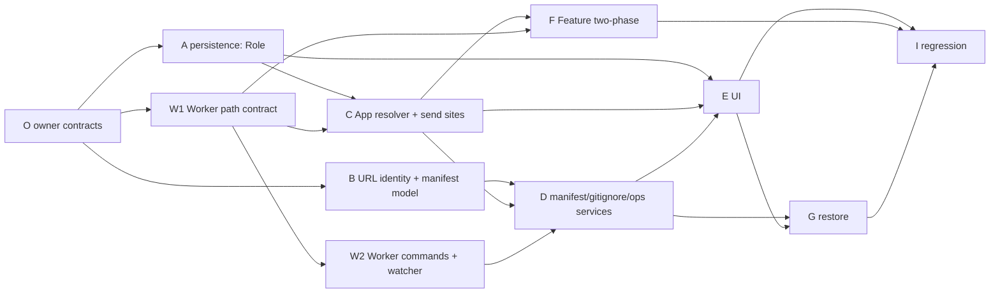

# Workspace as a Git Repository - Implementation Plan

Living execution document. Three documents define this feature:

| Document | Role |
|---|---|
| `GrayMoon-Workspace-As-Git-Repository-Design-v3.md` | Architecture and invariants |
| `Workspace-Repository-Design-Supplement-v3.1.md` | Binding decisions D1-D15 that make v3 implementable. Wins over v3. |
| this file | State, sequencing, exact steps per unit |

It must be possible to stop work here and resume later without reconstructing state from chat history.

**Statuses:** `TODO` `READY` `IN PROGRESS` `BLOCKED` `REVIEW` `DONE`

---

## Overall status

| | |
|---|---|
| Project status | READY |
| Current phase | Wave 0 complete (Unit O DONE). Wave 1 (A, W1, B) is READY to start |
| Units planned in detail | O, A, W1, B, C, W2, D, E, F, G, I |
| Last verified | 2026-10-06, after Unit O on `c0bfb2a` + O: `dotnet build GrayMoon.slnx` 0 warnings; App 1007/1007, Worker 320/320 + 1 pre-existing skip, Common 236/236. The baseline moved from `f7f94ce` (App 999, Worker 318) to `c0bfb2a` because `origin/main` (Worker Windows-service password change) was merged into this branch; the owner accepted the new numbers. Original plan baseline `f7f94ce`: `dotnet build GrayMoon.slnx` 0 warnings; App 999/999, Worker 318 + 1 pre-existing skip, Common 236/236. Every file path named in the units was checked to exist. |

**What works today.** Nothing of this feature. A Workspace is a folder containing one subfolder per repository; the Worker derives every repository path as `<root>\<WorkspaceName>\<RepositoryName>`; Features create one worktree per repository under `<FeatureStorageRoot>\<Feature>\<RepositoryName>`.

**What "done" looks like.** A Workspace can name one of its imported GitHub repositories as its Workspace repository. That repository's working tree is the Workspace root; it appears first in the Repositories grid with a `Workspace` badge and full Git actions; it is always the root worktree of every Feature; `.graymoon.json` and the managed `.gitignore` section are written to it by the Worker and show up in Git Changes; a second computer can restore the Workspace from that repository by URL matching alone.

---

## Reading list per unit (do not read more than this)

Every unit reads, in this order, and nothing else unless the unit's "Files to read" says so:

1. `CLAUDE.md` sections: Coding conventions, Architecture (first two bullets), Database schema, DbContext lifetime.
2. `AGENTS.md` sections: DbContext handling, Feature-context scoping, Never commit or push.
3. `Workspace-Repository-Design-Supplement-v3.1.md` - only the decisions listed in the unit's "Decisions" row.
4. This file: "Rules for agents", "Handoff template", and the unit's own section.
5. The unit's "Files to read" list.

Reading v3 in full is for the owner. A unit that needs a v3 section is told which one.

---

## Unit map



| Wave | Units | Parallel? | Why |
|---|---|---|---|
| 0 | O | no | Shared contracts. Everything compiles against them. |
| 1 | A, W1, B | yes, file-disjoint | A is App persistence, W1 is Worker only, B is Common + Application + App/Services/WorkspaceManifest. |
| 2 | C, W2 | yes | C touches App send sites; W2 touches Worker commands and watcher. |
| 3 | D | no | First unit that can create a Workspace-role link end to end. Needs B, C, W2. |
| 4 | E, F | yes | E is Razor pages and query DTOs; F is `WorkspaceFeatureOperations` only. |
| 5 | G | no | Restore is UI + ops; waits for E. |
| 6 | I | no | Regression, docs, manual pass. |

**Deployment rule.** W1 must be released in a Worker before any user can enable a Workspace repository (D2). The App refuses to enable until the connected Worker reports `supportedFeatures` containing `workspaceRepository`.

---

## Rules for agents

These are written for an agent with limited context. Follow them literally.

1. Read only what the "Reading list per unit" says. Do not open `WorkspaceFeatureOperations.cs` unless you are Unit F.
2. Edit only files in your unit's "Files owned". If you need a change in another file, write it under "Discoveries" in this plan and stop that step; do not make the change.
3. Do not create a new abstraction when the unit names one. Use the exact type, file and member names written here.
4. Every new C# file: CRLF line endings, `sealed` classes, primary constructors, ASCII hyphen only (no U+2013 / U+2014 anywhere, including comments and Markdown).
5. Every schema change needs both the entity configuration in `AppDbContext*.cs` and a strict migration step in `Migrations.StrictSteps`. Never delete or renumber a shipped step.
6. Never inject `AppDbContext` into a Blazor page; use `IDbContextFactory<AppDbContext>`.
7. Before handoff run exactly the commands in the unit's "Acceptance" row. Paste the result counts into the unit's "Handoff log".
8. Never run `git commit` or `git push`. End your reply with a one-line commit message in a fenced block.
9. If a step cannot be done as written, set the unit status to `BLOCKED`, write why under the unit's "Handoff log", and stop. Do not improvise a different design.
10. Do not refactor, rename or clean up anything the steps do not mention.
11. When a step says "replace X with Y in every file", first run the given search command, record the count, do the replacements, re-run the search and confirm the count is zero (or the stated remainder).
12. Update this file before handoff: status, handoff log, discoveries, follow-ups.

### Hot files - one unit at a time

```text
src/GrayMoon.App/Services/Features/WorkspaceFeatureOperations.cs     Unit F only
src/GrayMoon.App/Services/Features/WorkspaceContextPathResolver.cs   Unit C only
src/GrayMoon.App/Data/AppDbContext.cs                                Unit A only (link block), Unit D (Workspace block)
src/GrayMoon.App/Migrations.cs                                       Unit A (step 5), Unit D (step 6)
src/GrayMoon.App/Program.cs                                          DI registration lines only; one unit at a time
src/GrayMoon.Worker/Services/CommandDispatcher.cs                    Unit W2 only
src/GrayMoon.Worker/Services/CommandJobFactory.cs                    Unit W2 only
src/GrayMoon.Abstractions/Worker/WorkerHubMethods.cs                 Unit O only
src/GrayMoon.App/Components/Pages/WorkspaceRepositories.*            Unit E only
```

### Handoff template

Copy this under the unit's "Handoff log" and fill every line:

```text
Date:
Status after this handoff:
Files changed (full paths):
Search counts before/after (for replace-all steps):
Build: dotnet build GrayMoon.slnx -> warnings: N, errors: N
Tests: App X/X, Worker X/X (+skipped), Common X/X   (only the suites the unit says to run)
New tests added (names):
Deviations from the steps (and why):
Discoveries (coupling, surprises, things that look wrong but were left alone):
Follow-ups for the owner:
Commit message:
```

### Standard commands

```powershell
dotnet build GrayMoon.slnx
dotnet test src/GrayMoon.App.Tests/GrayMoon.App.Tests.csproj
dotnet test src/GrayMoon.Worker.Tests/GrayMoon.Worker.Tests.csproj
dotnet test src/GrayMoon.Common.Tests/GrayMoon.Common.Tests.csproj
# one test class
dotnet test src/GrayMoon.App.Tests/GrayMoon.App.Tests.csproj --filter "FullyQualifiedName~WorkspaceRepositoryRoleMigrationTests"
# non-ASCII dash check over the files you touched (should print nothing)
Select-String -Path <file> -Pattern "[\u2013\u2014]"
```

---

## Unit O - Owner: contracts and documents

| | |
|---|---|
| Owner | owner |
| Status | DONE |
| Dependencies | none |
| Decisions | D1, D2, D4, D5, D15 |

**Scope.** Create every shared type the other units compile against, with no behaviour. Keep the three documents current.

**Files owned.**

```text
docs/workspace-repository/*.md
src/GrayMoon.App/Models/WorkspaceRepositoryRole.cs                         (new)
src/GrayMoon.Application/Features/WorkerWorkspaceArgs.cs                   (new)
src/GrayMoon.Application/Features/IWorkspaceContextPathResolver.cs         (signature change only)
src/GrayMoon.Application/WorkspaceManifest/WorkspaceManifest.cs            (new, records)
src/GrayMoon.Application/WorkspaceManifest/IWorkspaceManifestService.cs    (new)
src/GrayMoon.Application/WorkspaceManifest/WorkspaceManifestDrift.cs       (new, record)
src/GrayMoon.Application/Workspaces/IWorkspaceRepositoryOperations.cs      (new)
src/GrayMoon.Abstractions/Worker/WorkerHubMethods.cs                       (two constants)
src/GrayMoon.Abstractions/Worker/WorkerFeatures.cs                         (new)
```

**Steps.**

1. `WorkspaceRepositoryRole.cs`:

   ```csharp
   namespace GrayMoon.App.Models;

   /// <summary>Role of a repository inside one Workspace. Persisted as int on WorkspaceRepositories.Role.</summary>
   public enum WorkspaceRepositoryRole
   {
       Source = 0,
       Workspace = 1
   }
   ```

2. `WorkerWorkspaceArgs.cs` exactly as in D1 step 4. **Do not change the existing `GetWorkerWorkspaceArgsAsync`.** Add a second method to `IWorkspaceContextPathResolver`:

   ```csharp
   /// <summary>Worker path arguments plus the Workspace-role repository name (null when none). Replaces GetWorkerWorkspaceArgsAsync; Unit C migrates every caller and then deletes the tuple method.</summary>
   Task<WorkerWorkspaceArgs> GetWorkerArgsAsync(WorkspaceFeatureContextId contextId, CancellationToken cancellationToken = default);
   ```

   and in `WorkspaceContextPathResolver` implement it for now as `new WorkerWorkspaceArgs(root, folder, null)` built from the existing tuple method. The build stays green between every wave; a red build is never "expected" in this plan. (Decision: green-build option chosen, 2026-10-06.)

3. `WorkspaceManifest.cs` - sealed records matching D15, all properties `init`:

   ```csharp
   namespace GrayMoon.Application.WorkspaceManifest;

   public sealed record WorkspaceManifest(
       int SchemaVersion,
       WorkspaceManifestWorkspace Workspace,
       IReadOnlyList<WorkspaceManifestConnector> Connectors,
       IReadOnlyList<WorkspaceManifestRepository> Repositories);

   public sealed record WorkspaceManifestWorkspace(string Name, WorkspaceManifestProfile Profile);
   public sealed record WorkspaceManifestProfile(string Type, string Versioning, string Ci);
   public sealed record WorkspaceManifestConnector(string Type, string Url);
   public sealed record WorkspaceManifestRepository(string Name, string RepositoryUrl, string ConnectorUrl);
   ```

4. `WorkspaceManifestDrift.cs`:

   ```csharp
   public sealed record WorkspaceManifestDrift(
       bool HasDrift,
       string? ParseError,
       IReadOnlyList<string> AddedRepositories,      // in file, not in database
       IReadOnlyList<string> RemovedRepositories,    // in database, not in file
       IReadOnlyList<string> ChangedProfileFields,
       IReadOnlyList<string> AddedConnectors,
       IReadOnlyList<string> RemovedConnectors);
   ```

5. `IWorkspaceManifestService.cs`:

   ```csharp
   public interface IWorkspaceManifestService
   {
       Task<WorkspaceManifest> BuildFromDatabaseAsync(int workspaceId, CancellationToken cancellationToken = default);
       string Serialize(WorkspaceManifest manifest);
       bool TryParse(string content, out WorkspaceManifest? manifest, out string? error);
       Task<OperationResult> WriteAuthoritativeManifestAsync(int workspaceId, CancellationToken cancellationToken = default);
       Task<OperationResult> WriteManagedGitIgnoreAsync(int workspaceId, CancellationToken cancellationToken = default);
       Task<WorkspaceManifestDrift> DetectDriftAsync(int workspaceId, CancellationToken cancellationToken = default);
   }
   ```

   `OperationResult` already exists in `GrayMoon.Application`.

6. `IWorkspaceRepositoryOperations.cs`:

   ```csharp
   public interface IWorkspaceRepositoryOperations
   {
       /// <summary>Links repositoryId as the Workspace repository and attaches it to the root (D4), then writes manifest and .gitignore (D5, D12).</summary>
       Task<OperationResult> EnableWorkspaceRepositoryAsync(int workspaceId, int repositoryId, IProgress<OperationProgress>? progress = null, CancellationToken cancellationToken = default);
       /// <summary>Removes the Workspace-role link only. Never deletes files or .git.</summary>
       Task<OperationResult> DisableWorkspaceRepositoryAsync(int workspaceId, CancellationToken cancellationToken = default);
       Task<RestoreWorkspaceResult> RestoreFromRepositoryAsync(int repositoryId, string workspaceName, IProgress<OperationProgress>? progress = null, CancellationToken cancellationToken = default);
   }

   public sealed record RestoreWorkspaceResult(
       bool Success,
       int? WorkspaceId,
       string? Error,
       IReadOnlyList<string> UnresolvedConnectorUrls,
       IReadOnlyList<string> UnresolvedRepositoryUrls);
   ```

7. `WorkerHubMethods.cs`: add `public const string AttachWorkspaceRepository = "AttachWorkspaceRepository";` and `public const string WriteRepositoryFile = "WriteRepositoryFile";`.

8. `WorkerFeatures.cs`:

   ```csharp
   namespace GrayMoon.Abstractions.Worker;

   public static class WorkerFeatures
   {
       public const string WorkspaceRepository = "workspaceRepository";
   }
   ```

**Acceptance.** `dotnet build GrayMoon.slnx` green, 0 warnings. All three suites unchanged (App 999, Worker 318 + 1 skipped, Common 236).

**Handoff log.**

```text
Date: 2026-10-06
Status after this handoff: DONE
Files changed (full paths):
  src/GrayMoon.App/Models/WorkspaceRepositoryRole.cs (new)
  src/GrayMoon.Application/Features/WorkerWorkspaceArgs.cs (new)
  src/GrayMoon.Application/Features/IWorkspaceContextPathResolver.cs (GetWorkerArgsAsync added; tuple method kept)
  src/GrayMoon.App/Services/Features/WorkspaceContextPathResolver.cs (GetWorkerArgsAsync wraps the tuple method, null name)
  src/GrayMoon.Application/WorkspaceManifest/WorkspaceManifest.cs (new)
  src/GrayMoon.Application/WorkspaceManifest/IWorkspaceManifestService.cs (new)
  src/GrayMoon.Application/WorkspaceManifest/WorkspaceManifestDrift.cs (new)
  src/GrayMoon.Application/Workspaces/IWorkspaceRepositoryOperations.cs (new)
  src/GrayMoon.Abstractions/Worker/WorkerHubMethods.cs (two constants)
  src/GrayMoon.Abstractions/Worker/WorkerFeatures.cs (new)
  docs/workspace-repository/Workspace-Repository-Implementation-Plan.md (status)
Search counts before/after (for replace-all steps): n/a
Build: dotnet build GrayMoon.slnx -> warnings: 0, errors: 0
Tests: App 1007/1007, Worker 320/320 (+1 skipped), Common 236/236
New tests added (names): none (contracts only)
Deviations from the steps (and why): none. Baseline numbers differ from the plan header (see Overall status).
Discoveries (coupling, surprises, things that look wrong but were left alone): none. WorkspaceContextPathResolver is the only implementer of IWorkspaceContextPathResolver.
Follow-ups for the owner: none
Commit message: Add the contracts for the Workspace repository feature
```

---

## Unit A - Persistence: `Role` on `WorkspaceRepositoryLink`

| | |
|---|---|
| Owner | subagent |
| Status | TODO |
| Dependencies | O |
| Decisions | none beyond v3 section 7 |

**Files to read.** `src/GrayMoon.App/Models/WorkspaceRepositoryLink.cs`, `src/GrayMoon.App/Data/AppDbContext.cs` lines 160-220, `src/GrayMoon.App/Migrations.cs` lines 1-120 and 405-460, `src/GrayMoon.App.Tests/WorkspaceProfileMigrationTests.cs` (pattern to copy).

**Files owned.**

```text
src/GrayMoon.App/Models/WorkspaceRepositoryLink.cs
src/GrayMoon.App/Data/AppDbContext.cs                      (WorkspaceRepositoryLink block only)
src/GrayMoon.App/Migrations.cs                             (StrictSteps entry 5 + one new method)
src/GrayMoon.App/Repositories/WorkspaceRepository.cs       (role guards only, see step 5)
src/GrayMoon.App.Tests/WorkspaceRepositoryRoleMigrationTests.cs   (new)
src/GrayMoon.App.Tests/WorkspaceRepositoryRoleGuardTests.cs       (new)
```

**Steps.**

1. Add to `WorkspaceRepositoryLink`, after `RepositoryId`/`Repository`:

   ```csharp
   /// <summary>Source (default) or Workspace. At most one Workspace-role link per Workspace (filtered unique index).</summary>
   public WorkspaceRepositoryRole Role { get; set; } = WorkspaceRepositoryRole.Source;
   ```

   Add `Role = Role,` to `WithBranchOverride`.

2. In the `WorkspaceRepositoryLink` entity block of `AppDbContext.OnModelCreating` add:

   ```csharp
   entity.Property(wr => wr.Role)
       .HasConversion<int>()
       .HasDefaultValue(WorkspaceRepositoryRole.Source);

   entity.HasIndex(wr => wr.WorkspaceId)
       .IsUnique()
       .HasFilter("\"Role\" = 1")
       .HasDatabaseName("IX_WorkspaceRepositories_WorkspaceId_WorkspaceRole");
   ```

3. In `Migrations.cs` append to `StrictSteps`:

   ```csharp
   (5, "Workspace repository role", dbContext => MigrateWorkspaceRepositoryRoleAsync(dbContext)),
   ```

   and add, copying the shape of `MigrateWorkspaceProfileColumnsAsync` (no try/catch):

   ```csharp
   public static async Task MigrateWorkspaceRepositoryRoleAsync(AppDbContext dbContext, ILogger? logger = null)
   {
       var conn = dbContext.Database.GetDbConnection();
       if (conn.State != ConnectionState.Open)
           await conn.OpenAsync();

       await using (var checkCmd = conn.CreateCommand())
       {
           checkCmd.CommandText = "SELECT COUNT(*) FROM pragma_table_info('WorkspaceRepositories') WHERE name = 'Role'";
           if (Convert.ToInt32(await checkCmd.ExecuteScalarAsync()) == 0)
           {
               await using var alterCmd = conn.CreateCommand();
               alterCmd.CommandText = "ALTER TABLE WorkspaceRepositories ADD COLUMN Role INTEGER NOT NULL DEFAULT 0";
               await alterCmd.ExecuteNonQueryAsync();
           }
       }

       await using var indexCmd = conn.CreateCommand();
       indexCmd.CommandText =
           "CREATE UNIQUE INDEX IF NOT EXISTS IX_WorkspaceRepositories_WorkspaceId_WorkspaceRole " +
           "ON WorkspaceRepositories(WorkspaceId) WHERE Role = 1";
       await indexCmd.ExecuteNonQueryAsync();
   }
   ```

4. Tests `WorkspaceRepositoryRoleMigrationTests` (copy the fixture style of `WorkspaceProfileMigrationTests`, including the `ALTER TABLE ... DROP COLUMN` trick to simulate the old shape):
   - `Existing_links_get_Role_Source_after_migration`
   - `Migration_is_idempotent`
   - `Second_Workspace_role_link_in_same_workspace_is_rejected_by_index` (insert two rows with Role=1 and same WorkspaceId; expect `DbUpdateException`)
   - `Workspace_role_links_in_different_workspaces_coexist`
   - `Fresh_database_has_filtered_index` (query `sqlite_master` for the index name)

5. In `WorkspaceRepository.cs`, inside `ReplaceRepositoriesCoreAsync` right after the `current` list is loaded, add: a `Role == Workspace` link is never removed by membership replacement. Concretely, exclude Workspace-role rows from `toRemove` and never add a repository as Source if it is already the Workspace-role repository (skip it). Write `WorkspaceRepositoryRoleGuardTests`:
   - `Replace_membership_never_removes_workspace_role_link`
   - `Replace_membership_skips_repository_that_is_the_workspace_repository`

**Acceptance.** Build clean. `GrayMoon.App.Tests` all green. Run the whole App suite, not only the new classes.

**Non-goals.** No UI, no path changes, no Worker changes, no way yet to set `Role = Workspace` from the UI.

**Handoff log.**

```text
(empty)
```

---

## Unit W1 - Worker path contract and compatibility flag

| | |
|---|---|
| Owner | subagent |
| Status | REVIEW |
| Dependencies | O |
| Decisions | D1, D2, D6 |

**Files to read.** `src/GrayMoon.Worker/Jobs/Requests/WorkspaceCommandRequest.cs`, `src/GrayMoon.Worker/Commands/SyncRepositoryCommand.cs` lines 1-60 and 150-170, `src/GrayMoon.Worker/Commands/GetHeadCommitsCommand.cs`, `src/GrayMoon.Worker/Commands/RefreshRepositoryProjectsCommand.cs`, `src/GrayMoon.Worker/Services/RepositoryStateProbe.cs`, `src/GrayMoon.Worker/Jobs/Response/GetHostInfoResponse.cs`, `src/GrayMoon.Worker/Commands/GetHostInfoCommand.cs`.

**Files owned.**

```text
src/GrayMoon.Worker/Jobs/Requests/WorkspaceCommandRequest.cs
src/GrayMoon.Worker/Services/WorkerRepositoryPaths.cs                 (new)
src/GrayMoon.Worker/Commands/*.cs                                     (path line and discoverProjects line only)
src/GrayMoon.Worker/Services/RepositoryStateProbe.cs                  (discoverProjects gate only)
src/GrayMoon.Worker/Services/WorkspaceFileSearchService.cs            (nested repo exclusion)
src/GrayMoon.Worker/Jobs/Response/GetHostInfoResponse.cs
src/GrayMoon.Worker/Commands/GetHostInfoCommand.cs
src/GrayMoon.Worker.Tests/WorkerRepositoryPathsTests.cs               (new)
src/GrayMoon.Worker.Tests/WorkspaceRepositoryDiscoveryGateTests.cs    (new)
```

**Steps.**

1. Add `WorkspaceRepositoryName` to `WorkspaceCommandRequest` exactly as in D1 step 1.

2. Create `WorkerRepositoryPaths.cs` exactly as in D1 step 2.

3. Record the baseline count:

   ```powershell
   (Select-String -Path src/GrayMoon.Worker/Commands/*.cs -Pattern 'Path\.Combine\(workspacePath, (repositoryName|repoName|name)\)').Count
   ```

   Expected about 35. Replace each with `WorkerRepositoryPaths.Resolve(workspacePath, <sameVariable>, request.WorkspaceRepositoryName)`. In handlers where the request variable is not named `request`, use that handler's name for it. In `GetHeadCommitsCommand` the loop variable is `repoName`; the request is the method parameter. In `GetWorkspaceRepositoriesCommand` **do not change** `Path.Combine(workspacePath, name)` - that command lists children. Re-run the search; expected remainder: 1 (`GetWorkspaceRepositoriesCommand`).

4. Discovery gate (D6). In `SyncRepositoryCommand` (line ~157), `RefreshRepositoryProjectsCommand` (line ~19), `PushRepositoryCommand` (line ~150) and `CommitSyncRepositoryCommand`, replace the read of `ShouldDiscoverProjects` with:

   ```csharp
   var discoverProjects = request.EffectiveCapabilities.ShouldDiscoverProjects
       && !WorkerRepositoryPaths.IsWorkspaceRepository(repositoryName, request.WorkspaceRepositoryName);
   ```

   and use `discoverProjects` where the old expression was used. For `RepositoryStateProbe`, add a `bool isWorkspaceRepository` parameter to the probe method that reads `capabilities.ShouldDiscoverProjects` (line ~22) and AND it the same way; update its callers (the four hook sync commands) to pass `WorkerRepositoryPaths.IsWorkspaceRepository(repositoryName, request.WorkspaceRepositoryName)`. Hook requests: hooks post repository paths, not names; if a hook sync command has no `request.WorkspaceRepositoryName` available, pass `false` and write a Discovery note: "hook sync for the Workspace repository still discovers projects; App-side projection ignores it because Unit E hides projects for Role == Workspace". This is acceptable for v1.

5. `WorkspaceFileSearchService` (Worker): when searching a repository folder, skip immediate child directories that contain `.git` (file or directory). Reuse the `HasGitMetadata` logic from `GetWorkspaceRepositoriesCommand` by moving it into `WorkerRepositoryPaths.HasGitMetadata(string path)` and calling it from both.

6. `GetHostInfoResponse`: add

   ```csharp
   [JsonPropertyName("supportedFeatures")]
   public List<string>? SupportedFeatures { get; set; }
   ```

   `GetHostInfoCommand`: set `SupportedFeatures = [WorkerFeatures.WorkspaceRepository]`.

7. Tests:
   - `WorkerRepositoryPathsTests`: `Resolve_returns_subfolder_when_no_workspace_repository`, `Resolve_returns_workspace_path_for_workspace_repository_case_insensitive`, `Resolve_returns_subfolder_for_other_repository_when_workspace_repository_set`, `HasGitMetadata_true_for_dir_and_file`.
   - `WorkspaceRepositoryDiscoveryGateTests`: run `SyncRepositoryCommand` with a fake `IGitService`/`ICsProjFileService` (copy the fake style from `ReturnToDefaultBranchCommandTests`) and assert that for `repositoryName == workspaceRepositoryName` the csproj service is never called and `Projects` is null, while for another name it is called.
   - `GetHostInfoCommand` test: response contains `workspaceRepository`.

**Acceptance.** Build clean. `GrayMoon.Worker.Tests` all green. Search remainder from step 3 is exactly 1.

**Non-goals.** No new commands (W2). No watcher change (W2). No App change.

**Handoff log.**

```text
Date: 2026-10-06
Status after this handoff: REVIEW
Decision: the owner approved extending W1's owned files with src\GrayMoon.Worker\Abstractions\IRepositoryStateProbe.cs, src\GrayMoon.Worker\Services\RepositoryStateProbe.cs and Worker.Tests probe stubs, to finish the step 4 probe gate.
Files changed (full paths), all under C:\Users\matth\.graymoon\GrayMoon\features\workspace-as-git-repository\W1\:
  src\GrayMoon.Worker\Jobs\Requests\WorkspaceCommandRequest.cs
  src\GrayMoon.Worker\Services\WorkerRepositoryPaths.cs (new)
  src\GrayMoon.Worker\Services\WorkspaceFileSearchService.cs
  src\GrayMoon.Worker\Services\RepositoryStateProbe.cs
  src\GrayMoon.Worker\Abstractions\IRepositoryStateProbe.cs
  src\GrayMoon.Worker\Jobs\Response\GetHostInfoResponse.cs
  src\GrayMoon.Worker.Tests\WorkerRepositoryPathsTests.cs (new)
  src\GrayMoon.Worker.Tests\WorkspaceRepositoryDiscoveryGateTests.cs (new)
  src\GrayMoon.Worker\Commands\*.cs: 33 files (Path line; discoverProjects gate in SyncRepositoryCommand, RefreshRepositoryProjectsCommand, PushRepositoryCommand; IsWorkspaceRepository passed to the probe in ReturnToDefaultBranchCommand; HasGitMetadata move in GetWorkspaceRepositoriesCommand; SupportedFeatures in GetHostInfoCommand)
  docs\workspace-repository\Workspace-Repository-Implementation-Plan.md (W1 section only)
Search counts before/after (for replace-all steps): before 34, after 1 (GetWorkspaceRepositoriesCommand only; the plan said about 35)
Build: dotnet build GrayMoon.slnx -> warnings: 0, errors: 0
Tests: Worker 329/329 (+1 skipped; was 320 + 1 skipped)
New tests added (names): WorkerRepositoryPathsTests: Resolve_returns_subfolder_when_no_workspace_repository, Resolve_returns_workspace_path_for_workspace_repository_case_insensitive, Resolve_returns_subfolder_for_other_repository_when_workspace_repository_set, HasGitMetadata_true_for_dir_and_file, GetHostInfo_response_contains_workspaceRepository_feature; WorkspaceRepositoryDiscoveryGateTests: Workspace_repository_never_calls_the_csproj_scanner_and_reports_no_projects, Other_repository_still_calls_the_csproj_scanner_when_a_workspace_repository_is_set, Probe_discovers_projects_only_when_not_the_workspace_repository (theory, 2 cases)
Deviations from the steps (and why):
  - Probe gate implemented as a new RepositoryStateProbeOptions.IsWorkspaceRepository init member (default false) instead of a method parameter: it keeps the IRepositoryStateProbe signature, all existing callers and the StubRepositoryStateProbe unchanged. The probe ANDs !options.IsWorkspaceRepository into its ShouldDiscoverProjects read.
  - Probe callers: only ReturnToDefaultBranchCommand has both IncludeProjects and a request name, so it passes WorkerRepositoryPaths.IsWorkspaceRepository(repositoryName, request.WorkspaceRepositoryName). CommitSyncRepositoryCommand and RefreshBranchesCommand never set IncludeProjects, so they were left alone. The four hook sync commands have no request name and rely on the default false (equivalent to passing false).
  - Step 4 CommitSyncRepositoryCommand: it never reads ShouldDiscoverProjects, so there was nothing to replace.
  - Step 4 PushRepositoryCommand: BuildPostOperationNotificationAsync has no repositoryName local, so the gate uses request.RepositoryName ?? string.Empty.
  - Step 5: the nested-repo skip applies only to immediate children of the repository root, as the plan says.
  - The GetHostInfoCommand test lives in WorkerRepositoryPathsTests.cs (only two new test files were owned for tests).
  - Added "using GrayMoon.Worker.Services;" to 28 command files and "using GrayMoon.Abstractions.Worker;" to GetHostInfoCommand so they compile.
Discoveries (coupling, surprises, things that look wrong but were left alone):
  - Hook sync for the Workspace repository still discovers projects (no request.WorkspaceRepositoryName on hook payloads). App-side projection ignores it because Unit E hides projects for Role == Workspace. Acceptable for v1.
  - SearchFilesCommand and IWorkspaceFileSearchService still do Path.Combine(workspacePath, repositoryName) internally, so a search scoped to the Workspace repository name finds no folder. Not owned by W1.
  - WorkspaceFileSearchService skips any root-level child containing .git, so submodule folders of any repository are also skipped (as the plan words it).
  - (Recorded here, not in the global Discoveries section, because W1 may edit only its own section.)
Follow-ups for the owner: none beyond the Discoveries above.
Commit message: feat(worker): resolve Workspace repository path, gate project discovery incl. probe, advertise workspaceRepository feature
```

---

## Unit B - URL identity and manifest serializer

| | |
|---|---|
| Owner | subagent |
| Status | TODO |
| Dependencies | O |
| Decisions | D11, D12, D15 |

**Files to read.** `src/GrayMoon.App/Services/GitHub/RepositoryUrlHelper.cs` (reuse its parsing approach; do not change it), `src/GrayMoon.Application/WorkspaceManifest/*.cs` (from Unit O).

**Files owned.**

```text
src/GrayMoon.Common/Git/RepositoryUrlIdentity.cs                                (new)
src/GrayMoon.Common.Tests/RepositoryUrlIdentityTests.cs                         (new)
src/GrayMoon.App/Services/WorkspaceManifest/WorkspaceManifestSerializer.cs      (new, static)
src/GrayMoon.App/Services/WorkspaceManifest/ManagedGitIgnoreSection.cs          (new, static)
src/GrayMoon.App/Services/WorkspaceManifest/WorkspaceManifestProfileNames.cs    (new, static enum<->string)
src/GrayMoon.App.Tests/WorkspaceManifestSerializerTests.cs                      (new)
src/GrayMoon.App.Tests/ManagedGitIgnoreSectionTests.cs                          (new)
```

**Steps.**

1. `RepositoryUrlIdentity` with the three static methods of D11. Implementation notes:
   - Trim input. If empty return empty.
   - `git@host:path` -> `https://host/path`.
   - `ssh://git@host/path` and `ssh://host/path` -> `https://host/path`.
   - `http(s)://user@host/path` -> drop userinfo.
   - Lower-case host; keep path case; strip one trailing `/`; strip trailing `.git` (case-insensitive).
   - Connector normalization: scheme+host only plus path with `/api/v3` suffix removed, no trailing slash, lower-case.
   - On any parse failure return the trimmed input.

2. `RepositoryUrlIdentityTests` (theory data):
   - `https://github.com/example/Avr.Api.git` == `https://github.com/example/Avr.Api` == `git@github.com:example/Avr.Api.git` == `ssh://git@github.com/example/Avr.Api.git` == `HTTPS://GitHub.com/example/Avr.Api/`
   - `https://github.com/example/Avr.Api` != `https://github.com/example/avr.api` is **false** (compare is ordinal-ignore-case) - assert equal.
   - `https://github.com/example/Avr.Api` != `https://github.com/other/Avr.Api`.
   - Connector: `https://GitHub.com/` == `https://github.com`; `https://ghe.company.com/api/v3` == `https://ghe.company.com`.
   - Garbage in returns trimmed garbage out, and two identical garbage strings are equal.

3. `WorkspaceManifestProfileNames`: `ToManifest(WorkspaceType)`, `ToManifest(WorkspaceVersioningMode)`, `ToManifest(WorkspaceCiProvider)` and the three `TryParse` inverses using the strings in D15. Unknown string -> false.

4. `WorkspaceManifestSerializer`:
   - `string Serialize(WorkspaceManifest m)`: sort `Connectors` by `Url`, `Repositories` by `Name` (ordinal-ignore-case) before serializing; `JsonSerializerOptions { WriteIndented = true, PropertyNamingPolicy = JsonNamingPolicy.CamelCase }`; replace `\r\n` with `\n`; append `\n`.
   - `bool TryParse(string content, out WorkspaceManifest? manifest, out string? error)`: case-insensitive property names; `schemaVersion` missing -> 1; `> 1` -> error text from D15; missing `workspace.name` -> error; null arrays -> empty.
   - Property order is fixed by declaring the records in D15 order (System.Text.Json serializes in declaration order).

5. `WorkspaceManifestSerializerTests`:
   - `Round_trip_is_byte_identical`
   - `Serialize_sorts_connectors_and_repositories`
   - `Serialize_uses_lf_and_trailing_newline` (assert no `\r`, ends with `\n`)
   - `Serialize_never_contains_id_fields` (serialize a manifest and assert the text does not contain `"workspaceId"`, `"repositoryId"`, `"connectorId"`, `"gitHubRepositoryId"`, `"nodeId"`)
   - `Parse_rejects_schema_version_2`
   - `Parse_defaults_missing_schema_version_to_1`
   - `Parse_ignores_unknown_properties`
   - `Parse_fails_on_missing_workspace_name`

6. `ManagedGitIgnoreSection.Apply(string? existingContent, IEnumerable<string> sourceRepositoryNames) : string` implementing D12. `ManagedGitIgnoreSectionTests`:
   - `Appends_section_to_empty_file`
   - `Appends_section_after_blank_line_to_non_empty_file`
   - `Replaces_existing_section_and_preserves_outside_lines`
   - `Sorts_names_case_insensitively`
   - `Output_uses_lf`
   - `Idempotent_second_apply_is_identical`

**Acceptance.** Build clean. `GrayMoon.Common.Tests` and `GrayMoon.App.Tests` green.

**Non-goals.** Nothing reads the database. Nothing calls the Worker.

**Handoff log.**

```text
(empty)
```

---

## Unit C - App path resolver and send sites

| | |
|---|---|
| Owner | subagent |
| Status | TODO |
| Dependencies | A, W1 (contract only; Worker binary not required to build) |
| Decisions | D1, D9 |

**Files to read.** `src/GrayMoon.App/Services/Features/WorkspaceContextPathResolver.cs`, `src/GrayMoon.App/Services/Features/WorkspaceHookContextAttributor.cs`, `src/GrayMoon.App/Services/Git/WorkspaceGitService.Context.cs`, `src/GrayMoon.App/Services/Git/WorkspaceGitService.Sync.cs` lines 30-95, `src/GrayMoon.App.Tests/FeatureContextIsolationTests.cs` (fixture pattern).

**Files owned.**

```text
src/GrayMoon.App/Services/Features/WorkspaceContextPathResolver.cs
every src/GrayMoon.App/**/*.cs and *.razor that calls GetWorkerWorkspaceArgsAsync or sends workspaceRoot   (send-site edits only)
src/GrayMoon.App.Tests/WorkspaceContextPathResolverRoleTests.cs           (new)
src/GrayMoon.App.Tests/WorkspaceHookContextAttributorRoleTests.cs         (new)
src/GrayMoon.App.Tests/WorkerSendSiteGuardTests.cs                        (new)
```

**Steps.**

1. `WorkspaceContextPathResolver.GetWorkerArgsAsync` (added by Unit O with a null name) now computes `WorkspaceRepositoryName` by querying `db.WorkspaceRepositories.Include(l => l.Repository).Where(l => l.WorkspaceId == info.WorkspaceId && l.Role == WorkspaceRepositoryRole.Workspace).Select(l => l.Repository!.RepositoryName).FirstOrDefaultAsync()`. Use the factory-created `db` already in the class.

2. `GetRepositoryPathAsync`: implement D9. Keep the existing `WorktreePath` branch for Features; add the special-context `Role == Workspace` branch returning `GetContextRootAsync(contextId)`; for a Feature with a Workspace-role row that has no `WorktreePath`, return `GetContextRootAsync(contextId)`.

3. Migrate every caller of the tuple method to `GetWorkerArgsAsync`, then delete `GetWorkerWorkspaceArgsAsync` from the interface and the class so the compiler proves nothing was missed. Count first: `(Select-String -Path src -Pattern 'GetWorkerWorkspaceArgsAsync' -Include *.cs,*.razor -Recurse).Count` (expected about 45 across 19 files); after the migration the count must be 0. For each call site that did `var (workspaceRoot, workspaceFolderName) = await ...GetWorkerWorkspaceArgsAsync(...)`:

   ```csharp
   var workerArgs = await ...GetWorkerArgsAsync(...);
   var workspaceRoot = workerArgs.WorkspaceRoot;
   var workspaceFolderName = workerArgs.WorkspaceFolderName;
   var workspaceRepositoryName = workerArgs.WorkspaceRepositoryName;
   ```

   and add `workspaceRepositoryName,` to every anonymous object in that method that contains `workspaceRoot`. Count first:

   ```powershell
   (Select-String -Path src/GrayMoon.App -Pattern 'workspaceRoot' -Include *.cs,*.razor -Recurse).Count
   ```

   Files known to contain send sites: `WorkspaceGitService.*.cs`, `GitChangesWorkerClient.cs` (add a `string? workspaceRepositoryName` parameter to every `IGitChangesWorkerClient` method and pass it through; update its callers), `WorkspacePushService.cs`, `WorkspaceFileVersionService.cs`, `WorkspaceFileSearchService.cs`, `WorkspaceUndoPushHandler.cs`, `WorkspaceCommitSyncHandler.cs`, `WorkspaceBranchUpdateHandler.cs`, `WorkspaceBranchOperations.cs`, `WorkspaceFileOperations.cs`, `WorkspaceGitChangesOperations.cs`, `GitChangesWorkspaceScanner.cs`, `WorkspaceService.cs`, `WorkspaceFiles.razor`, `ViewFileModal.razor`, `MarkdownImageEmbedder.cs`, `WorkspaceGitChanges.*.cs`. `WorkspaceFeatureOperations.cs` is Unit F's; for its `(featureStorageRoot, _) =` deconstructions only change the deconstruction shape, nothing else, and record it under Discoveries.

4. `WorkerSendSiteGuardTests`: locate the repo root by walking up from `AppContext.BaseDirectory` until a directory contains `GrayMoon.slnx`; enumerate `src/GrayMoon.App/**/*.cs` and `*.razor` excluding `bin`/`obj`; for each file, find every `new\s*\{[^}]*\}` block (regex, `Singleline`) containing the word `workspaceRoot` **and** (`repositoryName` or `repositoryNames`); assert each such block also contains `workspaceRepositoryName`. On failure list `file:line` for every offender. Add an allow-list constant for blocks that legitimately omit it (expected: none; keep the list empty).

5. `WorkspaceContextPathResolverRoleTests` (seed with SQLite in-memory via the existing test context helpers):
   - `Special_context_source_role_resolves_to_root_slash_name`
   - `Special_context_workspace_role_resolves_to_root`
   - `Feature_context_workspace_role_uses_persisted_worktree_path`
   - `Feature_context_workspace_role_without_worktree_path_resolves_to_feature_root`
   - `GetWorkerWorkspaceArgs_returns_workspace_repository_name_when_present_else_null`

6. `WorkspaceHookContextAttributorRoleTests`:
   - `Hook_path_equal_to_workspace_root_attributes_to_special_context_for_workspace_role`
   - `Hook_path_equal_to_feature_root_attributes_to_feature_context_for_workspace_role`
   - `Hook_path_of_source_repo_still_attributes_to_source_link_not_workspace_link`

**Acceptance.** Build clean. `GrayMoon.App.Tests` all green, including the guard test.

**Non-goals.** No UI. No new Worker calls. No Feature ordering changes.

**Handoff log.**

```text
(empty)
```

---

## Unit W2 - Worker commands and watcher

| | |
|---|---|
| Owner | subagent |
| Status | TODO |
| Dependencies | W1 |
| Decisions | D4, D5, D7 |

**Files to read.** `.claude/skills/add-worker-command/SKILL.md`, `src/GrayMoon.Worker/Commands/SyncRepositoryCommand.cs` (clone + hook install lines), `src/GrayMoon.Worker/Services/GitService.cs` `CloneAsync` and `BuildCloneArguments`, `src/GrayMoon.Common/Git/GitRepositoryPathValidator.cs`, `src/GrayMoon.Worker/Services/GitChanges/GitRepositoryWatcher.cs`, `src/GrayMoon.Worker.Tests/GitRepositoryWatcherObservationTests.cs` (test style for `TryCreateWorkTreeObservation`).

**Files owned.**

```text
src/GrayMoon.Worker/Jobs/Requests/AttachWorkspaceRepositoryRequest.cs      (new)
src/GrayMoon.Worker/Jobs/Response/AttachWorkspaceRepositoryResponse.cs     (new)
src/GrayMoon.Worker/Commands/AttachWorkspaceRepositoryCommand.cs           (new)
src/GrayMoon.Worker/Jobs/Requests/WriteRepositoryFileRequest.cs            (new)
src/GrayMoon.Worker/Jobs/Response/WriteRepositoryFileResponse.cs           (new)
src/GrayMoon.Worker/Commands/WriteRepositoryFileCommand.cs                 (new)
src/GrayMoon.Worker/Abstractions/IGitService.cs                            (new members only)
src/GrayMoon.Worker/Services/GitService.cs                                 (new members only)
src/GrayMoon.Worker/Services/CommandDispatcher.cs
src/GrayMoon.Worker/Services/CommandJobFactory.cs
src/GrayMoon.Worker/Cli/Handlers/RunCommandHandler.cs                      (two AddSingleton lines)
src/GrayMoon.Worker/Services/GitChanges/GitRepositoryWatcher.cs
src/GrayMoon.Worker.Tests/AttachWorkspaceRepositoryCommandTests.cs         (new)
src/GrayMoon.Worker.Tests/WriteRepositoryFileCommandTests.cs               (new)
src/GrayMoon.Worker.Tests/GitRepositoryWatcherNestedRepoTests.cs           (new)
```

**Steps.**

1. Follow the `add-worker-command` skill for `AttachWorkspaceRepository` (main pool). Request/response per D4. New `IGitService` members needed (add only these, implement with the existing `CommandLineService` pattern):
   - `Task<bool> CloneIntoAsync(string targetDir, string cloneUrl, string? bearerToken, CancellationToken ct)` - `git clone <url> .` executed in `targetDir`.
   - `Task<(bool Success, string? Error)> InitAsync(string repoPath, CancellationToken ct)`
   - `Task<(bool Success, string? Error)> AddRemoteAsync(string repoPath, string name, string url, CancellationToken ct)`
   - `Task<string?> GetRemoteDefaultBranchAsync(string repoPath, string? bearerToken, CancellationToken ct)` - `git ls-remote --symref origin HEAD`, parse `ref: refs/heads/<name>`.
   - `Task<(bool Success, string? Error)> CheckoutTrackingAsync(string repoPath, string branch, CancellationToken ct)` - `git checkout -b <b> --track origin/<b>`; return stderr verbatim on failure.
   - `Task<(bool Success, string? Error)> SetUnbornHeadAsync(string repoPath, string branch, CancellationToken ct)` - `git symbolic-ref HEAD refs/heads/<branch>`.
   Reuse the existing fetch, safe-directory and hook-install members. Every git call that touches the remote uses the same `-c http.extraHeader` token mechanism as `CloneAsync` (look at `BuildCloneArguments`).

2. Follow the skill for `WriteRepositoryFile` (main pool). Request/response per D5. Path check: `GitRepositoryPathValidator` rejects absolute and `..`; additionally reject a first segment equal to `.git`. Write to `<dir>\<name>.graymoon-tmp` then `File.Move(tmp, target, overwrite: true)`. `onlyIfChanged`: read existing bytes and compare to `Encoding.UTF8.GetBytes(content)` (no BOM); if equal, `written = false`.

3. `GitRepositoryWatcher` (D7):
   - Add a private `HashSet<string> _nestedRepoRoots` (ordinal-ignore-case full paths) built in `Start()` from immediate child directories where `WorkerRepositoryPaths.HasGitMetadata(child)` is true.
   - In `TryCreateWorkTreeObservation` (make it an instance method or pass the set in), return null when `fullPath` starts with any nested root followed by a separator, or equals it.
   - On a `Created`/`Deleted`/`Renamed` event whose path is an immediate child directory of `_repoPath`, recompute the set.
   - Nested-repo events must not raise `Changed` either.

4. Tests:
   - `AttachWorkspaceRepositoryCommandTests` with real git in a temp dir (the repo already has tests that shell out to git, e.g. `GitServiceStageAndCommitTests`; copy their temp-dir fixture): `Empty_root_is_cloned_in_place`, `Non_empty_root_without_git_is_initialized_and_checked_out`, `Non_empty_root_with_empty_remote_leaves_unborn_main`, `Root_with_same_origin_is_idempotent`, `Root_with_different_origin_fails`, `Checkout_collision_returns_git_message_and_keeps_dot_git`.
   - `WriteRepositoryFileCommandTests`: `Writes_utf8_without_bom`, `Skips_when_identical`, `Rejects_parent_traversal`, `Rejects_dot_git_path`, `Creates_missing_subdirectory`.
   - `GitRepositoryWatcherNestedRepoTests`: `Event_under_nested_repo_is_ignored`, `Event_at_root_file_is_observed`, `Newly_created_nested_repo_is_excluded_after_refresh`.

**Acceptance.** Build clean. `GrayMoon.Worker.Tests` green.

**Non-goals.** No App code. No hook script change.

**Handoff log.**

```text
(empty)
```

---

## Unit D - Manifest, `.gitignore`, drift and Workspace-repository operations

| | |
|---|---|
| Owner | subagent |
| Status | TODO |
| Dependencies | B, C, W2 |
| Decisions | D2, D3, D4, D5, D8, D11, D12 |

**Files to read.** `src/GrayMoon.App/Services/Application/WorkspaceGitChangesOperations.cs` (facade + progress pattern), `src/GrayMoon.App/Services/Workspaces/WorkspaceService.cs` lines 240-280 (`GetHostInfo` call), `src/GrayMoon.App/Models/Api/WorkspaceWorkerApiModels.cs` (`GetHostInfoWorkerResponse`), `src/GrayMoon.App/Repositories/WorkspaceRepository.cs` lines 430-560, `src/GrayMoon.App/Services/Git/WorkspaceGitService.Sync.cs` (where a full sync completes), `src/GrayMoon.App/Services/Worker/SyncCommandHandler.cs` (hook sync completion).

**Files owned.**

```text
src/GrayMoon.App/Models/Workspace.cs                                        (ManifestDriftDetectedAt only)
src/GrayMoon.App/Data/AppDbContext.cs                                       (Workspace block only)
src/GrayMoon.App/Migrations.cs                                              (StrictSteps entry 6 + method)
src/GrayMoon.App/Models/Api/WorkspaceWorkerApiModels.cs                     (SupportedFeatures on GetHostInfoWorkerResponse)
src/GrayMoon.App/Services/Worker/WorkerFeatureSupportService.cs             (new)
src/GrayMoon.App/Services/WorkspaceManifest/WorkspaceManifestService.cs     (new)
src/GrayMoon.App/Services/Application/WorkspaceRepositoryOperations.cs      (new)
src/GrayMoon.App/Repositories/WorkspaceRepository.cs                        (hook into ReplaceRepositoriesCoreAsync callers, see step 6)
src/GrayMoon.App/Program.cs                                                 (DI lines)
src/GrayMoon.App.Tests/WorkspaceManifestServiceTests.cs                     (new)
src/GrayMoon.App.Tests/WorkspaceRepositoryOperationsTests.cs                (new)
src/GrayMoon.App.Tests/WorkspaceManifestDriftMigrationTests.cs              (new)
```

**Steps.**

1. `Workspace.ManifestDriftDetectedAt` (`DateTime?`), entity config (nullable, no default), strict step 6 `MigrateWorkspaceManifestDriftColumnAsync` using the `AddNullable...ColumnIfMissingAsync` pattern but with `TEXT NULL` (EF stores `DateTime` as TEXT in SQLite). Test: `Column_added_once_and_idempotent`.

2. `WorkerFeatureSupportService` (singleton, `IWorkerFeatureSupportService` in the same file): `Task<bool> SupportsAsync(string feature, CancellationToken ct)` - calls `GetHostInfo` through `IWorkerBridge`, deserializes `GetHostInfoWorkerResponse`, caches the list for 60 seconds, returns false when the Worker is disconnected or the list is null.

3. `WorkspaceManifestService : IWorkspaceManifestService` (sealed, factory-based `AppDbContext`, injects `IWorkerBridge`, `IWorkspaceContextPathResolver`, `IWorkspaceFeatureContextResolver`):
   - `BuildFromDatabaseAsync`: Workspace name, profile strings via `WorkspaceManifestProfileNames`, connectors = distinct GitHub connectors of all Source links mapped per D11, repositories = Source links only (D15 / v3 12.1).
   - `Serialize` / `TryParse` delegate to `WorkspaceManifestSerializer`.
   - `WriteAuthoritativeManifestAsync`: if the Workspace has no Workspace-role link return `OperationResult` success with message "No Workspace repository" and do nothing. Otherwise resolve the special context, get worker args, send `WriteRepositoryFile` with `repositoryName = workspaceRepositoryName`, `filePath = ".graymoon.json"`, `onlyIfChanged = true`.
   - `WriteManagedGitIgnoreAsync`: read `.gitignore` through `GetFileContents` (missing file -> null), apply `ManagedGitIgnoreSection.Apply`, write through `WriteRepositoryFile` with `onlyIfChanged = true`.
   - `DetectDriftAsync`: per D8. Refuse (throw `InvalidOperationException`) when called with a Feature context; the method takes `workspaceId` and always uses the special context. Compare the parsed file with `BuildFromDatabaseAsync` after normalizing URLs with `RepositoryUrlIdentity`. Persist `ManifestDriftDetectedAt = HasDrift ? UtcNow : null`.

4. `WorkspaceRepositoryOperations : IWorkspaceRepositoryOperations`:
   - `EnableWorkspaceRepositoryAsync`: (a) gate: `SupportsAsync(WorkerFeatures.WorkspaceRepository)` else fail with the D2 message; (b) refuse while Features exist (same text style as `WorkspaceRepository`); (c) refuse if a Workspace-role link exists; (d) refuse if `repositoryId` is already a Source link of this Workspace; (e) add the link with `Role = Workspace` through a factory-created context; (f) call `AttachWorkspaceRepository` with the repository `CloneUrl` and unprotected connector token (`ConnectorHelpers.UnprotectToken`); on failure delete the link and return the error; (g) `WriteManagedGitIgnoreAsync`, then `WriteAuthoritativeManifestAsync`; (h) return success. Run under `IWorkspaceOperationLock.TryStartStructural` like Feature create does, with job key `WorkspaceJobKeys.RepositoriesOverlayKey(workspaceId)`.
   - `DisableWorkspaceRepositoryAsync`: refuse while Features exist; delete the link row and its dependents through `WorkspaceRepositoryLinkCleanup.DeleteDependentsAsync`; never touch disk.
   - `RestoreFromRepositoryAsync`: implement D14 steps 1-7 (step 8, the sync, is triggered by the caller in Unit G). Return `RestoreWorkspaceResult` with the unresolved lists.

5. `Program.cs`: register `IWorkerFeatureSupportService` (singleton), `IWorkspaceManifestService` (scoped), `IWorkspaceRepositoryOperations` (scoped).

6. Membership hook: wherever the App commits a change to Source membership of a Workspace (`WorkspaceRepository.AddRepositoriesAsync`, `ReplaceRepositoriesAsync`, `UpdateAsync` when the set changed) the **caller facade** (not the repository class) afterwards calls `WriteManagedGitIgnoreAsync` then `WriteAuthoritativeManifestAsync` when a Workspace-role link exists. Find the callers with `Select-String -Pattern 'ReplaceRepositoriesAsync|AddRepositoriesAsync' -Path src/GrayMoon.App -Recurse`. Also after a profile change commit (`WorkspaceProfileTransition`). Failures of these writes are reported as a toast, never thrown.

7. Drift hooks: after a full Sync completes in the special context (`WorkspaceGitService.Sync.cs`, at the end of the method that loops repositories) and after `SyncCommandHandler` persists a hook sync attributed to the special context for the Workspace-role repository, call `DetectDriftAsync(workspaceId)` fire-and-forget with its own DI scope (`IServiceScopeFactory.CreateAsyncScope()`, rule 3 in `AGENTS.md`). Skip entirely when the Workspace has no Workspace-role link.

8. Tests (`WorkspaceManifestServiceTests`, fake `IWorkerBridge` capturing sent commands):
   - `Build_excludes_workspace_role_repository_and_nuget_connectors`
   - `Build_connector_url_derived_from_api_base_url` (api.github.com -> https://github.com; ghe /api/v3 -> https://ghe)
   - `Write_manifest_sends_WriteRepositoryFile_to_workspace_repository_root`
   - `Write_manifest_is_noop_without_workspace_repository`
   - `Detect_drift_false_when_file_equals_database`
   - `Detect_drift_true_when_repository_added_in_file`
   - `Detect_drift_true_on_parse_error_with_reason`
   - `Detect_drift_refuses_feature_context`
   - `Detect_drift_ignores_url_formatting_differences`
   `WorkspaceRepositoryOperationsTests`:
   - `Enable_refused_when_worker_lacks_feature`
   - `Enable_refused_while_features_exist`
   - `Enable_refused_when_repository_is_already_source`
   - `Enable_rolls_back_link_when_attach_fails`
   - `Enable_writes_gitignore_then_manifest`
   - `Disable_refused_while_features_exist`
   - `Restore_resolves_repositories_by_normalized_url_with_different_local_ids` (seed `Repository` rows whose ids differ from any hint; match purely by URL)
   - `Restore_reports_unresolved_connector_and_repository`

**Acceptance.** Build clean. `GrayMoon.App.Tests` green.

**Non-goals.** No Razor changes (E). No Feature ordering (F). No automatic import from GitHub.

**Handoff log.**

```text
(empty)
```

---

## Unit E - UI

| | |
|---|---|
| Owner | subagent |
| Status | TODO |
| Dependencies | A, C, D |
| Decisions | D2, D6 (App part), D8 (banner), D13 |

**Files to read.** `src/GrayMoon.App/Components/Modals/WorkspaceModal.razor`, `src/GrayMoon.App/Components/Modals/WorkspaceRepositoriesModal.razor(.cs)`, `src/GrayMoon.App/Services/Queries/WorkspaceRepositoryLinkListModels.cs`, `src/GrayMoon.App/Services/Queries/WorkspaceRepositoryLinkListQueryService.cs` (Project and ApplySort), `src/GrayMoon.App/Services/Queries/WorkspaceRepositoryLinkListMapper.cs`, `src/GrayMoon.App/Components/Pages/WorkspaceRepositories.razor` and `.Display.cs`, `src/GrayMoon.App/Components/Shared/WorkspaceRepositoriesHeader.razor`, `AGENTS.md` "Buttons and short action labels never word-wrap".

**Files owned.**

```text
src/GrayMoon.App/Components/Modals/WorkspaceModal.razor(.cs)
src/GrayMoon.App/Components/Modals/WorkspaceRepositoriesModal.razor(.cs)
src/GrayMoon.App/Services/Queries/WorkspaceRepositoryLinkListModels.cs
src/GrayMoon.App/Services/Queries/WorkspaceRepositoryLinkListQueryService.cs
src/GrayMoon.App/Services/Queries/WorkspaceRepositoryLinkListMapper.cs
src/GrayMoon.App/Components/Pages/WorkspaceRepositories.razor
src/GrayMoon.App/Components/Pages/WorkspaceRepositories.Display.cs
src/GrayMoon.App/Components/Pages/WorkspaceRepositories.Loading.cs            (banner data only)
src/GrayMoon.App/Components/Shared/WorkspaceRepositoriesHeader.razor
src/GrayMoon.App.Tests/WorkspaceRepositoryLinkListQueryServiceRoleTests.cs  (new)
../GrayMoon.Desktop/README.md                                                (Recent GrayMoon changes bullet)
```

**Steps.**

1. `WorkspaceRepositoryLinkListItemDto` gains `WorkspaceRepositoryRole Role`. Mapper fills it. `ApplySort`: Workspace-role row sorts first in every sort mode (add a leading `OrderBy(l => l.Role == Workspace ? 0 : 1)` before existing ordering; keyset cursor must include it - follow how `DependencyLevel` is handled in `ApplyKeyset`). Level grouping: a `Role == Workspace` row is never counted in a level group; render it under its own group header "Workspace repository".

2. Grid row for `Role == Workspace`: `Workspace` badge next to the name (`badge text-bg-secondary text-nowrap`); level / dependencies / projects / packages cells render empty; all Git action buttons stay. Verify the Projects / Packages / Deps pages already skip repositories with no projects (they should; if not, record a Discovery, do not fix).

3. `WorkspaceModal` (create + edit): add "Workspace repository (optional)" `<select>` listing imported GitHub repositories not Source-linked to this Workspace; blank option "None". On save: if changed and Features exist -> show the refusal text; if set -> call `IWorkspaceRepositoryOperations.EnableWorkspaceRepositoryAsync` after the Workspace is saved; if cleared -> `DisableWorkspaceRepositoryAsync`. Show the D2 refusal message as an error toast.

4. `WorkspaceRepositoriesModal`: filter out the Workspace-role repository from the selectable list and from the "current" set so saving the modal cannot remove it.

5. Banners on `WorkspaceRepositories` (special context only):
   - Drift: when `Workspace.ManifestDriftDetectedAt != null`: `alert alert-warning` "Workspace definition on disk differs from this Workspace." with buttons "Write Workspace definition to disk" (calls `WriteManagedGitIgnoreAsync` then `WriteAuthoritativeManifestAsync`, then `DetectDriftAsync`) and "Dismiss" (clears the column). Buttons `text-nowrap`.
   - Compat: when a Workspace-role link exists and `SupportsAsync(WorkspaceRepository)` is false: `alert alert-danger` "The connected Worker does not support Workspace repositories. Update the Worker."

6. Tests `WorkspaceRepositoryLinkListQueryServiceRoleTests` (copy fixture from `WorkspaceRepositoryLinkListQueryServiceTests`): `Workspace_role_row_is_first_in_every_sort`, `Workspace_role_row_is_not_in_any_level_group`, `Keyset_paging_keeps_workspace_row_first`.

7. Desktop README bullet (per `AGENTS.md`): "**Workspace repository** - a Workspace can name one of its GitHub repositories as its Workspace repository; its working tree is the Workspace root, it appears first in Repositories with a Workspace badge, and it is the root of every Feature."

**Acceptance.** Build clean. `GrayMoon.App.Tests` green. Manual: enable a Workspace repository on a test Workspace; grid shows it first with badge; Git Changes shows `.graymoon.json` and `.gitignore` as new files; commit from Git Changes works.

**Non-goals.** Restore UI (G). Feature creation (F).

**Handoff log.**

```text
(empty)
```

---

## Unit F - Feature create, repair and remove become two-phase

| | |
|---|---|
| Owner | subagent |
| Status | TODO |
| Dependencies | C, W1 |
| Decisions | D9, D10 |

**Files to read.** `src/GrayMoon.App/Services/Features/WorkspaceFeatureOperations.cs` lines 99-390 (create), 390-800 (analyze + remove), the Retry/repair method (search `Pending` and `Retry`), `src/GrayMoon.Worker/Jobs/Requests/RemoveGitWorktreeRequest.cs`, `src/GrayMoon.App.Tests/CreateFeatureParentBranchTests.cs` and `WorkspaceFeatureRepairTests.cs` (fixtures with a fake `IWorkerBridge`).

**Files owned.**

```text
src/GrayMoon.App/Services/Features/WorkspaceFeatureOperations.cs
src/GrayMoon.App.Tests/WorkspaceFeatureWorkspaceRepositoryTests.cs   (new)
```

**Steps.**

1. Create: after `pendingRows` are committed, split them:

   ```csharp
   var rootRow = pendingRows.SingleOrDefault(r => links.First(l => l.WorkspaceRepositoryId == r.WorkspaceRepositoryId).Role == WorkspaceRepositoryRole.Workspace);
   var sourceRows = pendingRows.Where(r => r != rootRow).ToList();
   ```

   When building rows (line ~220), the root row gets `WorktreePath = featureRootPath` (no repository name appended). Create the root first with the same `CreateGitWorktree` call shape and the same per-row persistence; if it fails, persist NeedsRepair on the root row and the Feature and return the NeedsRepair result **without** starting the Source fan-out. Then run the existing fan-out over `sourceRows`. Progress text: "Created feature in {done} of {total} repositories" counts the root too.

2. Repair Retry: before the Pending fan-out, if a Pending root row exists, retry it alone first; if it fails, stop and keep NeedsRepair.

3. Remove: run the existing fan-out over Source rows; after `Task.WhenAll`, if no Source removal failed and a root row exists, send one `RemoveGitWorktree` for it with `featureRootPath = null`, `featureStorageRoot = null`, `force`/`unlock` as the user authorized. If any Source removal failed, do not remove the root; keep NeedsRepair with the existing error text plus "Workspace repository worktree kept until all repository worktrees are removed."

4. `GetHeadSnapshotAsync` sends `repositoryNames`; it already receives worker args from the resolver after Unit C, so `workspaceRepositoryName` must be in that anonymous object (Unit C changed the deconstruction only; add the field here if it is missing).

5. Tests `WorkspaceFeatureWorkspaceRepositoryTests` (fake bridge records the order of `CreateGitWorktree` / `RemoveGitWorktree` calls):
   - `Create_sends_root_worktree_before_any_source_worktree`
   - `Create_root_worktree_path_equals_feature_root`
   - `Create_root_failure_leaves_source_rows_pending_and_feature_needs_repair`
   - `Remove_sends_root_worktree_after_all_source_worktrees`
   - `Remove_skips_root_when_a_source_removal_failed`
   - `Retry_retries_root_before_sources`
   - `Workspace_without_workspace_repository_behaves_exactly_as_before` (same call set and order as today)

**Acceptance.** Build clean. `GrayMoon.App.Tests` green (existing Feature tests must not change).

**Non-goals.** No UI. No new worker commands.

**Handoff log.**

```text
(empty)
```

---

## Unit G - Restore from an existing Workspace repository

| | |
|---|---|
| Owner | subagent |
| Status | TODO |
| Dependencies | D, E |
| Decisions | D14 |

**Files to read.** `src/GrayMoon.App/Components/Pages/Workspaces.razor`, `src/GrayMoon.App/Components/Modals/WorkspaceImportModal.razor` (closest existing shape), `src/GrayMoon.App/Services/Application/WorkspaceRepositoryOperations.cs` (from D).

**Files owned.**

```text
src/GrayMoon.App/Components/Modals/RestoreWorkspaceModal.razor(.cs)    (new)
src/GrayMoon.App/Components/Pages/Workspaces.razor                     (one button + modal host)
src/GrayMoon.App.Tests/RestoreWorkspaceFlowTests.cs                    (new, service-level)
../GrayMoon.Desktop/README.md                                          (one bullet)
```

**Steps.**

1. `RestoreWorkspaceModal`: repository select (imported GitHub repositories), Workspace name input defaulting to the repository name, validation (name unique, folder absent or empty - use the existing `WorkspaceService.DirectoryExistsAsync`), "Restore" button `text-nowrap`. Runs `RestoreFromRepositoryAsync` as a background job with the overlay, then triggers the normal full Sync for the new Workspace (existing sync entry point), then navigates to the new Workspace's Repositories page. Shows the unresolved lists in a result panel with the text "Import these repositories through their connector, then use Review on the Repositories page."

2. `Workspaces.razor`: add the "Restore from repository" button next to the existing create/import actions.

3. Tests `RestoreWorkspaceFlowTests` (service level, fake bridge returning a canned `.graymoon.json`): `Restore_creates_workspace_links_and_profile_from_manifest`, `Restore_without_manifest_creates_bare_workspace`, `Restore_lists_unresolved_repositories_and_still_succeeds`.

4. Desktop README bullet: "**Restore Workspace from repository** - pick a GitHub repository that contains `.graymoon.json`; GrayMoon clones it as the Workspace root, recreates the Workspace profile and repository list by URL, and syncs."

**Acceptance.** Build clean. App tests green. Manual: restore on a second database (delete `graymoon.db`, start, import connector, restore) reproduces the Workspace.

**Handoff log.**

```text
(empty)
```

---

## Unit I - Regression, documentation, manual pass

| | |
|---|---|
| Owner | owner + subagent |
| Status | TODO |
| Dependencies | E, F, G |

**Steps.**

1. All three suites green; build 0 warnings.
2. Manual matrix (owner), record results here:

   | Scenario | Expected | Result |
   |---|---|---|
   | Basic Workspace, enable Workspace repo on non-empty root | attach succeeds, files appear in Git Changes | |
   | DotNetDependency Workspace, Workspace repo row | no level, no projects, Update/Push unaffected | |
   | Create Feature | root worktree first, Sources under it, `CLAUDE.md` present in Feature root | |
   | Edit `CLAUDE.md` in Feature | appears in Feature Git Changes for the Workspace repo only | |
   | Edit `Avr.Api/x.cs` in Feature | appears under `Avr.Api` only | |
   | Edit Feature `.graymoon.json` | Git change only; special Workspace unchanged; no drift banner | |
   | Pull Workspace repo with changed manifest | drift banner appears | |
   | Remove Feature | Sources removed, then root; folder gone | |
   | Old Worker connected | enable refused; banner when link exists | |
   | Restore on second machine | repositories matched by URL with different local ids | |
   | 10 nested repositories | `git status` on root under 1 s | |

3. Update `docs/architecture/01`, `03`, `05` with a short "Workspace repository" subsection each (current-state wording, not design wording). Mark v3 + supplement as historical design records in `docs/architecture/README.md` the same way `docs/worktree/` is.
4. Follow-ups list below is triaged into issues or dropped.

**Handoff log.**

```text
(empty)
```

---

## Discoveries

Record coupling or surprises here with unit, file and one sentence. Do not fix them unless your unit owns the file.

```text
(empty)
```

## Decisions made during execution

Only the owner writes here. Each entry: date, what, why, which document was updated.

```text
(empty)
```

## Follow-ups (not v1)

- Local connector type for an offline Workspace repository (D3).
- Automatic per-URL import from GitHub during restore (D14).
- Apply a drifted manifest to the database with per-item review (D8, v3 sections 27 and 42).
- Model-driven watcher exclusion list sent from the App (D7).
- Hook sync for the Workspace repository still discovers projects if the hook path has no request field (W1 step 4 note); harmless while the App hides projects for the Workspace row.
