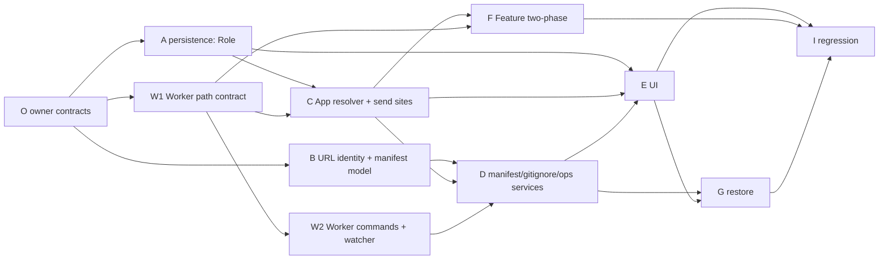

# Workspace as a Git Repository - Implementation Plan

Living execution document. Three documents define this feature:

| Document | Role |
|---|---|
| `GrayMoon-Workspace-As-Git-Repository-Design-v3.md` | Architecture and invariants |
| `Workspace-Repository-Design-Supplement-v3.1.md` | Binding decisions D1-D15 that make v3 implementable. Wins over v3. |
| this file | State, sequencing, exact steps per unit |

It must be possible to stop work here and resume later without reconstructing state from chat history.

**Statuses:** `TODO` `READY` `IN PROGRESS` `BLOCKED` `REVIEW` `DONE`

---

## Overall status

| | |
|---|---|
| Project status | READY |
| Current phase | All code units merged (O, A, W1, B, C, W2, D, D2, E, E2, F, G, H1, H2, H3) plus Unit I docs. Remaining: owner manual matrix in Unit I step 2 and follow-up triage. |
| Units planned in detail | O, A, W1, B, C, W2, D, E, F, G, I |
| Last verified | 2026-10-07, after E3 on `workspace-as-git-repository`: `dotnet build GrayMoon.slnx` 0 warnings; App 1119/1119, Worker 353/353 + 1 pre-existing skip, Common 255/255. |

**What works today.** Nothing of this feature. A Workspace is a folder containing one subfolder per repository; the Worker derives every repository path as `<root>\<WorkspaceName>\<RepositoryName>`; Features create one worktree per repository under `<FeatureStorageRoot>\<Feature>\<RepositoryName>`.

**What "done" looks like.** A Workspace can name one of its imported GitHub repositories as its Workspace repository. That repository's working tree is the Workspace root; it appears first in the Repositories grid with a `Workspace` badge and full Git actions; it is always the root worktree of every Feature; `.graymoon.json` and the managed `.gitignore` section are written to it by the Worker and show up in Git Changes; a second computer can restore the Workspace from that repository by URL matching alone.

---

## Reading list per unit (do not read more than this)

Every unit reads, in this order, and nothing else unless the unit's "Files to read" says so:

1. `CLAUDE.md` sections: Coding conventions, Architecture (first two bullets), Database schema, DbContext lifetime.
2. `AGENTS.md` sections: DbContext handling, Feature-context scoping, Never commit or push.
3. `Workspace-Repository-Design-Supplement-v3.1.md` - only the decisions listed in the unit's "Decisions" row.
4. This file: "Rules for agents", "Handoff template", and the unit's own section.
5. The unit's "Files to read" list.

Reading v3 in full is for the owner. A unit that needs a v3 section is told which one.

---

## Unit map



| Wave | Units | Parallel? | Why |
|---|---|---|---|
| 0 | O | no | Shared contracts. Everything compiles against them. |
| 1 | A, W1, B | yes, file-disjoint | A is App persistence, W1 is Worker only, B is Common + Application + App/Services/WorkspaceManifest. |
| 2 | C, W2 | yes | C touches App send sites; W2 touches Worker commands and watcher. |
| 3 | D | no | First unit that can create a Workspace-role link end to end. Needs B, C, W2. |
| 4 | E, F | yes | E is Razor pages and query DTOs; F is `WorkspaceFeatureOperations` only. |
| 5 | G | no | Restore is UI + ops; waits for E. |
| 6 | I | no | Regression, docs, manual pass. |

**Deployment rule.** W1 must be released in a Worker before any user can enable a Workspace repository (D2). The App refuses to enable until the connected Worker reports `supportedFeatures` containing `workspaceRepository`.

---

## Rules for agents

These are written for an agent with limited context. Follow them literally.

1. Read only what the "Reading list per unit" says. Do not open `WorkspaceFeatureOperations.cs` unless you are Unit F.
2. Edit only files in your unit's "Files owned". If you need a change in another file, write it under "Discoveries" in this plan and stop that step; do not make the change.
3. Do not create a new abstraction when the unit names one. Use the exact type, file and member names written here.
4. Every new C# file: CRLF line endings, `sealed` classes, primary constructors, ASCII hyphen only (no U+2013 / U+2014 anywhere, including comments and Markdown).
5. Every schema change needs both the entity configuration in `AppDbContext*.cs` and a strict migration step in `Migrations.StrictSteps`. Never delete or renumber a shipped step.
6. Never inject `AppDbContext` into a Blazor page; use `IDbContextFactory<AppDbContext>`.
7. Before handoff run exactly the commands in the unit's "Acceptance" row. Paste the result counts into the unit's "Handoff log".
8. Never run `git commit` or `git push`. End your reply with a one-line commit message in a fenced block.
9. If a step cannot be done as written, set the unit status to `BLOCKED`, write why under the unit's "Handoff log", and stop. Do not improvise a different design.
10. Do not refactor, rename or clean up anything the steps do not mention.
11. When a step says "replace X with Y in every file", first run the given search command, record the count, do the replacements, re-run the search and confirm the count is zero (or the stated remainder).
12. Update this file before handoff: status, handoff log, discoveries, follow-ups.

### Hot files - one unit at a time

```text
src/GrayMoon.App/Services/Features/WorkspaceFeatureOperations.cs     Unit F only
src/GrayMoon.App/Services/Features/WorkspaceContextPathResolver.cs   Unit C only
src/GrayMoon.App/Data/AppDbContext.cs                                Unit A only (link block), Unit D (Workspace block)
src/GrayMoon.App/Migrations.cs                                       Unit A (step 5), Unit D (step 6)
src/GrayMoon.App/Program.cs                                          DI registration lines only; one unit at a time
src/GrayMoon.Worker/Services/CommandDispatcher.cs                    Unit W2 only
src/GrayMoon.Worker/Services/CommandJobFactory.cs                    Unit W2 only
src/GrayMoon.Abstractions/Worker/WorkerHubMethods.cs                 Unit O only
src/GrayMoon.App/Components/Pages/WorkspaceRepositories.*            Unit E only
```

### Handoff template

Copy this under the unit's "Handoff log" and fill every line:

```text
Date:
Status after this handoff:
Files changed (full paths):
Search counts before/after (for replace-all steps):
Build: dotnet build GrayMoon.slnx -> warnings: N, errors: N
Tests: App X/X, Worker X/X (+skipped), Common X/X   (only the suites the unit says to run)
New tests added (names):
Deviations from the steps (and why):
Discoveries (coupling, surprises, things that look wrong but were left alone):
Follow-ups for the owner:
Commit message:
```

### Standard commands

```powershell
dotnet build GrayMoon.slnx
dotnet test src/GrayMoon.App.Tests/GrayMoon.App.Tests.csproj
dotnet test src/GrayMoon.Worker.Tests/GrayMoon.Worker.Tests.csproj
dotnet test src/GrayMoon.Common.Tests/GrayMoon.Common.Tests.csproj
# one test class
dotnet test src/GrayMoon.App.Tests/GrayMoon.App.Tests.csproj --filter "FullyQualifiedName~WorkspaceRepositoryRoleMigrationTests"
# non-ASCII dash check over the files you touched (should print nothing)
Select-String -Path <file> -Pattern "[\u2013\u2014]"
```

---

## Unit O - Owner: contracts and documents

| | |
|---|---|
| Owner | owner |
| Status | DONE |
| Dependencies | none |
| Decisions | D1, D2, D4, D5, D15 |

**Scope.** Create every shared type the other units compile against, with no behaviour. Keep the three documents current.

**Files owned.**

```text
docs/workspace-repository/*.md
src/GrayMoon.App/Models/WorkspaceRepositoryRole.cs                         (new)
src/GrayMoon.Application/Features/WorkerWorkspaceArgs.cs                   (new)
src/GrayMoon.Application/Features/IWorkspaceContextPathResolver.cs         (signature change only)
src/GrayMoon.Application/WorkspaceManifest/WorkspaceManifest.cs            (new, records)
src/GrayMoon.Application/WorkspaceManifest/IWorkspaceManifestService.cs    (new)
src/GrayMoon.Application/WorkspaceManifest/WorkspaceManifestDrift.cs       (new, record)
src/GrayMoon.Application/Workspaces/IWorkspaceRepositoryOperations.cs      (new)
src/GrayMoon.Abstractions/Worker/WorkerHubMethods.cs                       (two constants)
src/GrayMoon.Abstractions/Worker/WorkerFeatures.cs                         (new)
```

**Steps.**

1. `WorkspaceRepositoryRole.cs`:

   ```csharp
   namespace GrayMoon.App.Models;

   /// <summary>Role of a repository inside one Workspace. Persisted as int on WorkspaceRepositories.Role.</summary>
   public enum WorkspaceRepositoryRole
   {
       Source = 0,
       Workspace = 1
   }
   ```

2. `WorkerWorkspaceArgs.cs` exactly as in D1 step 4. **Do not change the existing `GetWorkerWorkspaceArgsAsync`.** Add a second method to `IWorkspaceContextPathResolver`:

   ```csharp
   /// <summary>Worker path arguments plus the Workspace-role repository name (null when none). Replaces GetWorkerWorkspaceArgsAsync; Unit C migrates every caller and then deletes the tuple method.</summary>
   Task<WorkerWorkspaceArgs> GetWorkerArgsAsync(WorkspaceFeatureContextId contextId, CancellationToken cancellationToken = default);
   ```

   and in `WorkspaceContextPathResolver` implement it for now as `new WorkerWorkspaceArgs(root, folder, null)` built from the existing tuple method. The build stays green between every wave; a red build is never "expected" in this plan. (Decision: green-build option chosen, 2026-10-06.)

3. `WorkspaceManifest.cs` - sealed records matching D15, all properties `init`:

   ```csharp
   namespace GrayMoon.Application.WorkspaceManifest;

   public sealed record WorkspaceManifest(
       int SchemaVersion,
       WorkspaceManifestWorkspace Workspace,
       IReadOnlyList<WorkspaceManifestConnector> Connectors,
       IReadOnlyList<WorkspaceManifestRepository> Repositories);

   public sealed record WorkspaceManifestWorkspace(string Name, WorkspaceManifestProfile Profile);
   public sealed record WorkspaceManifestProfile(string Type, string Versioning, string Ci);
   public sealed record WorkspaceManifestConnector(string Type, string Url);
   public sealed record WorkspaceManifestRepository(string Name, string RepositoryUrl, string ConnectorUrl);
   ```

4. `WorkspaceManifestDrift.cs`:

   ```csharp
   public sealed record WorkspaceManifestDrift(
       bool HasDrift,
       string? ParseError,
       IReadOnlyList<string> AddedRepositories,      // in file, not in database
       IReadOnlyList<string> RemovedRepositories,    // in database, not in file
       IReadOnlyList<string> ChangedProfileFields,
       IReadOnlyList<string> AddedConnectors,
       IReadOnlyList<string> RemovedConnectors);
   ```

5. `IWorkspaceManifestService.cs`:

   ```csharp
   public interface IWorkspaceManifestService
   {
       Task<WorkspaceManifest> BuildFromDatabaseAsync(int workspaceId, CancellationToken cancellationToken = default);
       string Serialize(WorkspaceManifest manifest);
       bool TryParse(string content, out WorkspaceManifest? manifest, out string? error);
       Task<OperationResult> WriteAuthoritativeManifestAsync(int workspaceId, CancellationToken cancellationToken = default);
       Task<OperationResult> WriteManagedGitIgnoreAsync(int workspaceId, CancellationToken cancellationToken = default);
       Task<WorkspaceManifestDrift> DetectDriftAsync(int workspaceId, CancellationToken cancellationToken = default);
   }
   ```

   `OperationResult` already exists in `GrayMoon.Application`.

6. `IWorkspaceRepositoryOperations.cs`:

   ```csharp
   public interface IWorkspaceRepositoryOperations
   {
       /// <summary>Links repositoryId as the Workspace repository and attaches it to the root (D4), then writes manifest and .gitignore (D5, D12).</summary>
       Task<OperationResult> EnableWorkspaceRepositoryAsync(int workspaceId, int repositoryId, IProgress<OperationProgress>? progress = null, CancellationToken cancellationToken = default);
       /// <summary>Removes the Workspace-role link only. Never deletes files or .git.</summary>
       Task<OperationResult> DisableWorkspaceRepositoryAsync(int workspaceId, CancellationToken cancellationToken = default);
       Task<RestoreWorkspaceResult> RestoreFromRepositoryAsync(int repositoryId, string workspaceName, IProgress<OperationProgress>? progress = null, CancellationToken cancellationToken = default);
   }

   public sealed record RestoreWorkspaceResult(
       bool Success,
       int? WorkspaceId,
       string? Error,
       IReadOnlyList<string> UnresolvedConnectorUrls,
       IReadOnlyList<string> UnresolvedRepositoryUrls);
   ```

7. `WorkerHubMethods.cs`: add `public const string AttachWorkspaceRepository = "AttachWorkspaceRepository";` and `public const string WriteRepositoryFile = "WriteRepositoryFile";`.

8. `WorkerFeatures.cs`:

   ```csharp
   namespace GrayMoon.Abstractions.Worker;

   public static class WorkerFeatures
   {
       public const string WorkspaceRepository = "workspaceRepository";
   }
   ```

**Acceptance.** `dotnet build GrayMoon.slnx` green, 0 warnings. All three suites unchanged (App 999, Worker 318 + 1 skipped, Common 236).

**Handoff log.**

```text
Date: 2026-10-06
Status after this handoff: DONE
Files changed (full paths):
  src/GrayMoon.App/Models/WorkspaceRepositoryRole.cs (new)
  src/GrayMoon.Application/Features/WorkerWorkspaceArgs.cs (new)
  src/GrayMoon.Application/Features/IWorkspaceContextPathResolver.cs (GetWorkerArgsAsync added; tuple method kept)
  src/GrayMoon.App/Services/Features/WorkspaceContextPathResolver.cs (GetWorkerArgsAsync wraps the tuple method, null name)
  src/GrayMoon.Application/WorkspaceManifest/WorkspaceManifest.cs (new)
  src/GrayMoon.Application/WorkspaceManifest/IWorkspaceManifestService.cs (new)
  src/GrayMoon.Application/WorkspaceManifest/WorkspaceManifestDrift.cs (new)
  src/GrayMoon.Application/Workspaces/IWorkspaceRepositoryOperations.cs (new)
  src/GrayMoon.Abstractions/Worker/WorkerHubMethods.cs (two constants)
  src/GrayMoon.Abstractions/Worker/WorkerFeatures.cs (new)
  docs/workspace-repository/Workspace-Repository-Implementation-Plan.md (status)
Search counts before/after (for replace-all steps): n/a
Build: dotnet build GrayMoon.slnx -> warnings: 0, errors: 0
Tests: App 1007/1007, Worker 320/320 (+1 skipped), Common 236/236
New tests added (names): none (contracts only)
Deviations from the steps (and why): none. Baseline numbers differ from the plan header (see Overall status).
Discoveries (coupling, surprises, things that look wrong but were left alone): none. WorkspaceContextPathResolver is the only implementer of IWorkspaceContextPathResolver.
Follow-ups for the owner: none
Commit message: Add the contracts for the Workspace repository feature
```

---

## Unit A - Persistence: `Role` on `WorkspaceRepositoryLink`

| | |
|---|---|
| Owner | subagent |
| Status | DONE |
| Dependencies | O |
| Decisions | none beyond v3 section 7. Owner decision (user approved): call MigrateWorkspaceRepositoryRoleAsync from RunLegacyBaselineAsync before MigrateWorkspaceFeatureContextSchemaAsync, because that legacy step loads WorkspaceRepositoryLink through EF and needs the Role column to exist on pre-0.1.0 databases. |

**Files to read.** `src/GrayMoon.App/Models/WorkspaceRepositoryLink.cs`, `src/GrayMoon.App/Data/AppDbContext.cs` lines 160-220, `src/GrayMoon.App/Migrations.cs` lines 1-120 and 405-460, `src/GrayMoon.App.Tests/WorkspaceProfileMigrationTests.cs` (pattern to copy).

**Files owned.**

```text
src/GrayMoon.App/Models/WorkspaceRepositoryLink.cs
src/GrayMoon.App/Data/AppDbContext.cs                      (WorkspaceRepositoryLink block only)
src/GrayMoon.App/Migrations.cs                             (StrictSteps entry 5 + one new method)
src/GrayMoon.App/Repositories/WorkspaceRepository.cs       (role guards only, see step 5)
src/GrayMoon.App.Tests/WorkspaceRepositoryRoleMigrationTests.cs   (new)
src/GrayMoon.App.Tests/WorkspaceRepositoryRoleGuardTests.cs       (new)
```

**Steps.**

1. Add to `WorkspaceRepositoryLink`, after `RepositoryId`/`Repository`:

   ```csharp
   /// <summary>Source (default) or Workspace. At most one Workspace-role link per Workspace (filtered unique index).</summary>
   public WorkspaceRepositoryRole Role { get; set; } = WorkspaceRepositoryRole.Source;
   ```

   Add `Role = Role,` to `WithBranchOverride`.

2. In the `WorkspaceRepositoryLink` entity block of `AppDbContext.OnModelCreating` add:

   ```csharp
   entity.Property(wr => wr.Role)
       .HasConversion<int>()
       .HasDefaultValue(WorkspaceRepositoryRole.Source);

   entity.HasIndex(wr => wr.WorkspaceId)
       .IsUnique()
       .HasFilter("\"Role\" = 1")
       .HasDatabaseName("IX_WorkspaceRepositories_WorkspaceId_WorkspaceRole");
   ```

3. In `Migrations.cs` append to `StrictSteps`:

   ```csharp
   (5, "Workspace repository role", dbContext => MigrateWorkspaceRepositoryRoleAsync(dbContext)),
   ```

   and add, copying the shape of `MigrateWorkspaceProfileColumnsAsync` (no try/catch):

   ```csharp
   public static async Task MigrateWorkspaceRepositoryRoleAsync(AppDbContext dbContext, ILogger? logger = null)
   {
       var conn = dbContext.Database.GetDbConnection();
       if (conn.State != ConnectionState.Open)
           await conn.OpenAsync();

       await using (var checkCmd = conn.CreateCommand())
       {
           checkCmd.CommandText = "SELECT COUNT(*) FROM pragma_table_info('WorkspaceRepositories') WHERE name = 'Role'";
           if (Convert.ToInt32(await checkCmd.ExecuteScalarAsync()) == 0)
           {
               await using var alterCmd = conn.CreateCommand();
               alterCmd.CommandText = "ALTER TABLE WorkspaceRepositories ADD COLUMN Role INTEGER NOT NULL DEFAULT 0";
               await alterCmd.ExecuteNonQueryAsync();
           }
       }

       await using var indexCmd = conn.CreateCommand();
       indexCmd.CommandText =
           "CREATE UNIQUE INDEX IF NOT EXISTS IX_WorkspaceRepositories_WorkspaceId_WorkspaceRole " +
           "ON WorkspaceRepositories(WorkspaceId) WHERE Role = 1";
       await indexCmd.ExecuteNonQueryAsync();
   }
   ```

4. Tests `WorkspaceRepositoryRoleMigrationTests` (copy the fixture style of `WorkspaceProfileMigrationTests`, including the `ALTER TABLE ... DROP COLUMN` trick to simulate the old shape):
   - `Existing_links_get_Role_Source_after_migration`
   - `Migration_is_idempotent`
   - `Second_Workspace_role_link_in_same_workspace_is_rejected_by_index` (insert two rows with Role=1 and same WorkspaceId; expect `DbUpdateException`)
   - `Workspace_role_links_in_different_workspaces_coexist`
   - `Fresh_database_has_filtered_index` (query `sqlite_master` for the index name)

5. In `WorkspaceRepository.cs`, inside `ReplaceRepositoriesCoreAsync` right after the `current` list is loaded, add: a `Role == Workspace` link is never removed by membership replacement. Concretely, exclude Workspace-role rows from `toRemove` and never add a repository as Source if it is already the Workspace-role repository (skip it). Write `WorkspaceRepositoryRoleGuardTests`:
   - `Replace_membership_never_removes_workspace_role_link`
   - `Replace_membership_skips_repository_that_is_the_workspace_repository`

**Acceptance.** Build clean. `GrayMoon.App.Tests` all green. Run the whole App suite, not only the new classes.

**Non-goals.** No UI, no path changes, no Worker changes, no way yet to set `Role = Workspace` from the UI.

**Handoff log.**

```text
Date: 2026-10-06
Status after this handoff: REVIEW
Files changed (full paths):
  C:\Users\matth\.graymoon\GrayMoon\features\workspace-as-git-repository\A\src\GrayMoon.App\Models\WorkspaceRepositoryLink.cs
  C:\Users\matth\.graymoon\GrayMoon\features\workspace-as-git-repository\A\src\GrayMoon.App\Data\AppDbContext.cs
  C:\Users\matth\.graymoon\GrayMoon\features\workspace-as-git-repository\A\src\GrayMoon.App\Migrations.cs
  C:\Users\matth\.graymoon\GrayMoon\features\workspace-as-git-repository\A\src\GrayMoon.App\Repositories\WorkspaceRepository.cs
  C:\Users\matth\.graymoon\GrayMoon\features\workspace-as-git-repository\A\src\GrayMoon.App.Tests\WorkspaceRepositoryRoleMigrationTests.cs (new)
  C:\Users\matth\.graymoon\GrayMoon\features\workspace-as-git-repository\A\src\GrayMoon.App.Tests\WorkspaceRepositoryRoleGuardTests.cs (new)
  C:\Users\matth\.graymoon\GrayMoon\features\workspace-as-git-repository\A\docs\workspace-repository\Workspace-Repository-Implementation-Plan.md (this log)
Search counts before/after (for replace-all steps): n/a (no replace-all step in this unit)
Build: dotnet build GrayMoon.slnx -> warnings: 0, errors: 0
Tests: App 1014/1014 (0 skipped; baseline 1007 + 7 new)
New tests added (names):
  WorkspaceRepositoryRoleMigrationTests: Existing_links_get_Role_Source_after_migration, Migration_is_idempotent,
    Second_Workspace_role_link_in_same_workspace_is_rejected_by_index, Workspace_role_links_in_different_workspaces_coexist,
    Fresh_database_has_filtered_index
  WorkspaceRepositoryRoleGuardTests: Replace_membership_never_removes_workspace_role_link,
    Replace_membership_skips_repository_that_is_the_workspace_repository
Deviations from the steps (and why): one extra owner-approved edit in Migrations.cs RunLegacyBaselineAsync: call MigrateWorkspaceRepositoryRoleAsync before MigrateWorkspaceFeatureContextSchemaAsync (fixes the regression below).
Discoveries (coupling, surprises, things that look wrong but were left alone):
  - FIXED (owner-approved early call). Only the Feature-context legacy step loads WorkspaceRepositoryLink through EF (Migrations.Features.cs lines 329, 444, 481, 519, all inside it); no other legacy baseline step does, so the single early call covers all. Original regression: UpgradeFrom010Tests.Golden_010_database_upgrades_to_current_schema now fails ("Sequence contains no elements"
    at UpgradeFrom010Tests.cs line 104). Cause: the legacy baseline step MigrateWorkspaceFeatureContextSchemaAsync ->
    BackfillSpecialWorkspaceContextsAsync (src/GrayMoon.App/Migrations.Features.cs line 329) loads
    dbContext.WorkspaceRepositories through EF, which now selects the new Role column. A pre-0.1.0 database has no Role
    column until strict step 5 runs, which is AFTER the legacy baseline, so the query throws; the legacy baseline catches
    and logs it, and the special Workspace context rows are never backfilled. This would also affect real upgrades.
    Not fixed: needs a change outside Unit A's owned edits. Suggested fix for the owner: call
    MigrateWorkspaceRepositoryRoleAsync (it is idempotent) from RunLegacyBaselineAsync in Migrations.cs before
    MigrateWorkspaceFeatureContextSchemaAsync, or make the backfill projection avoid the Role column. Other
    legacy/strict steps that load WorkspaceRepositoryLink via EF before step 5 could be affected the same way.
  - Guard implementation: UpdateAsync/AddAsync membership replacement now excludes Workspace-role repositories from
    validSet and from the SetEquals no-op comparison, and excludes Workspace-role rows from toRemove.
  - Process note: an early edit attempt wrote 2 files into the sibling worktree ...\workspace-as-git-repository\GrayMoon
    (relative-path mistake); it was reverted with git checkout and that worktree is clean again.
Follow-ups for the owner: none.
Commit message: Add Role to WorkspaceRepositoryLink with strict migration step 5, filtered unique index and membership guards
```

---

## Unit W1 - Worker path contract and compatibility flag

| | |
|---|---|
| Owner | subagent |
| Status | DONE |
| Dependencies | O |
| Decisions | D1, D2, D6 |

**Files to read.** `src/GrayMoon.Worker/Jobs/Requests/WorkspaceCommandRequest.cs`, `src/GrayMoon.Worker/Commands/SyncRepositoryCommand.cs` lines 1-60 and 150-170, `src/GrayMoon.Worker/Commands/GetHeadCommitsCommand.cs`, `src/GrayMoon.Worker/Commands/RefreshRepositoryProjectsCommand.cs`, `src/GrayMoon.Worker/Services/RepositoryStateProbe.cs`, `src/GrayMoon.Worker/Jobs/Response/GetHostInfoResponse.cs`, `src/GrayMoon.Worker/Commands/GetHostInfoCommand.cs`.

**Files owned.**

```text
src/GrayMoon.Worker/Jobs/Requests/WorkspaceCommandRequest.cs
src/GrayMoon.Worker/Services/WorkerRepositoryPaths.cs                 (new)
src/GrayMoon.Worker/Commands/*.cs                                     (path line and discoverProjects line only)
src/GrayMoon.Worker/Services/RepositoryStateProbe.cs                  (discoverProjects gate only)
src/GrayMoon.Worker/Services/WorkspaceFileSearchService.cs            (nested repo exclusion)
src/GrayMoon.Worker/Jobs/Response/GetHostInfoResponse.cs
src/GrayMoon.Worker/Commands/GetHostInfoCommand.cs
src/GrayMoon.Worker.Tests/WorkerRepositoryPathsTests.cs               (new)
src/GrayMoon.Worker.Tests/WorkspaceRepositoryDiscoveryGateTests.cs    (new)
```

**Steps.**

1. Add `WorkspaceRepositoryName` to `WorkspaceCommandRequest` exactly as in D1 step 1.

2. Create `WorkerRepositoryPaths.cs` exactly as in D1 step 2.

3. Record the baseline count:

   ```powershell
   (Select-String -Path src/GrayMoon.Worker/Commands/*.cs -Pattern 'Path\.Combine\(workspacePath, (repositoryName|repoName|name)\)').Count
   ```

   Expected about 35. Replace each with `WorkerRepositoryPaths.Resolve(workspacePath, <sameVariable>, request.WorkspaceRepositoryName)`. In handlers where the request variable is not named `request`, use that handler's name for it. In `GetHeadCommitsCommand` the loop variable is `repoName`; the request is the method parameter. In `GetWorkspaceRepositoriesCommand` **do not change** `Path.Combine(workspacePath, name)` - that command lists children. Re-run the search; expected remainder: 1 (`GetWorkspaceRepositoriesCommand`).

4. Discovery gate (D6). In `SyncRepositoryCommand` (line ~157), `RefreshRepositoryProjectsCommand` (line ~19), `PushRepositoryCommand` (line ~150) and `CommitSyncRepositoryCommand`, replace the read of `ShouldDiscoverProjects` with:

   ```csharp
   var discoverProjects = request.EffectiveCapabilities.ShouldDiscoverProjects
       && !WorkerRepositoryPaths.IsWorkspaceRepository(repositoryName, request.WorkspaceRepositoryName);
   ```

   and use `discoverProjects` where the old expression was used. For `RepositoryStateProbe`, add a `bool isWorkspaceRepository` parameter to the probe method that reads `capabilities.ShouldDiscoverProjects` (line ~22) and AND it the same way; update its callers (the four hook sync commands) to pass `WorkerRepositoryPaths.IsWorkspaceRepository(repositoryName, request.WorkspaceRepositoryName)`. Hook requests: hooks post repository paths, not names; if a hook sync command has no `request.WorkspaceRepositoryName` available, pass `false` and write a Discovery note: "hook sync for the Workspace repository still discovers projects; App-side projection ignores it because Unit E hides projects for Role == Workspace". This is acceptable for v1.

5. `WorkspaceFileSearchService` (Worker): when searching a repository folder, skip immediate child directories that contain `.git` (file or directory). Reuse the `HasGitMetadata` logic from `GetWorkspaceRepositoriesCommand` by moving it into `WorkerRepositoryPaths.HasGitMetadata(string path)` and calling it from both.

6. `GetHostInfoResponse`: add

   ```csharp
   [JsonPropertyName("supportedFeatures")]
   public List<string>? SupportedFeatures { get; set; }
   ```

   `GetHostInfoCommand`: set `SupportedFeatures = [WorkerFeatures.WorkspaceRepository]`.

7. Tests:
   - `WorkerRepositoryPathsTests`: `Resolve_returns_subfolder_when_no_workspace_repository`, `Resolve_returns_workspace_path_for_workspace_repository_case_insensitive`, `Resolve_returns_subfolder_for_other_repository_when_workspace_repository_set`, `HasGitMetadata_true_for_dir_and_file`.
   - `WorkspaceRepositoryDiscoveryGateTests`: run `SyncRepositoryCommand` with a fake `IGitService`/`ICsProjFileService` (copy the fake style from `ReturnToDefaultBranchCommandTests`) and assert that for `repositoryName == workspaceRepositoryName` the csproj service is never called and `Projects` is null, while for another name it is called.
   - `GetHostInfoCommand` test: response contains `workspaceRepository`.

**Acceptance.** Build clean. `GrayMoon.Worker.Tests` all green. Search remainder from step 3 is exactly 1.

**Non-goals.** No new commands (W2). No watcher change (W2). No App change.

**Handoff log.**

```text
Date: 2026-10-06
Status after this handoff: REVIEW
Decision: the owner approved extending W1's owned files with src\GrayMoon.Worker\Abstractions\IRepositoryStateProbe.cs, src\GrayMoon.Worker\Services\RepositoryStateProbe.cs and Worker.Tests probe stubs, to finish the step 4 probe gate.
Files changed (full paths), all under C:\Users\matth\.graymoon\GrayMoon\features\workspace-as-git-repository\W1\:
  src\GrayMoon.Worker\Jobs\Requests\WorkspaceCommandRequest.cs
  src\GrayMoon.Worker\Services\WorkerRepositoryPaths.cs (new)
  src\GrayMoon.Worker\Services\WorkspaceFileSearchService.cs
  src\GrayMoon.Worker\Services\RepositoryStateProbe.cs
  src\GrayMoon.Worker\Abstractions\IRepositoryStateProbe.cs
  src\GrayMoon.Worker\Jobs\Response\GetHostInfoResponse.cs
  src\GrayMoon.Worker.Tests\WorkerRepositoryPathsTests.cs (new)
  src\GrayMoon.Worker.Tests\WorkspaceRepositoryDiscoveryGateTests.cs (new)
  src\GrayMoon.Worker\Commands\*.cs: 33 files (Path line; discoverProjects gate in SyncRepositoryCommand, RefreshRepositoryProjectsCommand, PushRepositoryCommand; IsWorkspaceRepository passed to the probe in ReturnToDefaultBranchCommand; HasGitMetadata move in GetWorkspaceRepositoriesCommand; SupportedFeatures in GetHostInfoCommand)
  docs\workspace-repository\Workspace-Repository-Implementation-Plan.md (W1 section only)
Search counts before/after (for replace-all steps): before 34, after 1 (GetWorkspaceRepositoriesCommand only; the plan said about 35)
Build: dotnet build GrayMoon.slnx -> warnings: 0, errors: 0
Tests: Worker 329/329 (+1 skipped; was 320 + 1 skipped)
New tests added (names): WorkerRepositoryPathsTests: Resolve_returns_subfolder_when_no_workspace_repository, Resolve_returns_workspace_path_for_workspace_repository_case_insensitive, Resolve_returns_subfolder_for_other_repository_when_workspace_repository_set, HasGitMetadata_true_for_dir_and_file, GetHostInfo_response_contains_workspaceRepository_feature; WorkspaceRepositoryDiscoveryGateTests: Workspace_repository_never_calls_the_csproj_scanner_and_reports_no_projects, Other_repository_still_calls_the_csproj_scanner_when_a_workspace_repository_is_set, Probe_discovers_projects_only_when_not_the_workspace_repository (theory, 2 cases)
Deviations from the steps (and why):
  - Probe gate implemented as a new RepositoryStateProbeOptions.IsWorkspaceRepository init member (default false) instead of a method parameter: it keeps the IRepositoryStateProbe signature, all existing callers and the StubRepositoryStateProbe unchanged. The probe ANDs !options.IsWorkspaceRepository into its ShouldDiscoverProjects read.
  - Probe callers: only ReturnToDefaultBranchCommand has both IncludeProjects and a request name, so it passes WorkerRepositoryPaths.IsWorkspaceRepository(repositoryName, request.WorkspaceRepositoryName). CommitSyncRepositoryCommand and RefreshBranchesCommand never set IncludeProjects, so they were left alone. The four hook sync commands have no request name and rely on the default false (equivalent to passing false).
  - Step 4 CommitSyncRepositoryCommand: it never reads ShouldDiscoverProjects, so there was nothing to replace.
  - Step 4 PushRepositoryCommand: BuildPostOperationNotificationAsync has no repositoryName local, so the gate uses request.RepositoryName ?? string.Empty.
  - Step 5: the nested-repo skip applies only to immediate children of the repository root, as the plan says.
  - The GetHostInfoCommand test lives in WorkerRepositoryPathsTests.cs (only two new test files were owned for tests).
  - Added "using GrayMoon.Worker.Services;" to 28 command files and "using GrayMoon.Abstractions.Worker;" to GetHostInfoCommand so they compile.
Discoveries (coupling, surprises, things that look wrong but were left alone):
  - Hook sync for the Workspace repository still discovers projects (no request.WorkspaceRepositoryName on hook payloads). App-side projection ignores it because Unit E hides projects for Role == Workspace. Acceptable for v1.
  - SearchFilesCommand and IWorkspaceFileSearchService still do Path.Combine(workspacePath, repositoryName) internally, so a search scoped to the Workspace repository name finds no folder. Not owned by W1.
  - WorkspaceFileSearchService skips any root-level child containing .git, so submodule folders of any repository are also skipped (as the plan words it).
  - (Recorded here, not in the global Discoveries section, because W1 may edit only its own section.)
Follow-ups for the owner: none beyond the Discoveries above.
Commit message: feat(worker): resolve Workspace repository path, gate project discovery incl. probe, advertise workspaceRepository feature
```

---

## Unit B - URL identity and manifest serializer

| | |
|---|---|
| Owner | subagent |
| Status | DONE |
| Dependencies | O |
| Decisions | D11, D12, D15 |

**Files to read.** `src/GrayMoon.App/Services/GitHub/RepositoryUrlHelper.cs` (reuse its parsing approach; do not change it), `src/GrayMoon.Application/WorkspaceManifest/*.cs` (from Unit O).

**Files owned.**

```text
src/GrayMoon.Common/Git/RepositoryUrlIdentity.cs                                (new)
src/GrayMoon.Common.Tests/RepositoryUrlIdentityTests.cs                         (new)
src/GrayMoon.App/Services/WorkspaceManifest/WorkspaceManifestSerializer.cs      (new, static)
src/GrayMoon.App/Services/WorkspaceManifest/ManagedGitIgnoreSection.cs          (new, static)
src/GrayMoon.App/Services/WorkspaceManifest/WorkspaceManifestProfileNames.cs    (new, static enum<->string)
src/GrayMoon.App.Tests/WorkspaceManifestSerializerTests.cs                      (new)
src/GrayMoon.App.Tests/ManagedGitIgnoreSectionTests.cs                          (new)
```

**Steps.**

1. `RepositoryUrlIdentity` with the three static methods of D11. Implementation notes:
   - Trim input. If empty return empty.
   - `git@host:path` -> `https://host/path`.
   - `ssh://git@host/path` and `ssh://host/path` -> `https://host/path`.
   - `http(s)://user@host/path` -> drop userinfo.
   - Lower-case host; keep path case; strip one trailing `/`; strip trailing `.git` (case-insensitive).
   - Connector normalization: scheme+host only plus path with `/api/v3` suffix removed, no trailing slash, lower-case.
   - On any parse failure return the trimmed input.

2. `RepositoryUrlIdentityTests` (theory data):
   - `https://github.com/example/Avr.Api.git` == `https://github.com/example/Avr.Api` == `git@github.com:example/Avr.Api.git` == `ssh://git@github.com/example/Avr.Api.git` == `HTTPS://GitHub.com/example/Avr.Api/`
   - `https://github.com/example/Avr.Api` != `https://github.com/example/avr.api` is **false** (compare is ordinal-ignore-case) - assert equal.
   - `https://github.com/example/Avr.Api` != `https://github.com/other/Avr.Api`.
   - Connector: `https://GitHub.com/` == `https://github.com`; `https://ghe.company.com/api/v3` == `https://ghe.company.com`.
   - Garbage in returns trimmed garbage out, and two identical garbage strings are equal.

3. `WorkspaceManifestProfileNames`: `ToManifest(WorkspaceType)`, `ToManifest(WorkspaceVersioningMode)`, `ToManifest(WorkspaceCiProvider)` and the three `TryParse` inverses using the strings in D15. Unknown string -> false.

4. `WorkspaceManifestSerializer`:
   - `string Serialize(WorkspaceManifest m)`: sort `Connectors` by `Url`, `Repositories` by `Name` (ordinal-ignore-case) before serializing; `JsonSerializerOptions { WriteIndented = true, PropertyNamingPolicy = JsonNamingPolicy.CamelCase }`; replace `\r\n` with `\n`; append `\n`.
   - `bool TryParse(string content, out WorkspaceManifest? manifest, out string? error)`: case-insensitive property names; `schemaVersion` missing -> 1; `> 1` -> error text from D15; missing `workspace.name` -> error; null arrays -> empty.
   - Property order is fixed by declaring the records in D15 order (System.Text.Json serializes in declaration order).

5. `WorkspaceManifestSerializerTests`:
   - `Round_trip_is_byte_identical`
   - `Serialize_sorts_connectors_and_repositories`
   - `Serialize_uses_lf_and_trailing_newline` (assert no `\r`, ends with `\n`)
   - `Serialize_never_contains_id_fields` (serialize a manifest and assert the text does not contain `"workspaceId"`, `"repositoryId"`, `"connectorId"`, `"gitHubRepositoryId"`, `"nodeId"`)
   - `Parse_rejects_schema_version_2`
   - `Parse_defaults_missing_schema_version_to_1`
   - `Parse_ignores_unknown_properties`
   - `Parse_fails_on_missing_workspace_name`

6. `ManagedGitIgnoreSection.Apply(string? existingContent, IEnumerable<string> sourceRepositoryNames) : string` implementing D12. `ManagedGitIgnoreSectionTests`:
   - `Appends_section_to_empty_file`
   - `Appends_section_after_blank_line_to_non_empty_file`
   - `Replaces_existing_section_and_preserves_outside_lines`
   - `Sorts_names_case_insensitively`
   - `Output_uses_lf`
   - `Idempotent_second_apply_is_identical`

**Acceptance.** Build clean. `GrayMoon.Common.Tests` and `GrayMoon.App.Tests` green.

**Non-goals.** Nothing reads the database. Nothing calls the Worker.

**Handoff log.**

```text
Date: 2026-10-06
Status after this handoff: REVIEW
Files changed (full paths):
  C:\Users\matth\.graymoon\GrayMoon\features\workspace-as-git-repository\B\src\GrayMoon.Common\Git\RepositoryUrlIdentity.cs (new)
  C:\Users\matth\.graymoon\GrayMoon\features\workspace-as-git-repository\B\src\GrayMoon.Common.Tests\RepositoryUrlIdentityTests.cs (new)
  C:\Users\matth\.graymoon\GrayMoon\features\workspace-as-git-repository\B\src\GrayMoon.App\Services\WorkspaceManifest\WorkspaceManifestSerializer.cs (new)
  C:\Users\matth\.graymoon\GrayMoon\features\workspace-as-git-repository\B\src\GrayMoon.App\Services\WorkspaceManifest\ManagedGitIgnoreSection.cs (new)
  C:\Users\matth\.graymoon\GrayMoon\features\workspace-as-git-repository\B\src\GrayMoon.App\Services\WorkspaceManifest\WorkspaceManifestProfileNames.cs (new)
  C:\Users\matth\.graymoon\GrayMoon\features\workspace-as-git-repository\B\src\GrayMoon.App.Tests\WorkspaceManifestSerializerTests.cs (new)
  C:\Users\matth\.graymoon\GrayMoon\features\workspace-as-git-repository\B\src\GrayMoon.App.Tests\ManagedGitIgnoreSectionTests.cs (new)
  C:\Users\matth\.graymoon\GrayMoon\features\workspace-as-git-repository\B\docs\workspace-repository\Workspace-Repository-Implementation-Plan.md (Unit B section only)
Search counts before/after (for replace-all steps): n/a
Build: dotnet build GrayMoon.slnx -> warnings: 0, errors: 0
Tests: App 1021/1021, Common 255/255   (Worker not run, not required by this unit)
New tests added (names): RepositoryUrlIdentityTests (Equivalent_repository_urls_normalize_to_the_same_value, Repository_url_compare_ignores_path_case, Different_owner_is_not_equal, Connector_urls_are_normalized, Garbage_returns_trimmed_input_and_equal_garbage_is_equal, Empty_input_returns_empty); WorkspaceManifestSerializerTests (Round_trip_is_byte_identical, Serialize_sorts_connectors_and_repositories, Serialize_uses_lf_and_trailing_newline, Serialize_never_contains_id_fields, Parse_rejects_schema_version_2, Parse_defaults_missing_schema_version_to_1, Parse_ignores_unknown_properties, Parse_fails_on_missing_workspace_name); ManagedGitIgnoreSectionTests (Appends_section_to_empty_file, Appends_section_after_blank_line_to_non_empty_file, Replaces_existing_section_and_preserves_outside_lines, Sorts_names_case_insensitively, Output_uses_lf, Idempotent_second_apply_is_identical)
Deviations from the steps (and why): none of substance. WorkspaceManifestSerializer declares using-aliases for the manifest records inside the namespace, because the namespace GrayMoon.App.Services.WorkspaceManifest otherwise shadows the record type WorkspaceManifest. TryParse also returns an error for empty content and invalid JSON. Profile-name TryParse is case-insensitive. Normalized non-default http(s) ports are kept in NormalizeRepositoryUrl; ssh port is dropped.
Discoveries (coupling, surprises, things that look wrong but were left alone): ManagedGitIgnoreSection treats a start marker without an end marker as "no section" and appends a new one (does not delete user lines). Serializer output of arrays is multi-line (WriteIndented), unlike the inline objects in the D15 example. Default JSON encoder escapes characters such as '&' and '+' as \uXXXX in URLs; stable but less readable.
Follow-ups for the owner: none.
Commit message: Add repository URL identity, manifest serializer and managed gitignore section
```

---

## Unit C - App path resolver and send sites

| | |
|---|---|
| Owner | subagent |
| Status | DONE |
| Dependencies | A, W1 (contract only; Worker binary not required to build) |
| Decisions | D1, D9 |

**Files to read.** `src/GrayMoon.App/Services/Features/WorkspaceContextPathResolver.cs`, `src/GrayMoon.App/Services/Features/WorkspaceHookContextAttributor.cs`, `src/GrayMoon.App/Services/Git/WorkspaceGitService.Context.cs`, `src/GrayMoon.App/Services/Git/WorkspaceGitService.Sync.cs` lines 30-95, `src/GrayMoon.App.Tests/FeatureContextIsolationTests.cs` (fixture pattern).

**Files owned.**

```text
src/GrayMoon.App/Services/Features/WorkspaceContextPathResolver.cs
every src/GrayMoon.App/**/*.cs and *.razor that calls GetWorkerWorkspaceArgsAsync or sends workspaceRoot   (send-site edits only)
src/GrayMoon.App.Tests/WorkspaceContextPathResolverRoleTests.cs           (new)
src/GrayMoon.App.Tests/WorkspaceHookContextAttributorRoleTests.cs         (new)
src/GrayMoon.App.Tests/WorkerSendSiteGuardTests.cs                        (new)
```

**Steps.**

1. `WorkspaceContextPathResolver.GetWorkerArgsAsync` (added by Unit O with a null name) now computes `WorkspaceRepositoryName` by querying `db.WorkspaceRepositories.Include(l => l.Repository).Where(l => l.WorkspaceId == info.WorkspaceId && l.Role == WorkspaceRepositoryRole.Workspace).Select(l => l.Repository!.RepositoryName).FirstOrDefaultAsync()`. Use the factory-created `db` already in the class.

2. `GetRepositoryPathAsync`: implement D9. Keep the existing `WorktreePath` branch for Features; add the special-context `Role == Workspace` branch returning `GetContextRootAsync(contextId)`; for a Feature with a Workspace-role row that has no `WorktreePath`, return `GetContextRootAsync(contextId)`.

3. Migrate every caller of the tuple method to `GetWorkerArgsAsync`, then delete `GetWorkerWorkspaceArgsAsync` from the interface and the class so the compiler proves nothing was missed. Count first: `(Select-String -Path src -Pattern 'GetWorkerWorkspaceArgsAsync' -Include *.cs,*.razor -Recurse).Count` (expected about 45 across 19 files); after the migration the count must be 0. For each call site that did `var (workspaceRoot, workspaceFolderName) = await ...GetWorkerWorkspaceArgsAsync(...)`:

   ```csharp
   var workerArgs = await ...GetWorkerArgsAsync(...);
   var workspaceRoot = workerArgs.WorkspaceRoot;
   var workspaceFolderName = workerArgs.WorkspaceFolderName;
   var workspaceRepositoryName = workerArgs.WorkspaceRepositoryName;
   ```

   and add `workspaceRepositoryName,` to every anonymous object in that method that contains `workspaceRoot`. Count first:

   ```powershell
   (Select-String -Path src/GrayMoon.App -Pattern 'workspaceRoot' -Include *.cs,*.razor -Recurse).Count
   ```

   Files known to contain send sites: `WorkspaceGitService.*.cs`, `GitChangesWorkerClient.cs` (add a `string? workspaceRepositoryName` parameter to every `IGitChangesWorkerClient` method and pass it through; update its callers), `WorkspacePushService.cs`, `WorkspaceFileVersionService.cs`, `WorkspaceFileSearchService.cs`, `WorkspaceUndoPushHandler.cs`, `WorkspaceCommitSyncHandler.cs`, `WorkspaceBranchUpdateHandler.cs`, `WorkspaceBranchOperations.cs`, `WorkspaceFileOperations.cs`, `WorkspaceGitChangesOperations.cs`, `GitChangesWorkspaceScanner.cs`, `WorkspaceService.cs`, `WorkspaceFiles.razor`, `ViewFileModal.razor`, `MarkdownImageEmbedder.cs`, `WorkspaceGitChanges.*.cs`. `WorkspaceFeatureOperations.cs` is Unit F's; for its `(featureStorageRoot, _) =` deconstructions only change the deconstruction shape, nothing else, and record it under Discoveries.

4. `WorkerSendSiteGuardTests`: locate the repo root by walking up from `AppContext.BaseDirectory` until a directory contains `GrayMoon.slnx`; enumerate `src/GrayMoon.App/**/*.cs` and `*.razor` excluding `bin`/`obj`; for each file, find every `new\s*\{[^}]*\}` block (regex, `Singleline`) containing the word `workspaceRoot` **and** (`repositoryName` or `repositoryNames`); assert each such block also contains `workspaceRepositoryName`. On failure list `file:line` for every offender. Add an allow-list constant for blocks that legitimately omit it (expected: none; keep the list empty).

5. `WorkspaceContextPathResolverRoleTests` (seed with SQLite in-memory via the existing test context helpers):
   - `Special_context_source_role_resolves_to_root_slash_name`
   - `Special_context_workspace_role_resolves_to_root`
   - `Feature_context_workspace_role_uses_persisted_worktree_path`
   - `Feature_context_workspace_role_without_worktree_path_resolves_to_feature_root`
   - `GetWorkerWorkspaceArgs_returns_workspace_repository_name_when_present_else_null`

6. `WorkspaceHookContextAttributorRoleTests`:
   - `Hook_path_equal_to_workspace_root_attributes_to_special_context_for_workspace_role`
   - `Hook_path_equal_to_feature_root_attributes_to_feature_context_for_workspace_role`
   - `Hook_path_of_source_repo_still_attributes_to_source_link_not_workspace_link`

**Acceptance.** Build clean. `GrayMoon.App.Tests` all green, including the guard test.

**Non-goals.** No UI. No new Worker calls. No Feature ordering changes.

**Handoff log.**

```text
Date: 2026-10-06
Status after this handoff: DONE (merged; verified by the orchestrator)
Files changed (full paths): all under src\
  GrayMoon.App\Services\Features\WorkspaceContextPathResolver.cs
  GrayMoon.Application\Features\IWorkspaceContextPathResolver.cs (tuple method deleted)
  GrayMoon.App\Services\Application\WorkspaceBranchOperations.cs, WorkspaceFileOperations.cs, WorkspaceGitChangesOperations.cs
  GrayMoon.App\Services\Features\WorkspaceFeatureOperations.cs (Unit F's file; deconstruction shape only)
  GrayMoon.App\Services\Git\WorkspaceGitService.Branches.cs, .Commit.cs, .Context.cs, .Fetch.cs, .Projects.cs, .Restore.cs, .ReturnToDefault.cs, .Sync.cs
  GrayMoon.App\Services\GitChanges\GitChangesWorkerClient.cs, GitChangesWorkspaceScanner.cs, MarkdownImageEmbedder.cs
  GrayMoon.App\Services\Orchestration\WorkspaceBranchUpdateHandler.cs, WorkspaceCommitSyncHandler.cs, WorkspaceUndoPushHandler.cs
  GrayMoon.App\Services\Workspaces\WorkspaceFileSearchService.cs, WorkspaceFileVersionService.cs, WorkspacePushService.cs
  GrayMoon.App\Components\Modals\ViewFileModal.razor, Components\Pages\WorkspaceFiles.razor
  GrayMoon.App\Components\Pages\WorkspaceGitChanges.CopyPath.cs, .Diff.cs, .Discard.cs, .Markdown.cs, .razor.cs
  GrayMoon.App.Tests\FeatureContextIsolationTests.cs, WorkspacePushStrategyTests.cs (compile-required edits only)
  GrayMoon.App.Tests\WorkspaceContextPathResolverRoleTests.cs, WorkspaceHookContextAttributorRoleTests.cs, WorkerSendSiteGuardTests.cs (new)
Search counts before/after:
  GetWorkerWorkspaceArgsAsync: 34 lines in 19 files -> 0 (plan said about 45)
  workspaceRoot in src/GrayMoon.App: 135 -> 173; every send block with workspaceRoot + repositoryName now also carries workspaceRepositoryName except WorkspaceService.cs blocks (no repository name) and the allow-listed WorkspaceFeatureOperations.cs blocks
Build: dotnet build GrayMoon.slnx -> warnings: 0, errors: 0
Tests: App 1037/1037 (baseline 1028, +9)
New tests added (names):
  WorkspaceContextPathResolverRoleTests: Special_context_source_role_resolves_to_root_slash_name, Special_context_workspace_role_resolves_to_root, Feature_context_workspace_role_uses_persisted_worktree_path, Feature_context_workspace_role_without_worktree_path_resolves_to_feature_root, GetWorkerWorkspaceArgs_returns_workspace_repository_name_when_present_else_null
  WorkspaceHookContextAttributorRoleTests: Hook_path_equal_to_workspace_root_attributes_to_special_context_for_workspace_role, Hook_path_equal_to_feature_root_attributes_to_feature_context_for_workspace_role, Hook_path_of_source_repo_still_attributes_to_source_link_not_workspace_link
  WorkerSendSiteGuardTests: Every_send_site_with_workspace_root_and_repository_name_also_sends_workspace_repository_name
Deviations from the steps (and why):
  1. Guard allow-list is NOT empty: AllowedFiles = [WorkspaceFeatureOperations.cs] with a "Unit F removes this" comment. That file (Unit F's) has 5 qualifying blocks (DeleteBranch x3, GetGitChangeStatus, GetHeadCommits) that C may not change.
  2. WorkspaceFeatureRepository.WorktreePath is non-null, so "no WorktreePath" is modelled as string.Empty in the test.
  3. WorkerWorkspaceArgs has 3 members, so tuple deconstructions became (a, b, _) / (a, _, _).
  4. Two test files outside "Files owned" were edited only to compile: FeatureContextIsolationTests.cs (3-element deconstructions) and WorkspacePushStrategyTests.cs (null argument for the new parameter).
  5. The new string? workspaceRepositoryName parameter sits right after repositoryName in every IGitChangesWorkerClient method and in MarkdownImageEmbedder.EmbedAsync / TryLoadRepoFileAsync.
  6. Compiler-forced signature changes: ResolveWorkerPathArgsAsync (WorkspaceGitService.Context.cs, WorkspacePushService.cs) returns WorkerWorkspaceArgs; WorkspacePushService restore/fetch helpers and WorkspaceFileVersionService.ResolveTokenValuesAsync take workspaceRepositoryName; WorkspaceGitChangesOperations.WithResolvedRepo callback has a 4th argument; GitChangesWorkspaceScanner MonitorTarget and page tuples gained a trailing element; ViewFileModal has a new WorkspaceRepositoryName parameter fed from WorkspaceFiles.razor.
  7. WorkspaceGitChanges.CopyPath.cs only uses root and folder name, so it does not read the repository name.
Discoveries:
  - WorkspaceFeatureOperations.cs edits (deconstruction shape only): ~559 returns (featureArgs.WorkspaceRoot, featureArgs.WorkspaceFolderName) from GetWorkerArgsAsync; ~737 and ~1724 use (workspaceRoot, workspaceFolderName, _); ~752 and ~1737 use (featureStorageRoot, _, _).
  - Pre-existing U+2013/U+2014 characters remain, identical in HEAD, in comments of FeatureContextIsolationTests.cs line 355, ViewFileModal.razor line 14, WorkspaceFeatureOperations.cs lines 1916 and 2204. Added lines contain none. Left alone (not mentioned by the steps).
  - IWorkspaceContextPathResolver.cs had CR-CR-LF endings in its first half (left by Unit O); it is now clean CRLF.
  - The plan's Select-String -Path src -Recurse form does not work; use Get-ChildItem -Recurse | Select-String.
Follow-ups for the owner: Unit F must add workspaceRepositoryName to the 5 WorkspaceFeatureOperations.cs blocks and then empty AllowedFiles in WorkerSendSiteGuardTests.
Commit message: Resolve Workspace-role repository paths in the App resolver and send workspaceRepositoryName from every Worker send site
```

---

## Unit W2 - Worker commands and watcher

| | |
|---|---|
| Owner | subagent |
| Status | DONE |
| Dependencies | W1 |
| Decisions | D4, D5, D7 |

**Files to read.** `.claude/skills/add-worker-command/SKILL.md`, `src/GrayMoon.Worker/Commands/SyncRepositoryCommand.cs` (clone + hook install lines), `src/GrayMoon.Worker/Services/GitService.cs` `CloneAsync` and `BuildCloneArguments`, `src/GrayMoon.Common/Git/GitRepositoryPathValidator.cs`, `src/GrayMoon.Worker/Services/GitChanges/GitRepositoryWatcher.cs`, `src/GrayMoon.Worker.Tests/GitRepositoryWatcherObservationTests.cs` (test style for `TryCreateWorkTreeObservation`).

**Files owned.**

```text
src/GrayMoon.Worker/Jobs/Requests/AttachWorkspaceRepositoryRequest.cs      (new)
src/GrayMoon.Worker/Jobs/Response/AttachWorkspaceRepositoryResponse.cs     (new)
src/GrayMoon.Worker/Commands/AttachWorkspaceRepositoryCommand.cs           (new)
src/GrayMoon.Worker/Jobs/Requests/WriteRepositoryFileRequest.cs            (new)
src/GrayMoon.Worker/Jobs/Response/WriteRepositoryFileResponse.cs           (new)
src/GrayMoon.Worker/Commands/WriteRepositoryFileCommand.cs                 (new)
src/GrayMoon.Worker/Abstractions/IGitService.cs                            (new members only)
src/GrayMoon.Worker/Services/GitService.cs                                 (new members only)
src/GrayMoon.Worker/Services/CommandDispatcher.cs
src/GrayMoon.Worker/Services/CommandJobFactory.cs
src/GrayMoon.Worker/Cli/Handlers/RunCommandHandler.cs                      (two AddSingleton lines)
src/GrayMoon.Worker/Services/GitChanges/GitRepositoryWatcher.cs
src/GrayMoon.Worker.Tests/AttachWorkspaceRepositoryCommandTests.cs         (new)
src/GrayMoon.Worker.Tests/WriteRepositoryFileCommandTests.cs               (new)
src/GrayMoon.Worker.Tests/GitRepositoryWatcherNestedRepoTests.cs           (new)
```

**Steps.**

1. Follow the `add-worker-command` skill for `AttachWorkspaceRepository` (main pool). Request/response per D4. New `IGitService` members needed (add only these, implement with the existing `CommandLineService` pattern):
   - `Task<bool> CloneIntoAsync(string targetDir, string cloneUrl, string? bearerToken, CancellationToken ct)` - `git clone <url> .` executed in `targetDir`.
   - `Task<(bool Success, string? Error)> InitAsync(string repoPath, CancellationToken ct)`
   - `Task<(bool Success, string? Error)> AddRemoteAsync(string repoPath, string name, string url, CancellationToken ct)`
   - `Task<string?> GetRemoteDefaultBranchAsync(string repoPath, string? bearerToken, CancellationToken ct)` - `git ls-remote --symref origin HEAD`, parse `ref: refs/heads/<name>`.
   - `Task<(bool Success, string? Error)> CheckoutTrackingAsync(string repoPath, string branch, CancellationToken ct)` - `git checkout -b <b> --track origin/<b>`; return stderr verbatim on failure.
   - `Task<(bool Success, string? Error)> SetUnbornHeadAsync(string repoPath, string branch, CancellationToken ct)` - `git symbolic-ref HEAD refs/heads/<branch>`.
   Reuse the existing fetch, safe-directory and hook-install members. Every git call that touches the remote uses the same `-c http.extraHeader` token mechanism as `CloneAsync` (look at `BuildCloneArguments`).

2. Follow the skill for `WriteRepositoryFile` (main pool). Request/response per D5. Path check: `GitRepositoryPathValidator` rejects absolute and `..`; additionally reject a first segment equal to `.git`. Write to `<dir>\<name>.graymoon-tmp` then `File.Move(tmp, target, overwrite: true)`. `onlyIfChanged`: read existing bytes and compare to `Encoding.UTF8.GetBytes(content)` (no BOM); if equal, `written = false`.

3. `GitRepositoryWatcher` (D7):
   - Add a private `HashSet<string> _nestedRepoRoots` (ordinal-ignore-case full paths) built in `Start()` from immediate child directories where `WorkerRepositoryPaths.HasGitMetadata(child)` is true.
   - In `TryCreateWorkTreeObservation` (make it an instance method or pass the set in), return null when `fullPath` starts with any nested root followed by a separator, or equals it.
   - On a `Created`/`Deleted`/`Renamed` event whose path is an immediate child directory of `_repoPath`, recompute the set.
   - Nested-repo events must not raise `Changed` either.

4. Tests:
   - `AttachWorkspaceRepositoryCommandTests` with real git in a temp dir (the repo already has tests that shell out to git, e.g. `GitServiceStageAndCommitTests`; copy their temp-dir fixture): `Empty_root_is_cloned_in_place`, `Non_empty_root_without_git_is_initialized_and_checked_out`, `Non_empty_root_with_empty_remote_leaves_unborn_main`, `Root_with_same_origin_is_idempotent`, `Root_with_different_origin_fails`, `Checkout_collision_returns_git_message_and_keeps_dot_git`.
   - `WriteRepositoryFileCommandTests`: `Writes_utf8_without_bom`, `Skips_when_identical`, `Rejects_parent_traversal`, `Rejects_dot_git_path`, `Creates_missing_subdirectory`.
   - `GitRepositoryWatcherNestedRepoTests`: `Event_under_nested_repo_is_ignored`, `Event_at_root_file_is_observed`, `Newly_created_nested_repo_is_excluded_after_refresh`.

**Acceptance.** Build clean. `GrayMoon.Worker.Tests` green.

**Non-goals.** No App code. No hook script change.

**Handoff log.**

```text
Date: 2026-10-06
Status after this handoff: DONE (merged; verified by the orchestrator)
Files changed (full paths): all under src\
  GrayMoon.Worker\Jobs\Requests\AttachWorkspaceRepositoryRequest.cs, WriteRepositoryFileRequest.cs (new)
  GrayMoon.Worker\Jobs\Response\AttachWorkspaceRepositoryResponse.cs, WriteRepositoryFileResponse.cs (new)
  GrayMoon.Worker\Commands\AttachWorkspaceRepositoryCommand.cs, WriteRepositoryFileCommand.cs (new)
  GrayMoon.Worker\Abstractions\IGitService.cs, GrayMoon.Worker\Services\GitService.cs (six new members)
  GrayMoon.Worker\Services\CommandDispatcher.cs, CommandJobFactory.cs, GrayMoon.Worker\Cli\Handlers\RunCommandHandler.cs
  GrayMoon.Worker\Services\GitChanges\GitRepositoryWatcher.cs
  GrayMoon.Worker.Tests\AttachWorkspaceRepositoryCommandTests.cs, WriteRepositoryFileCommandTests.cs, GitRepositoryWatcherNestedRepoTests.cs (new)
Search counts before/after: n/a
Build: dotnet build GrayMoon.slnx -> warnings: 0, errors: 0
Tests: Worker 343/343 (+1 skipped); baseline 329 + 1 skipped, +14 new
New tests added (names):
  AttachWorkspaceRepositoryCommandTests: Empty_root_is_cloned_in_place, Non_empty_root_without_git_is_initialized_and_checked_out, Non_empty_root_with_empty_remote_leaves_unborn_main, Root_with_same_origin_is_idempotent, Root_with_different_origin_fails, Checkout_collision_returns_git_message_and_keeps_dot_git
  WriteRepositoryFileCommandTests: Writes_utf8_without_bom, Skips_when_identical, Rejects_parent_traversal, Rejects_dot_git_path, Creates_missing_subdirectory
  GitRepositoryWatcherNestedRepoTests: Event_under_nested_repo_is_ignored, Event_at_root_file_is_observed, Newly_created_nested_repo_is_excluded_after_refresh
Deviations from the steps (and why):
  1. The six new IGitService members are default interface methods that throw NotSupportedException; GitService implements all six. Two unowned test files (DeleteBranchCommandTests.cs, ReturnToDefaultBranchCommandTests.cs) have full IGitService fakes that plain members would break.
  2. AttachWorkspaceRepositoryRequest has two extra int properties, workspaceId and repositoryId. D4 does not list them; hook installation (WriteSyncHooksAsync) needs both.
  3. After GetRemoteDefaultBranchAsync the command checks refs/remotes/origin/<default> exists locally (RevParseAsync); git 2.31+ can report an unborn HEAD branch for an empty remote. An empty remote falls through to the unborn main path.
  4. Watcher: TryCreateWorkTreeObservation stays static with an optional fifth parameter nestedRepoRoots; added internal RefreshNestedRepoRoots() and a NestedRepoRoots property for tests.
  5. Watcher: the nested-root set also refreshes on a Created/Deleted/Renamed event for a .git entry directly inside an immediate child (otherwise a brand-new nested repo is never excluded).
  6. Attach emits no explicit CommandOutput step lines; the git processes' own output streaming covers it (no existing command writes CommandOutput directly).
Discoveries:
  - GitRepositoryWatcher.cs was committed with CR-CR-LF endings on 204 lines. It is now proper CRLF, so a plain git diff shows the whole file; use git diff --ignore-space-at-eol (real change: 91 added, 3 removed).
  - Retry after a checkout collision: .git stays with a matching origin, so a re-run takes the idempotent-success path and never re-checks out the default branch; HEAD stays unborn. D4 says the user resolves and retries, so Unit D's Enable flow (or a later Attach change) must handle it.
  - Idempotent re-attach also installs hooks, runs safe.directory and reports the current branch; D4 step 2 only says success.
  - AddSafeDirectoryAsync can modify global git config, only when the repository is not already safe; tests do not touch global config.
Follow-ups for the owner: add the six IGitService stubs to the two test fakes and make the members non-default (one line each) when convenient. Unit D must send workspaceId and repositoryId in the Attach request.
Commit message: Add AttachWorkspaceRepository and WriteRepositoryFile Worker commands and exclude nested repositories from the git watcher
```

---

## Unit D - Manifest, `.gitignore`, drift and Workspace-repository operations

| | |
|---|---|
| Owner | subagent |
| Status | DONE |
| Dependencies | B, C, W2 |
| Decisions | D2, D3, D4, D5, D8, D11, D12 |

**Files to read.** `src/GrayMoon.App/Services/Application/WorkspaceGitChangesOperations.cs` (facade + progress pattern), `src/GrayMoon.App/Services/Workspaces/WorkspaceService.cs` lines 240-280 (`GetHostInfo` call), `src/GrayMoon.App/Models/Api/WorkspaceWorkerApiModels.cs` (`GetHostInfoWorkerResponse`), `src/GrayMoon.App/Repositories/WorkspaceRepository.cs` lines 430-560, `src/GrayMoon.App/Services/Git/WorkspaceGitService.Sync.cs` (where a full sync completes), `src/GrayMoon.App/Services/Worker/SyncCommandHandler.cs` (hook sync completion).

**Files owned.**

```text
src/GrayMoon.App/Models/Workspace.cs                                        (ManifestDriftDetectedAt only)
src/GrayMoon.App/Data/AppDbContext.cs                                       (Workspace block only)
src/GrayMoon.App/Migrations.cs                                              (StrictSteps entry 6 + method)
src/GrayMoon.App/Models/Api/WorkspaceWorkerApiModels.cs                     (SupportedFeatures on GetHostInfoWorkerResponse)
src/GrayMoon.App/Services/Worker/WorkerFeatureSupportService.cs             (new)
src/GrayMoon.App/Services/WorkspaceManifest/WorkspaceManifestService.cs     (new)
src/GrayMoon.App/Services/Application/WorkspaceRepositoryOperations.cs      (new)
src/GrayMoon.App/Repositories/WorkspaceRepository.cs                        (hook into ReplaceRepositoriesCoreAsync callers, see step 6)
src/GrayMoon.App/Program.cs                                                 (DI lines)
src/GrayMoon.App.Tests/WorkspaceManifestServiceTests.cs                     (new)
src/GrayMoon.App.Tests/WorkspaceRepositoryOperationsTests.cs                (new)
src/GrayMoon.App.Tests/WorkspaceManifestDriftMigrationTests.cs              (new)
```

**Steps.**

1. `Workspace.ManifestDriftDetectedAt` (`DateTime?`), entity config (nullable, no default), strict step 6 `MigrateWorkspaceManifestDriftColumnAsync` using the `AddNullable...ColumnIfMissingAsync` pattern but with `TEXT NULL` (EF stores `DateTime` as TEXT in SQLite). Test: `Column_added_once_and_idempotent`.

2. `WorkerFeatureSupportService` (singleton, `IWorkerFeatureSupportService` in the same file): `Task<bool> SupportsAsync(string feature, CancellationToken ct)` - calls `GetHostInfo` through `IWorkerBridge`, deserializes `GetHostInfoWorkerResponse`, caches the list for 60 seconds, returns false when the Worker is disconnected or the list is null.

3. `WorkspaceManifestService : IWorkspaceManifestService` (sealed, factory-based `AppDbContext`, injects `IWorkerBridge`, `IWorkspaceContextPathResolver`, `IWorkspaceFeatureContextResolver`):
   - `BuildFromDatabaseAsync`: Workspace name, profile strings via `WorkspaceManifestProfileNames`, connectors = distinct GitHub connectors of all Source links mapped per D11, repositories = Source links only (D15 / v3 12.1).
   - `Serialize` / `TryParse` delegate to `WorkspaceManifestSerializer`.
   - `WriteAuthoritativeManifestAsync`: if the Workspace has no Workspace-role link return `OperationResult` success with message "No Workspace repository" and do nothing. Otherwise resolve the special context, get worker args, send `WriteRepositoryFile` with `repositoryName = workspaceRepositoryName`, `filePath = ".graymoon.json"`, `onlyIfChanged = true`.
   - `WriteManagedGitIgnoreAsync`: read `.gitignore` through `GetFileContents` (missing file -> null), apply `ManagedGitIgnoreSection.Apply`, write through `WriteRepositoryFile` with `onlyIfChanged = true`.
   - `DetectDriftAsync`: per D8. Refuse (throw `InvalidOperationException`) when called with a Feature context; the method takes `workspaceId` and always uses the special context. Compare the parsed file with `BuildFromDatabaseAsync` after normalizing URLs with `RepositoryUrlIdentity`. Persist `ManifestDriftDetectedAt = HasDrift ? UtcNow : null`.

4. `WorkspaceRepositoryOperations : IWorkspaceRepositoryOperations`:
   - `EnableWorkspaceRepositoryAsync`: (a) gate: `SupportsAsync(WorkerFeatures.WorkspaceRepository)` else fail with the D2 message; (b) refuse while Features exist (same text style as `WorkspaceRepository`); (c) refuse if a Workspace-role link exists; (d) refuse if `repositoryId` is already a Source link of this Workspace; (e) add the link with `Role = Workspace` through a factory-created context; (f) call `AttachWorkspaceRepository` with the repository `CloneUrl` and unprotected connector token (`ConnectorHelpers.UnprotectToken`); on failure delete the link and return the error; (g) `WriteManagedGitIgnoreAsync`, then `WriteAuthoritativeManifestAsync`; (h) return success. Run under `IWorkspaceOperationLock.TryStartStructural` like Feature create does, with job key `WorkspaceJobKeys.RepositoriesOverlayKey(workspaceId)`.
   - `DisableWorkspaceRepositoryAsync`: refuse while Features exist; delete the link row and its dependents through `WorkspaceRepositoryLinkCleanup.DeleteDependentsAsync`; never touch disk.
   - `RestoreFromRepositoryAsync`: implement D14 steps 1-7 (step 8, the sync, is triggered by the caller in Unit G). Return `RestoreWorkspaceResult` with the unresolved lists.

5. `Program.cs`: register `IWorkerFeatureSupportService` (singleton), `IWorkspaceManifestService` (scoped), `IWorkspaceRepositoryOperations` (scoped).

6. Membership hook: wherever the App commits a change to Source membership of a Workspace (`WorkspaceRepository.AddRepositoriesAsync`, `ReplaceRepositoriesAsync`, `UpdateAsync` when the set changed) the **caller facade** (not the repository class) afterwards calls `WriteManagedGitIgnoreAsync` then `WriteAuthoritativeManifestAsync` when a Workspace-role link exists. Find the callers with `Select-String -Pattern 'ReplaceRepositoriesAsync|AddRepositoriesAsync' -Path src/GrayMoon.App -Recurse`. Also after a profile change commit (`WorkspaceProfileTransition`). Failures of these writes are reported as a toast, never thrown.

7. Drift hooks: after a full Sync completes in the special context (`WorkspaceGitService.Sync.cs`, at the end of the method that loops repositories) and after `SyncCommandHandler` persists a hook sync attributed to the special context for the Workspace-role repository, call `DetectDriftAsync(workspaceId)` fire-and-forget with its own DI scope (`IServiceScopeFactory.CreateAsyncScope()`, rule 3 in `AGENTS.md`). Skip entirely when the Workspace has no Workspace-role link.

8. Tests (`WorkspaceManifestServiceTests`, fake `IWorkerBridge` capturing sent commands):
   - `Build_excludes_workspace_role_repository_and_nuget_connectors`
   - `Build_connector_url_derived_from_api_base_url` (api.github.com -> https://github.com; ghe /api/v3 -> https://ghe)
   - `Write_manifest_sends_WriteRepositoryFile_to_workspace_repository_root`
   - `Write_manifest_is_noop_without_workspace_repository`
   - `Detect_drift_false_when_file_equals_database`
   - `Detect_drift_true_when_repository_added_in_file`
   - `Detect_drift_true_on_parse_error_with_reason`
   - `Detect_drift_refuses_feature_context`
   - `Detect_drift_ignores_url_formatting_differences`
   `WorkspaceRepositoryOperationsTests`:
   - `Enable_refused_when_worker_lacks_feature`
   - `Enable_refused_while_features_exist`
   - `Enable_refused_when_repository_is_already_source`
   - `Enable_rolls_back_link_when_attach_fails`
   - `Enable_writes_gitignore_then_manifest`
   - `Disable_refused_while_features_exist`
   - `Restore_resolves_repositories_by_normalized_url_with_different_local_ids` (seed `Repository` rows whose ids differ from any hint; match purely by URL)
   - `Restore_reports_unresolved_connector_and_repository`

9. Added 2026-10-06 (from W2 handoff): the AttachWorkspaceRepository request has two extra int properties beyond D4, `workspaceId` and `repositoryId` (needed to install hooks). `EnableWorkspaceRepositoryAsync` must send both.
10. Added 2026-10-06 (from W2 handoff): after a checkout collision Attach leaves `.git` in place with a matching origin, so a retry returns idempotent success without checking out the default branch (HEAD stays unborn). `EnableWorkspaceRepositoryAsync` must handle this: on retry detect an unborn HEAD instead of claiming success. Ask the owner if the Attach response needs a field for it.
**Acceptance.** Build clean. `GrayMoon.App.Tests` green.

**Non-goals.** No Razor changes (E). No Feature ordering (F). No automatic import from GitHub.

**Handoff log.**

```text
Date: 2026-10-06
Status after this handoff: DONE (merged; verified by the orchestrator). Owner note 10 and two policy points are OPEN, see Decisions pending.
Files changed (full paths): all under src\
  Owned: GrayMoon.App\Models\Workspace.cs (ManifestDriftDetectedAt), GrayMoon.App\Data\AppDbContext.cs (Workspace block), GrayMoon.App\Migrations.cs (strict step 6 + MigrateWorkspaceManifestDriftColumnAsync), GrayMoon.App\Models\Api\WorkspaceWorkerApiModels.cs (SupportedFeatures), GrayMoon.App\Program.cs (3 DI lines)
  Permitted hook sites (steps 6/7): GrayMoon.App\Components\Pages\Workspaces.razor, GrayMoon.App\Components\Pages\WorkspaceRepositories.RepositoriesModal.cs, GrayMoon.App\Services\Worker\SyncCommandHandler.cs, GrayMoon.App\Services\Git\WorkspaceGitService.Sync.cs, GrayMoon.App\Services\Git\WorkspaceGitService.cs (one optional constructor parameter)
  New: GrayMoon.App\Services\Worker\WorkerFeatureSupportService.cs, GrayMoon.App\Services\WorkspaceManifest\WorkspaceManifestService.cs, GrayMoon.App\Services\Application\WorkspaceRepositoryOperations.cs, GrayMoon.App.Tests\WorkspaceManifestServiceTests.cs, WorkspaceRepositoryOperationsTests.cs, WorkspaceManifestDriftMigrationTests.cs
Search counts before/after: n/a
Build: dotnet build GrayMoon.slnx -> warnings: 0, errors: 0
Tests: App 1056/1056 (baseline 1037, +19); Worker 343 + 1 skipped and Common 255 re-run by the orchestrator after the merge, unchanged
New tests added (names):
  WorkspaceManifestServiceTests: Build_excludes_workspace_role_repository_and_nuget_connectors, Build_connector_url_derived_from_api_base_url, Write_manifest_sends_WriteRepositoryFile_to_workspace_repository_root, Write_manifest_is_noop_without_workspace_repository, Detect_drift_false_when_file_equals_database, Detect_drift_true_when_repository_added_in_file, Detect_drift_true_on_parse_error_with_reason, Detect_drift_refuses_feature_context, Detect_drift_ignores_url_formatting_differences
  WorkspaceRepositoryOperationsTests: Enable_refused_when_worker_lacks_feature, Enable_refused_while_features_exist, Enable_refused_when_repository_is_already_source, Enable_rolls_back_link_when_attach_fails, Enable_writes_gitignore_then_manifest, Disable_refused_while_features_exist, Restore_resolves_repositories_by_normalized_url_with_different_local_ids, Restore_reports_unresolved_connector_and_repository
  WorkspaceManifestDriftMigrationTests: Column_added_once_and_idempotent, Strict_step_6_is_registered_after_step_5 (extra)
Deviations from the steps (and why):
  1. WorkspaceGitService got an optional trailing constructor parameter IServiceScopeFactory? scopeFactory = null for the step 7 fire-and-forget scope (AGENTS.md rule 3). A null factory skips drift detection.
  2. Step 6 "caller facade": the only callers of the membership methods are Razor pages, so those call sites were edited: Workspaces.razor (3 sites: UpdateAsync in the editor, UpdateAsync in the repositories modal, AddRepositoriesAsync in ConfirmImportAsync) and WorkspaceRepositories.RepositoriesModal.cs (1 site). Each calls the new extension WorkspaceManifestHooks.SyncDefinitionToDiskAsync (in WorkspaceManifestService.cs): writes .gitignore, then the manifest, never throws, returns an error string shown with ShowError. The profile-change hook is covered by the editor UpdateAsync site; WorkspaceProfileTransition itself is unedited.
  3. OperationResult has no message field, so "No Workspace repository" is returned as new OperationResult(true, "No Workspace repository") (text in Error on a success result).
  4. DetectDriftAsync takes only workspaceId; "refuse a Feature context" is implemented by asking IWorkspaceFeatureContextResolver for the special context and throwing InvalidOperationException when GetRequiredAsync reports it is not special.
  5. With no Workspace-role link DetectDriftAsync clears ManifestDriftDetectedAt and returns no drift. A missing .graymoon.json counts as drift with a ParseError. A Worker or read failure throws and persists nothing.
  6. Enable step (g): if the .gitignore or manifest write fails after the attach, the link and attached repository are kept and the result is Fail "The Workspace repository was attached, but ...". A retry of Enable then fails at check (c). The drift banner's "Write Workspace definition to disk" is the repair path.
  7. Restore reports problems in RestoreWorkspaceResult: Success=true with Error="Restored without definition: <reason>" when the file is missing or unparsable; Success=true with Error="Workspace restored, but the Workspace definition could not be written: ..." when step 7 fails.
  8. UnresolvedRepositoryUrls entries are "<repositoryUrl> (connector <connectorUrl>)" because the result type has no other place for the connector URL (Unit G must know this format).
  9. Restore creates the Workspace through WorkspaceRepository.AddAsync (name normalization, duplicate check); if the attach fails the new Workspace row and its link are deleted.
  10. Unknown profile strings in a manifest keep the Basic/None/None default for that axis.
  11. Drift ignores workspace.name (a clone may use a different name) and compares repositories by normalized URL only.
Discoveries:
  - Owner note 10 NOT implemented: AttachWorkspaceRepositoryResponse has branch and isUnborn, but nothing says whether the remote has a default branch; isUnborn is also true for a legitimately empty remote. Needs a Worker change (a remoteHasDefaultBranch field, or the idempotent re-attach path checking out the default branch when HEAD is unborn and origin/<default> exists).
  - Owner note 9 done: Enable sends workspaceName, workspaceRoot, workspaceRepositoryName, cloneUrl, bearerToken, workspaceId and repositoryId; response success and errorMessage are read.
  - Restore D14 step 1 (folder must not exist or be empty) cannot be checked by the App without a new Worker command; Attach on a non-empty root without .git runs the convert flow, so Restore into a populated folder would silently convert it.
  - D8 also lists single-repository sync of the Workspace repository and Checkout Branch/Tag as drift triggers; step 7 names only full Sync and hook sync, so SyncSingleRepositoryAsync and checkout are not hooked.
  - The drift hook in SyncAsync runs only when the loaded Workspace has a Workspace-role link and the context is special; it runs even when repositoryIds filters the sync to a subset.
  - The legacy baseline does not load the Workspace entity through EF, so no baseline reordering was needed for the new column.
Follow-ups for the owner: see Decisions pending. Unit E can use ManifestDriftDetectedAt for the banner and WorkspaceManifestHooks.SyncDefinitionToDiskAsync for the "Write Workspace definition to disk" button. Unit G triggers the sync (D14 step 8) after RestoreFromRepositoryAsync.
Commit message: Add Workspace manifest, managed .gitignore, drift detection and Workspace-repository enable, disable and restore operations
```

---

## Unit E - UI

| | |
|---|---|
| Owner | subagent |
| Status | DONE |
| Dependencies | A, C, D |
| Decisions | D2, D6 (App part), D8 (banner), D13 |

**Files to read.** `src/GrayMoon.App/Components/Modals/WorkspaceModal.razor`, `src/GrayMoon.App/Components/Modals/WorkspaceRepositoriesModal.razor(.cs)`, `src/GrayMoon.App/Services/Queries/WorkspaceRepositoryLinkListModels.cs`, `src/GrayMoon.App/Services/Queries/WorkspaceRepositoryLinkListQueryService.cs` (Project and ApplySort), `src/GrayMoon.App/Services/Queries/WorkspaceRepositoryLinkListMapper.cs`, `src/GrayMoon.App/Components/Pages/WorkspaceRepositories.razor` and `.Display.cs`, `src/GrayMoon.App/Components/Shared/WorkspaceRepositoriesHeader.razor`, `AGENTS.md` "Buttons and short action labels never word-wrap".

**Files owned.**

```text
src/GrayMoon.App/Components/Modals/WorkspaceModal.razor(.cs)
src/GrayMoon.App/Components/Modals/WorkspaceRepositoriesModal.razor(.cs)
src/GrayMoon.App/Services/Queries/WorkspaceRepositoryLinkListModels.cs
src/GrayMoon.App/Services/Queries/WorkspaceRepositoryLinkListQueryService.cs
src/GrayMoon.App/Services/Queries/WorkspaceRepositoryLinkListMapper.cs
src/GrayMoon.App/Components/Pages/WorkspaceRepositories.razor
src/GrayMoon.App/Components/Pages/WorkspaceRepositories.Display.cs
src/GrayMoon.App/Components/Pages/WorkspaceRepositories.Loading.cs            (banner data only)
src/GrayMoon.App/Components/Shared/WorkspaceRepositoriesHeader.razor
src/GrayMoon.App.Tests/WorkspaceRepositoryLinkListQueryServiceRoleTests.cs  (new)
../GrayMoon.Desktop/README.md                                                (Recent GrayMoon changes bullet)
```

**Steps.**

1. `WorkspaceRepositoryLinkListItemDto` gains `WorkspaceRepositoryRole Role`. Mapper fills it. `ApplySort`: Workspace-role row sorts first in every sort mode (add a leading `OrderBy(l => l.Role == Workspace ? 0 : 1)` before existing ordering; keyset cursor must include it - follow how `DependencyLevel` is handled in `ApplyKeyset`). Level grouping: a `Role == Workspace` row is never counted in a level group; render it under its own group header "Workspace repository".

2. Grid row for `Role == Workspace`: `Workspace` badge next to the name (`badge text-bg-secondary text-nowrap`); level / dependencies / projects / packages cells render empty; all Git action buttons stay. Verify the Projects / Packages / Deps pages already skip repositories with no projects (they should; if not, record a Discovery, do not fix).

3. `WorkspaceModal` (create + edit): add "Workspace repository (optional)" `<select>` listing imported GitHub repositories not Source-linked to this Workspace; blank option "None". On save: if changed and Features exist -> show the refusal text; if set -> call `IWorkspaceRepositoryOperations.EnableWorkspaceRepositoryAsync` after the Workspace is saved; if cleared -> `DisableWorkspaceRepositoryAsync`. Show the D2 refusal message as an error toast.

4. `WorkspaceRepositoriesModal`: filter out the Workspace-role repository from the selectable list and from the "current" set so saving the modal cannot remove it.

5. Banners on `WorkspaceRepositories` (special context only):
   - Drift: when `Workspace.ManifestDriftDetectedAt != null`: `alert alert-warning` "Workspace definition on disk differs from this Workspace." with buttons "Write Workspace definition to disk" (calls `WriteManagedGitIgnoreAsync` then `WriteAuthoritativeManifestAsync`, then `DetectDriftAsync`) and "Dismiss" (clears the column). Buttons `text-nowrap`.
   - Compat: when a Workspace-role link exists and `SupportsAsync(WorkspaceRepository)` is false: `alert alert-danger` "The connected Worker does not support Workspace repositories. Update the Worker."

6. Tests `WorkspaceRepositoryLinkListQueryServiceRoleTests` (copy fixture from `WorkspaceRepositoryLinkListQueryServiceTests`): `Workspace_role_row_is_first_in_every_sort`, `Workspace_role_row_is_not_in_any_level_group`, `Keyset_paging_keeps_workspace_row_first`.

7. Desktop README bullet (per `AGENTS.md`): "**Workspace repository** - a Workspace can name one of its GitHub repositories as its Workspace repository; its working tree is the Workspace root, it appears first in Repositories with a Workspace badge, and it is the root of every Feature."

**Acceptance.** Build clean. `GrayMoon.App.Tests` green. Manual: enable a Workspace repository on a test Workspace; grid shows it first with badge; Git Changes shows `.graymoon.json` and `.gitignore` as new files; commit from Git Changes works.

**Non-goals.** Restore UI (G). Feature creation (F).

**Handoff log.**

```text
Date: 2026-10-06. Status: DONE (merged); UI NOT run by hand. Files (all merged): WorkspaceRepositoryLinkList{Models,Mapper,QueryService}.cs, WorkspaceModal.razor, WorkspaceRepositoriesModal.razor.cs, WorkspaceRepositories.{razor,Display.cs,Loading.cs}, plus four files outside the owned list that the steps required (owner-visible): WorkspaceRepositories.State.cs (ComputeSlots, level grouping), WorkspaceRepositories.RepositoriesModal.cs, WorkspaceRepositoriesRow.razor (badge, empty deps cell), Workspaces.razor (SaveWorkspaceAsync, Unit D hooks kept). File search per owner decision: IWorkspaceFileSearchService (SearchAsync gained optional workspaceRepositoryName), SearchFilesCommand, WorkspaceFileSearchService. Build 0 warnings. App 1068 at unit tip (+11), Worker 353 + 1 skipped (+4); combined tip App 1078.
New tests: App WorkspaceRepositoryLinkListQueryServiceRoleTests (Workspace_role_row_is_first_in_every_sort, Workspace_role_row_is_not_in_any_level_group, Workspace_role_row_with_no_level_is_not_in_the_no_dependencies_group, Keyset_paging_keeps_workspace_row_first, Keyset_cursor_carries_the_role_of_the_last_row) and WorkspaceRepositoryGridLayoutTests (ComputeSlots x3, Repositories_modal_filtering_drops_excluded_ids_and_keeps_order, Workspace_repository_choices x2); Worker SearchFilesWorkspaceRepositoryTests (4).
Deviations: Role added as optional trailing members (DTO, index entry, cursor RoleSortKey = 1). Keyset cursor key 0 resumes at the first Source row. The "Workspace repository" header shows whenever a Workspace-role row exists. Level 0 / No dependencies bulk actions exclude the Workspace row. The modal select is disabled while Features exist (rename wording). Disable runs before Enable; results shown as toast and modal error; link re-read from the DB after each call. WorkspaceRepositoriesModal has a new ExcludedRepositoryIds parameter. Drift banner: "Write Workspace definition to disk" runs SyncDefinitionToDiskAsync then DetectDriftAsync; Dismiss clears ManifestDriftDetectedAt. Both banners show in the special Workspace context only.
Discoveries: App WorkspaceFileSearchService already sent workspaceRepositoryName (unchanged, no App search test). Projects, Packages and Deps pages were NOT checked for skipping repositories with no Projects (D6): manual check needed. Compatibility banner shows "does not support" also when the Worker is merely offline (follows plan literally). Pre-existing non-ASCII in WorkspaceRepositories.Loading.cs line 547 left alone.
Follow-ups: decide whether the compatibility banner hides when the Worker is disconnected. D8 Review action (diff view) not built, DetectDriftAsync returns the data. Create flow: Enable runs before the existing-repositories import suggestion; if Enable fails the modal stays open and a second Save retries Enable but skips the import suggestion.
Manual testing needed: Add/Edit Workspace modal (select, disabled with Features, enable/change/clear, old Worker refusal toast); grid first row, header, badge, no phantom Level 0 / No dependencies group, virtual scroll, Feature selector view; both banners; Repositories membership modals; Git Changes shows .graymoon.json and .gitignore as new files and commit works; Projects/Packages/Deps pages with a Workspace repository.
```

---

## Unit F - Feature create, repair and remove become two-phase

| | |
|---|---|
| Owner | subagent |
| Status | DONE |
| Dependencies | C, W1 |
| Decisions | D9, D10 |

**Files to read.** `src/GrayMoon.App/Services/Features/WorkspaceFeatureOperations.cs` lines 99-390 (create), 390-800 (analyze + remove), the Retry/repair method (search `Pending` and `Retry`), `src/GrayMoon.Worker/Jobs/Requests/RemoveGitWorktreeRequest.cs`, `src/GrayMoon.App.Tests/CreateFeatureParentBranchTests.cs` and `WorkspaceFeatureRepairTests.cs` (fixtures with a fake `IWorkerBridge`).

**Files owned.**

```text
src/GrayMoon.App/Services/Features/WorkspaceFeatureOperations.cs
src/GrayMoon.App.Tests/WorkspaceFeatureWorkspaceRepositoryTests.cs   (new)
```

**Steps.**

1. Create: after `pendingRows` are committed, split them:

   ```csharp
   var rootRow = pendingRows.SingleOrDefault(r => links.First(l => l.WorkspaceRepositoryId == r.WorkspaceRepositoryId).Role == WorkspaceRepositoryRole.Workspace);
   var sourceRows = pendingRows.Where(r => r != rootRow).ToList();
   ```

   When building rows (line ~220), the root row gets `WorktreePath = featureRootPath` (no repository name appended). Create the root first with the same `CreateGitWorktree` call shape and the same per-row persistence; if it fails, persist NeedsRepair on the root row and the Feature and return the NeedsRepair result **without** starting the Source fan-out. Then run the existing fan-out over `sourceRows`. Progress text: "Created feature in {done} of {total} repositories" counts the root too.

2. Repair Retry: before the Pending fan-out, if a Pending root row exists, retry it alone first; if it fails, stop and keep NeedsRepair.

3. Remove: run the existing fan-out over Source rows; after `Task.WhenAll`, if no Source removal failed and a root row exists, send one `RemoveGitWorktree` for it with `featureRootPath = null`, `featureStorageRoot = null`, `force`/`unlock` as the user authorized. If any Source removal failed, do not remove the root; keep NeedsRepair with the existing error text plus "Workspace repository worktree kept until all repository worktrees are removed."

4. `GetHeadSnapshotAsync` sends `repositoryNames`; it already receives worker args from the resolver after Unit C, so `workspaceRepositoryName` must be in that anonymous object (Unit C changed the deconstruction only; add the field here if it is missing).

5. Tests `WorkspaceFeatureWorkspaceRepositoryTests` (fake bridge records the order of `CreateGitWorktree` / `RemoveGitWorktree` calls):
   - `Create_sends_root_worktree_before_any_source_worktree`
   - `Create_root_worktree_path_equals_feature_root`
   - `Create_root_failure_leaves_source_rows_pending_and_feature_needs_repair`
   - `Remove_sends_root_worktree_after_all_source_worktrees`
   - `Remove_skips_root_when_a_source_removal_failed`
   - `Retry_retries_root_before_sources`
   - `Workspace_without_workspace_repository_behaves_exactly_as_before` (same call set and order as today)

Note added 2026-10-06 (from C handoff): `WorkspaceFeatureOperations.cs` has 5 Worker send blocks that Unit C could not change (DeleteBranch x3, GetGitChangeStatus ~line 1173, GetHeadCommits ~line 2162). Unit F adds `workspaceRepositoryName` to them (and the variable at the deconstruction sites ~737, ~752, ~1724, ~1737), then empties `AllowedFiles` in `WorkerSendSiteGuardTests`.
**Acceptance.** Build clean. `GrayMoon.App.Tests` green (existing Feature tests must not change).

**Non-goals.** No UI. No new worker commands.

**Handoff log.**

```text
Date: 2026-10-06. Status: DONE (merged). Files: WorkspaceFeatureOperations.cs, WorkerSendSiteGuardTests.cs (AllowedFiles emptied), WorkspaceFeatureWorkspaceRepositoryTests.cs (new). Build 0 warnings. App 1067 (+10). New tests: Create_sends_root_worktree_before_any_source_worktree, Create_root_worktree_path_equals_feature_root, Create_root_failure_leaves_source_rows_pending_and_feature_needs_repair, Remove_sends_root_worktree_after_all_source_worktrees, Remove_skips_root_when_a_source_removal_failed, Retry_retries_root_before_sources, Workspace_without_workspace_repository_behaves_exactly_as_before, Rollback_removes_root_worktree_after_all_source_worktrees, Rollback_keeps_root_when_a_source_removal_failed, Rollback_without_workspace_repository_behaves_exactly_as_before.
Deviations: GetHeadSnapshotAsync got a private workspaceRepositoryName parameter (it did not receive resolver args). Fan-out lambdas became local delegates (createRowAsync, retryRowAsync, removeRowAsync); root runs first/last alone. A root create failure leaves Feature LastError as the existing text; root error stays on the root row. Rollback (not in plan steps, added at the orchestrator's request per D10) now removes Source rows first and the root last, keeps the root when any source failed. Remove/Rollback root removal sends featureRootPath = null and featureStorageRoot = null.
Discoveries: Rollback returns Fail without changing Feature state on failure (pre-existing). GetHeadCommits payload now carries workspaceRepositoryName (null when no Workspace role row); Worker ignores null. Pre-existing U+2013/U+2014 in two comments left alone.
```

---

## Unit G - Restore from an existing Workspace repository

| | |
|---|---|
| Owner | subagent |
| Status | DONE |
| Dependencies | D, E |
| Decisions | D14 |

**Files to read.** `src/GrayMoon.App/Components/Pages/Workspaces.razor`, `src/GrayMoon.App/Components/Modals/WorkspaceImportModal.razor` (closest existing shape), `src/GrayMoon.App/Services/Application/WorkspaceRepositoryOperations.cs` (from D).

**Files owned.**

```text
src/GrayMoon.App/Components/Modals/RestoreWorkspaceModal.razor(.cs)    (new)
src/GrayMoon.App/Components/Pages/Workspaces.razor                     (one button + modal host)
src/GrayMoon.App.Tests/RestoreWorkspaceFlowTests.cs                    (new, service-level)
../GrayMoon.Desktop/README.md                                          (one bullet)
```

**Steps.**

1. `RestoreWorkspaceModal`: repository select (imported GitHub repositories), Workspace name input defaulting to the repository name, validation (name unique, folder absent or empty - use the existing `WorkspaceService.DirectoryExistsAsync`), "Restore" button `text-nowrap`. Runs `RestoreFromRepositoryAsync` as a background job with the overlay, then triggers the normal full Sync for the new Workspace (existing sync entry point), then navigates to the new Workspace's Repositories page. Shows the unresolved lists in a result panel with the text "Import these repositories through their connector, then use Review on the Repositories page."

2. `Workspaces.razor`: add the "Restore from repository" button next to the existing create/import actions.

3. Tests `RestoreWorkspaceFlowTests` (service level, fake bridge returning a canned `.graymoon.json`): `Restore_creates_workspace_links_and_profile_from_manifest`, `Restore_without_manifest_creates_bare_workspace`, `Restore_lists_unresolved_repositories_and_still_succeeds`.

4. Desktop README bullet: "**Restore Workspace from repository** - pick a GitHub repository that contains `.graymoon.json`; GrayMoon clones it as the Workspace root, recreates the Workspace profile and repository list by URL, and syncs."

**Acceptance.** Build clean. App tests green. Manual: restore on a second database (delete `graymoon.db`, start, import connector, restore) reproduces the Workspace.

**Handoff log.**

```text
Date: 2026-10-06. Status: DONE (merged). Files: RestoreWorkspaceModal.razor and .razor.cs (new), Workspaces.razor (button + modal host + 4 small members), RestoreWorkspaceFlowTests.cs (new). Desktop README bullet applied by the orchestrator (uncommitted, GrayMoon.Desktop). Build 0 warnings; App 1096 (+12). Tests: Restore_creates_workspace_links_and_profile_from_manifest, Restore_without_manifest_creates_bare_workspace, Restore_lists_unresolved_repositories_and_still_succeeds, Sync_is_not_requested_when_restore_fails, A_failing_sync_keeps_the_restored_workspace_and_is_reported, Default_name_is_the_repository_name (5 cases), Name_must_be_present_a_valid_folder_name_and_unique_ignoring_case, Folder_must_be_absent_or_empty.
Deviations: (1) the dialog blocks Restore only when the folder exists and holds repositories (the App can only ask the Worker whether the folder exists and how many repositories it holds); an existing folder with no repositories gets a warning, and the Worker's requireEmptyRoot is the real guard (a folder with only non-repository files passes the dialog and fails in the Worker with its message). (2) Sync runs inside the restore job (key /workspaces) via IWorkspaceSyncOperations.SyncAsync on the special-Workspace context, without WorkspaceOperationLock (brand-new Workspace); a Sync failure or cancel does not undo the restore and shows as a warning. (3) If there is anything to show (unresolved lists or a warning) the modal stays open with an "Open Workspace" button; otherwise it navigates to workspaces/{id} (the plan says the Repositories page; the Workspace page route is workspaces/{id}).
Discoveries: BackgroundJobOverlay matches jobs on the lowercase URL path. RestoreWorkspaceResult.Error also carries warnings when Success is true.
Manual testing needed: button and dialog (list of imported GitHub repositories, filter, name defaulting, duplicate name error, non-empty folder block); restore end to end on a second database (overlay shows restore then sync); manifest with unimported repositories (panel text and Open Workspace); repository without .graymoon.json ("Restored without definition"); abort during overlay; restore into an existing empty folder and into one with non-repository files.
```

---

## Unit I - Regression, documentation, manual pass

| | |
|---|---|
| Owner | owner + subagent |
| Status | IN PROGRESS (docs and automated checks DONE; manual matrix waits for the owner) |
| Dependencies | E, F, G |

**Steps.**

1. All three suites green; build 0 warnings.
2. Manual matrix (owner), record results here:

   | Scenario | Expected | Result |
   |---|---|---|
   | Basic Workspace, enable Workspace repo on non-empty root | attach succeeds, files appear in Git Changes | |
   | DotNetDependency Workspace, Workspace repo row | no level, no projects, Update/Push unaffected | |
   | Create Feature | root worktree first, Sources under it, `CLAUDE.md` present in Feature root | |
   | Edit `CLAUDE.md` in Feature | appears in Feature Git Changes for the Workspace repo only | |
   | Edit `Avr.Api/x.cs` in Feature | appears under `Avr.Api` only | |
   | Edit Feature `.graymoon.json` | Git change only; special Workspace unchanged; no drift banner | |
   | Pull Workspace repo with changed manifest | drift banner appears | |
   | Remove Feature | Sources removed, then root; folder gone | |
   | Old Worker connected | enable refused; banner when link exists | |
   | Restore on second machine | repositories matched by URL with different local ids | |
   | 10 nested repositories | `git status` on root under 1 s | |

3. Update `docs/architecture/01`, `03`, `05` with a short "Workspace repository" subsection each (current-state wording, not design wording). Mark v3 + supplement as historical design records in `docs/architecture/README.md` the same way `docs/worktree/` is.
4. Follow-ups list below is triaged into issues or dropped.

**Handoff log.**

```text
Date: 2026-10-06. Docs DONE (merged 927e6f3): docs/architecture/01, 03, 05 each gained a Workspace repository subsection and docs/architecture/README.md marks GrayMoon-Workspace-As-Git-Repository-Design-v3.md and the Supplement as historical design records (the Design v3 file name is the real one, not Workspace-Repository-Design-v3.md). Unverified and left out of the docs: the Restore button label (written before G merged; 05 only mentions RestoreFromRepositoryAsync). Step 1 automated: build 0 warnings; Common 255, Worker 353 + 1 skip, App 1096. Step 2 manual matrix: OWNER, not run. Step 4 follow-up triage: owner.
```

---

## Discoveries

Record coupling or surprises here with unit, file and one sentence. Do not fix them unless your unit owns the file.

```text
D   Owner note 10 not implementable without a Worker change (Attach response cannot say whether the remote has a default branch). Open, see Decisions pending.
D   Restore cannot check the D14 step 1 empty-folder rule without a Worker change. Open.
D   Enable step (g) partial-failure policy chosen by the subagent (keep link, fail with message). Open for owner confirmation.
D   D8 triggers not hooked: single-repository sync of the Workspace repository and Checkout Branch/Tag.
D   Drift hook in SyncAsync runs even when repositoryIds filters the sync to a subset.
C   WorkerSendSiteGuardTests allow-list is not empty: WorkspaceFeatureOperations.cs is allow-listed until Unit F (see Unit F note).
W2  Six new IGitService members are default interface methods that throw NotSupportedException so the two unowned test fakes still compile; make them non-default later.
W2  GitRepositoryWatcher.cs line endings normalized from CR-CR-LF to CRLF (whole-file diff; use --ignore-space-at-eol).
W2  Attach retry after a checkout collision returns idempotent success with HEAD still unborn (see Unit D step 10).
W1  SearchFilesCommand and IWorkspaceFileSearchService still Path.Combine(workspacePath, repositoryName) internally; a file search scoped to the Workspace repository name finds no folder. Triage: needed by Unit E (file search for the Workspace row); owner to assign an owner for those two files before Unit E starts.
W1  Hook sync commands have no request.WorkspaceRepositoryName and rely on the default false, so a hook sync for the Workspace repository still discovers projects. Acceptable for v1; the App hides projects for Role == Workspace (Unit E).
W1  WorkspaceFileSearchService also skips submodule folders at the repository root (they contain .git). Intended side effect of the nested-repo exclusion.
B   ManagedGitIgnoreSection treats a start marker without an end marker as no section and appends a new one; it never deletes user lines.
B   WriteIndented makes manifest arrays multi-line and the default JSON encoder escapes characters such as & and + in URLs as \uXXXX. Output is stable but less readable than the D15 example.
A   Only the Feature-context legacy migration step loads WorkspaceRepositoryLink through EF before strict step 5; the early role call covers it.
```

## Decisions pending (owner)

```text
(all three resolved 2026-10-06, see Decisions made during execution; Unit D2 implements 1 and 2)
```

## Decisions made during execution
2026-10-07  Unit E3 DONE (merged, owner request after manual testing): header text is now 'Workspace'; the Workspace header reuses WorkspaceRepositoriesLevelHeader (new TitleText and IsLevelHeader parameters) so it shows '1 repository' and the full actions menu for the Workspace-role repository; owner decision: in a basic (flat) Workspace with a Workspace-role row a second 'Repositories' header (key src-repos-header, VirtualSlotKind.SourcesHeader) shows 'N repositories' with the same menu acting on all Source repositories (skipped when there are zero Sources; flat list without a Workspace row stays header-free; level-grouped lists get no Repositories header). Bulk handlers gained id-set entry points (CommitSync, PullRequests, BulkMerge, Sync, Push partials); level paths delegate to them. Badge cause: bundled Bootstrap 5.1.0 has no .text-bg-* utilities and global .badge sets dark text; fixed with scoped .workspace-role-badge (#495057 on white text). Tests: ComputeSlots_flat_list_with_workspace_row_adds_repositories_header_over_sources, ComputeSlots_flat_list_without_workspace_row_has_no_headers, ComputeSlots_level_grouped_list_has_no_repositories_header, ComputeSlots_flat_list_with_only_a_workspace_row_has_no_repositories_header, GetRepositoryIdsByRole_splits_workspace_role_from_sources_in_index_order; one existing test updated. Not run by hand. Note: messages such as 'All repositories in this level are on tags' now also appear for the two new headers.
2026-10-07  Owner decisions: Restore dialog folder check stays as is (the Worker requireEmptyRoot is the real guard); the Worker compatibility banner stays as is (it also shows while the Worker is offline). Owner asked to include the smaller follow-ups; done as H1, H2, H3.
2026-10-07  Unit H1 DONE (merged): Dependencies graph and levels exclude the Workspace-role repository (WorkspaceProjectRepository.DependencyGraph.cs both repo graph overloads and LoadWorkspaceRepoDependencyGraphAsync; DependencyStats.cs persists DependencyLevel null, Dependencies 0 for it); arrow-key navigation (Up/Down clamp, Enter selects, highlight resets on filter change) in WorkspaceModal picker. Projects and Packages pages need no change (they read project rows). Push plan queries still include the Workspace repository and sort it last (left alone). Scroll-into-view of the highlighted row is NOT done (needs a small JS helper). Tests: Graph_excludes_workspace_role_repository, Graph_without_workspace_role_repository_is_unchanged, Graph_excludes_workspace_role_repository_in_feature_context, Recompute_gives_workspace_role_repository_no_dependency_level, MoveHighlight_ClampsAtEnds (6), ResetHighlight_PicksFirstFilteredEntryOrNone (3). App 1109 at unit tip.
2026-10-07  Unit H2 DONE (merged): drift detection now runs after a sync only when the synced set includes the Workspace-role repository (full sync, the row's Sync action, and SyncSingleRepositoryAsync), and after a successful branch or tag checkout of the Workspace-role repository in the special Workspace context (WorkspaceBranchOperations gained an IServiceScopeFactory constructor parameter). AttachAsync always sends requireEmptyRoot. Files: WorkspaceGitService.Sync.cs, WorkspaceBranchOperations.cs, WorkspaceRepositoryOperations.cs, WorkspaceRepositoryOperationsTests.cs, WorkspaceManifestDriftTriggerTests.cs (5 tests). App 1101 at unit tip. Not tested: subset sync that excludes the Workspace repository, the SyncSingleRepositoryAsync hook, Feature-context checkout.
2026-10-07  Unit H3 DONE (merged): the six W2 IGitService members are normal interface members; stubs added to the two RecordingGitService fakes (DeleteBranchCommandTests, ReturnToDefaultBranchCommandTests). No counts changed.
2026-10-07  Orchestrator note: the H1 agent left two 3-byte BOM-only files at src/GrayMoon.App/WorkspaceProjectRepository.DependencyGraph.cs and .DependencyStats.cs in the integration tree (untracked, mis-pathed); verified content was only a BOM and deleted them. Integration tree is otherwise clean.
2026-10-06  Unit E2 (owner request, outside the original plan): the Workspace repository select in WorkspaceModal.razor was replaced by a searchable filtered picker (text input plus scrollable list, gray 8px auto scrollbar copied from BranchModal.razor.css). Files: WorkspaceModal.razor, WorkspaceModal.razor.css, WorkspaceRepositoryPickerFilterTests.cs (new, 6 tests incl. 3 theory cases). App 1084 (+6). Inline list (pushes content down, not a popup); no arrow-key navigation; Escape closes the list before the modal. Not run by hand.

Only the owner writes here. Each entry: date, what, why, which document was updated.

```text
2026-10-06  Owner decision (D note 10): the idempotent re-attach path of AttachWorkspaceRepositoryCommand checks out the remote default branch when HEAD is unborn and origin/<default> exists, so a retry after a checkout collision completes the attach or returns the git collision message again. Implemented in follow-up Unit D2. Documents unchanged (D4 step 2 gains this behaviour).
2026-10-06  Owner decision (D14 step 1): AttachWorkspaceRepositoryRequest gains requireEmptyRoot (bool, default false); when true the Worker fails if the root exists and is non-empty. RestoreFromRepositoryAsync sends true, Enable does not. Implemented in follow-up Unit D2.
2026-10-06  Owner decision (Enable step g): keep the link and fail with a message when the .gitignore or manifest write fails after the attach; the drift banner action repairs it. No change.
2026-10-06  Follow-up Unit D2 (owner-approved scope): files owned are src/GrayMoon.Worker/Commands/AttachWorkspaceRepositoryCommand.cs, src/GrayMoon.Worker/Jobs/Requests/AttachWorkspaceRepositoryRequest.cs, src/GrayMoon.Worker/Jobs/Response/AttachWorkspaceRepositoryResponse.cs (only if needed), src/GrayMoon.Worker.Tests/AttachWorkspaceRepositoryCommandTests.cs, src/GrayMoon.App/Services/Application/WorkspaceRepositoryOperations.cs, src/GrayMoon.App.Tests/WorkspaceRepositoryOperationsTests.cs. Status: DONE 2026-10-06 (merged; verified by the orchestrator). Files changed: AttachWorkspaceRepositoryCommand.cs, AttachWorkspaceRepositoryRequest.cs, AttachWorkspaceRepositoryCommandTests.cs, WorkspaceRepositoryOperations.cs, WorkspaceRepositoryOperationsTests.cs. Build 0 warnings. Tests: Worker 349 + 1 skipped (+6), App 1057 (+1), Common 255. New tests: Reattach_after_collision_checks_out_default_when_head_is_unborn, Reattach_with_empty_remote_stays_unborn, Reattach_collision_again_returns_git_message, Require_empty_root_fails_when_folder_has_files, Require_empty_root_allows_missing_or_empty_folder, Reattach_with_require_empty_root_false_is_unchanged, Restore_sends_require_empty_root_and_cleans_up_workspace_row_on_failure. Note: the App sends two anonymous objects (with and without requireEmptyRoot) from AttachAsync; harmless, could be simplified later. The D2 subagent report never reached the orchestrator, so this entry comes from the orchestrator's own diff review and test run.
2026-10-06  Owner decision (file search): Unit E also owns the file-search fix for the Workspace repository: src/GrayMoon.Worker/Commands/SearchFilesCommand.cs, the Worker file-search service interface/implementation it calls, the App IWorkspaceFileSearchService/WorkspaceFileSearchService, and their tests, so a search scoped to the Workspace repository name finds its folder (Worker uses WorkerRepositoryPaths.Resolve with request.WorkspaceRepositoryName). Unit F also owns src/GrayMoon.App.Tests/WorkerSendSiteGuardTests.cs for the single edit that empties AllowedFiles.
2026-10-06  Unit worktrees for Wave 4 and later are created in C:\Users\matth\.graymoon\wr-units (outside the Feature folder) so the owner's Feature does not report needs-attention.
2026-10-06  Wave 2 handoffs are written into this file by the orchestrator and left uncommitted so the owner can track them; Wave 2 subagents did not edit the plan.
2026-10-06  Baseline moved to c0bfb2a (origin/main merged: Worker Windows-service password change). App 1007, Worker 320 + 1 skip, Common 236. Accepted by the owner. Plan header updated.
2026-10-06  Unit A may also edit Migrations.cs RunLegacyBaselineAsync: it calls the idempotent MigrateWorkspaceRepositoryRoleAsync before MigrateWorkspaceFeatureContextSchemaAsync. Why: the legacy Feature-context backfill loads WorkspaceRepositoryLink through EF and failed on databases without the Role column (UpgradeFrom010Tests). Chosen by the owner.
2026-10-06  Unit W1 may also edit IRepositoryStateProbe.cs, RepositoryStateProbe.cs and the Worker.Tests probe stubs. Why: the D6 discovery gate in the probe needed them. Chosen by the owner. Implemented as RepositoryStateProbeOptions.IsWorkspaceRepository (default false), set only by ReturnToDefaultBranchCommand.
```

## Follow-ups (not v1)
Added 2026-10-06 from Wave 4 and 5 handoffs:
- (OWNER DECIDED 2026-10-07: keep as is) Decide whether the Worker compatibility banner hides while the Worker is disconnected (it currently shows "does not support" then).
- D8 Review action (diff of added/removed repositories, profile and connector differences) is not built; DetectDriftAsync already returns the data.
- Create flow: Enable runs before the existing-repositories import suggestion; if Enable fails, a second Save retries Enable but skips the import suggestion.
- (DONE 2026-10-07, H1/H2/H3) Projects, Packages and Deps pages were not checked for skipping repositories with no Projects (D6).
- (OWNER DECIDED 2026-10-07: keep as is) Restore dialog folder check is weaker than absent-or-empty (see Unit G deviation 1).
- (DONE 2026-10-07, H1/H2/H3) Workspace picker has no arrow-key navigation.
- (DONE 2026-10-07, H1/H2/H3) Make the six W2 IGitService members non-default and add stubs to the two test fakes.
- (DONE 2026-10-07, H1/H2/H3) Single-repository sync of the Workspace repository and Checkout Branch/Tag do not trigger drift detection (D8).
- (DONE 2026-10-07, H1/H2/H3) AttachAsync sends two anonymous objects (with and without requireEmptyRoot); could be simplified.


- Local connector type for an offline Workspace repository (D3).
- Automatic per-URL import from GitHub during restore (D14).
- Apply a drifted manifest to the database with per-item review (D8, v3 sections 27 and 42).
- Model-driven watcher exclusion list sent from the App (D7).
- Hook sync for the Workspace repository still discovers projects if the hook path has no request field (W1 step 4 note); harmless while the App hides projects for the Workspace row.
- SearchFilesCommand / IWorkspaceFileSearchService do not know the Workspace repository name (see Discoveries); decide an owning unit before Unit E.
